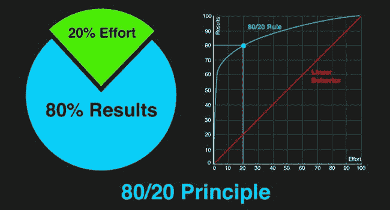

# 数据科学家的帕累托原则

> 原文：[`www.kdnuggets.com/2019/03/pareto-principle-data-scientists.html`](https://www.kdnuggets.com/2019/03/pareto-principle-data-scientists.html)

 评论

**作者：[Pradeep Gulipalli](https://in.linkedin.com/in/gulipalli)，[Tiger Analytics](http://www.tigeranalytics.com/)**

一个多世纪前，政治经济学教授维弗雷多·帕累托发布了他关于社会财富分配的研究结果。他观察到的剧烈不平等现象，如 20%的人拥有 80%的财富，令经济学家、社会学家和政治学家感到惊讶。在过去的一个世纪中，许多领域的先驱观察到这种不成比例的分配，包括商业。少数关键投入/原因（例如 20%的投入）直接影响大多数输出/效果（例如 80%的输出）的理论被称为帕累托原则，也称为 80-20 法则。

来源：[威廉·利波夫斯基](https://due.com/blog/the-pareto-principle-the-secret-of-successful-freelancers/)

* * *

## 我们的前三个课程推荐

 1\. [谷歌网络安全证书](https://www.kdnuggets.com/google-cybersecurity) - 快速进入网络安全职业生涯。

 2\. [谷歌数据分析专业证书](https://www.kdnuggets.com/google-data-analytics) - 提升你的数据分析能力

 3\. [谷歌 IT 支持专业证书](https://www.kdnuggets.com/google-itsupport) - 支持你的组织 IT

* * *

帕累托原则是一个非常简单却极其强大的管理工具。企业高管们长期以来一直用它来进行战略规划和决策。比如，20%的商店产生了 80%的收入，20%的软件漏洞导致了 80%的系统崩溃，20%的产品特性驱动了 80%的销售等，这些观察结果非常普遍，分析能力强的企业试图在其业务中发现这样的帕累托。这样，他们能够进行计划和优先排序。事实上，今天，数据科学在筛选大量复杂数据以帮助识别未来的帕累托中扮演着重要角色。

虽然数据科学有助于预测企业的新帕累托，但数据科学也可以通过内部视角来受益，寻找内部的帕累托。利用这些可以使数据科学显著更高效、更有效。在这篇文章中，我将分享作为数据科学家，我们如何利用帕累托原则的力量来指导我们日常活动的一些方法。

**项目优先排序**

如果你是数据科学领域的领导者/经理，你不可避免地需要帮助制定组织的分析策略。虽然不同的业务领导者可以分享他们的需求，你必须将所有这些组织（或业务单元）的需求进行阐述，并将它们优先排序为分析路线图。一种简单的方法是量化每个分析需求的解决价值，并按价值降序排序。你会发现，前几个问题/用例通常具有不成比例的高价值（帕累托原则），应该优先于其他问题。实际上，更好的方法是量化解决/实施每个问题/用例的复杂性，并根据价值与复杂性之间的权衡来进行优先排序（例如，通过将价值放在 y 轴上、复杂性放在 x 轴上的图示来进行排序）。

**问题范围定义**

业务问题往往模糊且结构不明确，而数据科学家的工作涉及确定正确的范围。范围定义通常需要关注问题最重要的方面，并降低较低价值方面的优先级。首先，查看输出/效果与输入/原因的分布将帮助我们理解问题空间中是否存在高层次的帕累托分布。随后，我们可以选择只关注某些输入/输出或原因/效果。例如，如果 20%的商店产生了 80%的销售额，我们可以将其余的商店分组为一个集群进行分析，而不是逐个评估它们。

范围定义还涉及评估风险——更深入的评估通常会告诉我们，最重要的项目可能会带来显著更高的风险，而较低的重要性项目发生的可能性非常小（帕累托原则）。我们可以优先将时间和精力集中在少数关键风险上，而不是解决所有风险。

**数据规划**

复杂的业务问题需要的数据超出分析数据集市中易得的数据范围。我们需要请求访问、购买、获取、抓取、解析、处理和整合来自内部/外部来源的数据。这些数据形态、规模、健康状况、复杂性、成本等各不相同。等待整个数据计划完全到位可能会导致项目延迟，而这些延迟不在我们的控制范围内。一种简单的方法是根据数据对最终解决方案的价值将数据需求进行分类，例如绝对必须的、希望有的和可选的（帕累托原则）。这将帮助我们专注于绝对必须的数据，而不会被可选项目分散注意力或拖延。此外，考虑数据获取的成本、时间和努力方面将帮助我们更好地优先排序我们的数据规划工作。

**分析**

据说工匠使用仅 20%的工具完成 80%的工作。对我们数据科学家来说也是如此。我们往往在工作中使用少量的分析和模型（帕累托原则），而其他技术则使用得较少。典型的探索分析例子包括变量分布、异常检测、缺失值填补、相关矩阵等。建模阶段的例子包括 k 折交叉验证、实际与预测图、误分类表、超参数调优分析等。构建小型自动化（如库、代码片段、可执行文件、用户界面）来使用/访问/实施这些分析可以显著提高分析过程的效率。

**建模**

在建模阶段，我们通常能在过程中较早地得出一个合理的工作模型。此时大部分的准确度提升已经完成（帕累托原则）。其余的过程主要是对模型进行微调，以争取逐步的准确度提升。有时，这些逐步的准确度提升是使解决方案对业务可行所必需的。在其他情况下，模型的微调对最终的洞察/提案贡献不大。作为数据科学家，我们需要对这些情况保持意识，以便知道在哪里适当划定界限。

**商业沟通**

当今的数据科学生态系统是高度多学科的。团队包括业务分析师、机器学习科学家、大数据工程师、软件开发人员和多个业务利益相关者。这类团队成功的关键驱动因素之一是沟通。作为一个努力工作的人，你可能会被诱惑去传达所有的工作——挑战、分析、模型、洞察等。然而，在信息过载的今天，这种方法不会有帮助。我们需要意识到有“有用的很多，但至关重要的少数”（帕累托原则），并利用这一理解简化我们沟通的信息量。同样，我们展示和强调的内容也需要根据目标受众（业务利益相关者与数据科学家）进行定制。

帕累托原则是我们工具箱中的一个强大工具。使用得当，它可以帮助我们理顺并优化我们的活动。

**简介: [Pradeep Gulipalli](https://in.linkedin.com/in/gulipalli)** 是 Tiger Analytics 的联合创始人，目前负责印度的团队。在过去的十年里，他与财富 100 强公司和初创公司客户合作，以推动他们组织中的科学决策。他帮助设计了复杂商业环境的分析路线图，并架构了众多数据科学解决方案框架，包括定价、预测、异常检测、个性化、优化、行为模拟。

**相关:**

+   关于数据科学职位申请的那些你不知道的事

+   如何识别适合你团队的数据科学家？

+   为意外情况做准备

### 更多相关话题

+   [停止学习数据科学去寻找目标，并找到目标来…](https://www.kdnuggets.com/2021/12/stop-learning-data-science-find-purpose.html)

+   [学习数据科学统计的顶级资源](https://www.kdnuggets.com/2021/12/springboard-top-resources-learn-data-science-statistics.html)

+   [成功数据科学家的 5 个特征](https://www.kdnuggets.com/2021/12/5-characteristics-successful-data-scientist.html)

+   [每个数据科学家都应该了解的三个 R 库（即使你使用 Python）](https://www.kdnuggets.com/2021/12/three-r-libraries-every-data-scientist-know-even-python.html)

+   [一个 90 亿美元的 AI 失败，解析](https://www.kdnuggets.com/2021/12/9b-ai-failure-examined.html)

+   [是什么让 Python 成为初创公司理想的编程语言](https://www.kdnuggets.com/2021/12/makes-python-ideal-programming-language-startups.html)
