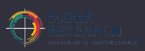
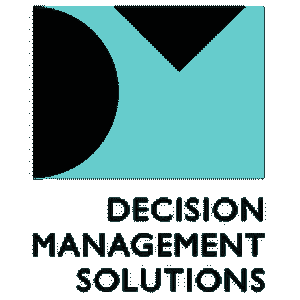
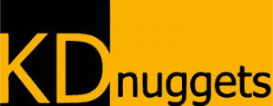

# Fidelity 如何找到量体裁衣的独角兽数据科学家

> 原文：[`www.kdnuggets.com/2020/02/paw-find-tailor-fit-unicorn-data-scientist.html`](https://www.kdnuggets.com/2020/02/paw-find-tailor-fit-unicorn-data-scientist.html)

赞助帖子。

|  |
| --- |

| Fidelity Investments 的 Victor Lo 将在 PAW Financial 2020**[金融服务预测分析世界](https://www.predictiveanalyticsworld.com/financial/2020/?utm_source=kdn&utm_medium=blog&utm_campaign=keynote)**上发表主题演讲，会议将于 2020 年 5 月 31 日至 6 月 4 日在拉斯维加斯举行，荣幸地邀请到 Fidelity Investments 人工智能和数据科学卓越中心领导者 **Victor Lo**：题目为：“如何为金融服务找到量体裁衣的‘独角兽’数据科学家”。

* * *

* * *

## 我们的前 3 大课程推荐

 1\. [谷歌网络安全证书](https://www.kdnuggets.com/google-cybersecurity) - 快速进入网络安全职业道路。 2\. [谷歌数据分析专业证书](https://www.kdnuggets.com/google-data-analytics) - 提升你的数据分析技能！ 3\. [谷歌 IT 支持专业证书](https://www.kdnuggets.com/google-itsupport) - 支持你组织的 IT 需求

* * *

使用代码 **KDNUGGETS** 获取预测分析世界门票 15% 的折扣。

* * *

 如何为金融服务找到量体裁衣的“独角兽”数据科学家随着数据科学家背景和经验的多样化，如何确定你真正需要哪种类型的数据科学家来满足你的业务需求？数据科学家有多少种类型？你可以在哪里找到他们？他们能为金融服务行业提供什么样的分析？Victor Lo 将结合超过 25 年的行业经验以及 20 多年的管理经验，介绍数据科学家的分类框架，并提出这些人才与各种项目类型之间的映射方案。

&#124;  **Victor Lo** AI 和数据科学卓越中心负责人，职场投资**富达投资** &#124; Victor S.Y. Lo 是一位经验丰富的大数据、市场营销、风险和金融领域的领导者，拥有超过 25 年的广泛咨询和企业经验，致力于在各种商业领域应用数据驱动的解决方案。他积极从事因果推断，是 Uplift/True-lift 建模的先驱，这是数据科学的一个关键子领域。在学术服务方面，Victor 曾在本特利大学担任访问研究员和企业驻校执行官。他还曾在波士顿运筹学与管理科学学会（INFORMS）分会的指导委员会和两个学术期刊的编辑委员会中服务。他还是国家统计科学研究所（NISS）的选举董事会成员。Victor 获得了运筹学硕士学位和统计学博士学位，并曾在管理科学领域担任博士后研究员。他曾合著了一本研究生级别的计量经济学书籍，并在数据挖掘、市场营销、统计学、分析学和管理科学领域发表了众多文章，目前正在完成一本关于商业中因果推断的研究生级别书籍。 &#124;

[查看完整会议议程](https://www.predictiveanalyticsworld.com/financial/2020/agenda/?utm_source=kdn&utm_medium=blog&utm_campaign=keynote)

* * *

**[金融服务预测分析世界](https://www.predictiveanalyticsworld.com/financial/2020/?utm_source=kdn&utm_medium=blog&utm_campaign=keynote)**  (**拉斯维加斯 2020 年 5 月 31 日至 6 月 4 日** )  汇聚了强大的演讲者阵容。现在就计划参加这场领先的跨供应商会议，涵盖银行、保险公司、信用卡公司、投资公司及其他金融机构在机器学习部署方面的应用。

**PAW 金融 2020 年其他重要演讲**

&#124; 

 &#124;  **[“大海捞针”——缺陷和欺诈检测案例研究](https://www.predictiveanalyticsworld.com/financial/2020/agenda/#session77651)**  **Richard Lee -**数据科学总监，美国 EOIT 高级分析与人工智能 - **宏利** &#124;

&#124; 

 &#124;  **[在机器学习部署中将伦理原则付诸实践](https://www.predictiveanalyticsworld.com/financial/2020/agenda/#session77571)**

Jen Gennai -**负责任创新全球事务负责人 - **Google** &#124;

&#124; 

 &#124;  **[从自动驾驶到欺诈检测——Lyft 如何简化机器学习的部署](https://www.predictiveanalyticsworld.com/financial/2020/agenda/#session77561)**

Gil Arditi -**产品负责人，机器学习 - **Lyft** &#124;

** 早鸟价格截至 2 月 21 日 [查看完整议程](https://www.predictiveanalyticsworld.com/financial/2020/agenda/?utm_source=kdn&utm_medium=blog&utm_campaign=keynote) &#124; [立即注册](https://www.predictiveanalyticsworld.com/machinelearningweek/registration/?utm_source=kdn&utm_medium=blog&utm_campaign=keynote)** |

| **机器学习周的一部分（前身为 Mega-PAW）——“一个活动五个会议”**PAW Financial 是机器学习周（前身为 Mega-PAW）的一部分——包括五个（5）平行会议，共有八个（8）专题： [PAW Business](http://www.predictiveanalyticsworld.com/business/2020/?utm_source=kdn&utm_medium=blog&utm_campaign=footer), [PAW Financial](http://www.predictiveanalyticsworld.com/financial/2020/?utm_source=kdn&utm_medium=blog&utm_campaign=footer), [PAW Healthcare](http://www.predictiveanalyticsworld.com/health/2020/?utm_source=kdn&utm_medium=blog&utm_campaign=footer), [PAW Industry 4.0](http://www.predictiveanalyticsworld.com/industry40/2020/?utm_source=kdn&utm_medium=blog&utm_campaign=footer), 和 [深度学习世界](http://www.deeplearningworld.com/?utm_source=kdn&utm_medium=blog&utm_campaign=footer)。

* * *

钻石赞助商

铂金赞助商

 

金牌赞助商

 

媒体合作伙伴

    

* * *

   |

|  |
| --- |
| **会议主办单位:** [Rising Media](http://www.risingmedia.com/) 和 [Prediction Impact](http://www.predictionimpact.com/)  |

### 更多相关主题

+   [适用于数据工程师和数据科学家的高保真合成数据](https://www.kdnuggets.com/2022/tonic-high-fidelity-synthetic-data-engineers-scientists-alike.html)

+   [停止学习数据科学以寻找目标并寻找目标以...](https://www.kdnuggets.com/2021/12/stop-learning-data-science-find-purpose.html)

+   [如何找到最佳的数据科学远程工作](https://www.kdnuggets.com/2022/12/find-best-data-science-remote-jobs.html)

+   [寻找合适的注释人员的快速指南](https://www.kdnuggets.com/2022/04/quick-guide-find-right-minds-annotation.html)

+   [在图像中找到一张图片而无需标记](https://www.kdnuggets.com/2022/09/find-picture-image-without-marking.html)

+   [如何构建一个模型来找到用户旅程中最具影响力的路径](https://www.kdnuggets.com/2022/09/objectiv-build-model-impactful-paths-user-journeys.html)
