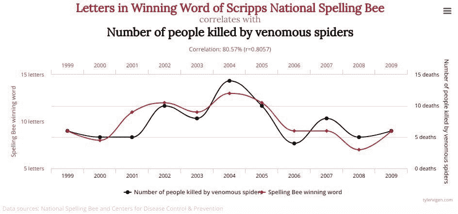

# 统计学、因果关系及难以接受的论点：Judea Pearl 辩论 Kevin Gray

> 原文：[`www.kdnuggets.com/2018/06/pearl-gray-statistics-causality-claims-difficult-swallow.html`](https://www.kdnuggets.com/2018/06/pearl-gray-statistics-causality-claims-difficult-swallow.html)

 评论

最近，著名计算机科学家和人工智能研究员[Judea Pearl](https://en.wikipedia.org/wiki/Judea_Pearl) 发布了他与 Dana Mackenzie 共同编著的新书《[因果之书：因果关系的新科学](https://www.amazon.com/Book-Why-Science-Cause-Effect/dp/046509760X)》。虽然这本书迅速成为畅销书，但也引起了部分读者的共鸣。

在发布后，市场营销科学家和分析顾问（以及常驻 KDnuggets 的撰稿人）Kevin Gray 撰写了对这本书的评论和反驳，[该评论在 KDnuggets 上发表](https://www.kdnuggets.com/2018/06/gray-pearl-book-of-why.html)。Pearl 随后回应了 Gray，Gray 又做出了回应，然后 Pearl 再次回应……你懂的。

* * *

## 我们的前 3 大课程推荐

 1\. [Google 网络安全证书](https://www.kdnuggets.com/google-cybersecurity) - 加速你的网络安全职业生涯。

 2\. [Google 数据分析专业证书](https://www.kdnuggets.com/google-data-analytics) - 提升你的数据分析技能

 3\. [Google IT 支持专业证书](https://www.kdnuggets.com/google-itsupport) - 支持你的组织的 IT

* * *

图片来源：[虚假相关](http://tylervigen.com/spurious-correlations)

本文包括了从 Kevin 原始回应文章引发的辩论。虽然 KDnuggets 没有表态，我们呈现了这场信息丰富且尊重的辩论，因为我们认为它对我们的读者有价值。我们希望你同意。

读者 Carlos Cinelli 指出，[Judea Pearl 回复了](http://causality.cs.ucla.edu/blog/index.php/2018/06/11/statisticians-reaction-to-the-book-of-why/) Kevin Gray 的文章，回复内容见下文。

> Kevin 预测许多统计学家可能会认为我的观点“奇怪或夸张”是准确的。这正是我在过去 30 年与统计学家进行的众多对话中发现的。然而，如果你更仔细地审视我的观点，你会发现它们并不像初看时那样异想天开或草率。
> 
> 当然，许多统计学家会挠头问：“这不正是我们多年来一直在做的事情，只是名字不同或者根本没有名字吗？”这就是我观点的本质。以非正式的方式，在不同的名字下进行，同时避免用统一的符号进行数学化处理，对因果推断的进展产生了毁灭性的影响，无论是在统计学中，还是在许多依赖统计学指导的学科中。最好的证据是，直到今天，只有一小部分实践中的统计学家能够解决《为何之书》中提出的因果玩具问题。
> 
> 例如：
> 
> 选择足够的协变量来控制混杂因素
> 
> 明确假设以便能够一致地估计因果效应
> 
> 查找这些假设是否可被检验
> 
> 估计因果的原因（而不是因果的效果）
> 
> 逐渐增多。
> 
> 《为何之书》的每一章都带来了一系列统计学家深切关注的问题，他们多年来一直在努力解决这些问题，尽管用错了名字（例如 ANOVA 或 MANOVA）“或者根本没有名字”。结果是许多深层次的问题却没有解决方案。
> 
> 在这一点上，一个有效的问题是，是什么让我如此大胆地断言在 1980 年代之前，没有统计学家（实际上没有科学家）能够正确解决这些玩具问题。怎么能如此确信没有某位聪明的统计学家或哲学家找到解决辛普森悖论的正确方法或区分直接效应与间接效应的正确方式？答案很简单：我们可以从科学家在 20 世纪使用的方程式的语法中看出这一点。要正确定义因果问题，更不用说解决它们，需要一种超出概率论语言的词汇。这意味着所有使用联合密度函数、相关分析、列联表、ANOVA 等的聪明和杰出的统计学家，如果没有用图示或反事实符号丰富这些工具，都是在徒劳地工作——与问题正交——如果没有提问的词汇，就无法回答问题。（《为何之书》，第 10 页）
> 
> 正是这种符号化的试金石让我有信心支持《为何之书》中您所引述的每一个声明。此外，如果您仔细观察这一试金石，您会发现它不仅是符号化的，还有概念上的和实际的。例如，费舍尔使用 ANOVA 来估计直接效应的错误仍然困扰着当今的中介分析师。其他许多例子在《为何之书》中有所描述，我希望您认真考虑每一个例子传达的教训。
> 
> 是的，你的许多朋友和同事会挠头说：“嗯……这不是我们多年来一直在做的事情吗，虽然可能用不同的名字，或者根本没有名字？”我希望你在阅读《为什么的书》后，能够抓住一些让人挠头的问题，并告诉他们：“嘿，在你进一步挠头之前，你能解决《为什么的书》中的任何一个玩具问题吗？”你会对结果感到惊讶——我确实是！
> 
> 对我来说，解决问题是理解的测试，而不是挠头。这就是我写这本书的原因。

Kevin Gray 随后注意到了[Judea Pearl 的回复](http://causality.cs.ucla.edu/blog/index.php/2018/06/11/statisticians-reaction-to-the-book-of-why/)，并在下面提供了跟进的回应。

> 我很感激 Judea Pearl 花时间阅读并回应我的博客文章。我也感到受宠若惊，因为我多年来一直是 Pearl 的仰慕者和追随者。由于某种原因——这种情况以前发生过——我在使用 Disqus 时遇到了困难，并请 Matt Mayo 代表我发布这篇（确实写得很仓促的）回应。
> 
> 简而言之，我认为 Pearl 对我帖子评论的实质性不强，因为他基本上重复了我在文章中质疑的观点。
> 
> 他开篇评论的建议是我对他的观点只了解皮毛。显然，我不觉得是这样。此外，文章中我没有将 Pearl 的观点描述为异想天开或轻率。我非常认真对待这些观点，否则我不会费心写博客文章。
> 
> 像许多其他统计学家，包括学术界人士，我觉得他对统计学家的描述不准确，而且他对谨慎的处理方法过于简单。这就是我的观点的本质（正如我所说，我并不孤单）。对于这些差异的许多可能原因，我在这里不会猜测为什么。????
> 
> “你没有词汇来提问就无法回答问题”这确实是对的。实践中的统计学家——与专注于理论的学术人员相对——与他们的客户紧密合作，而这些客户是特定领域的专家。该领域的语言在很大程度上定义了特定语境中使用的因果关系语言。这就是为什么没有普遍的因果框架，以及为什么心理学、医疗保健和经济学等领域的统计学家有不同的方法，并且经常使用不同的语言和数学。我自己结合了这三者以及 Pearl 的观点。在我 30 多年经验中，每种方法的实用性都是个案情况。此外，还有一些临时方法（有些值得怀疑）。
> 
> 他声称“……即使到今天，只有一小部分从业统计学家能解决《为什么的书》中提出的因果玩具问题”，但没有提供证据。这些问题并不难，声明并不是证据。此外，他在《为什么的书》的每一章中给出的统计学失败的例子，通常并不令人信服，且这些例子本身就是文章写作的动机之一。
> 
> 西蒙斯悖论的各种形式是几代研究人员和统计学家被训练去警惕的内容。我们确实如此。它并没有什么神秘之处。（关于西蒙斯的辩论，发表于 2014 年的《美国统计学家》，我在文章中提供了链接，希望对不是 ASA 会员的读者可见。）
> 
> 调解，常常与调节混淆，可能是一个难题。简单的路径图或包含少量变量的 DAG 往往是不够的，并且可能严重误导我们。在统计学家的实际工作中，通常存在大量潜在的相关变量，包括那些我们无法观察到的变量。还有一些关键变量由于各种原因没有包含在我们可以使用的数据中，并且无法获得。测量误差可能是相当大的——这并不罕见——而且不同类别的主体（例如，消费者）可能存在不同的因果机制。这些类别通常是未观察到的，对我们来说是未知的。
> 
> 我应该明确表示，我非常赞赏 Pearl 将因果分析引入公众视野的努力。我会建议统计学家阅读他的著作，但也要咨询（就像我做的那样）其他资深从业者和学者对他的著作和因果分析的看法。因果关系有许多种方法来处理，Pearl 的方法只是其中之一。正如 Pearl 自己也意识到的那样，直到今天，哲学家们对因果关系是什么仍然存在分歧，因此在我看来，建议他找到了答案是不现实的。真正的统计学家知道寻找“万能钥匙”是不切实际的。

Pearl 随后回应了[这一回复](http://causality.cs.ucla.edu/blog/index.php/2018/06/15/a-statisticians-re-reaction-to-the-book-of-why/)：

> 亲爱的 Kevin，
> 
> 我并不是在暗示你只是对我的工作有肤浅的了解。实际上，你对我的了解比我们部门的大多数统计学家要深得多，我非常感激你花时间评论《为什么的书》。你向我展示了其他有类似视角的读者会如何看待这本书，以及他们会发现哪些观点没有依据或难以接受。因此，让我们直接进入这两个要点（即，没有依据和难以接受）并进行深入的探讨。
> 
> 你说我没有提供支持我说法的证据：“即使在今天，只有一小部分实践中的统计学家能解决《为何之书》中提出的任何因果玩具问题。”我相信我确实提供了这样的证据，在每一章中，而这一说法是有效的，只要我们对“解决”的含义达成一致。
> 
> 让我们以你提到的第一个例子——Simpson 悖论为例，它在《为何之书》第六章中处理，并且每个热血的统计学家都很熟悉。我用这些话描述了这个悖论：“它困扰了统计学家超过六十年——直到今天仍然令人困扰”（第 201 页）。正如你正确地注意到的，这是一种委婉的说法：“即使在今天，大多数统计学家无法解决 Simpson 悖论”，这一事实我坚信是正确的。
> 
> 你觉得这个说法很难接受，因为：“几代研究人员和统计学家已经被训练去留意它[Simpson 悖论]”，这一观察似乎与我的说法相矛盾。但我恳请你注意，“被训练去留意它”并不能使研究人员能够“解决它”，即在数据中出现悖论时决定该怎么做。
> 
> 这种区别在 2014 年《美国统计学家》上的辩论中表现得非常明显，而这是你我引用的期刊。然而，尽管你将辩论中的分歧视为统计学家解决 Simpson 悖论的多种方式的证据，我却认为这是他们甚至没有接近正确答案的证据。换句话说，其他参与者没有提出一种方法来决定是聚合数据还是分离数据能正确回答“治疗是否有帮助或有害”的问题。
> 
> 请特别注意 Keli Liu 和 Xiao-Li Meng 的文章，他们都来自哈佛大学统计系（Xiao-Li 是资深教授和系主任），所以不能被指责扭曲 2014 年统计知识的现状。请仔细阅读他们的论文，并自行判断它是否能帮助你决定在辩论中提供的任何示例中，治疗是否有效。
> 
> 绝对不会！！我怎么知道？我在听他们的结论：
> 
> 1.  他们否认与因果关系的任何关联（第 18 页），并且
> 1.  
> 1.  他们最终得出了错误的结论。引用：“当 Simpson 悖论出现时，较少的条件设定最有可能导致严重偏差。”（第 17 页）Simpson 本人举了一个例子，说明条件设定会导致更多偏差，而不是更少。
> 1.  
> 我不责怪 Liu 和 Meng 在这一点上的错误，这不完全是他们的错（Rosenbaum 和 Rubin 也犯了同样的错误）。解决 Simpson 困境的正确方法依赖于后门准则，而没有 DAG 几乎不可能阐明这一点。正如你可能知道的，DAG 在哈佛大学周围 5 英里禁飞区内是禁止进入的。
> 
> 所以，我们来到了这里。大多数统计学家认为每个人都知道如何“留意”辛普森悖论，而那些寻求“我们应该治疗还是不治疗？”答案的人意识到，“留意”远非“解决”。此外，他们还意识到，没有走出统计分析的舒适区，进入因果关系和图形模型的禁忌之地，就没有解决方案。
> 
> 我同意你的一点——你对因果革命的不切实际的警告。引用：“直到今天，哲学家们对于因果关系是什么存在分歧，因此，建议他找到了答案是不切实际的。”确实，不切实际的是，特别是一个半外部者，找到了银弹。这很难接受。这也是我如此兴奋于因果革命的原因，也是我写这本书的原因。这本书并没有为所有存在的因果问题提供银弹，但它为一类问题提供了解决方案，而这些问题几个世纪以来的统计学家和哲学家尝试过但未能破解。我同意这不切实际，但它发生了。发生的原因不是因为我更聪明，而是因为我认真对待了 Sewall Wright 的想法，并尽可能将其推导到逻辑结论。
> 
> 我冒着相当大的风险，显得自负地称这一发展为因果革命。我认为这是必要的。现在我请你花几分钟时间，自己判断证据是否足以证明这样的冒险性描述是合理的。
> 
> 如果我们能提醒那些深度投入统计语言的统计学家，21 世纪甚至可能出现范式转变，那就太好了，并且几个世纪的无效争论并不会使这样的转变变得不可能。
> 
> 你对范式转变的必要性表示怀疑和不信是对的，任何负责任的科学家都会这样做。下一步是让社区进行探索：
> 
> 1.  多少统计学家能真正回答辛普森的问题，以及
> 1.  
> 1.  如何让那个数字达到 90%。
> 1.  
> 我相信《因果之书》已经把那个数字翻倍了，这算是一种进展。实际上，这是我在过去三十年里通过与我们时代的主要统计学家的艰苦讨论无法做到的事情。
> 
> 这是一些进展，让我们继续，
> 
> Judea

最新的消息是，Gray 在发布时向我们提供了以下内容。

> 再次感谢你抽出时间回复我的博客文章和早期的回复。也感谢你的好评，特别是考虑到 UCLA 在 SEM 和 AI 方面处于前沿。那里没有禁飞区。
> 
> 我觉得我们是在为同一个问题而战，尽管方式不同、角度不同、往往对抗的“敌人”也不同。我告诉别人我对因果关系情有独钟，但不知其所以然。???? 我从应用市场研究员和“数据科学家”（这是我不太舒服且自己也不完全理解的术语）的角度来看待这场战斗。为了让你了解我“来自何处”，让我重现一下我刚刚在 LinkedIn 上发布的一条帖子：
> 
> *关于因果关系的更多想法…*
> 
> 了解“谁、什么、何时、何地、如何、多久一次”等信息在市场营销和市场研究中至关重要。预测分析在许多情况下和许多组织中也很有用。
> 
> 然而，了解“为什么”也往往至关重要，这有助于我们更好地理解和预测“谁、什么、何时、何地、如何、多久一次”等问题。
> 
> 然而，因果关系的分析非常具有挑战性，有些人会说几乎是不可能的。
> 
> 传统观念认为，最佳的方法是通过随机实验。虽然我同意这一点，但在许多情况下，实验是不可行或不道德的。实验也可能出现错误，或过于人为，以至于无法推广到真实世界条件中。它们也可能无法复制。它们不是魔法。
> 
> 在许多情况下，非实验性研究可能是我们唯一的选择。但这并不意味着数据挖掘或其他不靠谱的研究方式。进行非实验性研究有更好和更差的方法。这就是问题所在——这并不容易做到正确，错误可能非常昂贵。
> 
> 我觉得最后一点最为重要。一些人似乎误解了你的著作，认为理论和判断无关紧要，计算机能够自动找到“最佳模型”。这是现代形式的“散弹枪经验主义”…这种情况因点选和拖拽的软件而加剧，这些软件可以说比微软 Word 更易于使用。散弹枪（有时还有 DAG）在孩子手中…
> 
> 在大数据时代，我这种角色有时需要确定成千上万变量的相对重要性，有时是针对每个消费者单独进行。一般认为这不是因果分析。在另一极端，基于少数几个焦点小组有时会得出广泛的因果推论。同样，这也经常不被认为是因果研究。
> 
> 关于辛普森悖论，我会让你继续与学术同行争论。我会根据手头的数据和研究目标逐案处理这个问题。显然，一些应该知道更好的人在这方面犯了错误。要明确的是，我指的是实际解决方案，而不是理论数学解决方案。虽然我与孟教授并不熟识，但我看过他在 YouTube 上的几次讲座，并阅读过他的一些论文。他在讨论常见的大数据谬误方面有很多见解。
> 
> 在应用领域，我确实注意到一些拥有出色数学和编程技能的人，尽管如此，他们在使用统计学解决现实世界问题方面却不尽如人意。这不是一个原创的观察。也许 ASA、RSS 和其他专业组织会对定期技能评估感兴趣，这完全是自愿的，旨在专业发展？
> 
> 我设想一个在线测验，包含少量应用统计学问题——不是数学问题，除非是某些重要领域。这将是保密的。作为激励，参与者在完成测试后将看到正确答案。随着时间的推移，参与者将能够了解他们在哪些方面表现强劲，哪些方面需要改进。我们还将拥有一些实证证据（即使不是来自真正具有代表性的样本）来了解实践统计学家和研究人员在关键领域的技能水平，这将是可以发表的。我希望你能贡献一些问题！
> 
> 对于任何领域具有良好统计学背景的统计学家和研究人员，我认为《因果关系》是必读书目。我也觉得《为什么的书》有价值，正如我所提到的。你当然会熟悉*概率图模型*（Koller 和 Friedman），我了解到 Fenton 教授和 Neil 教授将出版《风险评估与决策分析》的新版本。由于你为第一版撰写了前言，你显然也认为这本优秀的书值得阅读。
> 
> 再次感谢你在漫长而卓越的职业生涯中对许多领域所做的*诸多*贡献。不幸的是，对我来说，现在是时候戴上安全帽，回到工作中了。
> 
> 此致，
> 
> 凯文

**相关**：

+   为什么的书

+   为什么的书：因果关系的新科学

+   更好的统计学 101

### 更多相关话题

+   [帮助我在困难的就业市场中导航的 4 条职业建议](https://www.kdnuggets.com/2023/05/4-lessons-made-difference-navigating-current-job-market.html)

+   [数据科学、统计学和机器学习词典](https://www.kdnuggets.com/2022/05/data-science-statistics-machine-learning-dictionary.html)

+   [数据科学家和分析师的统计学基础](https://www.kdnuggets.com/2023/08/fundamentals-statistics-data-scientists-analysts.html)

+   [数据科学中的统计学：理论与概述](https://www.kdnuggets.com/statistics-in-data-science-theory-and-overview)

+   [在 Python 中应用描述性和推断统计学](https://www.kdnuggets.com/applying-descriptive-and-inferential-statistics-in-python)

+   [数据科学的统计学与概率](https://www.kdnuggets.com/2022/06/statistics-probability-data-science.html)
