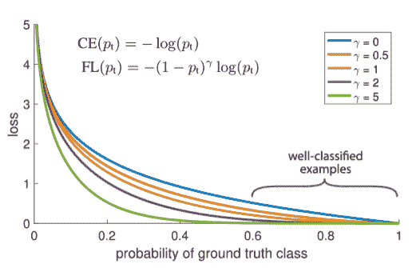
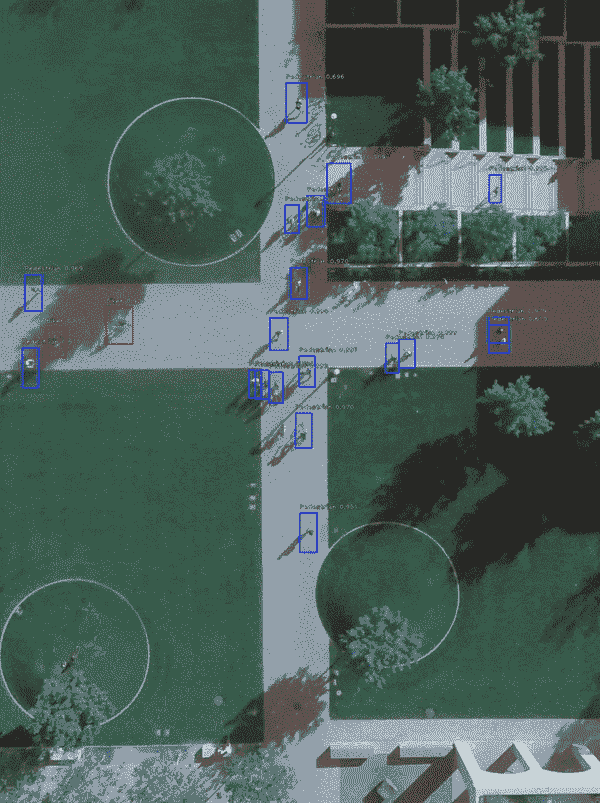
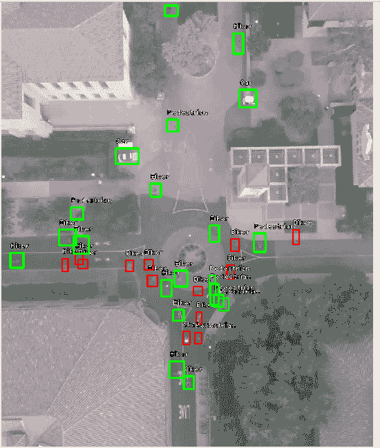
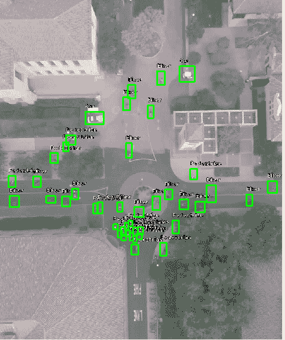

# 《使用 RetinaNet 进行航拍图像中的行人检测》

> 原文：[`www.kdnuggets.com/2019/03/pedestrian-detection-aerial-images-retinanet.html`](https://www.kdnuggets.com/2019/03/pedestrian-detection-aerial-images-retinanet.html)

 评论

**由 [Priyanka Kochhar](https://github.com/priya-dwivedi)，深度学习顾问**

### 介绍

航拍图像中的物体检测是一个具有挑战性且有趣的问题。随着无人机成本的降低，生成的航拍数据量激增。拥有能够从航拍数据中提取有价值信息的模型将非常有用。[RetinaNet](https://arxiv.org/abs/1708.02002) 是最著名的单阶段检测器，在这篇博客中，我想测试它在来自 [斯坦福无人机数据集](http://cvgl.stanford.edu/projects/uav_data/) 的行人和骑车人的航拍图像上的表现。见下图。这是一个具有挑战性的问题，因为大多数物体宽度只有几个像素，有些物体被遮挡，而阴影中的物体更难检测。我阅读了几篇关于航拍图像中物体检测的博客，特别是在行人检测方面的链接较少，这尤其具有挑战性。

斯坦福无人机数据集中的航拍图像 — 行人用粉色标记，骑车人用红色标记

* * *

## 我们的前三个课程推荐

 1\. [谷歌网络安全证书](https://www.kdnuggets.com/google-cybersecurity) - 快速入门网络安全职业生涯。

 2\. [谷歌数据分析专业证书](https://www.kdnuggets.com/google-data-analytics) - 提升你的数据分析技能

 3\. [谷歌 IT 支持专业证书](https://www.kdnuggets.com/google-itsupport) - 支持你的组织 IT 部门

* * *

### RetinaNet

[RetinaNet](https://arxiv.org/abs/1708.02002) 是一种单阶段检测器，使用特征金字塔网络 (FPN) 和焦点损失进行训练。[特征金字塔网络](https://medium.com/@jonathan_hui/understanding-feature-pyramid-networks-for-object-detection-fpn-45b227b9106c) 是一种用于多尺度物体检测的结构，介绍于这篇 [论文](https://arxiv.org/abs/1612.03144) 中。它通过自上而下的路径和横向连接将低分辨率、语义强的特征与高分辨率、语义弱的特征结合在一起。最终结果是，它在网络的多个层次上生成不同尺度的特征图，这有助于分类器和回归器网络。

Focal Loss 旨在解决单阶段目标检测问题中的不平衡问题，在这种问题中，背景类别的数量非常大，而前景类别则很少。这导致训练效率低下，因为大多数位置都是容易的负例，不提供有用的信号，而这些大量的负例会淹没训练并降低模型性能。Focal Loss 基于交叉熵损失，如下所示，通过调整 gamma 参数，我们可以减少来自已分类示例的损失贡献。

Focal Loss 解释

在这个博客中，我想谈谈如何在 Keras 上训练一个 RetinaNet 模型。我没有充分阐述 RetinaNet 背后的理论。我使用了这个[链接](https://medium.com/@14prakash/the-intuition-behind-retinanet-eb636755607d)来了解该模型，并强烈推荐它。我的第一个训练模型在检测目标方面表现很好，如下面的视频所示。我还在我的[Github 链接](https://github.com/priya-dwivedi/keras_retinanet_cs230)上开源了代码。

Retina Net 在人和骑车人的航空图像上的效果

### 斯坦福无人机数据集

[斯坦福无人机数据集](http://cvgl.stanford.edu/projects/uav_data/)是一个由无人机在斯坦福校园上空收集的大量航空图像数据集。该数据集非常适合用于目标检测和跟踪问题。它包含约 60 个航空视频。每个视频都有 6 个类别的边界框坐标——“行人”、“骑车人”、“滑板车手”、“推车”、“汽车”和“公交车”。该数据集在人和骑车人方面非常丰富，这两个类别覆盖了约 85%-95%的标注。

### 在斯坦福无人机数据集上训练 RetinaNet

为了训练 Retina Net，我使用了[Keras 中的这个实现](https://github.com/fizyr/keras-retinanet)。它文档齐全且没有错误。非常感谢 Fizyr 开源他们的实现！

我遵循的主要步骤是：

+   从庞大的斯坦福无人机数据集中选择样本图像以构建模型。我取了大约 2200 张训练图像，带有 30,000+个标注，并保留了大约 1000 张图像用于验证。我已经将我的图像数据集上传到 Google Drive [这里](https://drive.google.com/drive/u/0/folders/1bLt6KK_9zKogJdvW-lKh9BnBKgFfvPp9)，供有兴趣跳过这一步的人使用。

+   生成 Retina Net 所需格式的标注。Retina Net 要求所有标注都符合该格式。

```py

path/to/image.jpg,x1,y1,x2,y2,class_name

```

我将斯坦福标注转换为这种格式，我的训练和验证标注已上传到我的[Github](https://github.com/priya-dwivedi/keras_retinanet_cs230)。

+   调整锚点尺寸：Retina Net 的默认锚点尺寸为 32、64、128、256、512。这些锚点尺寸适用于大多数物体，但由于我们处理的是空中图像，一些物体可能小于 32。这些库提供了一个方便的工具来检查现有锚点是否足够。下图中绿色的注释被现有的锚点覆盖，红色的注释被忽略。如图所示，相当一部分注释对于最小的锚点尺寸来说仍然太小。

使用默认锚点的 Retina Net

因此，我调整了锚点，去掉了最大的 512 并添加了一个大小为 16 的小锚点。这带来了明显的改进，如下所示：

添加一个小锚点后

+   有了这些准备，我们已经可以开始训练了。我保留了大部分其他默认参数，包括 Resnet50 主干，并开始了训练：

```py

keras_retinanet/bin/train.py --weights
snapshots/resnet50_coco_best_v2.1.0.h5  --config config.ini
csv train_annotations.csv labels.csv --val-annotations
val_annotations.csv

```

这里的权重是 COCO 权重，可以用于启动训练。训练和验证的注释是输入数据，config.ini 中有更新后的锚点尺寸。所有文件也在我的 [Github 仓库](https://github.com/priya-dwivedi/keras_retinanet_cs230) 中。

就这些！模型训练速度较慢，我整晚都在训练。我通过检查测试集上的 **平均精度 (MAP)** 来测试训练模型的准确性。如下所示，第一个训练模型的 MAP 达到了 0.63，表现非常好。尤其在汽车和公交车类别上表现优异，因为这些类别在空中比较容易识别。Biker 类的 MAP 较低，因为它经常被行人混淆。我目前正在进一步提高 Biker 类的准确性。

```py

Biker: 0.4862
Car:0.9363
Bus: 0.7892
Pedestrian: 0.7059
Weighted: 0.6376

```

### 结论

Retina Net 是一个强大的模型，使用了特征金字塔网络。它能够在一个非常具有挑战性的数据集上进行空中物体检测，该数据集中的物体尺寸非常小。我在半天的工作时间内训练了一个 Retina Net。第一个版本的训练模型性能相当不错。我仍在探索如何进一步调整 Retina Net 架构，以提高空中检测的准确性。有关内容将在我的下一篇博客中介绍。

希望你喜欢这篇博客，也尝试自己训练模型。

我有自己的深度学习咨询公司，喜欢处理有趣的问题。我帮助了许多初创公司部署创新的 AI 解决方案。请访问我们的 [网站](http://deeplearninganalytics.org/) 了解更多。

你也可以查看我的其他文章： [`deeplearninganalytics.org/blog`](http://deeplearninganalytics.org/blog)

如果你有一个可以合作的项目，请通过我的网站或邮件 priya.toronto3@gmail.com 联系我。

### 参考文献

+   [Retina Net](https://medium.com/@14prakash/the-intuition-behind-retinanet-eb636755607d)

+   [斯坦福无人机数据集](http://cvgl.stanford.edu/projects/uav_data/)

+   [Retina Net Keras 实现](https://github.com/fizyr/keras-retinanet)

**个人简介： [Priyanka Kochhar](https://github.com/priya-dwivedi)** 已有 10 年以上的数据科学经验。她现在拥有自己的深度学习咨询公司，并热衷于解决有趣的问题。她曾帮助多家初创公司部署创新的 AI 解决方案。如果你有一个可以合作的项目，请通过 priya.toronto3@gmail.com 联系她。

[原创](https://towardsdatascience.com/pedestrian-detection-in-aerial-images-using-retinanet-9053e8a72c6)。经许可转载。

**相关：**

+   使用深度学习进行人员跟踪

+   Keras 深度学习入门

+   Keras 四步工作流程

### 更多相关话题

+   [如何使用 Python 进行动作检测](https://www.kdnuggets.com/2022/08/perform-motion-detection-python.html)

+   [使用 Hugging Face Transformers 进行文本情感检测](https://www.kdnuggets.com/using-hugging-face-transformers-for-emotion-detection-in-text)

+   [KDnuggets 新闻，8 月 17 日：如何使用…进行动作检测](https://www.kdnuggets.com/2022/n33.html)

+   [数据科学中异常检测技术的初学者指南](https://www.kdnuggets.com/2023/05/beginner-guide-anomaly-detection-techniques-data-science.html)

+   [功能数据中的密度核深度用于异常检测](https://www.kdnuggets.com/density-kernel-depth-for-outlier-detection-in-functional-data)

+   [BigQuery 中的异常检测：揭示隐藏的见解并推动行动](https://www.kdnuggets.com/anomaly-detection-in-bigquery-uncover-hidden-insights-and-drive-action)
