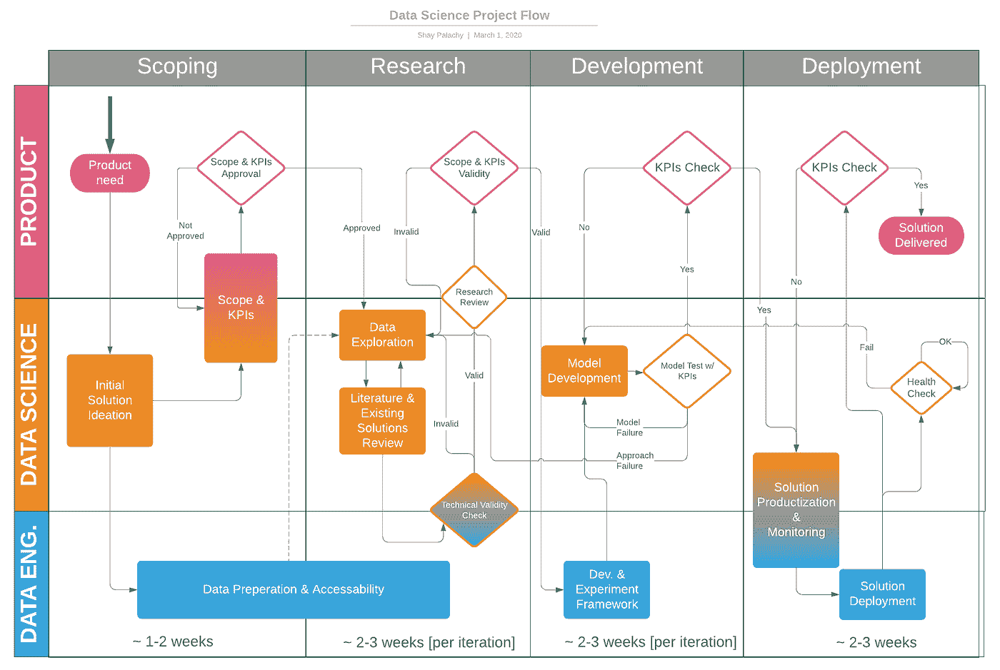
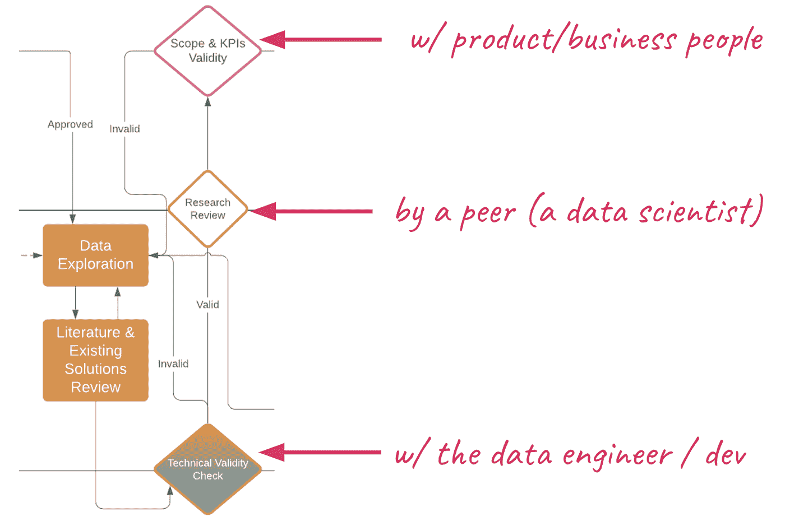
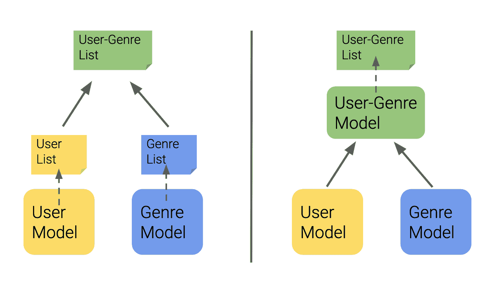
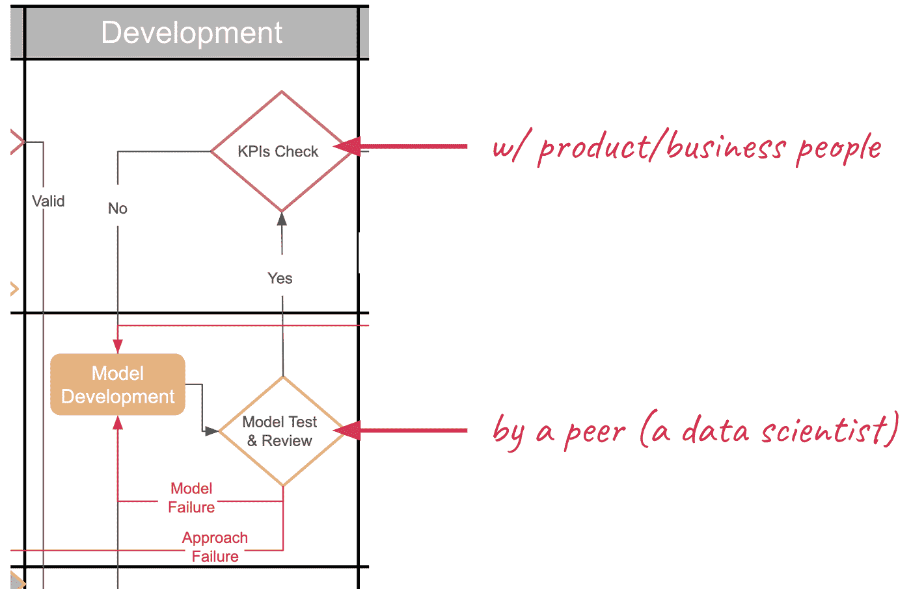

# 同行评审数据科学项目

> 原文：[`www.kdnuggets.com/2020/04/peer-reviewing-data-science-projects.html`](https://www.kdnuggets.com/2020/04/peer-reviewing-data-science-projects.html)

评论

**作者：[Shay Palachy](http://www.shaypalachy.com/)，数据科学顾问**。

同行评审是任何创意活动中重要的一部分。它在研究中使用——无论是在学术界还是在学术界之外——以确保结果的正确性、遵循科学方法和输出的质量。在工程领域，它用于提供外部审查，并在技术开发过程的早期捕捉到昂贵的错误。在各个领域，它都用于改进决策。

* * *

## 我们的前三个课程推荐

 1\. [Google 网络安全证书](https://www.kdnuggets.com/google-cybersecurity) - 快速进入网络安全职业轨道

 2\. [Google 数据分析专业证书](https://www.kdnuggets.com/google-data-analytics) - 提升你的数据分析能力

 3\. [Google IT 支持专业证书](https://www.kdnuggets.com/google-itsupport) - 支持你所在组织的 IT

* * *

我们在科技行业工作的人员都熟悉一个特别重要的同行评审实例——代码审查过程。如果你曾经接受过审查，你应该知道尽管这会稍微让人不适——因为将我们的创作放在审查下总是令人不安——但它可以非常有价值。这个过程迫使我们提前准备，从而在审查之前就发现了许多改进点。这通常会提出一些小但重要的问题，这些问题可能被我们忽视，但对外部人员来说却很容易发现，有时它还可以提供非常深刻的见解。

本文的目标是建议一个布局，用于为数据科学项目执行类似功能的流程。这是作为对 [我个人观点](https://towardsdatascience.com/data-science-project-flow-for-startups-282a93d4508d?source=friends_link&sk=7c29bb9683e4c3564d92d89d31a666d1) 的一个部分，关于小规模数据科学项目的运行方式，这个话题我在之前的博客文章中已经涉及过：[数据科学项目流程](https://www.kdnuggets.com/2019/01/data-science-project-flow-startups.html)。你可以在下面找到这个工作流程的图示。

这个框架也基于我作为首席数据科学家、团队领导的经验，以及作为 [独立顾问](http://www.shaypalachy.com/) 目睹了我咨询过的各种公司遵循的工作模式。我还依赖于许多领导团队或数据科学家小组的朋友们的经验。

*图 1：数据科学项目流程（来源：作者）。*

根据我对项目流程的看法，我建议针对我认为最需要同行审查的两个阶段：研究阶段和模型开发阶段，采用两种不同的同行评审过程。

目标是为这两个阶段提供一个同行评审过程的一般框架，该框架将：

1.  使过程正式化并提供结构。

1.  鼓励数据科学家提出问题并提供同行评审。

1.  降低高成本错误的风险。

我将讨论这两个过程的动机、目标和结构，并为每个过程提供一个独特的问题和问题检查列表。

类似于项目流程，这些过程是在考虑小团队从事应用数据科学的情况下编写的。然而，较大的团队甚至研究小组可能会发现下面的一些想法有用。

> ***致谢：*** 模型开发 [审查清单](https://medium.com/@ptannor/checklist-for-data-science-research-review-8a817b50697b) 是 [Philip Tannor](https://medium.com/@ptannor)的创作，他是一位出色的数据科学家，也是一个更好的人。

### 数据科学研究阶段审查

为了帮助你记忆，我们称“研究阶段”为在数据探索和文献回顾之间进行迭代往返的过程（可以包括审查现有代码和实现）。这一阶段还包括描绘可能的方法论方法的空间，以框定和解决当前问题，并形成我们对前进最佳方式的推荐，同时列出每个选择固有的优缺点。

*图 2：研究阶段的三项检查（来源：作者）。*

请注意，在这一阶段进行三种类型的检查以验证自然影响力选择的方法：

1.  **技术有效性检查**，通常与支持项目的数据/软件工程师一起进行，旨在确保建议的方法可以成功部署并得到工程支持。

1.  **研究审查**，同行帮助数据科学家验证他的过程和建议。我们将在稍后深入探讨。

1.  **范围和 KPI 有效性检查**，与负责产品的人一起进行，以确保推荐的方法仍在项目范围内，并且看起来能够满足项目的 KPI。

**动机**

我认为数据科学家对项目研究阶段进行同行评审的主要动机是防止他们在项目的早期阶段选择错误的方法或方向。这些错误——在 [DS 工作流程](https://towardsdatascience.com/data-science-project-flow-for-startups-282a93d4508d?source=friends_link&sk=7c29bb9683e4c3564d92d89d31a666d1) 中称为 *方法失败*——是 *非常* 昂贵的，并且会阻碍项目在其余生命周期中的进展。

如果我们幸运的话，我们在经过几个模型开发迭代后发现方法失败，这会浪费宝贵的数据科学家工作时间。这种情况是指方法失败导致使用我们选择的指标进行跟踪和优化时性能下降。

然而，在某些情况下，由于方法失败导致的性能差异可能更加微妙，并且在使用大量生产数据验证模型性能之前可能极其难以识别，有时甚至需要用户/客户反馈来发现这一行为，从而在模型投入生产后才发现失败。其代价显著更高：数据科学家、工程师和产品人员的数月工作，客户满意度下降，潜在的客户流失，甚至收入减少。

这就是为什么模型基准测试不能是我们希望发现过程和决策中方法论错误的唯一方式；我们必须明确假设这些错误可能会被这些手段遗漏，并尝试通过检查过程本身、其逻辑以及支持它们的主张和数据来从方法论上发现这些错误。

**目标**

显然，这里的主要目标是及早发现代价高昂的错误，如前所述，通过明确检验过程的核心方面，同时对几个常见问题进行基本的合理性检查。

然而，这里可以陈述两个额外的子目标：首先，提高数据科学家在即将到来的产品/业务评审过程中解释和辩护她决策的能力。其次，更好地准备将研究阶段的成果展示给团队其他成员，这是大多数数据科学团队/小组中非常常见且重要的实践。

**结构**

准备评审的步骤有三：

1.  被评审的数据科学家准备一个关于他所经历的研究过程的演示（不一定是幻灯片）。

1.  被评审的数据科学家与评审员安排了一个长时间的会议（至少 60 分钟；上次我们花了两个小时）。

1.  评审员在会议前检查清单。

在他的演示中，被评审的数据科学家尝试涉及以下七个要点：

1.  提醒：项目范围和产品需求。

    *总是从这里开始，因为评审的主要一点是估计过程的遵循情况以及做出的选择是否满足项目范围和需求。*

1.  初步的指导方针和关键绩效指标（KPIs）。

    *在许多情况下，这将是评审数据科学家第一次看到产品需求转化为技术 KPIs 的过程，这是一种很好的机会来暴露这一点接受同行审查。覆盖问题特征和限制。*

1.  做出的假设。

    *我们都对数据格式、可用性、可接受的错误和常见产品使用模式等方面做出强烈假设。将这些假设明确化。*

1.  使用的数据及其探索方式。

    *数据探索结果可以证明一些假设和选择的方法，因此请清楚地呈现它们。*

1.  得出的可能方法/解决方案列表。

    *研究阶段的第一个主要成果：解决方案地图，详细说明每个方案的优缺点——包括假设——并可能还描绘了它们的起源和相互关系（如果相关的话）。*

1.  未来选择的方法及其理由。

    *你的推荐。这是这一阶段最显著的成果，但请记住，要绘制路线图，你首先必须拥有地图。解决方案地图提供的背景应使你能够向评审者解释选择，同时排除其他选项。*

1.  什么可能的失败会导致替代选择？

    *我认为，这一常被忽视的研究阶段产物不亚于你的推荐。你现在正通过应急计划来增强它，明确分享如何对研究驱动项目固有的风险进行对冲和计算。*

最后，这里是审查会议的建议结构：

1.  *待审查的 DS*: 研究阶段演示

1.  *评审者*: 一般反馈

1.  *评审者*: 检查清单 *(见下方)*

1.  *评审者*: 批准或拒绝

1.  *共同*: 结果行动点

**检查清单**

该列表关注于在研究阶段应解决的问题。我将其分为十个类别：

1.  数据属性

1.  方法假设

1.  过去的经验

1.  目标对齐

1.  实施情况

1.  扩展

1.  组合/拆分能力

1.  信息要求

1.  领域适应

1.  噪声/偏差/缺失数据的韧性

让我们回顾一下问题。记住，这只是我提出的初步建议，并没有全面覆盖需要考虑的所有内容。

**数据属性**

关于初始数据集：

+   生成是如何完成的？样本是如何选择的？是否进行了更新？

    *例如，上个月 10%的数据是从现有五个客户中的每一个均匀采样的。*

+   这引入了什么噪声、采样偏差和缺失数据？

    *例如，其中一个客户仅在两周前才与我们的服务整合，这在数据集中引入了对其数据的下采样偏差。*

+   你能否修改采样/生成以减少或消除噪声？采样偏差？缺失数据？

    *例如，将样本量不足的客户增加一倍，或者仅使用过去两周的数据用于所有客户。*

+   你能否独立于某种方法来显式建模噪声？

+   如果数据集有标签，它是如何标记的？

+   这引入了什么标签偏差？可以测量吗？

    *例如，标签可能来自半关注的用户。通过专家/分析师手动标记一个非常小（但具有代表性）的集合可能是可行的，并且将使我们能够测量这个集合上的标签偏差/错误。*

+   你能否修改或增强标记过程以补偿现有的偏差？

+   初始数据集在生产中预期的输入数据、结构和模式上有多相似？

    *例如，某些项目的内容在生产中动态变化。或者可能不同领域缺失，取决于创建时间或源领域，之后被补全或推断。*

+   初始数据集对生产数据的代表性如何？

    *例如，客户之间的数据分布不断变化。或者可能是采样覆盖了两个春季月，但模型将在冬季开始时出现问题。或者可能是在集成了一个重要的客户/服务/数据源之前收集的。*

+   你能期望的最佳训练数据集是什么？

    - 非常明确地定义它。

    - 估算：它将改善性能多少？

    - 生成的可能性和成本有多大？

    *例如，使用三个标注员标记 20,000 条帖子情感，并给出每条帖子的模式/平均分数作为标签。这将需要 400 人小时，预计成本为两到三千美元，并预计将提高至少 5% 的准确率（这个数字通常很难提供）。*

**方法假设**

+   每种方法对数据/数据生成过程/研究现象做出了什么假设？

+   对你的问题做出这些假设是否合理？在多大程度上？

+   你如何期望适用性与这些假设的违反情况相关联？例如，10% 违反 → 性能降低 10%？

+   这些假设可以独立验证吗？

+   是否存在违反这些假设的边缘/极端情况？

> ***示例：*** 为了确定飞机票价格的变化是否驱动了你服务的使用增加，你可能希望使用一些经典的因果推断统计方法对这两个值的时间序列进行分析。或者，你可以使用像 ARIMA 这样的常见模型来预测下个月的飞机票价格。
> 
> *许多此类方法不仅有时隐含地假设输入时间序列是[平稳随机过程](https://towardsdatascience.com/stationarity-in-time-series-analysis-90c94f27322)的实现，而且也没有提供时间序列的平稳度度量或其违反假设的程度的度量。最后，当这种假设在任何程度上被违反时，它们没有提供误差的上界或发生误差的概率。*
> 
> *因此，这是这些方法的一个显著缺点，应该明确呈现并加以说明。在这种情况下，[平稳性实际上可以被测试](https://towardsdatascience.com/detecting-stationarity-in-time-series-data-d29e0a21e638)，与使用的方法无关，因此可以在做出选择之前确认某些方法的有效性。*

以下是一些方法所做的非常强且通常隐含的假设示例：

+   每个特征遵循高斯分布。

+   时间序列是平稳过程的实现。

+   特征是严格独立的（例如，朴素贝叶斯假设这一点）。

+   系统中不同组件的测量可分离性。

**过去经验**

+   你在应用这种方法方面有什么经验，无论是一般的还是针对类似问题的？

+   你是否发现任何已发布的（例如，在博客文章或文章中）将这种方法应用于类似问题的成功/失败案例？

+   你是否向同行询问过他们的经验？

+   从上述内容中可以学习到哪些教训？

+   如果这个项目是试图在现有解决方案的基础上进行迭代和改进：迄今为止使用了什么解决方案来解决这个问题？它们的优点是什么，它们遇到了什么问题？

**目标对齐**

对于基于优化的监督学习方法：

+   在拟合模型参数时可以使用哪些损失函数？它们与项目 KPIs 的关系如何？

+   可以使用哪些指标进行模型选择/超参数优化？它们与项目 KPIs 的关系如何？

+   应该添加哪些硬性约束以反映 KPIs？

对于无监督学习方法：

+   该方法优化了什么指标？

+   这与 KPIs 有何关联？

    *例如，最大化平均词向量的可分离性与寻找一组捕捉不同意见的文章的近似效果如何？*

+   有哪些边缘案例满足指标但不符合 KPI？

对于无监督表示学习：

+   为什么假任务（例如，在*Word2Vec*中预测一个词的邻居）预计能促进输入表示的学习，这将有利于执行实际任务的模型？

**实现**

+   目前在你的生产环境中使用的语言中是否有这种方法的实现？

+   实现是否是最新的？是否得到持续支持？是否被广泛使用？

+   有类似公司/组织成功使用这种具体实现的案例吗？这些问题是否与您的类似？

**扩展性**

+   计算/训练时间如何随着数据点的增加而变化？

+   随着特征数量的增加？

+   存储如何随着数据点/特征的增加而扩展？

**组合/拆解能力**

+   如果需要，不同领域（类别/客户/国家）的模型可以以合理的方式组合吗？

+   或者，它们的结果是否可以以有意义的方式整合？

+   一般模型是否可以分解为每个领域的模型？可以识别和利用这些模型的每个领域相关的内部组件吗？

*图 3：模型的可组合性可能是一个要求，并且有不同的形式（来源：作者）。*

> ***示例：*** 假设我们正在开发一个主题动态播放列表生成系统，作为音乐流媒体服务的一部分。这意味着我们想自动生成和更新围绕“新独立”、“英国新浪潮”、“女性主义音乐”或“俗气情歌”等主题的播放列表。为了增加复杂性，我们可能还希望允许主题组合的播放列表，例如“女性主义新浪潮”或“新忧郁独立”。或者，也许我们希望能够为每个听众个性化每个播放列表。最终，如果我们有一个为主题播放列表排名歌曲的模型和另一个通过特定用户喜欢的可能性排名歌曲的个性化模型，我们可能希望能够结合这两个模型的结果。*
> 
> *不同的方法可以以不同的方式支持这些场景。例如，如果我们将每个人/主题建模为所有歌曲的概率分布，其中播放列表通过重复采样（无重复）动态生成，那么可以很容易地将这些模型组合成一个单一的概率分布，然后可以使用相同的过程生成适应性的播放列表。然而，如果我们使用某些机器学习模型通过评分对歌曲进行排序，我们可能需要制定一种方法使不同模型的评分可比，或者使用通用的方法将多个排序结果整合到相同的项目集合中。*

**信息需求**

+   每种方法在多大程度上依赖于可用的信息量？少量信息对性能的预期影响是什么？

+   这与当前可用的信息量以及未来的信息可用性是否一致？

> *例如，从头开始训练基于神经网络的序列模型进行文本分类通常需要大量信息，如果不能依赖于预训练模型或词嵌入。例如，如果我们正在为代码文件构建一个脚本或模块分类器，这可能正是我们面临的情况。在这种情况下，假设每种编程语言代表一个独立的领域，神经网络模型可能在非常稀有的编程语言或我们拥有很少标签的语言上表现不好。*

**冷启动与领域适应**

+   新客户/类别/国家/领域预计需要多长时间才能达到每种方法的最低信息需求？

+   一般模型是否可以预期在这些领域表现良好，至少作为起点？

+   是否有办法将已经拟合的模型适应到新领域？这是否预期会比从头开始训练获得更好的性能？这样做是否比从头开始训练更快/更便宜？

> ***示例：*** 假设我们正在为我们在线市场中的产品建立推荐系统，这些产品由许多商家使用，新商家每天都会加入并开始销售他们的产品。使用基于神经网络的模型，该模型在某些代表商家的数据上学习商家及/或其产品的嵌入，对于这些新商家，通过将他们映射到嵌入空间中与类似现有商家接近的位置，然后借用已经学习到的现有商家中不同购物者购买某些产品的可能性，这样的模型可能表现出意想不到的好效果。

**噪声/偏差/缺失数据的弹性**

该方法如何处理数据中的噪声？如何处理？

+   这是否针对特定模型？

+   如果适用，请考虑：噪声模型对你问题中的噪声生成过程的适用性如何？

+   对于异常/预测/因果关系/动态：该方法是否对系统中的外生变量进行建模？

对于监督和半监督方法：

+   每种方法对标签偏差的敏感性如何？

+   在你的案例中，偏置模型的影响是什么？

+   泛型偏差修正技术是否适用于该方法？

对于所有方法：

+   每种方法如何处理缺失数据（如果有的话）？

+   在每种情况下，随着缺失数据的增加，性能预计会恶化到什么程度？

### 数据科学模型开发阶段审查

再次回顾一下，我所称的模型开发阶段是数据科学项目的一个部分，在这个阶段，进行了大量的数据处理（包括特征生成，如果使用的话），实际模型应用于实际数据——在监督情境下，它们被*训练*或*拟合*——并使用一些预定的指标进行基准测试，通常是在留出的测试/验证集上。

你可以把整个过程看作是一个大的迭代——无论检查了多少种方法——但我更倾向于将其视为几个迭代，每个迭代专注于单一方法。这些迭代要么并行进行，要么按研究阶段末尾概述的排名顺序进行，在这种情况下，方法失败——即模型子性能估计由于当前方法与问题的不匹配或基本不适用——将导致对下一个最佳方法的模型开发迭代。

*图 4：模型开发阶段的两个检查点（来源：作者）。*

与所有其他阶段类似，最终检查点是与负责的产品经理进行联合讨论，以验证即将部署的模型是否满足项目 KPI。然而，在此之前，还需要由同事进行另一次审查。

**动机与目标**

正如在研究审查中一样，这里的动机是模型开发阶段的错误也可能代价高昂。这些错误几乎总是在生产中发现，可能需要主动模型监控来捕捉。否则，它们会在产品化阶段晚些时候被发现，这可能需要开发人员/数据工程师，并暴露出在工程能力或生产环境方面做出的隐性假设之间的差距；研究阶段末的技术有效性检查旨在减轻一些这些错误。然而，由于许多错误是（1）技术性的，（2）基于实现的，以及（3）特定于模型的，它们通常只能在此阶段及之后进行检查，因此模型开发评审也会处理这些问题。

因此，目标是相同的：首先，为模型开发阶段提供一个结构化的评审过程，将其正式纳入项目流程中以增加同行审查的严谨性。其次，通过审查准备好的问题和问题清单来减少成本高昂的错误风险，这些问题和问题基于其他数据科学家的宝贵经验。

**结构**

准备审查时需要遵循三个简单的步骤：

1.  被评审的数据科学家准备模型开发过程的演示（不一定是幻灯片）。

1.  被评审的数据科学家安排一个详细的会议（至少 60 分钟）与评审的数据科学家。

1.  评审的数据科学家在会议前检查清单。

被评审的数据科学家在其演示中应涵盖以下要点：

1.  提醒：项目范围和产品需求

1.  研究阶段后的选定方法

1.  模型选择的指标 + 软约束和硬约束

1.  使用的数据、预处理和特征工程

1.  检查的模型、训练方案、超参数优化。

1.  选择的模型、备选方案及其优缺点。

1.  后续步骤：自动化、产品化、性能优化、监控等。

这里建议的审查会议结构如下：

1.  *被评审的数据科学家*: 模型开发阶段演示

1.  *评审者*: 一般反馈

1.  *评审者*: 检查清单 *(见下文)*

1.  *评审者*: 批准或拒绝

1.  *共同*: 结果行动点

**检查清单**

再次， [Philip Tannor](https://medium.com/@ptannor) 创建了一个审查模型开发阶段时使用的问题和问题清单，分为以下几个类别：

+   数据假设

+   预处理

+   漏洞

+   因果关系

+   损失/评估指标

+   过拟合

+   运行时间

+   笨蛋错误

+   微不足道的问题

在这里重复清单没有意义，尤其是因为 Philip 计划维护它，所以直接去阅读 [他的博客文章](https://medium.com/@ptannor/checklist-for-data-science-research-review-8a817b50697b)。

[原文](https://towardsdatascience.com/peer-reviewing-data-science-projects-7bfbc2919724?source=friends_link&sk=914d618224f713cbcabf1f6ead3ba3d9)。经许可转载。

**简介：**[Shay Palachy](http://www.shaypalachy.com/)在担任过[ZenCity](http://zencity.io/)的首席数据科学家、[Neura](http://www.theneura.com/)的数据科学家，以及英特尔和[Ravello](http://www.ravellosystems.com/)（现为 Oracle Cloud）的开发人员之后，现在作为机器学习和数据科学顾问工作。Shay 还创办并管理了[NLPH](https://github.com/NLPH/NLPH)，这是一个旨在促进希伯来语开放 NLP 工具的倡议。

**相关：**

+   [数据科学入门指南。第二部分：如何构建数据项目](https://www.kdnuggets.com/2020/04/guide-data-science-build-data-project.html)

+   [部署机器学习模型意味着什么？](https://www.kdnuggets.com/2020/02/deploy-machine-learning-model.html)

+   [我如何提高了机器学习技能](https://www.kdnuggets.com/2019/11/better-machine-learning.html)

### 相关文章

+   [停止学习数据科学以寻找目标，并通过寻找目标…](https://www.kdnuggets.com/2021/12/stop-learning-data-science-find-purpose.html)

+   [学习数据科学统计学的顶级资源](https://www.kdnuggets.com/2021/12/springboard-top-resources-learn-data-science-statistics.html)

+   [成功数据科学家的五个特征](https://www.kdnuggets.com/2021/12/5-characteristics-successful-data-scientist.html)

+   [每个数据科学家都应该知道的三个 R 库（即使你使用 Python）](https://www.kdnuggets.com/2021/12/three-r-libraries-every-data-scientist-know-even-python.html)

+   [一个 90 亿美元的 AI 失败，分析](https://www.kdnuggets.com/2021/12/9b-ai-failure-examined.html)

+   [是什么让 Python 成为初创企业的理想编程语言](https://www.kdnuggets.com/2021/12/makes-python-ideal-programming-language-startups.html)
