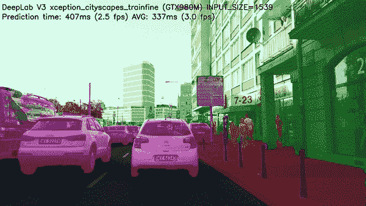
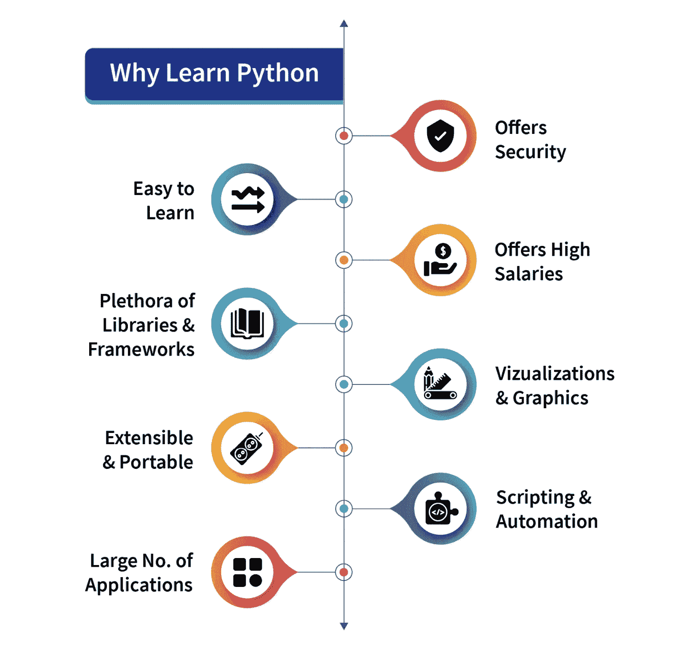
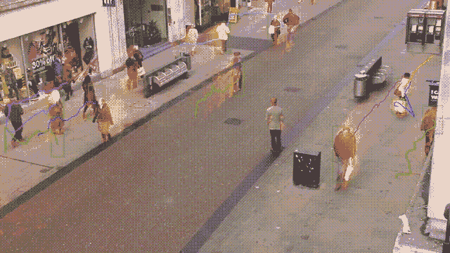
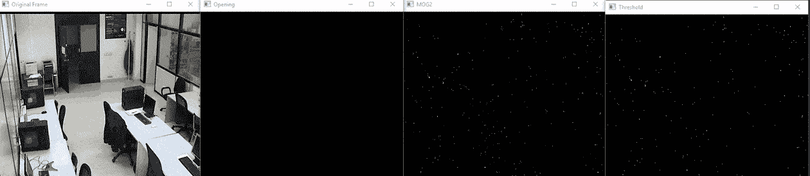
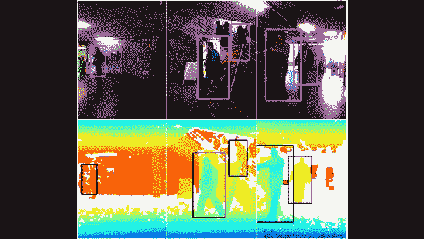

# 如何使用 Python 进行运动检测

> 原文：[`www.kdnuggets.com/2022/08/perform-motion-detection-python.html`](https://www.kdnuggets.com/2022/08/perform-motion-detection-python.html)



来源：[gfycat](https://gfycat.com/ediblepresentclam)

## 概述

* * *

## 我们的三大课程推荐

 1\. [谷歌网络安全证书](https://www.kdnuggets.com/google-cybersecurity) - 快速开启网络安全职业生涯。

 2\. [谷歌数据分析专业证书](https://www.kdnuggets.com/google-data-analytics) - 提升你的数据分析技能

 3\. [谷歌 IT 支持专业证书](https://www.kdnuggets.com/google-itsupport) - 支持你所在组织的 IT 工作

* * *

使用 Python 进行运动检测很简单，因为 Python 编程语言提供了多种开源库。运动检测有许多现实世界的应用。例如，它可以用于在线考试监控或用于商店、银行等的安全目的。

# 介绍

Python 编程语言是一个富含开源库的语言，为用户提供了大量应用，并且拥有众多用户。因此，它在市场上迅速增长。由于其简单的语法、易于发现错误和快速的调试过程，使得 Python 语言更具用户友好性，其优点无穷无尽。

**为什么你应该学习 Python？图示：**



来源：[Scaler Topics](https://www.scaler.com/topics/python/what-is-python-programming/)

Python 于 1991 年设计，由 Python 软件基金会开发。Python 有许多版本，其中 python2 和 python3 最为著名。目前，python3 被广泛使用，python3 的用户正在迅速增加。在这个项目或脚本中，我们将使用 python3。

# 什么是运动检测？

根据物理学，当物体静止且没有速度时，它被认为处于静止状态；相反，当物体没有完全静止，并在某个方向上有一定的运动或速度时，无论是左右、前后还是上下，它就被认为处于运动状态。在这篇文章中，我们将尝试检测这一点。



来源：[gtycat](https://gfycat.com/ediblepresentclam)

运动检测有许多实际应用，例如使用网络摄像头进行在线考试监考（我们将在本文中实现），作为保安等。

在这篇文章中，我们将尝试实现一个脚本，通过它我们将使用桌面或笔记本电脑的网络摄像头来检测运动。其思路是我们将拍摄两个视频帧，并尝试找到它们之间的差异。如果两个帧之间有某种差异，那么很明显在摄像头前面有物体的移动，这会产生差异。

# 重要库

在我们开始代码实现之前，让我们看看在通过网络摄像头进行运动检测时会用到的一些模块或库。正如我们讨论过的，库在 Python 的流行中扮演着重要角色，接下来我们来了解一下我们需要哪些：

1.  OpenCV

1.  Pandas

上述提到的库，OpenCV 和 Pandas 完全基于 Python，免费且开源，我们将与 Python3 版本的 Python 编程语言一起使用它们。

## 1\. OpenCV

[OpenCV](https://opencv.org/) 是一个开源库，可以与多种编程语言（如 C++、Python 等）一起使用。它用于处理图像和视频，通过将其与 Python 的 Pandas/NumPy 库集成，我们可以充分利用 OpenCV 的功能。

## 2\. Pandas：

如我们所讨论的，“[pandas](https://pandas.pydata.org/)” 是一个 Python 的开源库，提供了丰富的内置数据分析工具，因此在数据科学和数据分析领域被广泛使用。Pandas 提供了以数据结构形式存在的数据框，这对操作和存储二维表格数据非常有用。

上述两个模块不是 [python](https://www.python.org/) 的内置模块，我们必须先安装它们才能使用。除此之外，还有两个模块我们将在项目中使用。

1.  Python 日期时间模块

1.  Python 时间模块

这两个模块是 Python 的内置模块，不需要后续安装。它们分别处理与日期和时间相关的功能。

# 代码实现

到目前为止，我们已经看到了我们将在代码中使用的库，现在让我们开始实现，前提是视频只是许多静态图像或帧的组合，而所有这些帧结合在一起形成一个视频：

## 导入所需的库

在这一部分，我们将导入所有库，如 pandas 和 panda。然后我们从 DateTime 模块导入 cv2、time 和 DateTime 函数。

```py
# Importing the Pandas libraries  
import pandas as panda  

# Importing the OpenCV libraries  
import cv2  

# Importing the time module  
import time  

# Importing the datetime function of the datetime module  
from datetime import datetime 
```

## 初始化我们的数据变量

在这一部分，我们初始化了一些将在代码中进一步使用的变量。我们将初始状态定义为“None”，并将跟踪到的运动存储在另一个变量 motionTrackList 中。

我们定义了一个列表“motionTime”来存储检测到运动的时间，并使用 Pandas 模块初始化了 dataFrame 列表。

```py
# Assigning our initial state in the form of variable initialState as None for initial frames  
initialState = None  

# List of all the tracks when there is any detected of motion in the frames  
motionTrackList= [ None, None ]  

# A new list ‘time’ for storing the time when movement detected  
motionTime = []  

# Initialising DataFrame variable ‘dataFrame’ using pandas libraries panda with Initial and Final column  
dataFrame = panda.DataFrame(columns = ["Initial", "Final"])  
```

## 主要捕获过程

在这一部分，我们将执行主要的运动检测步骤。让我们一步一步理解它们：

1.  首先，我们将使用 cv2 模块捕捉视频，并将其存储在 video 变量中。

1.  然后，我们将使用无限的 while 循环捕获视频中的每一帧。

1.  我们将使用 read() 方法读取每一帧，并将它们存储到各自的变量中。

1.  我们定义了一个变量 motion，并将其初始化为零。

1.  我们使用 cv2 函数 cvtColor 和 GaussianBlur 创建了两个变量 grayImage 和 grayFrame，以发现运动中的变化。

1.  如果我们的 initialState 为 None，则将当前的 grayFrame 分配给 initialState，否则使用 ‘continue’ 关键字中止下一步处理。

1.  在下一部分，我们计算了当前迭代中初始帧和灰度帧之间的差异。

1.  然后我们将使用 cv2 threshold 和 dilate 函数突出显示初始帧和当前帧之间的变化。

1.  我们将从当前图像或帧中的移动物体中找到轮廓，并通过使用矩形函数创建绿色边界来标识移动物体。

1.  之后，我们将通过将当前检测到的元素添加到 motionTrackList 中来更新我们的列表。

1.  我们使用 imshow 方法显示了所有的帧，如灰度帧和原始帧等。

1.  此外，我们使用 cv2 模块的 witkey() 方法创建了一个键以结束过程，我们可以通过使用 ‘m’ 键来结束过程。

```py
# starting the webCam to capture the video using cv2 module  
video = cv2.VideoCapture(0)  

# using infinite loop to capture the frames from the video 
while True:  

   # Reading each image or frame from the video using read function 

   check, cur_frame = video.read()  

   # Defining 'motion' variable equal to zero as initial frame 

   var_motion = 0  

   # From colour images creating a gray frame 

   gray_image = cv2.cvtColor(cur_frame, cv2.COLOR_BGR2GRAY)  

   # To find the changes creating a GaussianBlur from the gray scale image  

   gray_frame = cv2.GaussianBlur(gray_image, (21, 21), 0)  

   # For the first iteration checking the condition

   # we will assign grayFrame to initalState if is none  

   if initialState is None:  

       initialState = gray_frame  

       continue  

   # Calculation of difference between static or initial and gray frame we created  

   differ_frame = cv2.absdiff(initialState, gray_frame)  

   # the change between static or initial background and current gray frame are highlighted 

   thresh_frame = cv2.threshold(differ_frame, 30, 255, cv2.THRESH_BINARY)[1]  

   thresh_frame = cv2.dilate(thresh_frame, None, iterations = 2)  

   # For the moving object in the frame finding the coutours 

   cont,_ = cv2.findContours(thresh_frame.copy(),   

                      cv2.RETR_EXTERNAL, cv2.CHAIN_APPROX_SIMPLE)  

   for cur in cont:  

       if cv2.contourArea(cur) < 10000:  

           continue  

       var_motion = 1  

       (cur_x, cur_y,cur_w, cur_h) = cv2.boundingRect(cur)  

       # To create a rectangle of green color around the moving object  

       cv2.rectangle(cur_frame, (cur_x, cur_y), (cur_x + cur_w, cur_y + cur_h), (0, 255, 0), 3)  

  # from the frame adding the motion status   

   motionTrackList.append(var_motion)  

   motionTrackList = motionTrackList[-2:]  

   # Adding the Start time of the motion 

   if motionTrackList[-1] == 1 and motionTrackList[-2] == 0:  

       motionTime.append(datetime.now())  

  # Adding the End time of the motion 

   if motionTrackList[-1] == 0 and motionTrackList[-2] == 1:  

       motionTime.append(datetime.now())  

  # In the gray scale displaying the captured image 

   cv2.imshow("The image captured in the Gray Frame is shown below: ", gray_frame)  

   # To display the difference between inital static frame and the current frame 

   cv2.imshow("Difference between the  inital static frame and the current frame: ", differ_frame)  

   # To display on the frame screen the black and white images from the video  

   cv2.imshow("Threshold Frame created from the PC or Laptop Webcam is: ", thresh_frame)  

   # Through the colour frame displaying the contour of the object

   cv2.imshow("From the PC or Laptop webcam, this is one example of the Colour Frame:", cur_frame)  

   # Creating a key to wait  

   wait_key = cv2.waitKey(1)  

   # With the help of the 'm' key ending the whole process of our system   

   if wait_key == ord('m'):  

       # adding the motion variable value to motiontime list when something is moving on the screen  

       if var_motion == 1:  

           motionTime.append(datetime.now())  

       break 
```

## 完成代码

在关闭循环后，我们将数据从 dataFrame 和 motionTime 列表中添加到 CSV 文件中，并最终关闭视频。

```py
# At last we are adding the time of motion or var_motion inside the data frame  
for a in range(0, len(motionTime), 2):  

   dataFrame = dataFrame.append({"Initial" : time[a], "Final" : motionTime[a + 1]}, ignore_index = True)  

# To record all the movements, creating a CSV file  
dataFrame.to_csv("EachMovement.csv")  

# Releasing the video   
video.release()  

# Now, Closing or destroying all the open windows with the help of openCV  
cv2.destroyAllWindows()
```

# 过程总结

我们已经创建了代码，现在让我们简要讨论一下过程。

首先，我们使用设备的网络摄像头捕获了一个视频，然后将输入视频的初始帧作为参考，并不时检查后续帧。如果发现与第一帧不同的帧，则表示存在运动。这将在绿色矩形中标记。

# 结合代码

我们在不同部分查看了代码。现在，让我们将其结合起来：

```py
# Importing the Pandas libraries  
import pandas as panda  

# Importing the OpenCV libraries  
import cv2  

# Importing the time module  
import time  

# Importing the datetime function of the datetime module  
from datetime import datetime 

# Assigning our initial state in the form of variable initialState as None for initial frames  
initialState = None  

# List of all the tracks when there is any detected of motion in the frames  
motionTrackList= [ None, None ]  

# A new list 'time' for storing the time when movement detected  
motionTime = []  

# Initialising DataFrame variable 'dataFrame' using pandas libraries panda with Initial and Final column  
dataFrame = panda.DataFrame(columns = ["Initial", "Final"])

# starting the webCam to capture the video using cv2 module  
video = cv2.VideoCapture(0)  

# using infinite loop to capture the frames from the video 
while True:  

   # Reading each image or frame from the video using read function 

   check, cur_frame = video.read()  

   # Defining 'motion' variable equal to zero as initial frame 

   var_motion = 0  

   # From colour images creating a gray frame 

   gray_image = cv2.cvtColor(cur_frame, cv2.COLOR_BGR2GRAY)  

   # To find the changes creating a GaussianBlur from the gray scale image  

   gray_frame = cv2.GaussianBlur(gray_image, (21, 21), 0)  

   # For the first iteration checking the condition

   # we will assign grayFrame to initalState if is none  

   if initialState is None:  

       initialState = gray_frame  

       continue  

   # Calculation of difference between static or initial and gray frame we created  

   differ_frame = cv2.absdiff(initialState, gray_frame)  

   # the change between static or initial background and current gray frame are highlighted 

   thresh_frame = cv2.threshold(differ_frame, 30, 255, cv2.THRESH_BINARY)[1]  

   thresh_frame = cv2.dilate(thresh_frame, None, iterations = 2)  

   # For the moving object in the frame finding the coutours 

   cont,_ = cv2.findContours(thresh_frame.copy(),   

                      cv2.RETR_EXTERNAL, cv2.CHAIN_APPROX_SIMPLE)  

   for cur in cont:  

       if cv2.contourArea(cur) < 10000:  

           continue  

       var_motion = 1  

       (cur_x, cur_y,cur_w, cur_h) = cv2.boundingRect(cur)  

       # To create a rectangle of green color around the moving object  

       cv2.rectangle(cur_frame, (cur_x, cur_y), (cur_x + cur_w, cur_y + cur_h), (0, 255, 0), 3)  

  # from the frame adding the motion status   

   motionTrackList.append(var_motion)  

   motionTrackList = motionTrackList[-2:]  

   # Adding the Start time of the motion 

   if motionTrackList[-1] == 1 and motionTrackList[-2] == 0:  

       motionTime.append(datetime.now())  

  # Adding the End time of the motion 

   if motionTrackList[-1] == 0 and motionTrackList[-2] == 1:  

       motionTime.append(datetime.now())  

  # In the gray scale displaying the captured image 

   cv2.imshow("The image captured in the Gray Frame is shown below: ", gray_frame)  

   # To display the difference between inital static frame and the current frame 

   cv2.imshow("Difference between the  inital static frame and the current frame: ", differ_frame)  

   # To display on the frame screen the black and white images from the video  

   cv2.imshow("Threshold Frame created from the PC or Laptop Webcam is: ", thresh_frame)  

   # Through the colour frame displaying the contour of the object

   cv2.imshow("From the PC or Laptop webcam, this is one example of the Colour Frame:", cur_frame)  

   # Creating a key to wait  

   wait_key = cv2.waitKey(1)  

   # With the help of the 'm' key ending the whole process of our system   

   if wait_key == ord('m'):  

       # adding the motion variable value to motiontime list when something is moving on the screen  

       if var_motion == 1:  

           motionTime.append(datetime.now())  

       break 

# At last we are adding the time of motion or var_motion inside the data frame  
for a in range(0, len(motionTime), 2):  

   dataFrame = dataFrame.append({"Initial" : time[a], "Final" : motionTime[a + 1]}, ignore_index = True)  

# To record all the movements, creating a CSV file  
dataFrame.to_csv("EachMovement.csv")  

# Releasing the video   
video.release()  

# Now, Closing or destroying all the open windows with the help of openCV  
cv2.destroyAllWindows()
```

# 结果

运行上述代码后得出的结果将类似于下面所示的内容。



在这里，我们可以看到视频中男子的动作已被跟踪。因此，输出可以相应地显示出来。

然而，在这段代码中，跟踪将通过围绕移动物体的矩形框进行，类似于下面所示的内容。值得注意的是，视频是安全摄像头的录像，检测已在其上完成。



# 结论

+   Python 编程语言是一个开源的、功能丰富的库语言，为用户提供了许多应用。

+   当一个物体静止且没有速度时，它被认为是静止的，反之，当一个物体不完全静止时，它被认为是运动中的。

+   OpenCV 是一个开源库，可与多种编程语言一起使用，通过将其与 Python 的 pandas/NumPy 库集成，我们可以最大限度地利用 OpenCV 的功能。

+   主要的观点是，每个视频实际上是由许多静态图像（称为帧）组合而成，而帧之间的差异用于检测。

**[Vaishnavi Amira Yada](https://www.linkedin.com/in/vaishnavi-amira-yada/)** 是一名技术内容编写者。她掌握 Python、Java、数据结构与算法（DSA）、C 等知识。她发现自己喜欢写作，并且热爱这份工作。

### 更多相关话题

+   [KDnuggets 新闻，8 月 17 日：如何使用…进行运动检测](https://www.kdnuggets.com/2022/n33.html)

+   [使用 NumPy 进行日期和时间计算](https://www.kdnuggets.com/using-numpy-to-perform-date-and-time-calculations)

+   [使用 Hugging Face Transformers 进行文本情感检测](https://www.kdnuggets.com/using-hugging-face-transformers-for-emotion-detection-in-text)

+   [如何在 Python 中执行单元测试？](https://www.kdnuggets.com/2023/01/perform-unit-testing-python.html)

+   [如何在大型数据集上执行内存高效操作](https://www.kdnuggets.com/how-to-perform-memory-efficient-operations-on-large-datasets-with-pandas)

+   [如何使用 NumPy 执行矩阵操作](https://www.kdnuggets.com/how-to-perform-matrix-operations-with-numpy)
