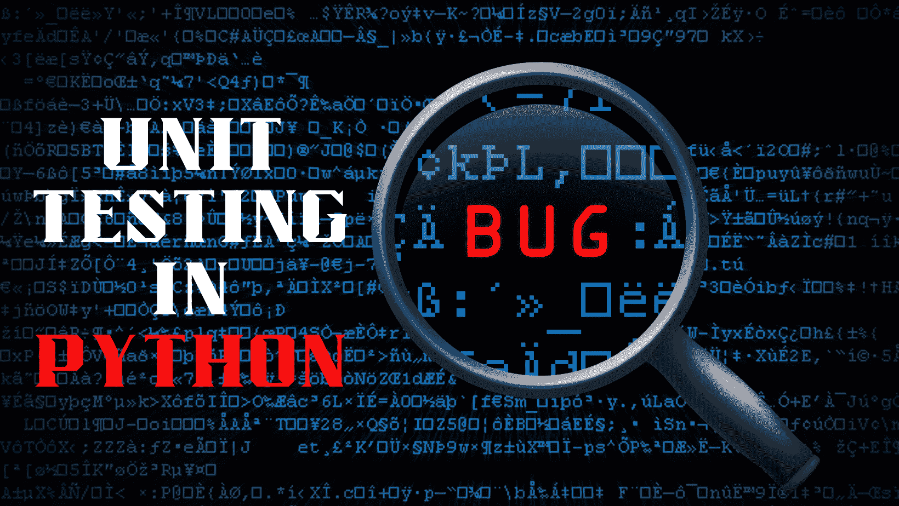

# 如何在 Python 中进行单元测试？

> 原文：[`www.kdnuggets.com/2023/01/perform-unit-testing-python.html`](https://www.kdnuggets.com/2023/01/perform-unit-testing-python.html)



图片由作者提供

# 介绍

验证代码的独立性是确保我们的代码符合质量标准并按预期工作的重要步骤。在制作简单的食谱时，我们会在各个阶段品尝并相应调整味道。将这一概念扩展到代码中，我们不断审视代码以验证其正确性。在测试方面，我们可以进行手动测试或自动测试，但手动测试是一项繁琐且耗时的过程。自动化测试涉及由脚本而非人工执行测试。自动化测试中有各种测试类型，如单元测试、集成测试、压力测试等，但本教程将重点关注单元测试。

# 单元测试的重要性

单元测试是一种分析单个单元是否存在错误的技术，以使你的代码稳定并具备未来适应性。这些单元可能是单独的函数、完整的类或整个模块。在大多数情况下，这些单元与代码的其他部分没有依赖关系。它的重要性在于，这些单元是你应用程序的基本构建块，如果它们有缺陷，你的应用程序就会崩溃。它还提升了开发者的生产力，并鼓励模块化编程。

# UnitTest

许多测试运行器可用于 Python，例如

+   Unittest

+   Pytest

+   Nose2

+   Testify

+   DocTest

在本教程中，我们将使用 `unittest`，这是 Python 标准库中的内置测试框架。它包含测试框架和测试运行器，提供了从测试自动化、将测试聚合到集合中的功能，到测试与报告框架独立的各种特性。它具有以下要求：

+   每个单元测试可以创建为扩展 TestCase 类的方法，并在方法前加上 "test" 以通知测试运行器测试方法

+   使用特殊的断言方法序列来确定测试用例是否通过或失败。以下是一些最常用的断言方法：

| **方法** | **描述** |
| --- | --- |
| .assertEqual(a, b) | a == b |
| .assertNotEqual(a, b) | a != b |
| .assertTrue(x) | bool(x) 为 True |
| .assertFalse(x) | bool(x) 为 False |
| .assertIs(a, b) | a 是 b |
| .assertIs(a, b) | a 不是 b |
| .assertIsNone(x) | x 是 None |
| .assertIsNotNone(x) | x 不是 None |
| .assertIn(a,b) | a 在 b 中 |
| .assertNotIn(a,b) | a 不在 b 中 |
| .assertIsInstance(a, b) | isinstance(a, b) |
| .assertNotIsInstance(a, b) | not isinstance(a, b) |

来源: [unittest 官方文档](https://docs.python.org/3/library/unittest.html)

# 使用 UnitTest 执行单元测试的步骤

+   在 Python 文件中编写你想要测试的代码，例如 **example.py**。

+   创建一个新的 Python 文件用于你的单元测试，文件名以 test 开头，例如 **test_example.py**。

+   导入 **unittest 模块** 和 **example.py**。

+   创建一个扩展 **unittest.TestCase** 类的类。

+   编写以 **test_functionName(self)** 开头的测试方法，并使用 assert 方法来验证正在测试的代码的行为。

+   在终端中运行命令 **python -m unittest test_example.py**，或者在测试文件中调用 unittest 的主方法，并运行 **python test_example.py**。

# 示例

创建一个名为 **calc.py** 的文件，用于计算矩形的面积。

```py
def calc_rectangle_area(length, width):
    return length * width
```

创建一个测试文件 **test_calc.py** 并编写以下代码：

```py
import unittest
import calc

class TestRectangleArea(unittest.TestCase):
    def test_area_calculation(self):
        self.assertEqual(calc.calc_rectangle_area(2, 4), 8, "Incorrect area for a rectangle with length 2 and width 4")
        self.assertEqual(calc.calc_rectangle_area(3, 5), 15, "Incorrect area for a rectangle with length 3 and width 5")
        self.assertEqual(calc.calc_rectangle_area(10, 10), 100, "Incorrect area for a rectangle with length 10 and width 10")

if __name__ == '__main__':
    unittest.main() 
```

在终端中运行 **python test_calc.py**。将显示以下输出：

```py
-----------------------------------------------------------
Ran 1 test in 0.001s

OK 
```

现在，修改矩形计算的公式以验证我们的测试用例。

```py
def calc_rectangle_area(length, width):
     return length * width * 2 
```

再次在终端中运行 **python test_calc.py**。

```py
self.assertEqual(calc.calc_rectangle_area(2, 4), 8, "Incorrect area for a rectangle with length 2 and width 4")
AssertionError: 16 != 8: Incorrect area for a rectangle with length 2 and width 4

-----------------------------------------------------------
Ran 1 test in 0.001s

FAILED (failures=1) 
```

你还可以扩展此代码以处理如除零错误等问题。

# 结论

虽然 unittest 模块为我们提供了编写和运行单元测试的基本工具，但也有第三方库提供更高级的功能。然而，单元测试仍然是软件开发生命周期的重要组成部分，并能帮助你及早发现错误，从而编写出更可靠和易于维护的代码。希望你喜欢这篇文章。欢迎在评论区分享你的想法或反馈。

**[Kanwal Mehreen](https://www.linkedin.com/in/kanwal-mehreen1)** 是一位有志的软件开发者，对数据科学和人工智能在医学中的应用充满兴趣。Kanwal 被选为 2022 年 APAC 区域的谷歌新生代学者。Kanwal 喜欢通过撰写关于热点话题的文章来分享技术知识，并且热衷于提高女性在科技行业的代表性。

* * *

## 我们的前三个课程推荐

 1\. [谷歌网络安全证书](https://www.kdnuggets.com/google-cybersecurity) - 快速入门网络安全职业。

 2\. [谷歌数据分析专业证书](https://www.kdnuggets.com/google-data-analytics) - 提升你的数据分析技能

 3\. [谷歌 IT 支持专业证书](https://www.kdnuggets.com/google-itsupport) - 支持你的组织的 IT 需求

* * *

### 更多相关内容

+   [假设检验和 A/B 测试](https://www.kdnuggets.com/hypothesis-testing-and-ab-testing)

+   [像专业人士一样测试：Python Mock 库的逐步指南](https://www.kdnuggets.com/testing-like-a-pro-a-step-by-step-guide-to-pythons-mock-library)

+   [如何使用 Python 进行运动检测](https://www.kdnuggets.com/2022/08/perform-motion-detection-python.html)

+   [KDnuggets 新闻，8 月 17 日：如何进行动作检测…](https://www.kdnuggets.com/2022/n33.html)

+   [介绍自然语言处理的测试库](https://www.kdnuggets.com/2023/04/introducing-testing-library-natural-language-processing.html)

+   [A/B 测试：全面指南](https://www.kdnuggets.com/ab-testing-a-comprehensive-guide)
