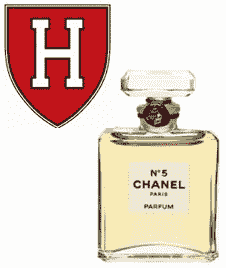

# 香水、计算机编程与哈佛

> 原文：[`www.kdnuggets.com/2014/10/perfume-computer-programming-harvard.html`](https://www.kdnuggets.com/2014/10/perfume-computer-programming-harvard.html)

品牌力量的经典例子是香水——昂贵的香水生产成本可能只需几美元，但由于品牌的声望，可以以超过$100 的价格出售。

大卫·马兰在哈佛的计算机科学课程，[CSCI E-50](http://www.extension.harvard.edu/courses/intensive-introduction-computer-science)，在教育领域提供了一个有趣的平行示例。它[可以通过 EdX 免费获取](https://www.edx.org/course/harvardx/harvardx-cs50x-introduction-computer-1022)，或者你可以支付$75 获得 EdX 完成证书（前提是你成功完成课程）。或者你可以支付$2200 获得哈佛学分。

这才是重点——在所有这三种情况下，学生的课程体验完全相同。唯一的区别，除了价格，还有是否有证书，以及如果有证书，则颁发证书的组织名称。

不是什么秘密，常春藤联盟的证书在教育质量之外还具有无形的价值。MOOC 时代生动地说明了这种品牌溢价——在固定产品的情况下，消费者似乎愿意为哈佛的名字支付 2800%的溢价，而不是 EdX 的证书。有点像香水。

Statistics.com 还提供了一个针对数据科学家需求的编程入门课程，使用 R、Python 和 SQL。小班授课，教师和助教提供个性化关注。详见：

[www.statistics.com/r-prog-intro-1/](http://www.statistics.com/r-prog-intro-1/)

彼得·布鲁斯是 Statistics.com 的总裁。

**相关：**

+   谁主导了分析就业市场？

+   统计教育指南

+   独家采访：彼得·布鲁斯，Statistics.com 总裁

+   开始文本分析

* * *

## 我们的前三个课程推荐

 1. [谷歌网络安全证书](https://www.kdnuggets.com/google-cybersecurity) - 快速进入网络安全职业。

 2. [谷歌数据分析专业证书](https://www.kdnuggets.com/google-data-analytics) - 提升你的数据分析技能

 3. [谷歌 IT 支持专业证书](https://www.kdnuggets.com/google-itsupport) - 支持你的组织的 IT 需求

* * *

### 更多相关话题

+   [来自哈佛大学的最受欢迎的编程入门课程免费啦！](https://www.kdnuggets.com/2022/03/popular-intro-programming-course-harvard-free.html)

+   [KDnuggets 新闻，3 月 30 日：最受欢迎的编程入门课程](https://www.kdnuggets.com/2022/n13.html)

+   [来自哈佛、斯坦福等高校的免费数据科学课程合集](https://www.kdnuggets.com/a-collection-of-free-data-science-courses-from-harvard-stanford-mit-cornell-and-berkeley)

+   [哈佛大学为有志于成为数据科学家的顶级免费课程](https://www.kdnuggets.com/harvard-top-free-courses-for-aspiring-data-scientists)

+   [9 门免费的哈佛数据科学课程](https://www.kdnuggets.com/2022/05/9-free-harvard-courses-learn-data-science-2022.html)

+   [KDnuggets 新闻，5 月 4 日：9 门免费的哈佛数据科学课程](https://www.kdnuggets.com/2022/n18.html)
