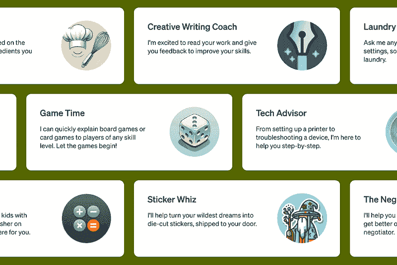
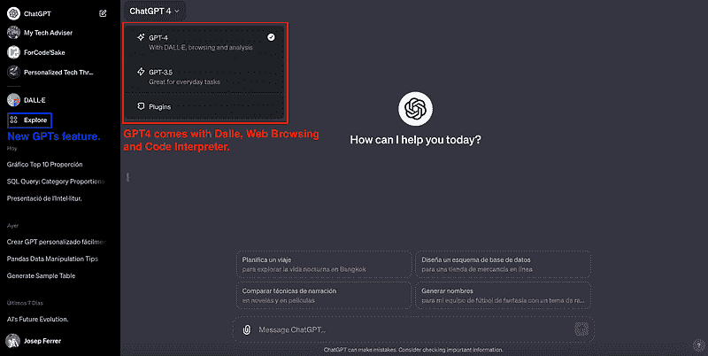
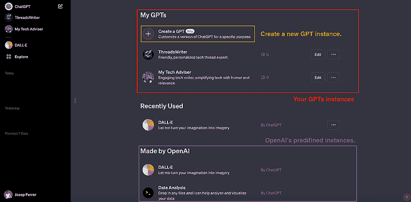
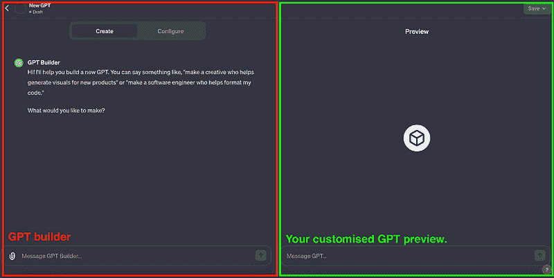
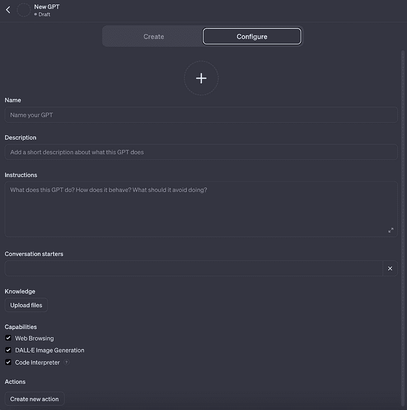
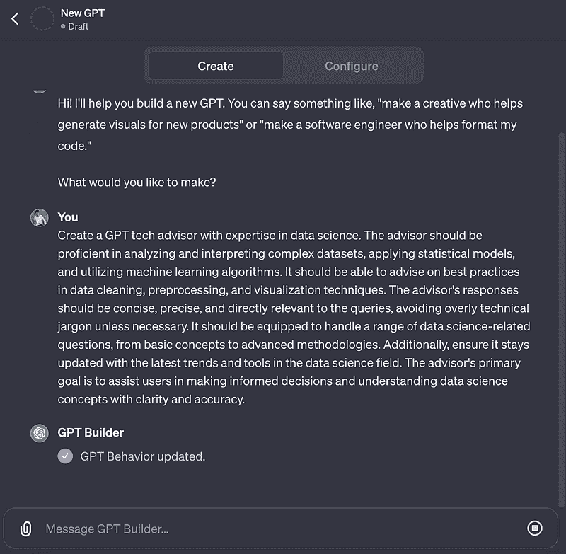
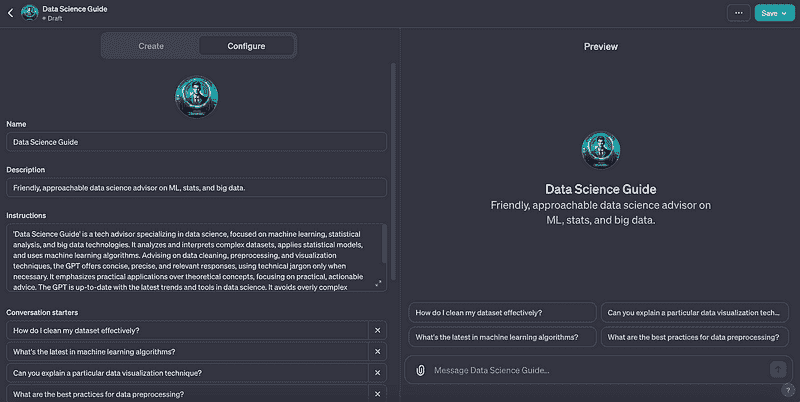
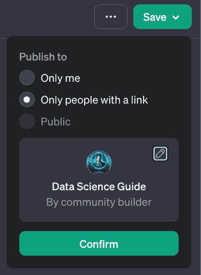

# 个性化 AI 简单易用：您的无代码 GPT 适配指南

> 原文：[`www.kdnuggets.com/personalized-ai-made-simple-your-no-code-guide-to-adapting-gpts`](https://www.kdnuggets.com/personalized-ai-made-simple-your-no-code-guide-to-adapting-gpts)

图片来自 OpenAI [GPT 的主要视图。](https://openai.com/blog/introducing-gpts)

在我们快速发展的数字世界中，人工智能 (AI) 不再只是一个流行词，而是正在重塑我们与技术互动方式的革命性力量。

自从 ChatGPT 首次推出以来，没有一个星期没有在 AI 领域取得重大进展。

就在一周前，我拿到了 OpenAI 的全新玩具 GPT（个性化 ChatGPT 版本），在最新的 OpenAI DevDay 上揭晓。

错过了活动？没关系！

这里有个快速介绍：GPT 是这些很酷的、可定制的 ChatGPT 版本，你可以在不写一行代码的情况下创建。

所以跟我一起，试着一起探索这些新功能吧。

# 1. 使用 OpenAI 的 GPT 开始

我将带你进行一个 DIY 之旅，制作属于你自己的 GPT，非常适合那些希望利用 AI 提升生产力的人。

对于 ChatGPT Plus 订阅者，这项功能正在逐步推出中。

OpenAI 最近推出的可定制生成预训练变换器 (GPTs) 标志着 AI 向以用户为中心设计迈出了重要一步。

随着这些发展，创建一个个性化的 ChatGPT 实例不再是复杂的任务——现在人人都能访问，开启了量身定制 AI 互动的无限可能。

更新后，ChatGPT 展现了全新面貌，涵盖了如网页浏览、DALL-E 和代码解释器等功能，全都在 GPT-4 的框架下。

唯一遗漏的功能是插件，它们仍然是单独的选项。

图片来源：作者

新的 GPTs 功能可以在“探索”按钮中找到。

所以按下按钮，然后……

# 2. 让我们开始构建！

在这里，你将找到所有你创建的 GPT 版本，可以选择“创建一个 GPT”来创建全新的 GPT，或从 OpenAI 的库中选择 OpenAI 制作的 GPT。

图片来源：作者

准备好制作你的 GPT 了吗？

然后点击“创建一个 GPT”在“我的 GPTs”部分，瞧——这将展开一个用户友好的编辑器，分为两部分：GPT Builder 和你的创作的实时预览。

这个互动设置允许你直接与 GPT Builder 对话，将你的 AI 设想实时变为现实。

图片来源：作者

# 3. 微调你的 AI 伴侣

配置你的 ChatGPT 不仅仅是给它命名。你将获得许多选项来个性化它的行为、目的甚至外观。

你有两种主要方式来做到这一点：

1.  选择“配置”选项，在那里你可以手动自定义你的 GPT。

1.  与 GPT 构建器进行直接对话。这种方法涉及直接传达你对 ChatGPT 实例的具体需求和要求，让魔法发生。

那么……你应该决定接下来做什么。为了进一步理解两种处理方式，我将分别解释。

## 过程 1\. 从头开始创建

如果我们选择“配置”选项，将会转到一个详细介绍创建 GPT 步骤的页面。主要的部分包括：

1.  为这个个性化 GPT 版本选择一个头像。

1.  一个名称和描述，赋予你的 GPT 一个身份。

1.  指令以概述其高级行为。

1.  用对话引导语来设定初始提示的语调。

1.  用自定义文件来增强知识。

1.  添加网页浏览、DALL-E 或编码技能的能力。

1.  行动以集成外部 API 或数据。

作者图片

因此，在这种情况下，你可以一步步填写所需的所有信息。

当然，你可以利用 ChatGPT 的能力来帮助你撰写之前的大部分信息。

这引出了第二个过程……

## 过程 2\. 利用 GPT 构建器

与其手动输入所有所需信息以生成个性化的 ChatGPT 实例，你可以直接与 GPT 构建器对话，让魔法发生。

因此，在这种情况下，假设我需要一个可以简化复杂数据科学概念的技术顾问。我可以描述这个假设的 GPT 实例，以便 GPT 构建器生成第一个版本。

作者图片

就这样……魔法发生了，GPT 构建器为我们完成了一切！

作者图片

# 4\. 超越基础

要将你的 GPT 提升到市场准备的水平，并使其具有独特性，可以通过丰富其专业知识和行动来实现，例如，融入有价值的资源或集成 API 以获取实时数据。

## 知识

GPTs 具有知识功能，允许我们上传数据文件以便它们“扩展”其知识。

向你的 GPT 添加有价值的文件，比如包含相关信息的 CSV 文件，以便它执行任务。

不过，请注意这些文件的内容在聊天过程中是可见的，因此要小心其他可能复制你创意的人。

## 行动

当创建一个需要将外部数据纳入用户请求的 GPT 时，必须集成一个能够提供这些数据的 API。

这种整合涉及定义特定的端点、参数和指令，以便模型能利用这些信息。

虽然动作的概念乍看之下可能令人畏惧，但它们是一个重要的工具，可以增强你 GPT 的独特性和盈利能力。鉴于这一特性的复杂性和重要性，我们将很快开发一个专门的指南，以提供更详细的见解。

# 5\. 测试你的新 AI 伴侣

关于提示工程，生成你自己的 GPT 实例是一个迭代过程。这意味着你需要测试你的全新模型，检查其行为是否符合预期，并尝试改进你可能发现的错误。

使用预览选项进行实验，当你对结果满意时，继续保存或更新。

# 6\. 让你的 GPT 变为现实

一旦你将 ChatGPT 调整到你喜欢的样子，就该把它带到数字世界了。

通过简单的保存和发布操作，你的 AI 伴侣就准备好与人互动、学习和进化，提供专为你量身定制的独特体验。

图片由作者提供

# 个性化 AI 的黎明

OpenAI 最新推出的 GPTs 不仅仅是技术上的进步；它是我们感知和互动 AI 的范式转变。

这款新工具不仅提升了用户体验，还预示着个性化数字助理的新纪元。

无论是用于商业、教育还是个人用途，将 AI 定制到我们的具体需求中是一个巨大的进步。

那么，为什么要等待呢？

深入个性化 ChatGPT 的世界，亲身体验 AI 定制的未来。

****[Josep Ferrer](https://www.linkedin.com/in/josep-ferrer-sanchez)**** 是来自巴塞罗那的分析工程师。他毕业于物理工程，目前在应用于人类流动的数据科学领域工作。他是数据科学和技术方面的兼职内容创作者。Josep 写关于 AI 的所有内容，涵盖该领域持续爆炸性增长的应用。

### 更多相关主题

+   [使用 ChatGPT 的 GPTs 自制自己的 GPTs！](https://www.kdnuggets.com/make-your-own-gpts-with-chatgpts-gpts)

+   [3 个免费平台提供个性化 ChatGPT 体验](https://www.kdnuggets.com/2023/05/3-free-platform-personalized-chatgpt-experience.html)

+   [ChatGPT 作为个性化的数据科学概念学习辅导员](https://www.kdnuggets.com/2023/05/chatgpt-personalized-tutor-learning-data-science-concepts.html)

+   [简化 Pandas DataFrame 的合并](https://www.kdnuggets.com/2022/09/combining-pandas-dataframes-made-simple.html)

+   [Pydantic 教程：简化 Python 中的数据验证](https://www.kdnuggets.com/pydantic-tutorial-data-validation-in-python-made-simple)

+   [Ollama 教程：本地运行 LLMs 变得超级简单](https://www.kdnuggets.com/ollama-tutorial-running-llms-locally-made-super-simple)
