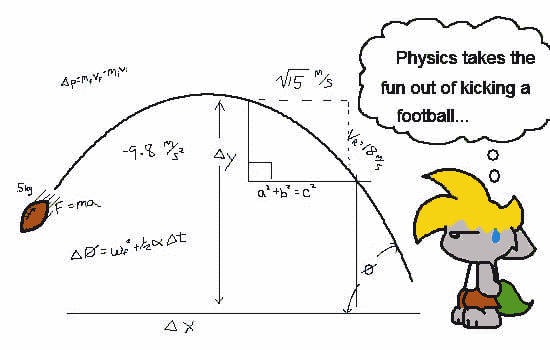
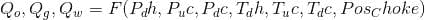
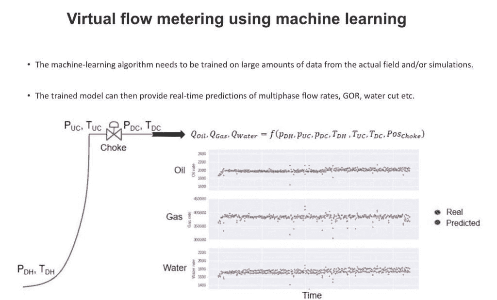

# 如何将物理学教给机器学习模型？

> 原文：[`www.kdnuggets.com/2019/05/physics-machine-learning-models.html`](https://www.kdnuggets.com/2019/05/physics-machine-learning-models.html)

 评论

**由[Vegard Flovik](https://www.linkedin.com/in/vegard-flovik/)，Axbit AS 首席数据科学家**

在我的其他文章中，我讨论了诸如：[异常检测和状态监测的机器学习](https://www.linkedin.com/pulse/how-use-machine-learning-anomaly-detection-condition-flovik-phd/)、[机器学习如何用于生产优化](https://towardsdatascience.com/machine-learning-for-production-optimization-e460a0b82237)以及[如何避免机器学习在时间序列预测中的常见陷阱](https://towardsdatascience.com/how-not-to-use-machine-learning-for-time-series-forecasting-avoiding-the-pitfalls-19f9d7adf424)等主题。

但你知道吗，你也可以将机器学习和基于物理的建模结合起来？在这里，我将描述如何做到这一点，以及如何“教物理学”给机器学习模型。

### 机器学习与基于物理的建模

作为一名物理学家，我喜欢创建数学模型来描述我们周围的世界。通过足够的信息，一个制作良好的基于物理的模型使我们能够理解复杂的过程并预测未来的事件。这些模型已经在我们现代社会中广泛应用于各种不同的过程，比如预测大型火箭的轨道或纳米级物体的行为，这些物体是现代电子学的核心。

预测能力也是机器学习（ML）的重要应用之一。一个常见的关键问题是如何在基于物理的模型和数据驱动的 ML 模型之间做出选择。答案取决于你想解决的问题。在这种情况下，主要有两类问题：

*1) 我们对系统没有直接的理论知识，但我们有大量关于其行为的实验数据。*

比如说，如果你对一个系统的行为没有直接的了解，你就无法制定任何数学模型来描述它并做出准确的预测。

幸运的是，一切并非丧失。如果你有大量的例子结果，你可以使用基于 ML 的模型。只要有足够的例子结果（训练数据），一个 ML 模型应该能够学习你所拥有的关于系统的信息（输入变量）与你希望预测的结果（输出变量）之间的任何潜在模式。

一个例子可能是预测一个城市的房价。如果你有足够多的类似房子的售价样本，你应该能够对一套待售房子的价格做出合理的预测。

*2) 我们对系统有很好的理解，并且也能用数学来描述它。*

如果一个问题可以用基于物理的模型很好地描述，这种方法通常是一个好的解决方案。

这并不意味着机器学习对任何可以用基于物理的建模描述的问题毫无用处。相反，将物理与机器学习结合在混合建模方案中是一个非常激动人心的前景。实际上，它如此激动人心，以至于正在深入研究。与我的工作相关，我最近也在深入探索机器学习与基于物理的建模之间的交集。

### 混合分析：结合机器学习和基于物理的建模

即使一个系统在原则上可以用基于物理的模型来描述，这也不意味着机器学习的方法不起作用。机器学习模型通过经验学习的能力意味着它们也可以学习物理：给定足够的物理系统行为的例子，机器学习模型可以学习这种行为并做出准确的预测。

这种通过经验而非数学方程学习物理的能力对许多人来说是熟悉的，尽管我们可能没有意识到。例如，如果你曾经踢过足球，你可能会尝试完美射门。为了做到这一点，你必须准确预测球的轨迹。这是一个相当复杂的物理问题，包括几个变量，如踢球的力量、脚的角度、球的重量、空气阻力、草地的摩擦等等。

然而，当一名足球运动员踢球时，这并不是因为他在短短一秒钟内进行了复杂的物理计算。相反，他从经验中学到了正确的动作，并对完美的射门有了直觉。

(*[插图来源：Deviant Art](https://chaoskomori.deviantart.com/art/The-Physics-of-Football-1870988))*

机器学习模型或算法从经验中学习的事实在原则上类似于人类的学习方式。一类名为人工神经网络的机器学习模型是受大脑如何处理信息和从经验中学习的启发而创建的计算系统。

这种从经验中学习的能力也激励了我和我的同事尝试教机器学习模型物理：我们不是使用数学方程，而是通过向模型展示输入变量和正确解决方案的例子来训练它。

### 为什么在我们已经有基于物理的模型时还要使用机器学习？

一个重要的问题是，当我们有一个能够描述相关系统的基于物理的模型时，我们为什么还要实施基于机器学习的方法。

其中一个关键方面是模型的计算成本：我们可能能够使用基于物理的模型详细描述系统。但解决这个模型可能复杂且耗时。因此，如果我们希望建立一个能够对实时数据进行预测的模型，基于物理的方法可能会崩溃。

在这种情况下，基于机器学习的更简单模型可能是一个选项。机器学习模型的计算复杂度主要体现在训练阶段。一旦模型完成训练，对新数据进行预测是直接的。这就是结合机器学习和基于物理建模的混合方法变得非常有趣的地方。

### 通过混合建模方案进行虚拟流量计量

例如，我们考虑了这种方法用于油井中的虚拟流量计量任务，如下图所示。多个传感器可以提供井下的温度和压力测量值 *P_dh, T_dh*，以及井口上游的 *P_uc, T_uc* 和下游的 *P_dc, T_dc*。我们要解决的问题是油、气和水的流量如何依赖于这些测量值：即描述多相流速的函数。

这是一个复杂的建模任务，但使用最先进的模拟工具，我们可以以高精度完成这项任务。

该模型捕捉了来自生产井的油、气和水的多相流的热力学和流体力学。利用这一点，我们可以生成大量模拟训练数据用于机器学习模型，并将其与来自实际井的数据相结合。

这种方法的优势在于，我们可以离线执行所有计算密集型的部分，在那里进行快速的实时预测不是问题。通过从基于物理的模型生成大量训练数据，我们可以教会机器学习模型问题的物理特性。

训练好的机器学习模型可以仅使用来自实际井的传感器测量值，即压力和温度，同时预测油、气和水的流量。更重要的是，它可以在不到一秒的时间内做出这些预测，使其成为处理生产井实时数据的理想应用。

这种方法使我们能够为生产设施上的所有井实现虚拟多相流量计。我相信它将成为监测和生产优化的极其宝贵的工具。

### 你认为还有哪些领域会从机器学习中受益？

我相信，未来机器学习将会以我们今天难以想象的方式被广泛应用。你认为它会对各个行业产生怎样的影响？我很期待在下方评论区看到你的想法。

**简介：**[Vegard Flovik](https://www.linkedin.com/in/vegard-flovik/) 是 Axbit As 的首席数据科学家。

[原文](https://towardsdatascience.com/how-do-you-combine-machine-learning-and-physics-based-modeling-3a3545d58ab9)。经许可转载。

**相关内容：**

+   [避免机器学习问题的复杂性](https://www.kdnuggets.com/2016/03/avoiding-complexity-machine-learning-problems.html)

+   [深度学习之所以效果好，是因为宇宙、物理学和围棋比之前的模型要简单得多，并且具有可利用的模式](https://www.kdnuggets.com/2016/12/deep-learning-works-great-universe-physics-go-simpler-than-previous-models.html)

+   [理论数据发现：利用物理学理解数据科学](https://www.kdnuggets.com/2016/07/theoretical-data-discovery-physics-data-science.html)

* * *

## 我们的 3 大课程推荐

 1\. [谷歌网络安全证书](https://www.kdnuggets.com/google-cybersecurity) - 快速进入网络安全职业的快车道。

 2\. [谷歌数据分析专业证书](https://www.kdnuggets.com/google-data-analytics) - 提升你的数据分析技能。

 3\. [谷歌 IT 支持专业证书](https://www.kdnuggets.com/google-itsupport) - 支持你组织的 IT 工作

* * *

### 更多相关内容

+   [为什么你应该使用线性回归模型而不是...](https://www.kdnuggets.com/2021/08/3-reasons-linear-regression-instead-neural-networks.html)

+   [你不知道的 7 件事，你可以用低代码工具做](https://www.kdnuggets.com/2022/09/7-things-didnt-know-could-low-code-tool.html)

+   [9 张可以让你获得学位的专业证书... 如果...](https://www.kdnuggets.com/9-professional-certificates-that-can-take-you-onto-a-degree-if-you-really-want-to)

+   [如果你想成为数据分析师，应该考虑的 3 门课程](https://www.kdnuggets.com/3-courses-you-should-consider-if-you-want-to-become-a-data-analyst)

+   [为什么机器学习模型会默默消亡？](https://www.kdnuggets.com/2022/01/machine-learning-models-die-silence.html)

+   [在机器学习模型中使用稀疏特征](https://www.kdnuggets.com/2021/01/sparse-features-machine-learning-models.html)
