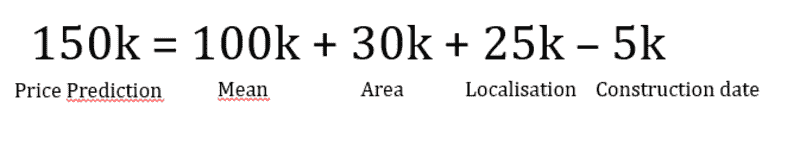
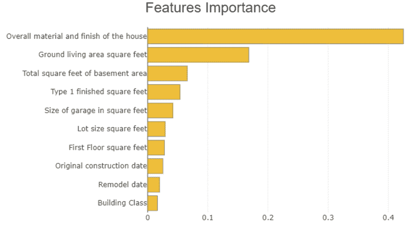
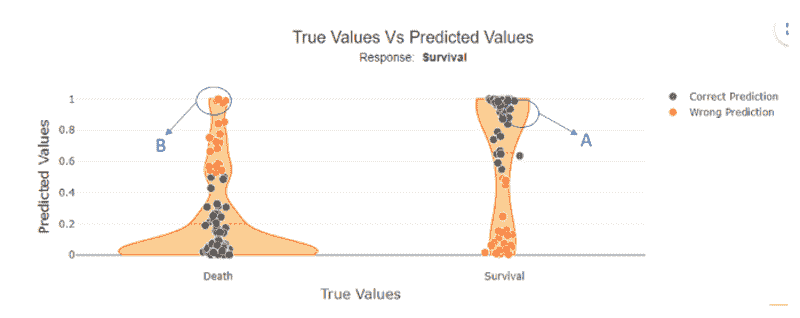
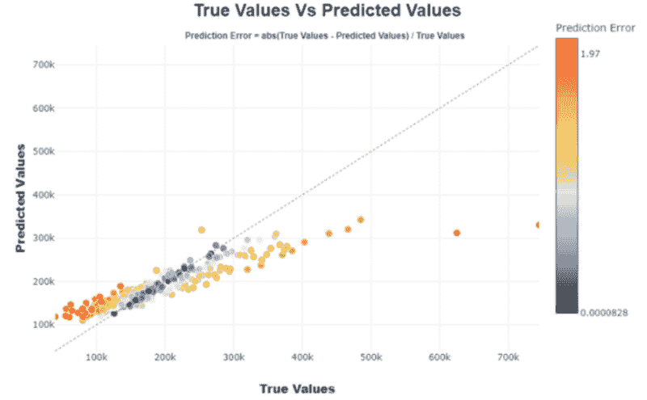
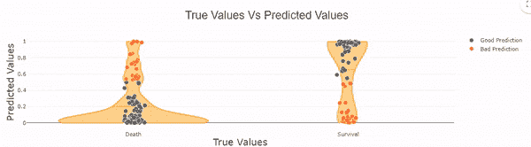
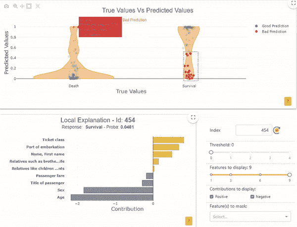
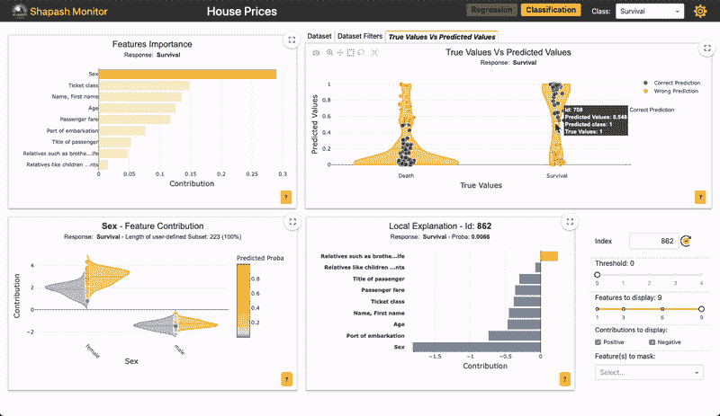

# 挑选示例以理解机器学习模型

> 原文：[`www.kdnuggets.com/2022/11/picking-examples-understand-machine-learning-model.html`](https://www.kdnuggets.com/2022/11/picking-examples-understand-machine-learning-model.html)

照片由 [Skylar Zilka](https://unsplash.com/@skylarjaybird?utm_source=unsplash&utm_medium=referral&utm_content=creditCopyText) 提供，来源于 [Unsplash](https://unsplash.com/s/photos/picking?utm_source=unsplash&utm_medium=referral&utm_content=creditCopyText)

评估模型的相关性不仅仅是测量其性能。了解模型如何得出这些预测结果也很重要，这有助于更好地理解模型，向非数据专家解释其工作原理，检查偏差和模型一致性，以及调试等。

* * *

## 我们的前三大课程推荐

 1\. [谷歌网络安全证书](https://www.kdnuggets.com/google-cybersecurity) - 快速进入网络安全职业。

 2\. [谷歌数据分析专业证书](https://www.kdnuggets.com/google-data-analytics) - 提升你的数据分析能力

 3\. [谷歌 IT 支持专业证书](https://www.kdnuggets.com/google-itsupport) - 支持你的组织的 IT 工作

* * *

机器学习模型可以通过局部可解释性或全局可解释性来解释。

在本文中，我们将通过结合**可解释性**和**样本挑选**来采用一种**互补方法**。

**样本挑选** 是一个具有巨大附加值的过程，有助于更好地理解模型及其优缺点。为了解释这种方法，我们将回答三个问题：

***为什么选择样本？你想分析什么样的样本？在这些样本中分析什么？***

## 局部和全局可解释性

在此之前，让我们简要回顾一下局部和全局可解释性的概念。

经典的局部可解释性形式是基于权重的方法。

通过分解机器学习模型中每个特征的权重来解释给定样本的预测。

图片由作者提供

全局可解释性包括测量特征对模型预测的重要性。这种可解释性通常如下所示：

图片由作者提供

现在我们已经快速介绍了可解释性的概念，让我们回到关于挑选的疑问。

为了说明这一点，我们使用了[**Shapash**](https://github.com/MAIF/shapash)，这是一个关于可解释性的开源 Python 库。你可以在这篇[**文章**](https://pub.towardsai.net/shapash-making-ml-models-understandable-by-everyone-8f96ad469eb3)中找到 Shapash 的一般介绍。

下面的插图基于著名的 Kaggle 数据集：**“**[**泰坦尼克号**](https://www.kaggle.com/competitions/titanic/overview)**”**（用于分类）和**“**[**房价**](https://www.kaggle.com/c/house-prices-advanced-regression-techniques)**”**（用于回归）。

# 为什么选择样本？

+   解释模型如何工作以及单个示例或子人群的特征。

*例如，我们可以以基于这些特征的房价回归模型为例。*

*你将能够向买家解释为什么房子会被定价在这个价格。或者模型如何估计面积更大的房子，位于特定社区，并且是用木头建造的。*

+   为了更好地理解错误预测

这可能会引发以下问题：问题是否出在数据质量上？

如果我们有一个非常低的实际价格，而我们估计它会更高，因为房子的面积很大，这可能会质疑“Surface”特征的质量。

额外的特征能改善预测吗？

如果房地产代理提供了买家最喜欢的文本描述。即使在预测时没有这个文本变量，我们也可以用它来交叉验证样本上的预测错误与买家的反馈。

+   为了说明模型的正确预测

我们可以通过示例来解释机器学习模型的预测。当最相关的示例被突出显示时，这一过程更容易。

+   选择样本以进行数据质量验证或验证结果

作为数据科学家，你可以对模型应该估计的一些销售价格有个大致了解。探索其局部可解释性也会给你提供潜在的理由来合理化估计。然后你可以观察你自己的想法与局部可解释性之间的差异。基于此，你可能会验证或不验证数据质量、模型预测以及可解释性。

+   与熟悉使用案例的专家一起研究示例。

通过选择销售数据，你将能够与房地产代理一起查看他对价格预测和特征对价格重要性的看法。

# 你想分析什么样的样本？

可以分析：

1.  原始模型预测

1.  正确预测/错误（通过将预测与已知目标状态关联）

1.  一个子集，根据模型预测的输出概率、待预测目标、解释特征的值

## 为什么不选择随机样本？

为了**节省时间**并获得**全面的视角**，由于我们通常不会评估数百个样本，随机选择可能最终随机选择到类似的样本，从而可能会错过潜在的有趣案例。

# 数据选择：如何轻松可靠地选择有意义的示例？

自[**Shapash 版本 2.2.0**](https://github.com/MAIF/shapash/)以来，你可以通过绘制每个样本的模型概率，以其真实标签为函数来识别这些样本，例如：

图 1 作者提供的图像

对于模型输出概率在 0 和 1 之间的二分类问题，我们可以选择一个预测良好的类别 1 样本。在这种情况下，这个类别 1 样本显示了一个如预期的高概率（如图 1 示例 A 所示）。

相反，我们也可以选择一个错误预测的类别 1 样本。这里这个样本应被预测为 0，但其在类别 1 的概率很高（如图 1 示例 B 所示）。

对于回归分析，将预测值与真实值绘制在一起有助于直接识别和研究模型返回的最佳或最差预测。

图 2 作者提供的图像

## 选择子集可以使理解群体行为变得更加容易：

对于二分类问题，子集可以集中在所有被预测为类别 1 但实际上是类别 0 的点（即“假阴性”子群体）。

作者提供的图像

对于回归分析，关注一组估计良好、过度或不足估计的值可能是有趣的。

你还可以根据解释变量的特征选择一个子集。

*例如，在房价问题上，你可以选择建筑日期在 2000 年之后的房屋，或者根据房屋的位置进行选择。*

# 在这些样本中要分析什么？

+   当你想解释一个单独的样本时，查看其局部可解释性是很有意义的。

例如，使用 shapash webapp，你可以在本地图中选择一个你想分析的样本：

作者提供的图像

索引为“206”的样本的生存概率为 0.99，但其真实标签是“死亡”。对于这个个体，局部可解释性表明，该概率主要由年龄（2 岁）和性别（女性）决定。

相反，索引为“571”的样本的生存概率为 0.005，但其真实标签是“生存”。在这里，局部可解释性再次表明，该概率主要由年龄（62 岁）和性别（男性）决定。

在这两种情况下，与模型的全局功能相关，我们理解模型出现错误是正常的。例如，检查“年龄”数据是否正确收集，或者询问是否有其他数据可以解释为什么年长的男性幸存下来。我们也可以思考这些类型的个体是否在数据集中经常出现。确实，如果只有少量示例，模型将无法有效学习可靠的规则。

在其他情况下，可能有助于质疑数据选择、数据质量或是否需要收集其他特征。

+   当你想了解一个子群体时，你可以查看该子群体的全局可解释性，并将其与全局人口进行比较。

例如，如果你想在这个应用中放大“假阴性”：

作者提供的图片

你可以查看子集的特征重要性是否与整体人口相似。

对于“假阴性”子群体，“性别”特征对预测的影响（灰色 vs 黄色条形图）有所下降。这可能是由于女性在这个子集中代表性不足。由于“性别”特征的影响减小，其他特征开始发挥作用。我们可以看到许多错误预测依赖于“年龄”变量，对于 20 至 30 岁之间的个体。

选择子集而非单一样本的优点在于，我们可以**推广**错误或正确的预测，特别是查看它们在整个群体中的全局可解释性。

在这个例子中，额外的特征可能有助于更好地分类二十多岁的男性。

# 结论

**选择** **单一样本** 或 **子集** 是一种补充的方法，有助于数据科学家理解他们的模型。

这些方法可以作为强大的工具来**向非数据技术人员解释模型**。它提供了对样本预测的可靠解释，以**说明**模型的工作原理。

子群体也可以通过聚类方法进行描述和定性分析。

如果你使用选择技术来帮助理解模型，请随时在评论中解释！

**[托马斯·布施](https://medium.com/@thomas.bouche_2245)** 是 MAIF 的数据科学家。

### 更多相关内容

+   [24 本最佳（且免费的）书籍以理解机器学习](https://www.kdnuggets.com/2020/03/24-best-free-books-understand-machine-learning.html)

+   [带有示例的集成学习](https://www.kdnuggets.com/2022/10/ensemble-learning-examples.html)

+   [SQL LIKE 操作符示例](https://www.kdnuggets.com/2022/09/sql-like-operator-examples.html)

+   [图表：理解数据的自然方式](https://www.kdnuggets.com/2022/10/manning-graphs-natural-way-understand-data.html)

+   [使用 SQL 理解数据科学职业趋势](https://www.kdnuggets.com/using-sql-to-understand-data-science-career-trends)

+   [Segment Anything Model: 图像分割的基础模型](https://www.kdnuggets.com/2023/07/segment-anything-model-foundation-model-image-segmentation.html)
