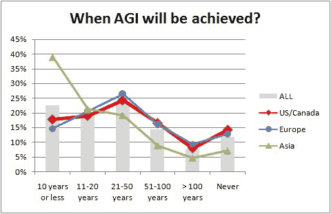

# KDnuggets 读者表示，人工通用智能（AGI）将在不到 50 年的时间内实现

> 原文：[`www.kdnuggets.com/2018/01/poll-agi-50-years.html`](https://www.kdnuggets.com/2018/01/poll-agi-50-years.html)

 评论 人工通用智能（AGI）被[定义](https://en.wikipedia.org/wiki/Artificial_general_intelligence)为

> 机器能够成功执行任何人类能够完成的智力任务的智能。

AGI 承诺带来巨大的好处，例如治愈疾病、提供充足的休闲时间、消除交通事故等。但它也对人类构成生存风险，正如埃隆·马斯克和斯蒂芬·霍金所警告的那样。AGI 是否可能实现？如果是，我们距离 AGI 还有多远？

随着 AlphaGo Zero（及后来的 AlphaZero）在围棋、国际象棋和其他游戏中取得超人类表现，且计算机现在能够识别图像、理解语音、驾驶汽车、诊断医学影像，且能力与人类相当或更好，AGI 似乎越来越近了。

注意：是否[技术奇点](https://en.wikipedia.org/wiki/Technological_singularity)（当智能将指数级增长时）会在 AGI 之后到来是一个单独的问题，此调查未涉及。

最新的 KDnuggets 调查问卷询问了

> AGI（人工通用智能）将何时实现？

根据 1200 多次投票的结果：

+   在 10 年或更短时间内：22.5%的受访者

+   在 11-20 年内，20.1%

+   在 21-50 年内，23.9%

+   在 51-100 年内，14.3%

+   在 100 年或更久，7.5%

+   永远不会，11.7%

67%的 KDnuggets 读者认为 AGI 将在不到 50 年内实现，最常见的答案（也是中位答案）是 21 至 50 年。仅约 12%的人认为 AGI 永远不会实现。

下面的图表显示了总体答案以及三个受访者最多的地区的答案。

**图 1：AGI（人工通用智能）的预期年限，总体和各地区**

我们注意到，美国/加拿大和欧洲地区的预测相似。

亚洲受访者对 AGI 的预测更加乐观，60%的人认为 AGI 将在 20 年内实现。

其他地区的受访者预测类似，AGI 的中位预测在 21-50 年范围内。

20 至 50 年的范围与其他专家的预测一致，例如

+   [人工智能越来越聪明：机器何时会让我们望尘莫及？](https://www.theguardian.com/commentisfree/2017/mar/15/artificial-intelligence-deepmind-singularity-computers-match-humans)，《卫报》，2017 年

+   [第一台机器何时会变得超级智能？](https://medium.com/ai-revolution/when-will-the-first-machine-become-superintelligent-ae5a6f128503)，顶级 AI 专家的预测，《Medium》，2016 年

区域参与情况是

+   美国/加拿大，33%

+   欧洲，32%

+   亚洲 23%

+   拉丁美洲，4.4%

+   非洲/中东，3.9%

+   澳大利亚/新西兰，3.1%

**精选评论：**

**阿米特·谢思，AGI 或奇点**

我怀疑任何阅读此推文的人会经历#奇点——一直是霍夫施塔特的粉丝，无法更同意 [qz.com/1088714](http://qz.com/1088714)

[`twitter.com/amit_p/status/920361898226446338`](https://twitter.com/amit_p/status/920361898226446338)

**trylks，奇点不会来临**

创造技术奇点的限制不在技术上，而在人类及其经济体系中。亚马逊机械土耳其人可以做同样的事情（因为他们是人类），而且比创建技术奇点更具盈利性。

如果在我们当前的经济体系中奇点是可能的，创造一个如此类似于神的存在，然后被一个公司拥有，将是对人类的最坏结果：回到古埃及，那时少数（奇点股东）将拥有一切，而其他人则成为他们的奴隶。

幸运的是，没有通往奇点的捷径和最低可行产品的路径，因此没有人正在朝这个方向努力。

更多文本（但可能没有更多意义），带有大量链接，见此：[`trylks.wordpress.com/2017/12/19/the-technological-singularity-is-beyond-human-capabilities/`](https://trylks.wordpress.com/2017/12/19/the-technological-singularity-is-beyond-human-capabilities/)

**相关文章：**

+   [**独家：与强化学习之父 Rich Sutton 的采访**](https://www.kdnuggets.com/2017/12/interview-rich-sutton-reinforcement-learning.html)

+   [**AI 中的声音 – 与 AI、机器学习和数据科学领域的领导者进行精彩对话**](https://www.kdnuggets.com/2017/10/gigaom-voices-ai-podcast.html)

+   [**深度学习、人工直觉与通用人工智能的追求**](https://www.kdnuggets.com/2017/02/deep-learning-artificial-intelligence-quest-agi.html)

### 关于此主题的更多信息

+   [在不到 6 个月的时间里成为商业智能分析师](https://www.kdnuggets.com/become-a-business-intelligence-analyst-in-less-than-6-months)

+   [KDnuggets 新闻，7 月 20 日：机器学习算法解释…](https://www.kdnuggets.com/2022/n29.html)

+   [每种机器学习算法在不到 1 分钟内解释](https://www.kdnuggets.com/2022/07/machine-learning-algorithms-explained-less-1-minute.html)

+   [不到 15 行代码的多模态深度学习](https://www.kdnuggets.com/2023/01/predibase-multi-modal-deep-learning-less-15-lines-code.html)

+   [深度神经网络不会引领我们走向 AGI](https://www.kdnuggets.com/2021/12/deep-neural-networks-not-toward-agi.html)

+   [婴儿 AGI：完全自主 AI 的诞生](https://www.kdnuggets.com/2023/04/baby-agi-birth-fully-autonomous-ai.html)
