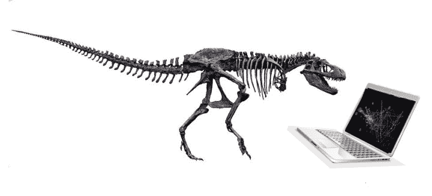

# 10 年后数据科学家的需求会如何？数据科学家会灭绝吗？

> 原文：[`www.kdnuggets.com/2021/06/poll-demand-data-scientists-10-years.html`](https://www.kdnuggets.com/2021/06/poll-demand-data-scientists-10-years.html)

Mikhail Mew 最近的一篇文章，数据科学家将在 10 年内灭绝，认为我们所知的数据科学家角色将在大约十年内消失。取而代之的将是“能够将深厚领域知识注入分析的商业专家和主题专家，无论他们是否能够编码。”

Ahmar Shah 在他的文章数据科学在 10 年内不会灭绝中提出了相反的观点，他表达了对数据科学领域即将崩溃的挫败感。他明确表示：“如果有哪个领域你最有可能真正退休，那就是数据科学。”

* * *

## 我们的前三个课程推荐

 1\. [谷歌网络安全证书](https://www.kdnuggets.com/google-cybersecurity) - 快速进入网络安全职业生涯。

 2\. [谷歌数据分析专业证书](https://www.kdnuggets.com/google-data-analytics) - 提升你的数据分析技能

 3\. [谷歌 IT 支持专业证书](https://www.kdnuggets.com/google-itsupport) - 支持你组织的 IT

* * *

这让我们再次思考数据科学和数据科学家的未来，注意到以上仅仅是两个例子，这个话题上有各种各样的意见。我们想知道我们的读者对数据科学家需求的未来有什么看法。

以下是 KDnuggets 调查的结果：

> **[放松！数据科学家在 10 年内不会灭绝，但角色会发生变化](https://www.kdnuggets.com/2021/07/poll-data-scientists-not-extinct-10-years.html)**

图片由 Gregory Piatetsky 创建。恐龙图片来自维基百科。

### 更多相关话题

+   [成为优秀数据科学家所需的 5 项关键技能](https://www.kdnuggets.com/2021/12/5-key-skills-needed-become-great-data-scientist.html)

+   [每位初学者数据科学家都应该掌握的 6 种预测模型](https://www.kdnuggets.com/2021/12/6-predictive-models-every-beginner-data-scientist-master.html)

+   [2021 年最佳 ETL 工具](https://www.kdnuggets.com/2021/12/mozart-best-etl-tools-2021.html)

+   [停止学习数据科学以寻找目的，并寻找目的以…](https://www.kdnuggets.com/2021/12/stop-learning-data-science-find-purpose.html)

+   [建立一个稳固的数据团队](https://www.kdnuggets.com/2021/12/build-solid-data-team.html)

+   [数据科学统计学习的顶级资源](https://www.kdnuggets.com/2021/12/springboard-top-resources-learn-data-science-statistics.html)
