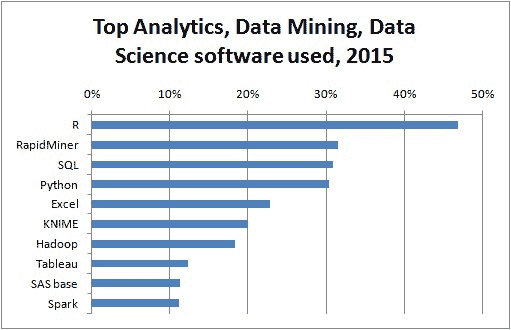
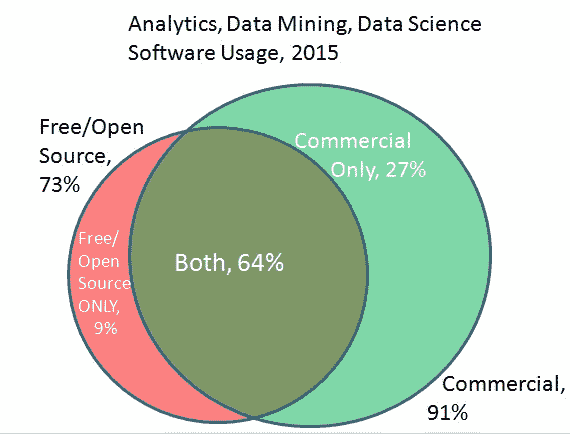

# R 领先，RapidMiner 紧随其后，Python 赶上，大数据工具增长，Spark 激发

> 原文：[`www.kdnuggets.com/2015/05/poll-r-rapidminer-python-big-data-spark.html`](https://www.kdnuggets.com/2015/05/poll-r-rapidminer-python-big-data-spark.html)

作者 **[Gregory Piatetsky](https://www.kdnuggets.com/author/gregory-piatetsky "Gregory Piatetsky 的帖子")**，KDnuggets，2015 年 5 月 25 日，[Actian](https://www.kdnuggets.com/tag/actian)，[Apache Spark](https://www.kdnuggets.com/tag/apache-spark)，[数据挖掘软件](https://www.kdnuggets.com/tag/data-mining-software)，[H2O](https://www.kdnuggets.com/tag/h2o)，[Knime](https://www.kdnuggets.com/tag/knime)，[调查](https://www.kdnuggets.com/tag/poll)，[Python](https://www.kdnuggets.com/tag/python)，[R](https://www.kdnuggets.com/tag/r)，[RapidMiner](https://www.kdnuggets.com/tag/rapidminer)，[SQL](https://www.kdnuggets.com/tag/sql)  评论

第十六届年度 KDnuggets 软件调查继续受到分析和数据挖掘社区以及供应商的广泛关注，吸引了约 2,800 名选民，他们从创纪录的 93 种不同工具中进行选择。

R 是数据挖掘和数据科学领域中最受欢迎的整体工具，但 Python 的使用增长更快，预计在 2-3 年内将赶上。RapidMiner 仍然是最受欢迎的数据挖掘/数据科学套件，但相比去年得票减少。Hadoop/大数据工具的使用显著增加（29%，相比 2014 年的 17%），主要受到 Spark 使用份额增长超过三倍的推动。（请参见 KDnuggets 对 Spark 创始人 Matei Zaharia 的独家采访）。其他增长强劲的工具包括 H2O (0xdata)、Actian、MLlib 和 Alteryx。

本报告有 5 个部分

+   顶级分析工具和趋势

+   Hadoop/大数据工具

+   深度学习工具

+   编程语言

+   完整结果和表格

按地区参与情况：美国/加拿大（41.5%），欧洲（38.4%），亚洲（8.2%），拉丁美洲（6.3%），澳大利亚/新西兰（3.1%），非洲/中东（2.5%）。

### 顶级分析工具和趋势

以下是按使用份额排名前十的工具：

**按用户份额排名前十的工具为**

1.  **R**，46.9%（2014 年为 38.5%）

1.  **RapidMiner**，31.5%（2014 年为 44.2%）

1.  **SQL**，30.9%（2014 年为 25.3%）

1.  **Python**，30.3%（2014 年为 19.5%）

1.  **Excel**，22.9%（2014 年为 25.8%）

1.  **KNIME**，20.0%（2014 年为 15.0%）

1.  **Hadoop**，18.4%（2014 年为 12.7%）

1.  **Tableau**，12.4%（2014 年为 9.1%）

1.  **SAS**，11.3%（2014 年为 10.9%）

1.  **Spark**，11.3%（2014 年为 2.6%）

与 2014 年分析/数据挖掘软件调查 相比，Tableau 和 Spark 成为前十名的新成员，取代了 Weka 和 Microsoft SQL Server。

工具的平均数量跃升至 4.8，较 2014 年的 3.7 和 2013 年的 3.0 增长。

商业软件和免费软件之间的区别越来越难以界定，许多工具同时拥有免费/社区版和商业/企业版。我们根据最新版本的主要类型对每个工具进行了分类，因此将 RapidMiner 归类为商业类别，将 KNIME 归类为免费软件类别。

许多供应商要求用户投票并甚至在推特上发布投票，但我们未发现任何机器人或非法投票，也未需删除任何投票。

今年，91%的选民使用了商业软件，73%使用了免费软件。约 27%仅使用商业软件，只有 9%使用免费软件。首次出现 64%的选民同时使用免费和商业软件，高于 2014 年的 49%。

在至少有 10 票的工具中，2014 年最大的增长为

1.  H2O（0xdata），增长 1210%，至 2.0%市场份额（55 票），从 2014 年的 0.2%

1.  Actian，增长 345%，至 2.0%（56 票），从 2014 年的 0.5%起

1.  Spark，增长 326%，至 11.3%（311 票），从 2014 年的 2.6%

1.  MLlib，增长 228%，至 3.3%（91 票），从 2014 年的 1.0%

1.  Alteryx，增长 79%，至 5.6%（155 票），从 2014 年的 3.1%

1.  Python，增长 56%，至 30.3%（837 票），从 2014 年的 19.5%

1.  TIBCO Spotfire，增长 56%，至 4.3%（119 票），从 2014 年的 2.8%

1.  Pig，增长 54%，至 5.4%（150 票），从 2014 年的 3.5%

1.  SAS Enterprise Miner，增长 53%，至 10.9%（302 票），从 2014 年的 7.2%

1.  Splunk/Hunk，增长 49%，至 1.1%（30 票），从 2014 年的 0.7%

连续两年在市场份额上增长至少 20%的工具包括 Alteryx、Hadoop、KNIME、Python、Qlikview、SAS Enterprise Miner、Tableau 和 TIBCO Spotfire。

2015 年获得至少 20 票的新分析工具包括

+   scikit-learn，8.3%（229 票）

+   Microsoft Azure ML，3.7%（102 票）

+   Microsoft Power BI，3.6%（98 票）

+   IBM Watson Analytics，2.1%（57 票）

+   Ayasdi，2.0%（56 票）

+   Dataiku，2.0%（56 票）

+   Lexalytics，1.3%（35 票）

+   Vowpal Wabbit，1.3%（35 票）

+   Microstrategy，0.9%（24 票）

+   Amazon Machine Learning，0.7%（20 票）

在 2014 年获得至少 20 票的工具中，2015 年最大的下降发生在这些工具上，这包括可能是免费工具如 Orange 的受欢迎程度下降，以及今年某些商业工具的选民驱动不足。

+   Predixion Software，下降 90%（0.4%市场份额），从 2014 年的 3.7%

+   BayesiaLab，下降 86%，至 0.6%，从 4.1%

+   Alpine Data Labs，下降 82%，至 0.5%，从 2.7%

+   Oracle Data Miner，下降 64%，至 0.8%从 2.2%

+   RapidInsight/Veera，下降 60%，至 0.2%从 0.5%

+   Revolution Analytics（现为 Microsoft 的一部分），下降 57%，至 4.0%从 9.1%

+   SAP（包括前 KXEN），下降 57%，至 3.0%从 6.8%

+   Orange，下降 44%，至 1.9%，从 3.4%

+   Gnu Octave，下降 41%，至 2.3%从 3.9%

### Hadoop/Big Data 工具

Hadoop/Big Data 工具的使用在选民中跃升至 29%，从 2014 年的 17%和 2013 年的 14%起

这可能是由于许多基于云的 Big Data 工具的可用性和低成本。特别显著的是 Spark 市场份额跃升至 11.3%。

然而，大多数数据分析仍然在“中等”及小数据上进行。

最受欢迎的 Hadoop/大数据工具包括

+   Hadoop，18.4%的份额（507 票）

+   Spark，11.3%（311）

+   Hive，10.2%（282）

+   SQL on Hadoop 工具，7.2%（198）

+   Pig，5.4%（150）

+   HBase，4.6%（127）

+   其他 Hadoop/HDFS 基础工具，4.5%（125）

+   MLlib，3.3%（91）

+   Mahout，2.8%（76）

+   Datameer，0.8%（23）

### 深度学习工具

今年新增了一个深度学习工具类别，最受欢迎的工具包括：

+   Pylearn2（55 用户）

+   Theano（50）

+   Caffe（29）

+   Cuda-convnet（17）

+   Deeplearning4j（12）

+   Torch（27）

然而，这一类别正在迅速增长，以上列表并不完整，因为在这个类别中，**其他深度学习工具**的数量最多（106）。

另见

+   深度学习简述 - 它是什么，如何运作，为什么要关心？

+   哪里可以学习深度学习 - 课程、教程、软件

+   深度学习 - 重要的学习和理解资源

+   KDnuggets 故事 标签：深度学习

### 编程语言

Python 的流行程度显著上升。Java 是分析/数据挖掘任务中第二常用的语言。这里是

+   Python，30.3%的份额（837 票），较 19.5%有所上升

+   Java，14.2%（392），2014 年未列入

+   C/C++，9.4%（260），2014 年未列入

+   Unix shell/awk/gawk，8.0%（221），较 5.8%有所上升

+   其他编程语言，5.1%（140）

+   Scala，3.5%（96），2014 年未列入

+   Perl，2.9%（79），较 3.0%有所下降

+   Ruby，1.2%（33），2014 年未列入

+   Julia，1.1%（31），较 0.8%有所上升

+   F#，0.7%（18），较 0.5%有所上升

+   Clojure，0.5%（13），与 0.5%相同

+   Lisp，0.4%（10），较 0.3%有所上升

### 完整结果和三年趋势

以下表格详细展示了投票结果。

**% alone** 是指仅使用该工具的投票者百分比。例如，只有 3.6%的 R 用户仅使用 R，而 13.7%的 RapidMiner 用户表示他们仅使用该工具。

| **您在过去 12 个月内为真实项目使用过哪些分析、大数据、数据挖掘、数据科学软件？** [2759 位投票者] |
| --- |

| 图例：红色：免费/开源工具 绿色：商业工具

Fuchsia：Hadoop/大数据工具 |  2015 年用户百分比  2014 年用户百分比

 2013 年用户百分比 |

| R（1293），3.6%仅用 |  |
| --- | --- |
| RapidMiner（870），13.7%仅用 |  |
| SQL（853），单独使用 0% | 未列入 |
| Python (837)，0% 单独使用 |  |
| Excel (631)，0% 单独使用 |  |
| KNIME (553)，6.7% 单独使用 |  |
| Hadoop (507)，0% 单独使用 |  |
| Tableau (341)，0% 单独使用 |  |
| SAS base (313)，0.6% 单独使用 |  |
| Spark (311)，0% 单独使用 | na |
| Weka (310)，0% 单独使用 |  |
| SAS Enterprise Miner (302)，3.6% 单独使用 |  |
| Microsoft SQL Server (268)，0% 单独使用 |  |
| MATLAB (243)，0% 单独使用 |  |
| scikit-learn (229)，0% 单独使用 | na na |
| Unix shell/awk/gawk (221)，0% 单独使用 | na |
| IBM SPSS Statistics (213)，0% 单独使用 |  |
| IBM SPSS Modeler (197)，7.1% 单独使用 |  |
| Alteryx (155)，39.4% 单独使用 |  |
| Pig (150)，0% 单独使用 | na |
| 其他编程语言 (140)，0% 单独使用 | na |
| 其他免费分析/数据挖掘工具 (138)，0% 单独使用 |  |
| 其他 Hadoop/HDFS 基于的工具 (125)，0% 单独使用 | na |
| TIBCO Spotfire (119)，11.8% 单独使用 |  |
| Rattle (117)，0.9% 单独使用 |  |
| QlikView (116)，0% 单独使用 |  |
| Revolution Analytics（现为微软的一部分） (109)，0% 单独使用 |  |
| Microsoft Azure ML (102)，1.0% 单独使用 | na na |
| Microsoft Power BI (98)，0% 单独使用 | na na |
| MLlib (91)，0% 单独使用 | na |
| JMP (86)，0% 单独使用 |  |
| SAP（包括前身 KXEN） (82)，26.8% 单独使用 |  |
| Perl (79)，0% 单独使用 | na |
| Mahout (76)，0% 单独使用 | na |
| Pentaho (74)，0% 单独使用 | na |
| 其他付费分析/数据挖掘/数据科学软件 (66)，6.1% 单独使用 |  |
| Salford SPM/CART/随机森林/MARS/TreeNet (64)，43.8% 单独使用 |  |
| Gnu Octave (64)，0% 单独使用 |  |
| IBM Watson Analytics (57)，0% 单独使用 | na na |
| Ayasdi (56)，10.7% 单独使用 | na na |
| Dataiku (56)，7.1% 单独使用 | na na |
| Actian (56)，7.1% 单独使用 | na |
| H2O (0xdata) (55)，0% 单独使用 | na |
| Orange (53)，0% 单独使用 |  |
| Mathematica (52)，0% 单独使用 |  |
| IBM Cognos (51)，0% 单独使用 |  |
| Dell (包括 StatSoft) (47)，19.1% 单独使用 |  |
| XLSTAT for Excel (42)，0% 单独使用 |  |
| Stata (36)，2.8% 单独使用 |  |
| Lexalytics (35)，28.6% 单独使用 | na na |
| Vowpal Wabbit (35)，0% 单独使用 | na na |
| C4.5/C5.0/See5 (35)，0% 单独使用 |  |
| Julia (31)，3.2% 单独使用 | na |
| Splunk/ Hunk (30)，0% 单独使用 | na |
| Datameer (26)，0% 单独使用 | na |
| MicroStrategy (24)，0% 单独使用 | na na |
| BigML (23)，0% 单独使用 | na |
| Zementis (22), 31.8% 单独使用 |  |
| Miner3D (22), 9.1% 单独使用 |  |
| Oracle Data Miner (22), 0% 单独使用 |  |
| Amazon Machine Learning (20), 5.0% 单独使用 | na na |
| F# (18), 0% 单独使用 |  |
| BayesiaLab (16), 12.5% 单独使用 |  |
| Dato (前身为 Graphlab) (15), 6.7% 单独使用 | na |
| Clojure (13), 0% 单独使用 | na |
| Alpine Data Labs (13), 0% 单独使用 | na |
| Angoss (11), 18.2% 单独使用 |  |
| Lavastorm (10), 0% 单独使用 |  |
| Lisp (10), 0% 单独使用 | na |
| Predixion Software (10), 0% 单独使用 |  |
| WordStat (9), 0% 单独使用 |  |
| Megaputer Polyanalyst/TextAnalyst (8), 0% 单独使用 |  |
| WPS: World Programming System (7), 0% 单独使用 | na |
| GoodData (6), 0% 单独使用 | na |
| MetaMind (5), 0% 单独使用 | na na |
| SiSense (5), 0% 独立使用 | na |
| RapidInsight/Veera (5), 0% 独立使用 |  |
| Skytree (3), 0% 独立使用 | na na |
| Birst (2), 0% 独立使用 | na na |
| Ontotext (1), 0% 独立使用 | na na |
| FICO Model Builder (1), 0% 独立使用 | na |

其他未包含但在评论中提到的工具包括

+   Daniel Soto: ETL：Anatella；预测分析：TIMI modeler。

+   Henrique Pinto: 提议将 SAP 技术分为建模工具（SAP Predictive Analytics，合并了 SAP PA + KXEN）和作为底层平台的 SAP HANA，就像你有 SAS Miner 和 SAS Base 一样。HANA 有其自身的编程逻辑（基于 SQL，称为 SQLScript），可以用于原生开发预测模型，或者你可以使用 SAP Predictive Analytics 的高级建模功能来支持不太具备开发能力的用户。

+   另一个工具建议：Domino（DominoLabs），复杂企业的分析中心：帮助组织更快地开发、跟踪和部署分析模型，同时通过保持工作集中、可共享和可审计来促进最佳实践。

+   Roberto Lopez: Neural Designer，一款高性能的预测分析工具。

+   Julian GV: Experian Strategy Management，包括集成在软件中的辅助设计分析模块。这是我在过去 12 个月中使用的解决方案。

+   Universal Platform, UP

这里是过去投票的结果

+   KDnuggets 第 15 届年度分析、数据挖掘、数据科学软件投票：RapidMiner 继续领先

+   KDnuggets 2013 软件投票：RapidMiner 和 R 争夺第一名。

+   KDnuggets 2012 投票：分析、数据挖掘、大数据软件使用情况

+   KDnuggets 2011 投票：使用的数据挖掘/分析工具

+   KDnuggets 2010 投票：使用的数据挖掘/分析工具

+   KDnuggets 2009 投票：使用的数据挖掘工具

+   KDnuggets 2008 投票：使用的数据挖掘软件

+   KDnuggets 2007 投票：数据挖掘/分析软件工具

### 更多相关信息

+   [如何在不断变化的世界中成长为数据科学家](https://www.kdnuggets.com/2022/01/grow-data-scientist-everchanging-world.html)

+   [处理大数据：工具和技术](https://www.kdnuggets.com/working-with-big-data-tools-and-techniques)

+   [KDnuggets 新闻，5 月 25 日：每个数据科学家都应该了解的 6 种 Python 机器学习工具…](https://www.kdnuggets.com/2022/n21.html)

+   [每个数据科学家都应该了解的 6 种 Python 机器学习工具](https://www.kdnuggets.com/2022/05/6-python-machine-learning-tools-every-data-scientist-know.html)

+   [KDnuggets™ 新闻 22:n01，1 月 5 日：跟踪和可视化的 3 种工具…](https://www.kdnuggets.com/2022/n01.html)

+   [构建生成 AI 应用程序的最佳 Python 工具备忘单](https://www.kdnuggets.com/2023/08/best-python-tools-generative-ai-cheat-sheet.html)
