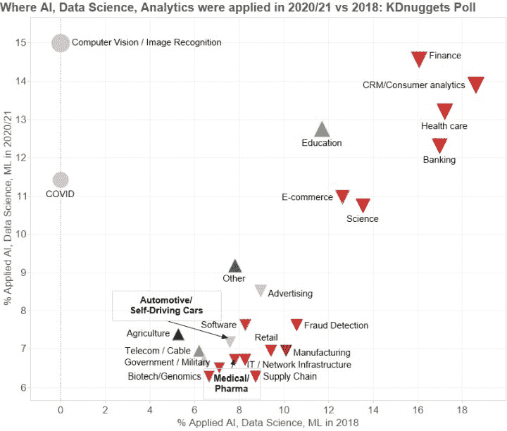
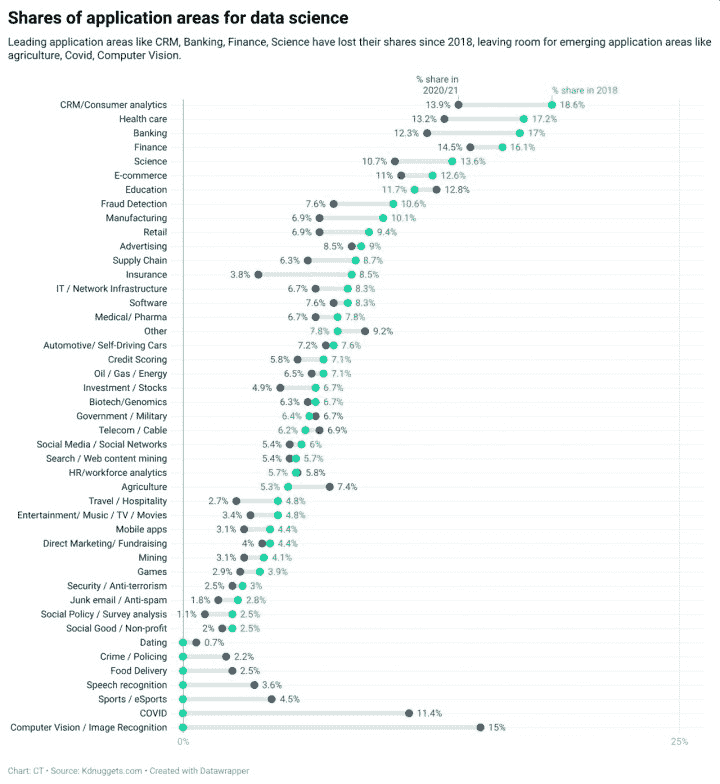

# 主要变化：2020/21 年分析、数据科学和机器学习的应用领域

> 原文：[`www.kdnuggets.com/2021/06/poll-where-analytics-data-science-ml-applied.html`](https://www.kdnuggets.com/2021/06/poll-where-analytics-data-science-ml-applied.html)

评论拥有像 KDnuggets 这样长期运行的网站的一个优势是能够审视趋势并将调查结果与我们过去进行的类似调查结果进行比较。最新的调查结果与之前的结果进行比较显示了重大变化，许多传统的数据科学应用领域如 CRM 出现了大幅下降，而计算机视觉、农业、COVID 和教育等领域则有所增长。

最新的 KDnuggets 调查询问了

> **你在 2020/21 年应用了哪些分析、数据科学和机器学习？**

这项调查显示了应用领域的显著变化。排名第一的是计算机视觉（2018 年的调查中没有涉及），其次是金融（2018 年没有涉及）。长期排名第一的 CRM/消费者应用领域已降至第三位。

下面是份额超过 10%的主要应用领域：

+   **计算机视觉 / 图像识别**，15.0%

+   **金融**，14.5%

+   **CRM/消费者分析**，13.9%

+   **医疗保健**，13.2%

+   **教育**，12.8%

+   **银行**，12.3%

+   **COVID**，11.4%

+   **电子商务**，11.0%

+   **科学**，10.7%

接下来，我们将 2020/21 年的应用领域与 2018 年的结果进行比较 - 见图 1。我们注意到大多数应用领域标记为红色，表示它们的份额下降。

 **图 1：2020/21 年与 2018 年相比的人工智能、数据科学和机器学习的应用领域，前六大领域在 2020/21 年份额至少为 6%。**

两个领域：计算机视觉和 COVID 在 2018 年的调查中没有涉及，并在 Y 轴上显示为灰色圆圈。

形状大小对应于 2020/21 年调查中的份额。

形状表示变化的方向，上升或下降。

颜色对应于百分比变化，绿色表示增加，红色表示减少。

本次调查中新出现的应用领域有

+   计算机视觉 / 图像识别，15.0%

+   COVID，11.4%

+   体育 / 电竞，4.5%

+   语音识别，3.6%

+   食品配送，2.5%

+   犯罪 / 警务，2.2%

+   约会，0.7%

只有 3 个领域的份额增加超过 10%：

+   农业，39.6%

+   其他，17.4%

+   电信 / 有线电视，11.7%

另一方面，24 个领域的份额下降超过 10%，其中 18 个领域的下降幅度超过 20%：

+   社会政策 / 调查，-56%

+   保险，-55%

+   旅行 / 酒店业，-44%

+   垃圾邮件 / 反垃圾邮件，-35%

+   制造业，-31%

+   娱乐 / 音乐 / 电视 / 电影，-31%

+   供应链，-28%

+   移动应用，-28%

+   欺诈检测，-28%

+   银行，-28%

+   零售，-26%

+   投资 / 股票，-26%

+   游戏，-26%

+   CRM/消费者分析，-25%

+   采矿，-24%

+   医疗保健，-23%

+   科学，-21%

+   社会公益 / 非营利组织，-20%

这是另一种查看这些数据的方式，由[Cong Tran](https://www.linkedin.com/in/trancong/)创建。 

**图 2：分析、数据科学、机器学习应用领域的范围图：2020/21 与 2018 年对比**

本次调查共收到 447 人的回应，而 2019 年的调查为 435 人。平均受访者选择了 2.9 个领域，而 2019 年为 3.0，2018 年为 2.8，因此数据科学家平均仍在大约 3 个不同领域工作。

最后，这里是一个更详细的表格。

| 应用领域 | 2020/21 年份额 | 2018 年份额 | 与 2018 年对比变化 |
| --- | --- | --- | --- |
| **计算机视觉 / 图像识别** | 15.0% | 新增 | 无数据 |
| **金融** | 14.5% | 16.1% | -9.6% |
| **客户关系管理/消费者分析** | 13.9% | 18.6% | -25.5% |
| **医疗保健** | 13.2% | 17.2% | -23.4% |
| **教育** | 12.8% | 11.7% | 8.8% |
| **银行业** | 12.3% | 17.0% | -27.7% |
| **COVID** | 11.4% | 新增 | 无数据 |
| **电子商务** | 11.0% | 12.6% | -13.3% |
| **科学** | 10.7% | 13.6% | -20.8% |
| **其他** | 9.2% | 7.8% | 17.4% |
| **广告** | 8.5% | 9.0% | -5.2% |
| **欺诈检测** | 7.6% | 10.6% | -28.1% |
| **软件** | 7.6% | 8.3% | -8.1% |
| **农业** | 7.4% | 5.3% | 39.6% |
| **汽车/自动驾驶汽车** | 7.2% | 7.6% | -5.6% |
| **制造业** | 6.9% | 10.1% | -31.4% |
| **零售** | 6.9% | 9.4% | -26.4% |
| **电信 / 有线电视** | 6.9% | 6.2% | 11.7% |
| **政府 / 军事** | 6.7% | 6.4% | 4.3% |
| **IT / 网络基础设施** | 6.7% | 8.3% | -18.9% |
| **医疗/制药** | 6.7% | 7.8% | -14.1% |
| **石油 / 天然气 / 能源** | 6.5% | 7.1% | -9.0% |
| **生物技术/基因组学** | 6.3% | 6.7% | -6.0% |
| **供应链** | 6.3% | 8.7% | -28.3% |
| **信用评分** | 5.8% | 7.1% | -18.4% |
| **人力资源/劳动力分析** | 5.8% | 5.7% | 1.2% |
| **搜索 / 网络内容挖掘** | 5.4% | 5.7% | -6.6% |
| **社交媒体 / 社交网络** | 5.4% | 6.0% | -10.2% |
| **投资 / 股票** | 4.9% | 6.7% | -26.2% |
| **体育 / 电竞** | 4.5% | 新增 | 无数据 |
| **直接营销/筹款** | 4.0% | 4.4% | -7.8% |
| **保险** | 3.8% | 8.5% | -55.3% |
| **语音识别** | 3.6% | 新增 | 无数据 |
| **娱乐/音乐/电视/电影** | 3.4% | 4.8% | -30.5% |
| **矿业** | 3.1% | 4.1% | -24.3% |
| **移动应用** | 3.1% | 4.4% | -28.3% |
| **游戏** | 2.9% | 3.9% | -25.6% |
| **旅行 / 酒店** | 2.7% | 4.8% | -44.4% |
| **安全 / 反恐** | 2.5% | 3.0% | -17.7% |
| **食品配送** | 2.5% | 新增 | 无数据 |
| **犯罪 / 警务** | 2.2% | 新增 | 无数据 |
| **社会公益 / 非营利** | 2.0% | 2.5% | -20.4% |
| **垃圾邮件 / 反垃圾邮件** | 1.8% | 2.8% | -35.1% |
| **社会政策 / 调查分析** | 1.1% | 2.5% | -55.8% |
| **约会** | 0.7% | 新增 | 无数据 |

**相关：**

+   [2018 年分析、数据科学、机器学习应用情况：趋势与分析](https://www.kdnuggets.com/2019/03/poll-analytics-data-science-ml-applied-2018.html)

+   [2017 年分析、数据科学、机器学习应用情况：趋势与分析](https://www.kdnuggets.com/2018/04/poll-analytics-data-science-ml-applied-2017.html)

+   [2016 年分析、数据挖掘、数据科学应用情况](https://www.kdnuggets.com/2016/12/poll-analytics-data-mining-data-science-applied-2016.html)

### 更多相关话题

+   [KDnuggets 应用数据科学调查](https://www.kdnuggets.com/2022/09/applied-data-science-survey.html)

+   [人工智能、分析、机器学习、数据科学、深度学习…](https://www.kdnuggets.com/2021/12/developments-predictions-ai-machine-learning-data-science-research.html)

+   [学习数据科学、机器学习和深度学习的实用计划](https://www.kdnuggets.com/2023/01/mwiti-solid-plan-learning-data-science-machine-learning-deep-learning.html)

+   [2022 年关键数据科学、机器学习、人工智能和分析发展](https://www.kdnuggets.com/2022/12/key-data-science-machine-learning-ai-analytics-developments-2022.html)

+   [每个机器学习工程师都应该掌握的 5 种机器学习技能](https://www.kdnuggets.com/2023/03/5-machine-learning-skills-every-machine-learning-engineer-know-2023.html)

+   [KDnuggets 新闻，12 月 14 日：3 门免费的机器学习课程](https://www.kdnuggets.com/2022/n48.html)
