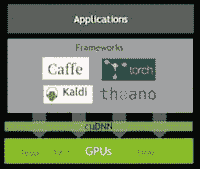

# 流行的深度学习工具 – 一项综述

> 原文：[`www.kdnuggets.com/2015/06/popular-deep-learning-tools.html`](https://www.kdnuggets.com/2015/06/popular-deep-learning-tools.html)

 评论

 深度学习现在是人工智能和机器学习中最热门的趋势之一，每天都有令人惊叹的新成就报告，比如 在智商测试中表现优于人类。

在 2015 KDnuggets 软件调查 中，新增了深度学习工具的类别，该调查中列出了最受欢迎的工具。

+   Pylearn2 (55 用户)

+   Theano (50)

+   Caffe (29)

+   Torch (27)

+   Cuda-convnet (17)

+   Deeplearning4j (12)

+   其他深度学习工具 (106)

我没有使用过所有这些工具，因此这是基于它们的主页和教程的简要总结。

**[Theano](http://deeplearning.net/software/theano/) & [Pylearn2](http://deeplearning.net/software/pylearn2/):**

Theano 和 Pylearn2 都是在蒙特利尔大学开发的，主要开发者来自由约书亚·本吉奥领导的 LISA 组。Theano 是一个 Python 库，你也可以将其视为数学表达式编译器。它适合从头开始创建算法。[这里](http://www.picalike.com/blog/2015/01/12/the-portrait-of-a-machine-learning-priestess/) 是一个直观的 Theano 训练示例。

如果我们想使用标准算法，我们可以将 Pylearn2 插件编写为 Theano 表达式，Theano 会优化和稳定这些表达式。它包括多层感知器/RBM/堆叠去噪自编码器/ConvNets 所需的所有内容。[这里](http://vdumoulin.github.io/articles/extending-pylearn2/) 是一个快速入门教程，带你了解 Pylearn2 的一些基本概念。

**[Caffe](http://caffe.berkeleyvision.org):**

Caffe 由伯克利视觉与学习中心开发，由杨青贾创建，并由埃文·谢尔哈默领导。它是用 C++ 实现的快速且可读的 ConvNets 实现。如其官方网站所示，Caffe 能够使用一块 NVIDIA K40 GPU 和 AlexNet 每天处理超过 60M 张图像。它可以作为图像分类的工具包使用，但不适用于其他深度学习应用，如文本或语音。

**[Torch](http://torch.ch) & [OverFeat](https://github.com/sermanet/OverFeat):**

Torch 是用 Lua 编写的，应用于 NYU、Facebook AI 实验室和 Google DeepMind。它声称提供一个类似 MATLAB 的环境，用于机器学习算法。为什么他们选择 Lua/LuaJIT 而不是更流行的 Python？他们在 [Torch7 论文](http://data.neuflow.org/pubs/biglearn11.pdf) 中提到，“Lua 可以很容易地与 C 集成，因此在几小时的工作内，任何 C 或 C++ 库都可以成为 Lua 库。” Lua 用纯 ANSI C 编写，可以很容易地编译为任意目标。

OverFeat 是一个在 ImageNet 数据集上用 Torch7 训练的特征提取器，也很容易入门。

**[Cuda](https://developer.nvidia.com/cuDNN):**

毫无疑问，如今 GPU 加速了深度学习研究。有关 GPU，尤其是 Nvidia Cuda 的新闻遍布互联网。 [Cuda-convnet](https://code.google.com/p/cuda-convnet/)/[CuDNN](https://developer.nvidia.com/cuDNN) 支持所有主流软件，如 Caffe、Torch 和 Theano，且非常容易启用。

**[Deeplearning4j](http://deeplearning4j.org):**

与上述软件包不同，Deeplearning4j 旨在用于商业环境，而非作为研究工具。正如其介绍所述，DL4J 是一个“基于 Java 的、面向行业的、商业支持的、分布式深度学习框架。”

**比较**

这些工具似乎在速度和易用性方面进行友好的竞争。

Caffe 开发者表示：“Caffe 是最快的 convnet 实现。”

Torch7 在大多数基准测试中被证明比 Theano 更快，如 [Torch7 论文](http://data.neuflow.org/pubs/biglearn11.pdf) 所示。

Soumith 提供了他对所有公开开源实现的 [convnet 基准测试](https://github.com/soumith/convnet-benchmarks)。

一些流行深度学习工具的比较表列在 [Caffe 论文](http://ucb-icsi-vision-group.github.io/caffe-paper/caffe.pdf) 中。

有关“最佳深度神经网络框架”的讨论可以在 [reddit 上找到](http://www.reddit.com/r/MachineLearning/comments/2c9x0s/best_framework_for_deep_neural_nets/)。DL4J 网站上也提供了 [DL4J 与 Torch 与 Theano 与 Caffe 的比较](http://deeplearning4j.org/compare-dl4j-torch7-pylearn.html)。

**相关：**

+   **R 领先于 RapidMiner，Python 赶上来，大数据工具增长，Spark 点燃**

+   **在哪里学习深度学习 – 课程、教程、软件**

+   **CuDNN – 深度学习的新库**

你最喜欢的深度学习软件包是什么？

* * *

## 我们的前三个课程推荐

 1\. [Google 网络安全证书](https://www.kdnuggets.com/google-cybersecurity) - 快速进入网络安全职业。

 2\. [Google 数据分析专业证书](https://www.kdnuggets.com/google-data-analytics) - 提升你的数据分析技能

 3\. [Google IT 支持专业证书](https://www.kdnuggets.com/google-itsupport) - 支持你的组织进行 IT

* * *

### 更多相关话题

+   [PyTorch 还是 TensorFlow？比较流行的机器学习框架](https://www.kdnuggets.com/2022/02/packt-pytorch-tensorflow-comparing-popular-machine-learning-frameworks.html)

+   [流行的机器学习算法](https://www.kdnuggets.com/2022/05/popular-machine-learning-algorithms.html)

+   [哈佛大学最受欢迎的编程入门课程免费提供！](https://www.kdnuggets.com/2022/03/popular-intro-programming-course-harvard-free.html)

+   [为什么 TinyML 案例变得越来越受欢迎？](https://www.kdnuggets.com/2022/10/tinyml-cases-becoming-popular.html)

+   [为什么 DuckDB 越来越受欢迎？](https://www.kdnuggets.com/2023/07/duckdb-getting-popular.html)

+   [KDnuggets 新闻 3 月 30 日：最受欢迎的编程入门…](https://www.kdnuggets.com/2022/n13.html)
