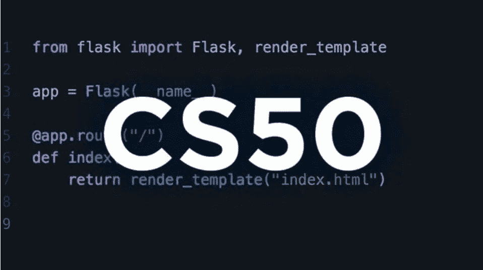

# 哈佛大学的最受欢迎编程入门课程免费提供！

> 原文：[`www.kdnuggets.com/2022/03/popular-intro-programming-course-harvard-free.html`](https://www.kdnuggets.com/2022/03/popular-intro-programming-course-harvard-free.html)

如果你有兴趣追求[美国最佳工作](https://www.glassdoor.com/List/Best-Jobs-in-America-LST_KQ0,20.htm)之一，那么学习和理解计算机科学是必不可少的。

* * *

## 我们的三大推荐课程

 1\. [Google 网络安全证书](https://www.kdnuggets.com/google-cybersecurity) - 快速进入网络安全职业道路。

 2\. [Google 数据分析专业证书](https://www.kdnuggets.com/google-data-analytics) - 提升你的数据分析技能

 3\. [Google IT 支持专业证书](https://www.kdnuggets.com/google-itsupport) - 支持你的组织的 IT 需求

* * *

哈佛大学，全球顶尖学校之一，提供名为 CS50 的热门编程课程，教授计算机科学的基础知识。这些课程通过由哈佛共同创办的电子学习平台[edX](https://www.edx.org/search?q=cs50&tab=course)进行。这些课程免费注册，但你可以选择支付费用以获得证书，这可以添加到你的简历或 LinkedIn 上。

CS50 课程非常受欢迎，适合没有计算机科学经验的学员到了解编程的人。2005 年 12 月 7 日，Mark Zuckerberg 在 Michael D. Smith 教授的带领下，参加了关于 Facebook 和计算机科学的 CS50 客座讲座。

CS50 目前是哈佛大学最大的课程，已有 3,493,337 人注册。

# CS50 的计算机科学导论

CS50 的计算机科学导论在哈佛校园内的注册人数最多，并且是 edX 有史以来的前 100 门课程之一。该课程由 David J. Malan、Doug Lloyd 和 Brian Yu 教授，是哈佛大学最大的课程。

+   **课程语言：** 英语

+   **课程时长？** 预计 12 周，每周 6–18 小时

+   **难度级别？** 入门级

+   **费用：** 免费，验证证书$149。完成 9 个问题集和最终项目并获得满意成绩的学生有资格获得证书。

+   **edX 链接：** [CS50 的计算机科学导论](https://www.edx.org/course/introduction-computer-science-harvardx-cs50x)

+   **YouTube 链接：** [CS50 的计算机科学导论](https://www.youtube.com/playlist?list=PLhQjrBD2T383f9scHRNYJkior2VvYjpSL)

+   **GitHub 链接：** [CS50](https://github.com/cs50)

+   **Discord 链接：** [`discord.gg/T8QZqRx`](https://discord.gg/T8QZqRx)

+   **Twitter:**[`twitter.com/cs50`](https://www.youtube.com/redirect?event=video_description&redir_token=QUFFLUhqbWNVdVNRSWdtSTlnN3JTdk5ydF9OUWthV0NtZ3xBQ3Jtc0tra1VxX3p1QUJPTUFJREEzWUVsZDV2eTR4ZHFTZFFzakM5SlhQZ1VWZEQ4WC1xUTRDQTNabERiNkV2NUdSS28xVTM0RnRBaXJJcFdZWlJfeUJmLUQzbTVpb0l1Z0R0WXloZjhQWmluTFFBdXNnVVJJSQ&q=https%3A%2F%2Ftwitter.com%2Fcs50)

    # 课程安排

    ## [**讲座 0 - Scratch**](https://www.youtube.com/watch?v=YoXxevp1WRQ&list=PLhQjrBD2T382_R182iC2gNZI9HzWFMC_8&index=1&t=332s)

    这是 CS50 的第 0 周，你将学习计算机科学的基础知识，以及如何使用它来解决问题。内容涉及数字的表示，例如十进制和二进制，以及文本的 ASCII 字符编码。

    其他话题包括图像、视频、声音、算法如何用于解决问题，以及如何编写伪代码。你对编程的初步理解将使用一种叫做[Scratch](https://scratch.mit.edu/)的图形编程语言，探索抽象和条件语句。

    ## [**讲座 1 - C**](https://www.youtube.com/watch?v=zYierUhIFNQ&list=PLhQjrBD2T382_R182iC2gNZI9HzWFMC_8&index=2)

    这是 CS50 的第 1 周，你将学习编程语言 C。你将深入了解流行的 IDE，如 Visual Studio Code，并掌握编译器和接口。

    之后，你将进一步探讨诸如函数、参数、返回值、变量和学习新命令等主题。本讲座还包括类型、格式代码、运算符、条件语句、布尔表达式、循环等内容。

    ## [**讲座 2 - 数组**](https://www.youtube.com/watch?v=tI_tIZFyKBw&list=PLhQjrBD2T382_R182iC2gNZI9HzWFMC_8&index=3)

    这是 CS50 的第 2 周。在这一阶段，你应该已经理解了计算机科学的基本概念以及如何使用编程语言 C 来返回值、进行循环，并了解你可能遇到的数据类型。

    本讲座涵盖的主题包括编译、调试、内存、数组、字符、字符串、命令行参数，以及通过打印“hello, world”、你的名字等内容来帮助你更清楚地理解这些主题。

    ## [**讲座 3 - 算法**](https://www.youtube.com/watch?v=gR6nycuZKlM&list=PLhQjrBD2T382_R182iC2gNZI9HzWFMC_8&index=4)

    这是 CS50 的第 3 周，你将学习算法。在这讲座中，你将利用前一讲座中的所有基础知识和解决问题的工具，并将它们嵌入到算法如何解决数组问题中。

    涵盖的主题包括线性/二分查找、使用代码进行搜索、结构体、排序和选择数据、递归和归并排序。这些主题将帮助你欣赏算法如何用于解决许多简单问题。

    ## [**讲座 4 - 内存**](https://www.youtube.com/watch?v=NKTfNv2T0FE&list=PLhQjrBD2T382_R182iC2gNZI9HzWFMC_8&index=5)

    这是 CS50 的第 4 周，你可能已经大致了解了内存以及数组如何用于存储数据。本讲座进一步探讨了数据存储的详细理解。

    本讲座的主题包括像素、十六进制、地址、指针、字符串、指针运算、内存分配、垃圾值、文件、JPEG 等。每个主题的视觉表现帮助你理解每个概念及数据存储方式。

    ## [**讲座 5 - 数据结构**](https://www.youtube.com/watch?v=2T-A_GFuoTo&list=PLhQjrBD2T382_R182iC2gNZI9HzWFMC_8&index=6)

    这是 CS50 的第 5 周，本讲座将帮助你更深入了解数据结构及其不同类型。本讲座重点讨论数组和内存，以及如何分配更多内存并移动数组。

    主题包括回顾、链表、动态数组、动态链表、实现链表、树及其他数据结构相关内容。

    ## [**讲座 6 - Python**](https://www.youtube.com/watch?v=ZEQh45W_UDo&list=PLhQjrBD2T382_R182iC2gNZI9HzWFMC_8&index=7)

    这是 CS50 的第 6 周，你将学习一种新的编程语言：Python！它将通过之前的示例讲解 C 和 Python 之间的相似性。

    因此，主题与讲座 1 - C 相似，但有一些额外内容。这些包括 Python 语法、库、输入、条件、文档、列表、字符串、命令行参数、退出代码、算法、文件及更多库。

    ## [**讲座 7 - SQL**](https://www.youtube.com/watch?v=Wb0DM9I8RDo&list=PLhQjrBD2T382_R182iC2gNZI9HzWFMC_8&index=8)

    这是 CS50 的第 7 周，主要关注 SQL，这是一种流行的标准化编程语言，用于管理关系数据库并对数据库中的数据执行操作。

    你将涵盖的主题包括不同的文件类型、数据清理、关系数据库、SQL 及其功能、SQLite、主键/外键等。SQL 是一种非常流行的编程语言，比 SQL 容易学习得多。

    ## [**讲座 8 - HTML, CSS, JavaScript**](https://www.youtube.com/watch?v=5g0x2xv3aHU&list=PLhQjrBD2T382_R182iC2gNZI9HzWFMC_8&index=9)

    这是 CS50 的第 8 周，你将学习更多编程语言。HTML、CSS 和 JavaScript 相辅相成。HTML 提供网站的基本结构，CSS 控制网站的呈现、格式和布局，而 JavaScript 则控制不同元素的行为。

    你将学习有关互联网和网站的所有知识，例如路由器、IP 地址、HTTP、URL 参数、HTML、CSS 和 JavaScript 元素。

    ## [**安全**](https://www.youtube.com/watch?v=qFiAJ1sgYNU&list=PLhQjrBD2T382_R182iC2gNZI9HzWFMC_8&index=10)

    本讲座虽然不完全属于计算机科学，但它是整体技术的重要组成部分。它深入探讨了如何保护你的计算机、笔记本电脑、数据和手机的安全。

    这一讲包含的主题有密码、暴力破解攻击、双因素认证、密码管理器和加密。

    ## [**第 9 讲 - Flask**](https://www.youtube.com/watch?v=x_c8pTW8ZUc&list=PLhQjrBD2T382_R182iC2gNZI9HzWFMC_8&index=11)

    这是 CS50 的第 9 周课程，在这一讲中，你将学习 Flask，这是一种用 Python 编写的微型 Web 框架，提供创建 Web 应用程序的有用工具。

    你将学习有关 Web 服务器、模板、布局、错误检查、数据存储、数据库等内容。

    ## [**人工智能**](https://www.youtube.com/watch?v=eey91kzfOZs&list=PLhQjrBD2T382_R182iC2gNZI9HzWFMC_8&index=12)

    与安全讲座一样，这一讲也不属于 CS50 大纲的一部分，但了解人工智能及其应用仍然很重要。人工智能是数据科学家需求增加的原因之一。

    主题包括决策制定、决策树、启发式方法、强化学习、神经网络等。

    ## [**第 10 讲 - 伦理**](https://www.youtube.com/watch?v=eNxMn7slmwI&list=PLhQjrBD2T382_R182iC2gNZI9HzWFMC_8&index=13)

    这是 CS50 的第 10 周课程，即本课程的最后一讲。这一讲将回顾你所学到的工具和技能，以及如何继续成长和实施它们。它还将讨论计算思维以及总体技术背后的伦理。

    ## **你将学到的内容概述**

    +   这是一个入门级课程，教授和指导学生使用编程的步骤序列有效解决特定问题。

    +   理解编程语言，如 C、Python、SQL、JavaScript、CSS 和 HTML。

    +   主题包括抽象、算法、数据结构、封装、资源管理、安全、软件工程和 Web 开发。

    +   现实世界的问题，如金融取证、密码学和游戏。

    **[Nisha Arya](https://www.linkedin.com/in/nisha-arya-ahmed/)**是一位数据科学家和自由技术作家。她特别关注提供数据科学职业建议或教程以及围绕数据科学的理论知识。她还希望探索人工智能如何有益于人类生命的延续。她是一个热衷于学习的人，寻求拓宽技术知识和写作技能，同时帮助指导他人。

    ### 更多相关内容

    +   [KDnuggets 新闻 3 月 30 日：最受欢迎的编程入门…](https://www.kdnuggets.com/2022/n13.html)

    +   [SQL 数据库入门：哈佛免费课程](https://www.kdnuggets.com/introduction-to-databases-with-sql-free-harvard-course)

    +   [免费哈佛课程：Python 中的人工智能入门](https://www.kdnuggets.com/free-harvard-course-introduction-to-ai-with-python)

    +   [学习 Python 的 3 大热门训练营](https://www.kdnuggets.com/3-most-popular-bootcamps-to-learn-python)

    +   [免费中级 Python 编程速成课程](https://www.kdnuggets.com/2022/12/free-intermediate-python-programming-crash-course.html)

    +   [9 门免费哈佛数据科学课程](https://www.kdnuggets.com/2022/05/9-free-harvard-courses-learn-data-science-2022.html)
