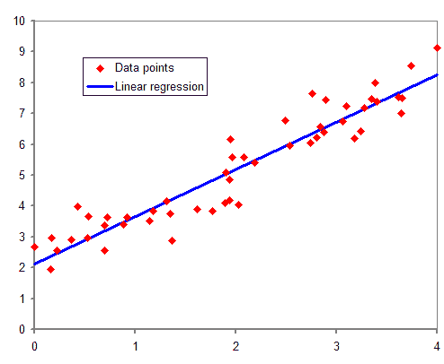
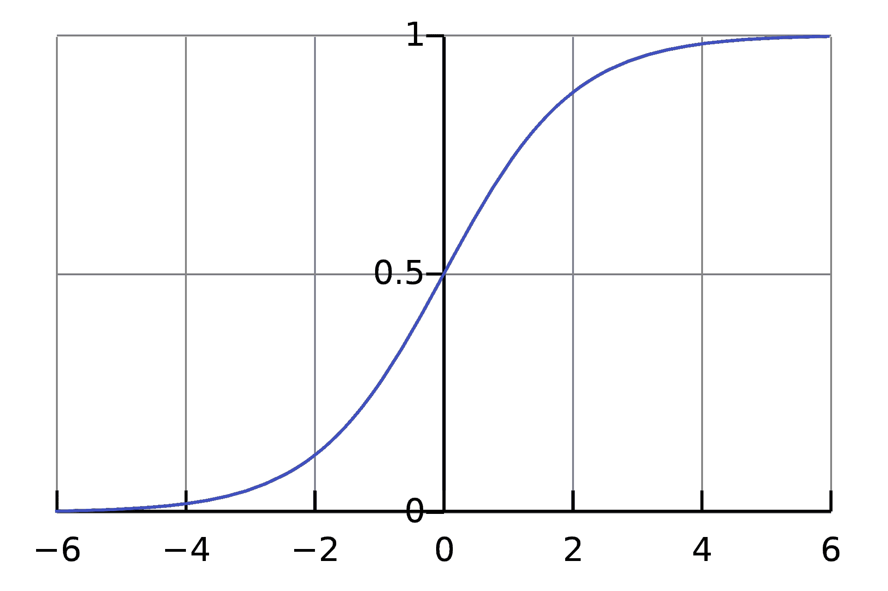
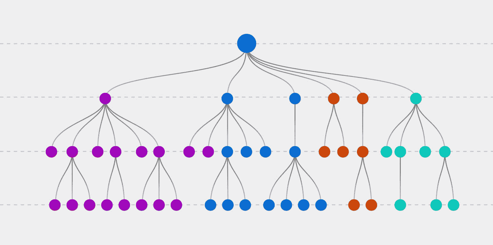
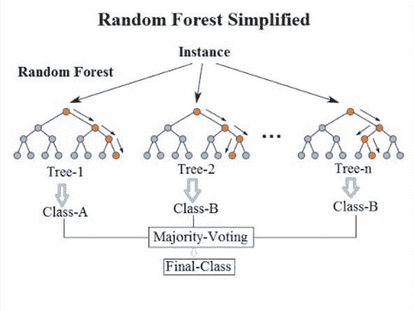
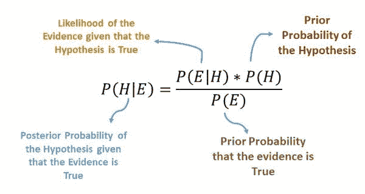
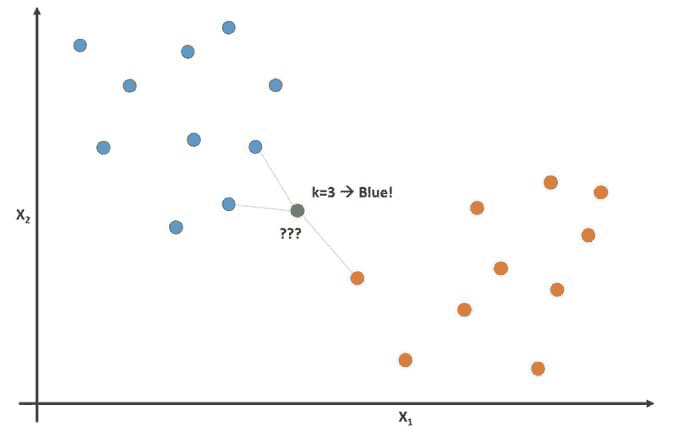
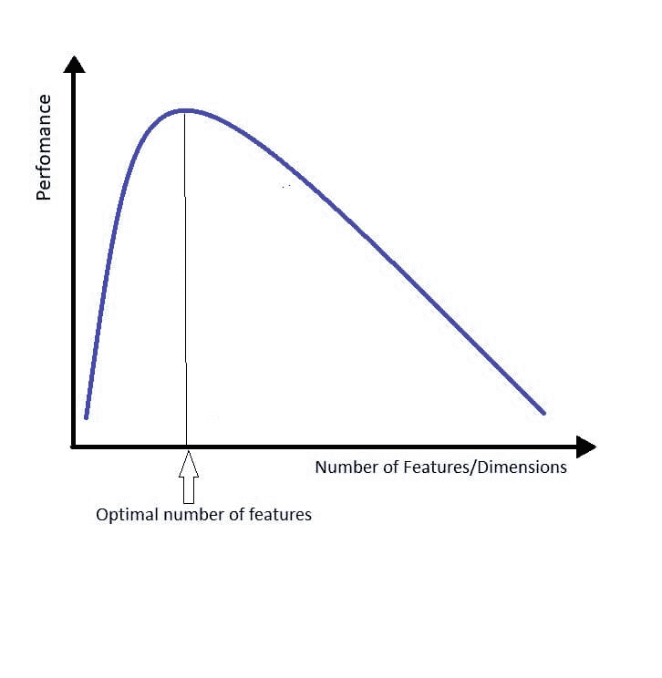

# 常见的机器学习算法

> 原文：[`www.kdnuggets.com/2022/05/popular-machine-learning-algorithms.html`](https://www.kdnuggets.com/2022/05/popular-machine-learning-algorithms.html)

在开始学习数据科学时，有很多内容需要学习，这可能会让人感到相当不知所措。如果你需要对数据科学的基础知识有更多的了解，可以查看这篇文章：初学者最佳数据科学书籍。

本指南将帮助有志于数据科学和机器学习工程的人员获得更好的知识和经验。我将列出不同类型的机器学习算法，这些算法可以在 Python 和 R 中使用。

# 1. 线性回归

来源：[维基百科](https://en.wikipedia.org/wiki/Regression_analysis)

线性回归是最简单的机器学习算法，源自监督学习。它主要用于解决回归问题，并利用独立变量的知识对连续因变量进行预测。

线性回归的目标是找到最佳拟合线，这有助于预测连续因变量的输出。例如，连续值包括房价、年龄和工资。

简单线性回归是一种模型，它使用直线来估计一个独立变量与一个因变量之间的关系。多元线性回归则包括两个以上的独立变量。

# 2. 逻辑回归

来源：[维基百科](https://en.wikipedia.org/wiki/Sigmoid_function)

逻辑回归是另一种从监督学习中分支出来的机器学习算法。它可以用于回归和分类任务，但主要用于分类。如果你想了解更多关于逻辑回归在分类任务中的应用，请点击链接。

逻辑回归用于预测具有独立变量知识的分类因变量。其目的是对输出进行分类，这些输出只能是 0 或 1。输入的加权和通过一个称为**Sigmoid 函数**的激活函数，该函数将值映射到 0 和 1 之间。

逻辑回归基于最大似然估计，这是一种估计假定概率分布参数的方法，给定一些观察到的数据。

在**线性回归**和**逻辑回归**之间容易感到困惑，因此如果你想对这两者有更深入的了解，可以阅读这篇文章：线性回归与逻辑回归：简明解释。

# 3. 决策树

来源：[explorium](https://www.explorium.ai/blog/the-complete-guide-to-decision-trees/)

决策树是另一种机器学习算法，分支自监督学习。决策树算法可以用于回归和分类问题。

这是一个树状模型，用于通过直观展示决策及其潜在结果、后果和成本来进行决策过程。这个概念类似于人类思维；通过将数据分割成部分。随着我们尽可能多地细化数据，我们将它们分割成独特的片段。

决策树的整体目标是创建一个可以用来预测目标变量类别的训练模型。

决策树有两种类型，取决于目标变量的类型：

1.  分类变量：决策树的目标变量为分类的。

1.  连续变量：决策树的目标变量为连续的。

# 4\. 随机森林®

来源: [维基百科](https://en.wikipedia.org/wiki/Random_forest)

下一个机器学习算法是随机森林算法，这是一种广泛用于分类和回归问题的监督机器学习算法。与决策树一样，它也是一种基于树的算法。然而，随机森林算法使用多个决策树来做出决策——一片树的森林。

随机森林算法使用包含连续变量的数据集来处理回归任务，而使用分类变量来处理分类任务。

随机森林算法是一种集成方法，这意味着结合多个模型，使用一组模型来进行预测，而不是使用单一模型。

**集成方法**使用两种类型的方法：

1.  **Bagging**：这会生成额外的数据用于训练数据集。这样做是为了减少预测中的方差。

1.  **Boosting**：这将弱学习器结合起来，通过创建序列模型将其转变为强学习器，从而使最终模型具有最高的准确性。

# 5. **朴素贝叶斯**

来源: [Medium](https://medium.com/analytics-vidhya/na%C3%AFve-bayes-algorithm-5bf31e9032a2)

**朴素贝叶斯**是一种基于贝叶斯定理的分类技术。贝叶斯定理是用于计算条件概率的数学公式。

上述公式为：

+   **E** 发生的可能性在 **H** 发生的条件下（后验概率）

+   **E** 发生的可能性在 **H** 发生的条件下

+   **H** 自己发生的可能性

+   **E** 自己发生的可能性

它假设当一个特征在一个类别中存在时，与其他特征的存在无关。它基于各种属性预测不同类别的概率。具有最高概率的类别被认为是最可能的类别。

**朴素贝叶斯**不是单一算法，而是多个算法，它们都共享一个共同的原则，基于贝叶斯定理。

# 6. **k-最近邻**

来源：[rapidminer](https://rapidminer.com/blog/k-nearest-neighbors-laziest-machine-learning-technique/)

kNN，即 K-最近邻算法，是一种从监督学习中衍生出的算法，可用于解决分类和回归问题。KNN 算法假设相似的事物会靠得很近。我记住它是“物以类聚”。

kNN 使用距离、接近度或亲密度的概念来衡量其他数据点之间的相似性。通过一种数学方法计算图上点之间的距离，然后根据最近的标记观测数据点为未观测数据进行标记。

为了找到最接近的相似点，你需要找到数据点之间的距离。这可以通过使用欧几里得距离、汉明距离、曼哈顿距离和闵可夫斯基距离等距离度量来完成。

K 被称为最近邻居的数量，一般是一个奇数。

# 7. K-Means

来源：[Wikimedia](https://commons.wikimedia.org/wiki/File:K-means_convergence.gif)

K-means 聚类是一种从无监督学习中衍生的机器学习算法。它是一种聚类算法，将相似的项目/数据点分组为簇，其中组的数量称为 K。

簇内的数据点被认为是同质的，而与同类组相比则是异质的。

K-means 通过找到这些数据点之间的相似性并将它们分组为簇来实现：

1.  选择 k 值。

1.  初始化质心。

1.  选择分组并计算平均值。

为了确定 k 值，你可以使用两种方法：

+   Elbow Method

+   Silhouette Method

# 8. 降维

来源：[TDS](https://towardsdatascience.com/curse-of-dimensionality-a-curse-to-machine-learning-c122ee33bfeb#:~:text=Curse%20of%20Dimensionality%20describes%20the,first%20introduced%20by%20Richard%20E.)

降维是一种减少训练数据中输入变量数量的技术。通俗来说，就是减少特征集的维度。假设你有一个包含一百列的数据集，降维会将列数减少到二十。

当特征数量增加时，模型会自动变得更复杂，并且过拟合的可能性更高。

维度诅咒是处理高维数据时最大的问题，指的是当数据具有过多特征时的情况。

降维可以通过以下组件实现：

+   特征选择用于识别和选择相关特征。

+   特征工程通过现有特征手动生成新特征。

降维的方法包括：

+   主成分分析 (PCA)

+   线性判别分析 (LDA)

+   广义判别分析 (GDA)

# 结论

现在你对数据科学家日常生活中使用的流行机器学习算法有了很好的理解。

如果你想知道进一步扩展知识的资源，可以阅读这篇文章：2022 年你需要阅读的机器学习书籍

RANDOM FORESTS 和 RANDOMFORESTS 是 Minitab, LLC 的注册商标。

**[尼莎·阿雅](https://www.linkedin.com/in/nisha-arya-ahmed/)** 是一名数据科学家和自由职业技术作家。她特别关注提供数据科学职业建议或教程以及数据科学相关理论知识。她还希望探索人工智能如何/可以有助于延长人类生命。她是一位热衷于学习的人，寻求拓宽她的技术知识和写作技能，同时帮助指导他人。

* * *

## 我们的前三大课程推荐

 1\. [谷歌网络安全证书](https://www.kdnuggets.com/google-cybersecurity) - 快速进入网络安全职业生涯。

 2\. [谷歌数据分析专业证书](https://www.kdnuggets.com/google-data-analytics) - 提升你的数据分析技能

 3\. [谷歌 IT 支持专业证书](https://www.kdnuggets.com/google-itsupport) - 支持你的组织在 IT 领域

* * *

### 更多相关话题

+   [PyTorch 还是 TensorFlow？对比流行的机器学习框架](https://www.kdnuggets.com/2022/02/packt-pytorch-tensorflow-comparing-popular-machine-learning-frameworks.html)

+   [哈佛最受欢迎的编程入门课程免费提供！](https://www.kdnuggets.com/2022/03/popular-intro-programming-course-harvard-free.html)

+   [为什么 TinyML 案例越来越受欢迎？](https://www.kdnuggets.com/2022/10/tinyml-cases-becoming-popular.html)

+   [为什么 DuckDB 越来越受欢迎？](https://www.kdnuggets.com/2023/07/duckdb-getting-popular.html)

+   [KDnuggets 新闻 3 月 30 日：最受欢迎的编程入门课程…](https://www.kdnuggets.com/2022/n13.html)

+   [AI 质量免费研讨会，因需求强烈回归](https://www.kdnuggets.com/2022/05/truera-free-workshop-ai-quality-back-popular-demand.html)
