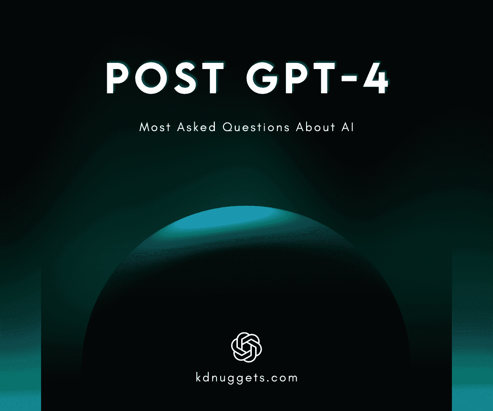

# Post GPT-4: 解答关于 AI 的最常见问题

> 原文：[`www.kdnuggets.com/2023/04/post-gpt4-answering-asked-questions-ai.html`](https://www.kdnuggets.com/2023/04/post-gpt4-answering-asked-questions-ai.html)

图片由作者提供

我们生活在一个既令人兴奋又奇怪的时代。生成式 AI，如 ChatGPT，已经改变了一切。我们看到像谷歌这样的公司首次承受压力，目前的就业市场充满不确定性，而开源开发正全速推进。跟上 AI 的发展和虚假信息很困难。

* * *

## 我们的前三个课程推荐

 1\. [谷歌网络安全证书](https://www.kdnuggets.com/google-cybersecurity) - 快速开启网络安全职业生涯。

 2\. [谷歌数据分析专业证书](https://www.kdnuggets.com/google-data-analytics) - 提升你的数据分析技能

 3\. [谷歌 IT 支持专业证书](https://www.kdnuggets.com/google-itsupport) - 支持你的组织的 IT 工作

* * *

在这篇博客中，我将尝试回答一些关于 AI 的常见问题。这些答案基于我在写作和阅读有关 AI 最新发展的过程中形成的观点。

## 哪一个更好：开源还是闭源？

在我看来，开源和闭源 AI 开发都是必要的。你需要理解 ChatGPT 的核心是[Transformers](https://ai.googleblog.com/2017/08/transformer-novel-neural-network.html)，这是一个开源项目，由谷歌大脑团队开发。没有开源开发，我们的创新会变得缓慢。有很多社区主导的项目正在运行大公司。

另一方面，闭源项目拥有完善的团队、资源和资本来开发精致的产品。在 OpenAI 的案例中，DALLE 2 和 ChatGPT 需要多个 GPU，有时仅仅实验的成本就可能高达数百万。它是一个干净且无错误的应用程序。

如果你问我，我会说开源更好。开源项目是公开的，透明的，推动创新，开发者可以通过出售许可证或提供额外功能来赚钱。

## AI 会完全取代技术工作者和艺术家吗？

不会。让我用简单的术语解释一下。AI 永远不会取代任何工作。它是来辅助我们的。工作场所文化将发生巨大变化。利用 AI 工具的人将逐渐取代那些仍在执行手动任务的人。

我知道 Dalle-2、Mid Journey、ChatGPT 和 GPT-4 都很棒，但相信我，它们不如普通人。ChatGPT 会犯错，并且不理解复杂的任务和概念。例如，如果你要求 ChatGPT 开发一个有多个集成的合适应用，它将无法理解整体情况。你必须进行多次手动修改才能正确完成任务。

## 生成性 AI 的潜在风险是什么，如何避免这些风险？

1.  **版权问题**：这些模型是在公共和一些受版权法保护的私人数据上开发的。你的辛勤工作被一些公司用来开发产品，而你却没有得到补偿。我们可以通过制定人工智能法律来解决这个问题。

1.  **安全和隐私**：ChatGPT 已经变得比任何东西都大，难以保持这个庞大系统的安全。曾经有用户投诉他们在查看其他人的历史记录。除此之外，你还允许 OpenAI 访问你的聊天记录，这对公司来说是个问题。你可以通过使用开源模型和工具包创建自己的 ChatGPT 应用来解决这个问题。查看 OpenChatKit: 开源 ChatGPT 替代方案。

1.  **剽窃**：教育机构面临困境，因为学生使用这些工具提交作业、开发项目甚至撰写论文。一些免费的工具，如[OpenAI AI 文本分类器](https://platform.openai.com/ai-text-classifier)，可以帮助教师检测生成的作品。你还可以查看检测 ChatGPT、GPT3 和 GPT2 的 5 个免费工具。

1.  **虚假信息和滥用**：像 ChatGPT 这样的语言模型可以被用于大规模的信息传播活动或在线滥用。你可以通过使用水印技术来解决这个问题。

## 为什么埃隆·马斯克和其他科技领袖希望暂停 AI 开发六个月？

一个由埃隆·马斯克和 11,761 名个人（包括人工智能专家）签署的[公开信](https://futureoflife.org/open-letter/pause-giant-ai-experiments/)，由非营利组织 Future of Life Institute 发布。信中呼吁暂时停止高级人工智能的开发，持续六个月。签署者敦促人工智能实验室避免训练超过 OpenAI 最近发布的 GPT-4 能力的任何技术。

这意味着 AI 领导者认为具有人类竞争智能的 AI 系统可能对社会和人类构成深远的风险。

首先，停止开发是不可能的。他们如何停止开源开发或中国等国家的开发？魔已经放出了瓶子。我们能做的就是努力使其变得安全和可靠。

在我看来，我相信这封公开信也有商业角度。许多公司未能成功推出像 GPT-4 这样的应用，他们需要 6 个月的缓冲时间来开发并与微软和 OpenAI 竞争。

## 接下来会发生什么？我们是否能在有生之年看到通用人工智能（AGI）？

我们将看到多模态领域的大量发展，其中模型将能够接收图像、视频和音频作为输入，并输出文本、图像和音频。例如，如果你让 AI 撰写技术博客，它将添加文本、代码块和图像，创建一个可以发布的完整博客。或者你可以像与人对话一样与 AI 交谈，它将像钢铁侠中的贾维斯一样用音频回复你。

未来，你将看到 AI 在工作生活中的更多应用，这将开启像提示工程这样的新研究领域。

我可以肯定的是，我们离通用人工智能（AGI）还有很长的路要走。AGI 是一种自我意识的机器，能够独立思考和决策。这些模型和 AI 应用是建立在人类生成的数据基础上的，要使 AI 在所有方面超过人类，它需要自主学习。因此，我在有生之年无法看到 AGI，但我仍然充满希望。

你应该害怕 AGI 吗？我想时间会告诉我们答案。

**[Abid Ali Awan](https://www.polywork.com/kingabzpro)** ([@1abidaliawan](https://twitter.com/1abidaliawan)) 是一位认证的数据科学专家，热衷于构建机器学习模型。目前，他专注于内容创作和撰写关于机器学习和数据科学技术的技术博客。Abid 拥有技术管理硕士学位和电信工程学士学位。他的愿景是利用图神经网络开发一款 AI 产品，帮助那些面临心理疾病的学生。

### 了解更多相关信息

+   [使用 HuggingFace Pipelines 和 Streamlit 回答问题](https://www.kdnuggets.com/2021/10/simple-question-answering-web-app-hugging-face-pipelines.html)

+   [12 个最具挑战性的数据科学面试问题](https://www.kdnuggets.com/2022/07/12-challenging-data-science-interview-questions.html)

+   [有经验专业人员的 SQL 面试问题](https://www.kdnuggets.com/2022/01/sql-interview-questions-experienced-professionals.html)

+   [如何回答数据科学编程面试问题](https://www.kdnuggets.com/2022/01/answer-data-science-coding-interview-questions.html)

+   [15 个你必须了解的数据科学 Python 编程面试问题](https://www.kdnuggets.com/2022/04/15-python-coding-interview-questions-must-know-data-science.html)

+   [24 个你可能在下一次面试中遇到的 SQL 问题](https://www.kdnuggets.com/2022/06/24-sql-questions-might-see-next-interview.html)
