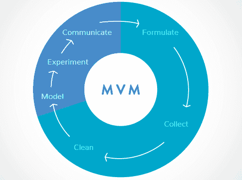
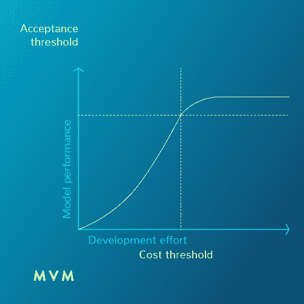

# 实用数据科学：构建最低可行模型

> 原文：[`www.kdnuggets.com/2016/11/practical-data-science-building-minimum-viable-models.html`](https://www.kdnuggets.com/2016/11/practical-data-science-building-minimum-viable-models.html)

 评论

**作者：Ernesto Mislej，联合创始人，数据科学组主任，7Puentes**。

* * *

## 我们的前三大课程推荐

 1\. [谷歌网络安全证书](https://www.kdnuggets.com/google-cybersecurity) - 快速进入网络安全职业。

 2\. [谷歌数据分析专业证书](https://www.kdnuggets.com/google-data-analytics) - 提升你的数据分析技能

 3\. [谷歌 IT 支持专业证书](https://www.kdnuggets.com/google-itsupport) - 支持组织的 IT

* * *

当我们谈论创新服务或产品时，许多初创公司遵循更平滑的发展模型。这使他们能够在筹集资金时最小化风险以获得改进。一旦他们找到了市场契合点，问题将变成增长，以实现平衡点。

对于那些基于数据的初创公司（如今，大多数初创公司将其数据视为决策的战略资产），找到一个解释数据的模型是一项困难的任务。提取/收集数据、测量、建模和决策是任何目标于动态、变化、流动市场的初创公司的常见路径。

数据科学家或数据科学团队的任务是找到该模型，但找到这些模型（确定建模技术、设置参数和调整）可能是一个非常漫长的过程，有时甚至与业务进展不一致。例如：一个模型“预测足球比赛的结果”却是在比赛后才找到结果，这没有意义。那么，初创公司如何在推出新应用时最小化这种风险？他们是否需要如此大量的部署才能进入市场，他们是否拥有必要的资源？在 7Puentes，我们理解他们不需要，因此我们创造了一个新概念：MVM（最低可行模型）。

MVM 基于这样一个原则：数据驱动的初创公司需要根据其财务现实拥有可负担的数据科学模型，而且这些模型在准确性方面也必须是可接受的。这种基于最低和有效模型的工作方法，最小化了在产品未能成功进入市场时的风险，因此，在推出方面减少了一个障碍。

一个 75%准确率的数据科学模型，在保证应用正常运行的情况下，需花费 25%的时间。要达到 100%，即一个完美模型，所需时间和投资将呈指数级增长。如果我们考虑像“Tinder”这样的推荐模型，MVM 不需要 10 个建议都理想，而是要在 10 个建议中有一个平均水平的好建议，并且可能有少量非常差的建议。开发一个 100%有效的预测算法既不必要也在财务上不可行。每个领域/项目都有其“足够好”：有时优先考虑快速响应，而在其他情况下则关注覆盖面。

要找到 MVM，需要业务目标定义领域与数据科学家之间的持续对话。仅让专家与数据合作两个月是没有用的，因为找到 MVM 需要关注数据提供的内容。许多时候，业务领域要求一个非常精确的模型，但训练数据不足、存在噪音或不符合思维模型。也许更好的方法是将模型的范围缩小到其效果更好的数据部分，未来当创业公司有了更好的财务资源时，再扩展模型的覆盖范围。

数据科学项目中超过 70%的工作集中在数据垃圾：数据的收集和清洗。建模、实验和结果沟通的时间则过于短暂。因此，MVM 模型从“精益”角度来加速知识提取过程。

**简介：[Ernesto Mislej](https://www.linkedin.com/in/emislej)**是 7Puentes 的联合创始人和 7P Labs（7Puentes 的数据科学小组）的主任。他还是布宜诺斯艾利斯大学数据挖掘与知识发现硕士课程中的机器学习和数据挖掘教授。

**相关**：

+   大数据科学：期望与现实

+   如何在构建数据创业公司时组织团队

+   4 个主要趋势正在扰乱数据科学市场

### 更多主题

+   [数据科学基础：开始时需要了解的 10 项关键技能…](https://www.kdnuggets.com/2020/10/data-science-minimum-10-essential-skills.html)

+   [Feature Store Summit 2023：部署机器学习的实用策略…](https://www.kdnuggets.com/2023/09/hopsworks-feature-store-summit-2023-practical-strategies-deploying-ml-models-production-environments)

+   构建数据管道以创建具有大型语言模型的应用)

+   [构建预测模型：Python 中的逻辑回归](https://www.kdnuggets.com/building-predictive-models-logistic-regression-in-python)

+   [数据科学家的实用统计学](https://www.kdnuggets.com/2023/05/practical-statistics-data-scientists.html)

+   [每个数据科学家都应了解的工具：实用指南](https://www.kdnuggets.com/tools-every-data-scientist-should-know-a-practical-guide)
