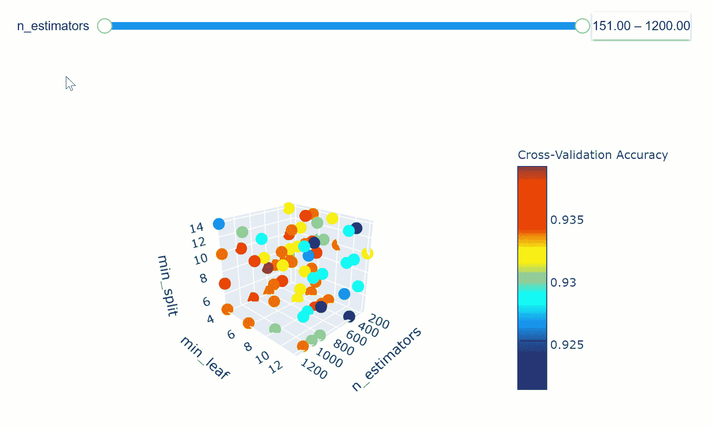
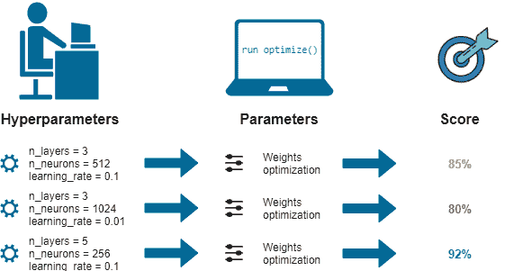
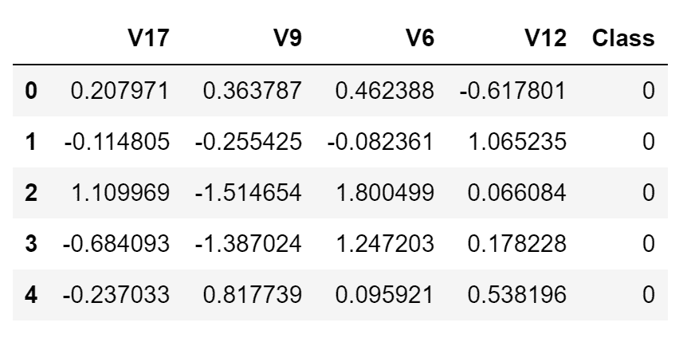
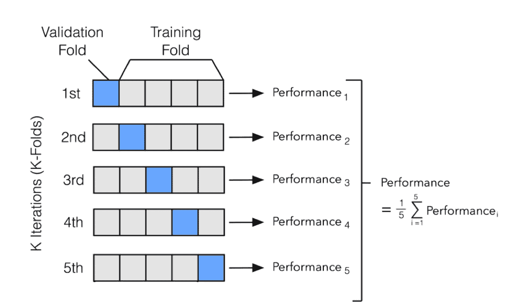
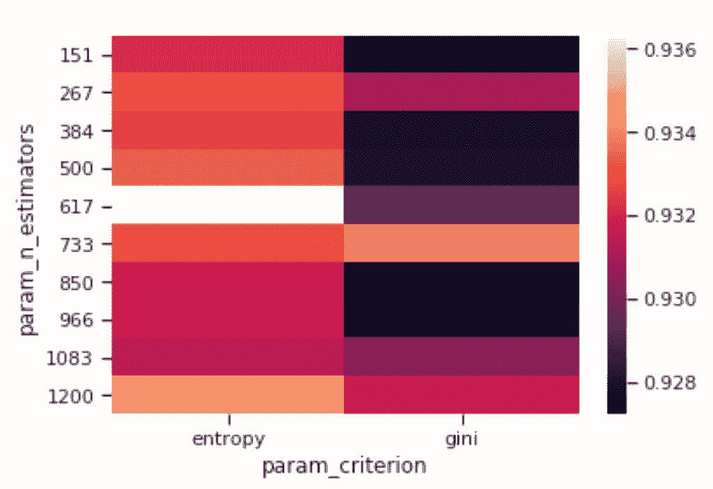

# 实用超参数优化

> 原文：[`www.kdnuggets.com/2020/02/practical-hyperparameter-optimization.html`](https://www.kdnuggets.com/2020/02/practical-hyperparameter-optimization.html)

comments

**由 [Pier Paolo Ippolito](https://www.linkedin.com/in/pierpaolo28/)，南安普顿大学**



* * *

## 我们的三大课程推荐

 1\. [谷歌网络安全证书](https://www.kdnuggets.com/google-cybersecurity) - 快速入门网络安全职业生涯。

 2\. [谷歌数据分析专业证书](https://www.kdnuggets.com/google-data-analytics) - 提升你的数据分析能力

 3\. [谷歌 IT 支持专业证书](https://www.kdnuggets.com/google-itsupport) - 支持你的组织进行 IT 工作

* * *

### 介绍

机器学习模型由两种不同类型的参数组成：

+   **超参数** = 是用户在开始训练前可以任意设置的所有参数（例如随机森林中的估计器数量）。

+   **模型参数 =** 是在模型训练过程中学习到的参数（例如神经网络中的权重，线性回归）。

模型参数定义了如何使用输入数据来获取期望的输出，并在训练时学习。而超参数则决定了我们的模型最初是如何结构化的。

机器学习模型调整是一种优化问题。我们有一组超参数，目标是找到这些参数值的正确组合，以帮助我们找到函数的最小值（例如损失）或最大值（例如准确度）（图 1）。

这在比较不同机器学习模型在数据集上的表现时尤为重要。例如，将具有最佳超参数的 SVM 模型与未经过优化的随机森林模型进行比较是不公平的。

在这篇文章中，将解释以下超参数优化方法：

1.  **手动搜索**

1.  **随机搜索**

1.  **网格搜索**

1.  **自动超参数调整（贝叶斯优化，遗传算法）**

1.  **人工神经网络（ANNs）调整**



图 1：ML 优化工作流程 [1]

为了演示如何在 Python 中执行超参数优化，我决定对 [信用卡欺诈检测 Kaggle 数据集](https://www.kaggle.com/mlg-ulb/creditcardfraud)进行完整的数据分析。本文的目标是正确分类哪些信用卡交易应标记为欺诈或真实（即二分类）。该数据集在分发之前已被匿名化，因此大多数特征的含义尚未公开。

在这种情况下，我决定只使用数据集的一个子集，以加快训练时间并确保在两个不同类别之间实现完美平衡。此外，仅使用有限数量的特征以使优化任务更具挑战性。最终的数据集如下面的图（图 2）所示。



图 2：信用卡欺诈检测数据集

本文中使用的所有代码（以及更多！）可以在我的 [GitHub 仓库](https://github.com/pierpaolo28/Kaggle-Challenges/blob/master/credit-card-fraud-model-tuning.ipynb) 和 [Kaggle 个人资料](https://www.kaggle.com/pierpaolo28/credit-card-fraud-model-tuning) 中找到。

### 机器学习

首先，我们需要将数据集分为训练集和测试集。

在本文中，我们将使用随机森林分类器作为优化的模型。

随机森林模型由大量不相关的决策树组成，这些树共同构成一个集合。在随机森林中，每棵决策树做出自己的预测，整体模型输出被选为出现频率最高的预测。

我们现在可以开始计算我们的基础模型准确率。

```py
[[110   6]
 [  6 118]]
              precision    recall  f1-score   support

           0       0.95      0.95      0.95       116
           1       0.95      0.95      0.95       124

    accuracy                           0.95       240
   macro avg       0.95      0.95      0.95       240
weighted avg       0.95      0.95      0.95       240
```

使用默认的 scikit-learn 参数的随机森林分类器达到了 95% 的总体准确率。现在我们来看看应用一些优化技术是否可以获得更好的准确率。

### 手动搜索

使用手动搜索时，我们根据自己的判断/经验选择一些模型超参数。然后训练模型，评估其准确率，并重新开始这个过程。这个循环会重复直到获得满意的准确率。

随机森林分类器使用的主要参数包括：

+   **criterion** = 用于评估分裂质量的函数。

+   **max_depth** = 每棵树允许的最大层数。

+   **max_features** = 分裂节点时考虑的最大特征数。

+   **min_samples_leaf** = 树叶中可以存储的最小样本数。

+   **min_samples_split** = 节点分裂所需的最小样本数。

+   **n_estimators** = 集合中的树木数量。

有关随机森林参数的更多信息可以在 scikit-learn 的 [文档](https://scikit-learn.org/stable/modules/generated/sklearn.ensemble.RandomForestClassifier.html) 中找到。

作为手动搜索的一个例子，我尝试指定我们模型中的估计器数量。不幸的是，这没有带来任何准确率的提高。

```py
[[110   6]
 [  6 118]]
              precision    recall  f1-score   support

           0       0.95      0.95      0.95       116
           1       0.95      0.95      0.95       124

    accuracy                           0.95       240
   macro avg       0.95      0.95      0.95       240
weighted avg       0.95      0.95      0.95       240
```

### 随机搜索

在随机搜索中，我们创建一个超参数网格，并在这些超参数的随机组合上训练/测试我们的模型。在这个例子中，我还决定在训练集上进行交叉验证。

在进行机器学习任务时，我们通常将数据集划分为训练集和测试集。这是为了在训练模型后对其进行测试（这样我们可以检查模型在处理未见数据时的表现）。使用交叉验证时，我们将训练集划分为 N 个分区，以确保我们的模型不会过拟合数据。

最常用的交叉验证方法之一是 K 折验证。在 K 折中，我们将训练集划分为 N 个分区，然后迭代地使用 N-1 个分区训练模型，并用剩下的分区进行测试（在每次迭代中我们会改变剩下的分区）。在训练了 N 次模型后，我们将平均每次迭代中获得的训练结果，以得到整体训练性能结果（图 3）。



图 3：K 折交叉验证 [2]

在实现超参数优化时使用交叉验证非常重要。通过这种方式，我们可以避免使用在训练数据上表现很好但在测试数据上表现不佳的超参数。

我们现在可以通过首先定义一个超参数网格来开始实现随机搜索，这个网格将在调用 ***RandomizedSearchCV()*** 时被随机采样。对于这个示例，我决定将训练集划分为 4 个折（***cv = 4***），并选择 80 作为要采样的组合数量（***n_iter = 80***）。使用 scikit-learn 的 ***best_estimator_*** 属性，我们可以检索在训练过程中表现最好的超参数集合来测试我们的模型。

一旦训练好模型，我们可以可视化超参数的变化如何影响整体模型准确度（图 4）。在这个例子中，我决定观察估算器数量和准则的变化如何影响随机森林的准确性。



图 4：准则与 N 估算器准确度热图

然后我们可以更进一步，通过使我们的可视化更具互动性。在下图中，我们可以通过滑块检查模型中估算器数量的变化如何影响模型的整体准确性，考虑了所选的 min_split 和 min_leaf 参数。

随意调整下图中的图表，改变 n_estimators 参数，放大和缩小图表，改变图表方向，并悬停在单个数据点上以获取更多信息！

如果你有兴趣了解如何使用 [Plotly](https://towardsdatascience.com/interactive-data-visualization-167ae26016e8) 创建这些动画，我的代码可以在 [这里](https://www.kaggle.com/kernels/scriptcontent/20590929/download) 获得。此外，这个内容也被 [Xoel López Barata](https://towardsdatascience.com/using-3d-visualizations-to-tune-hyperparameters-of-ml-models-with-python-ba2885eab2e9) 的文章覆盖了。

我们现在可以评估使用随机搜索的模型性能。在这种情况下，使用随机搜索相比于我们的基线模型，准确性有了一致的提高。

```py
[[115   1]
 [  6 118]]
              precision    recall  f1-score   support

           0       0.95      0.99      0.97       116
           1       0.99      0.95      0.97       124

    accuracy                           0.97       240
   macro avg       0.97      0.97      0.97       240
weighted avg       0.97      0.97      0.97       240
```

### 网格搜索

在网格搜索中，我们建立一个超参数网格，并在每个可能的组合上训练/测试我们的模型。

为了选择在网格搜索中使用的参数，我们现在可以查看随机搜索中表现最好的参数，并基于这些参数形成一个网格，以查看是否能找到更好的组合。

可以使用 Python 中的 scikit-learn ***GridSearchCV()***函数来实现网格搜索。此次，我决定将训练集分成 4 个折叠（***cv = 4***）。

使用网格搜索时，会尝试网格中所有可能的参数组合。在这种情况下，训练期间将使用 128000 种组合（2 × 10 × 4 × 4 × 4 × 10）。而在之前的网格搜索示例中，仅使用了 80 种组合。

```py
[[115   1]
 [  7 117]]
              precision    recall  f1-score   support

           0       0.94      0.99      0.97       116
           1       0.99      0.94      0.97       124

    accuracy                           0.97       240
   macro avg       0.97      0.97      0.97       240
weighted avg       0.97      0.97      0.97       240
```

与随机搜索相比，网格搜索较慢，但由于可以遍历整个搜索空间，它总体上可能更有效。而随机搜索可能较快，但可能会遗漏搜索空间中的一些重要点。

### 自动超参数调整

在使用自动超参数调整时，使用贝叶斯优化、梯度下降和进化算法等技术来确定要使用的模型超参数。

### 贝叶斯优化

贝叶斯优化可以在 Python 中使用 Hyperopt 库进行。贝叶斯优化利用概率来找到函数的最小值。最终目标是找到能使函数输出值最低的输入值。

已经证明，贝叶斯优化比随机搜索、网格搜索或手动搜索更高效。因此，贝叶斯优化可以在测试阶段带来更好的性能，并减少优化时间。

在 Hyperopt 中，可以通过给函数**fmin()**传递 3 个主要参数来实现贝叶斯优化。

+   **目标函数** = 定义要最小化的损失函数。

+   **领域空间** = 定义测试输入值的范围（在贝叶斯优化中，该空间为每个使用的超参数创建概率分布）。

+   **优化算法** = 定义用于选择每次新迭代中使用的最佳输入值的搜索算法。

此外，还可以在***fmin()***中定义最大评估次数。

贝叶斯优化通过考虑过去的结果来减少搜索迭代次数。通过这种方式，我们可以从一开始就将搜索集中在接近我们期望输出的值上。

我们现在可以使用**fmin()**函数运行我们的贝叶斯优化器。首先创建一个**Trials()**对象，以便之后可视化**fmin()**函数运行期间的情况（例如，损失函数的变化以及所使用的超参数的变化）。

```py
100%|██████████| 80/80 [03:07<00:00,  2.02s/it, best loss: -0.9339285714285713]{'criterion': 1,
 'max_depth': 120.0,
 'max_features': 2,
 'min_samples_leaf': 0.0006380325074247448,
 'min_samples_split': 0.06603114636418073,
 'n_estimators': 1}
```

我们现在可以检索识别出的最佳参数集，并使用在训练期间创建的***最佳***字典测试我们的模型。由于一些参数在***最佳***字典中是以索引的形式存储的，因此我们需要首先将它们转换回字符串，然后再输入到我们的随机森林中。

使用贝叶斯优化的分类报告如下所示。

```py
[[114   2]
 [ 11 113]]
              precision    recall  f1-score   support

           0       0.91      0.98      0.95       116
           1       0.98      0.91      0.95       124

    accuracy                           0.95       240
   macro avg       0.95      0.95      0.95       240
weighted avg       0.95      0.95      0.95       240
```

### 遗传算法

遗传算法尝试将自然选择机制应用于机器学习环境。它们受到达尔文自然选择过程的启发，因此通常也称为进化算法。

设想我们创建一个有 N 个机器学习模型的种群，使用一些预定义的超参数。然后我们可以计算每个模型的准确性，并决定保留一半的模型（即表现最好的模型）。我们可以生成一些具有类似超参数的后代，以便重新获得 N 个模型的种群。此时，我们可以再次计算每个模型的准确性，并重复这一过程若干代。通过这种方式，最终只有最佳模型会存活下来。

为了在 Python 中实现遗传算法，我们可以使用[TPOT 自动机器学习库](https://epistasislab.github.io/tpot/)。TPOT 基于 scikit-learn 库构建，可用于回归或分类任务。

使用遗传算法识别出的训练报告和最佳参数在以下片段中显示。

```py
Generation 1 - Current best internal CV score: 0.9392857142857143
Generation 2 - Current best internal CV score: 0.9392857142857143
Generation 3 - Current best internal CV score: 0.9392857142857143
Generation 4 - Current best internal CV score: 0.9392857142857143
Generation 5 - Current best internal CV score: 0.9392857142857143

Best pipeline: RandomForestClassifier(CombineDFs(input_matrix, input_matrix), criterion=entropy, max_depth=406, max_features=log2, min_samples_leaf=4, min_samples_split=5, n_estimators=617)
```

我们的随机森林遗传算法优化模型的整体准确性如下所示。

```py
0.9708333333333333
```

### 人工神经网络（ANN）调优

使用 KerasClassifier 包装器，可以像使用 scikit-learn 机器学习模型时一样，对深度学习模型应用网格搜索和随机搜索。在下面的示例中，我们将尝试优化一些 ANN 参数，例如：每一层使用多少个神经元以及使用什么激活函数和优化器。更多关于深度学习超参数优化的示例可以在[这里](https://machinelearningmastery.com/grid-search-hyperparameters-deep-learning-models-python-keras/)找到。

```py
Max Accuracy Registred: 0.932 using {'activation': 'relu', 'neurons': 35, 'optimizer': 'Adam'}
```

我们的人工神经网络（ANN）评分的整体准确性可以在下面观察到。

```py
[[115   1]
 [  8 116]]
              precision    recall  f1-score   support

           0       0.93      0.99      0.96       116
           1       0.99      0.94      0.96       124

    accuracy                           0.96       240
   macro avg       0.96      0.96      0.96       240
weighted avg       0.96      0.96      0.96       240
```

### 评估

我们现在可以比较所有不同优化技术在此练习中的表现。总体而言，随机搜索和进化算法表现最佳。

```py
Base Accuracy vs Manual Search 0.0000%.
Base Accuracy vs Random Search 2.1930%.
Base Accuracy vs Grid Search 1.7544%.
Base Accuracy vs Bayesian Optimization Accuracy -0.4386%.
Base Accuracy vs Evolutionary Algorithms 2.1930%.
Base Accuracy vs Optimized ANN 1.3158%.
```

获得的结果高度依赖于所选择的网格空间和数据集。因此，在不同情况下，不同的优化技术将表现得比其他技术更好。

*希望你喜欢这篇文章，谢谢阅读！*

### 联系方式

如果你想获取我的最新文章和项目动态，[请关注我在 Medium](https://medium.com/@pierpaoloippolito28?source=post_page---------------------------) 并订阅我的 [邮件列表](http://eepurl.com/gwO-Dr?source=post_page---------------------------)。以下是我的一些联系方式：

+   [Linkedin](https://uk.linkedin.com/in/pier-paolo-ippolito-202917146?source=post_page---------------------------)

+   [个人博客](https://pierpaolo28.github.io/blog/?source=post_page---------------------------)

+   [个人网站](https://pierpaolo28.github.io/?source=post_page---------------------------)

+   [Medium 个人资料](https://towardsdatascience.com/@pierpaoloippolito28?source=post_page---------------------------)

+   [GitHub](https://github.com/pierpaolo28?source=post_page---------------------------)

+   [Kaggle](https://www.kaggle.com/pierpaolo28?source=post_page---------------------------)

### 参考文献

[1] 超参数优化：自动化算法的解释，Dawid Kopczyk。访问地址：[`dkopczyk.quantee.co.uk/hyperparameter-optimization/`](https://dkopczyk.quantee.co.uk/hyperparameter-optimization/)

[2] 模型选择，ethen8181。访问地址：[`ethen8181.github.io/machine-learning/model_selection/model_selection.html`](http://ethen8181.github.io/machine-learning/model_selection/model_selection.html)

**简介：[Pier Paolo Ippolito](https://www.linkedin.com/in/pierpaolo28/)** 是南安普顿大学人工智能专业的最后一年硕士生。他是 AI 爱好者、数据科学家和 RPA 开发人员。

[原文](https://towardsdatascience.com/hyperparameters-optimization-526348bb8e2d)。转载经许可。

**相关：**

+   自动化机器学习项目实施复杂性

+   自动化机器学习：团队如何在 AutoML 项目中协作？

+   如何自动化超参数优化

### 更多相关主题

+   [超参数优化：10 个顶级 Python 库](https://www.kdnuggets.com/2023/01/hyperparameter-optimization-10-top-python-libraries.html)

+   [使用网格搜索和随机搜索进行超参数调整](https://www.kdnuggets.com/2022/10/hyperparameter-tuning-grid-search-random-search-python.html)

+   [超参数调整：GridSearchCV 和 RandomizedSearchCV 的解释](https://www.kdnuggets.com/hyperparameter-tuning-gridsearchcv-and-randomizedsearchcv-explained)

+   [TPOT 的机器学习管道优化](https://www.kdnuggets.com/2021/05/machine-learning-pipeline-optimization-tpot.html)

+   [SQL 查询优化技术](https://www.kdnuggets.com/2023/03/sql-query-optimization-techniques.html)

+   [数据库优化：探索 SQL 中的索引](https://www.kdnuggets.com/2023/07/database-optimization-exploring-indexes-sql.html)
