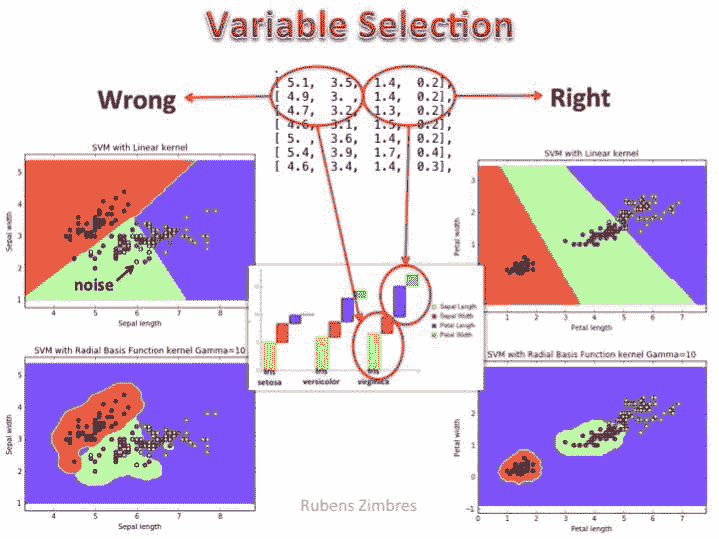

# 特征选择的实际重要性

> 原文：[`www.kdnuggets.com/2017/06/practical-importance-feature-selection.html`](https://www.kdnuggets.com/2017/06/practical-importance-feature-selection.html)

 评论

例如，如果你想根据大量收集到的相关数据来分类动物，你会迅速发现各种潜在的数据属性或特征对分类相对无用。例如，鉴于大多数生物都有一个心脏，从学习角度来看，这个特征不会有帮助。另一方面，表示某个动物是否有蹄的属性可能是一个强有力的预测因子。

此外，使用所有这些与强预测因子混杂的无关属性，实际上可能对结果模型产生负面影响。更不用说包含无用属性可能带来的训练时间增加，或在训练数据上可能发生的过拟合。

特征选择是缩小用于预测建模过程中的特征或属性子集的过程。特征选择在多个方面都很有用：它是对抗维度灾难的最佳武器；它可以减少整体训练时间；同时也是对抗过拟合的强大防御，提高模型的泛化能力。

我最近读到的一篇文章 -- [由数据科学家 [Rubens Zimbres](https://www.linkedin.com/in/rubens-zimbres/) 以非常优雅和简洁的方式撰写](https://www.linkedin.com/feed/update/urn:li:activity:6257288156043890688/) -- 提到了从实际角度看特征选择的重要性：

> 经过一些经验，使用堆叠神经网络、并行神经网络、不对称配置、简单神经网络、多层、丢弃、激活函数等，得出的一个结论是：没有什么比良好的特征选择更重要。

由于之前与 Rubens Zimbres 有过一些专业联系，我向他寻求了一些详细说明。他提供了如下内容：

> 特征选择应该是数据科学家的主要关注点之一。通过正确的特征选择，可以利用相关性、偏度、t 检验、ANOVA、熵和信息增益来提高准确性和泛化能力。
> 
> 多次正确的特征选择可以帮助你开发更简单、更快速的机器学习模型。请看下面的图片（IRIS 数据集的支持向量机分类）：左侧展示了错误的变量选择。线性核无法正确处理分类任务，径向基函数核也无法处理。在右侧，选择了花瓣宽度和花瓣长度作为特征，即使是线性核也表现得相当准确。正确的变量选择、好的算法选择和超参数调整是成功的关键。下图使用 Python 制作。

在充足的处理能力使我们可能认为特征选择可能不再像以前那样相关的时代里，重要的是要记住，这仅仅是知情特征选择的诸多好处之一——减少训练时间。正如 Zimbres 上面所述，通过一个简单的具体例子，特征选择可以确实意味着有效且可泛化的模型与浪费时间之间的区别。

**相关**：

+   必须知道：为什么在机器学习模型中减少预测变量可能更好？

+   回归分析真的属于机器学习吗？

+   识别可能是更好预测变量的变量

* * *

## 我们的前三个课程推荐

 1\. [谷歌网络安全证书](https://www.kdnuggets.com/google-cybersecurity) - 快速进入网络安全职业生涯。

 2\. [谷歌数据分析专业证书](https://www.kdnuggets.com/google-data-analytics) - 提升你的数据分析水平

 3\. [谷歌 IT 支持专业证书](https://www.kdnuggets.com/google-itsupport) - 支持组织的 IT

* * *

### 更多相关话题

+   [停止学习数据科学以寻找目标，并寻找目标来…](https://www.kdnuggets.com/2021/12/stop-learning-data-science-find-purpose.html)

+   [成为优秀数据科学家所需的 5 项关键技能](https://www.kdnuggets.com/2021/12/5-key-skills-needed-become-great-data-scientist.html)

+   [每个初学者数据科学家都应该掌握的 6 个预测模型](https://www.kdnuggets.com/2021/12/6-predictive-models-every-beginner-data-scientist-master.html)

+   [90 亿美元的 AI 失败，剖析](https://www.kdnuggets.com/2021/12/9b-ai-failure-examined.html)

+   [构建一个强大的数据团队](https://www.kdnuggets.com/2021/12/build-solid-data-team.html)

+   [使用管道编写干净的 Python 代码](https://www.kdnuggets.com/2021/12/write-clean-python-code-pipes.html)
