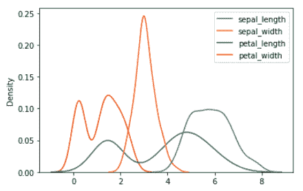
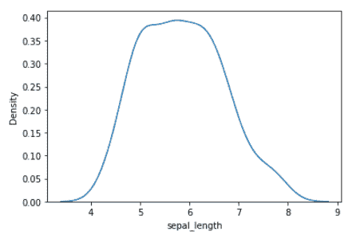
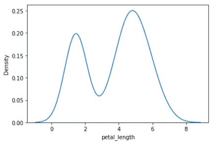
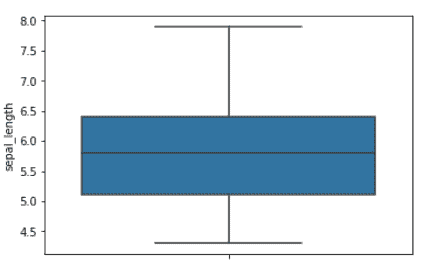
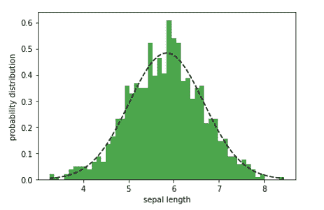

# 数据科学家的实用统计学

> 原文：[`www.kdnuggets.com/2023/05/practical-statistics-data-scientists.html`](https://www.kdnuggets.com/2023/05/practical-statistics-data-scientists.html)


图片由[unsplash](https://unsplash.com/photos/uKlneQRwaxY)提供

统计概念广泛用于从数据中提取有用信息。本文将回顾数据科学和机器学习中适用的基本统计概念。

* * *

## 我们的前 3 个课程推荐

 1\. [谷歌网络安全证书](https://www.kdnuggets.com/google-cybersecurity) - 快速进入网络安全职业生涯

 2\. [谷歌数据分析专业证书](https://www.kdnuggets.com/google-data-analytics) - 提升你的数据分析技能

 3\. [谷歌 IT 支持专业证书](https://www.kdnuggets.com/google-itsupport) - 支持你的组织 IT

* * *

# 概率分布

概率分布展示了特征值如何围绕均值分布。使用鸢尾花数据集，可以使用以下代码生成萼片长度、萼片宽度、花瓣长度和花瓣宽度的概率分布。

```py
import numpy as np
import matplotlib.pyplot as plt
from sklearn import datasets
import seaborn as sns

iris = sns.load_dataset("iris")
sns.kdeplot(data=iris)
plt.show()
```



萼片长度、萼片宽度、花瓣长度和花瓣宽度的概率分布 | 图片由作者提供

# 众数

现在让我们关注萼片长度变量。下图展示了萼片长度变量的概率分布。



萼片长度变量的概率分布 | 图片由作者提供

我们观察到，萼片长度变量的概率分布具有单一的最大值，因此它是**单峰的**。出现最大值的萼片长度值是众数，约为 5.8。

下图展示了花瓣宽度变量的概率分布。



花瓣宽度变量的概率分布 | 图片由作者提供

从这张图中，我们观察到花瓣长度变量的概率分布有 2 个最大值，因此它是**双峰的**。出现最大值的花瓣长度值是众数，即 1.7 和 5.0。

# 平均值

平均值是中心趋势的度量。萼片长度变量的均值计算如下：

```py
data = datasets.load_iris().data
sepal_length = data[:,0]
mean = np.mean(sepal_length)
>>> 5.843333333333334
```

# 中位数

中位数也是中心趋势的度量。中位数对异常值的存在不那么敏感，因此比均值更可靠。萼片长度变量的中位数计算如下：

```py
data = datasets.load_iris().data
sepal_length = data[:,0]
np.median(sepal_length)
>>> 5.8
```

# 标准差

标准差是衡量数据值围绕均值波动的度量。它用于量化数据集中的不确定性。花萼长度特征的标准差使用下面的代码计算。

```py
data = datasets.load_iris().data
sepal_length = data[:,0]
std = np.std(sepal_length)
>>> 0.8253012917851409
```

# 置信区间

置信区间是围绕均值的值范围。65%的置信区间是从均值偏离一个标准差的值范围。95%的置信区间是从均值偏离两个标准差的值范围。下面的箱线图显示了花萼长度特征的均值和 65%的置信区间。

```py
sns.boxplot(data = iris, y='sepal_length')
plt.show()
```



花萼长度特征的箱线图。蓝色区域表示 65%的置信区间 | 作者提供的图片

# 正态分布

概率分布可以用于预测建模。花萼长度特征只有 150 个数据点。假设我们希望生成更多的数据点。如果假设花萼长度特征呈正态分布，我们可以生成更多的数据点。在下面的示例中，我们为花萼长度特征生成了 N = 1000 个数据点。

```py
np.random.seed(10**7)
mu = mean
sigma = std
x = np.random.normal(mean, std, N)

num_bins = 50

n, bins, patches = plt.hist(x, num_bins, 
                            density = 1, 
                            color ='green',
                            alpha = 0.7)

y = ((1 / (np.sqrt(2 * np.pi) * sigma)) *
     np.exp(-0.5 * (1 / sigma * (bins - mu))**2))

plt.plot(bins, y, '--', color ='black')

plt.xlabel('sepal length')
plt.ylabel('probability distribution')

plt.title('matplotlib.pyplot.hist() function Example\n\n',
          fontweight ="bold")

plt.show()
```



花萼长度宽度的概率分布 | 作者提供的图片

# 贝叶斯定理与条件概率

贝叶斯定理是统计学和数据科学中的一个重要定理。它用于评估二元分类算法的预测能力。关于贝叶斯定理如何在二元分类算法中使用的简单教程在这里找到：[用通俗英语讲解的贝叶斯定理](https://benjaminobi.medium.com/bayes-theorem-in-plain-english-eeb142710475?sk=056a4e2d13a83c3305029b91326f2155)。

# 结论

总结来说，我们回顾了数据科学中有用的基本统计概念，如众数、中位数、均值、标准差、概率分布、正态分布和贝叶斯定理。任何对数据科学感兴趣的人都必须学习统计学基础。

**[本杰明·O·塔约](https://www.linkedin.com/in/benjamin-o-tayo-ph-d-a2717511/)** 是一名物理学家、数据科学教育者和作家，也是 DataScienceHub 的所有者。此前，本杰明曾在中奥克拉荷马大学、大峡谷大学和匹兹堡州立大学教授工程学和物理学。

### 了解更多

+   [数据科学家和分析师的统计学基础](https://www.kdnuggets.com/2023/08/fundamentals-statistics-data-scientists-analysts.html)

+   [每个数据科学家应该知道的工具：实用指南](https://www.kdnuggets.com/tools-every-data-scientist-should-know-a-practical-guide)

+   [实用深度学习课程从 fast.ai 回归！](https://www.kdnuggets.com/2022/07/practical-deep-learning-fastai-2022.html)

+   [使用 PyTorch 的迁移学习实用指南](https://www.kdnuggets.com/2023/06/practical-guide-transfer-learning-pytorch.html)

+   [机器学习中的特征工程实用方法](https://www.kdnuggets.com/2023/07/practical-approach-feature-engineering-machine-learning.html)

+   [Python 中的客户细分：一种实用方法](https://www.kdnuggets.com/customer-segmentation-in-python-a-practical-approach)
