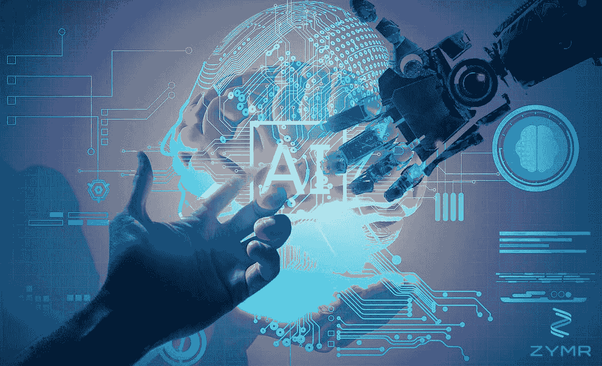
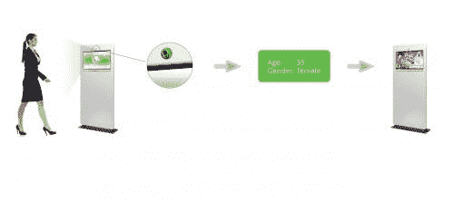
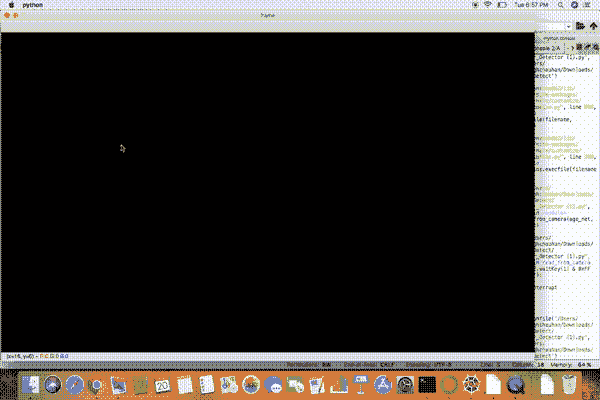
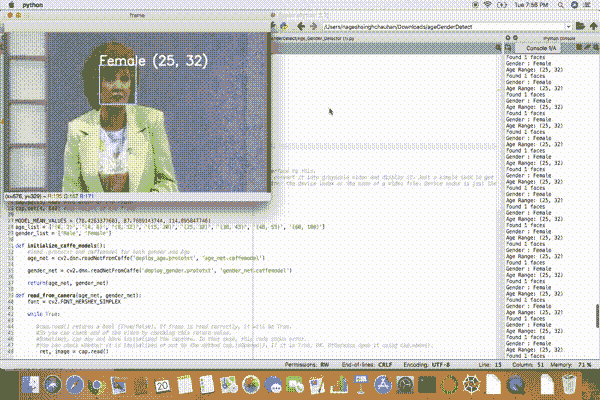

# 使用卷积神经网络和 OpenCV 预测年龄和性别

> 原文：[`www.kdnuggets.com/2019/04/predict-age-gender-using-convolutional-neural-network-opencv.html`](https://www.kdnuggets.com/2019/04/predict-age-gender-using-convolutional-neural-network-opencv.html)

评论

来源：[`www.zymr.com/difference-machine-learning-artificial-intelligence-bots/`](https://www.zymr.com/difference-machine-learning-artificial-intelligence-bots/)

> 自动化的年龄和性别分类在社交平台和社交媒体兴起之后，变得越来越相关。然而，与最近在面部识别任务上取得的巨大进展相比，现有方法在现实世界图像上的表现仍然显著不足。 — [**使用卷积神经网络进行年龄和性别分类**](https://talhassner.github.io/home/publication/2015_CVPR)

* * *

## 我们的前三大课程推荐

 1\. [Google 网络安全证书](https://www.kdnuggets.com/google-cybersecurity) - 快速进入网络安全职业生涯。

 2\. [Google 数据分析专业证书](https://www.kdnuggets.com/google-data-analytics) - 提升数据分析技能

 3\. [Google IT 支持专业证书](https://www.kdnuggets.com/google-itsupport) - 支持组织的 IT 部门

* * *

### 介绍

年龄和性别这两个关键面部特征，在社交互动中起着非常基础的作用，使得从单一面部图像中估计年龄和性别成为智能应用中的一个重要任务，如访问控制、人机交互、执法、市场情报和视觉监控等。

**现实世界应用案例：**



来源：[`www.kiwi-digital.com/produkty/age-gender-detection`](https://www.kiwi-digital.com/produkty/age-gender-detection)

最近我遇到了 [**Quividi**](https://www.quividi.com/)，这是一款 AI 软件应用程序，用于基于在线面部分析检测用户的年龄和性别，并根据目标受众自动开始播放广告。

另一个例子是 [**AgeBot**](https://play.google.com/store/apps/details?id=com.testa.agebot&hl=en_IN)，这是一个 Android 应用程序，可以通过面部识别从照片中确定你的年龄。它可以猜测你的年龄和性别，并且还可以在一张图片中找到多张面孔，并估计每张面孔的年龄。

受上述用例的启发，我们将在这篇详细的文章中构建一个简单的年龄和性别检测模型。那么让我们开始我们的用例：

**用例**—我们将进行一些人脸识别、人脸检测工作，并且，我们将使用 CNN（卷积神经网络）从 YouTube 视频中进行年龄和性别预测，你不需要下载视频，只需视频 URL 即可。令人感兴趣的是在视频 URL 上使用 CNN 进行年龄和性别预测。

**要求：**

pip install OpenCV-python

numpy

pip install pafy

pip install youtube_dl（了解更多关于[youtube_dl](https://rg3.github.io/youtube-dl/)的信息）

**pafy**：Pafy 库用于检索 YouTube 内容和元数据（如标题、评分、观看次数、时长、评分、作者、缩略图、关键词等）。了解更多关于[pafy](https://pypi.org/project/pafy/)的信息。我们来看一个示例：

```py
import pafy

url = 'https://www.youtube.com/watch?v=c07IsbSNqfI&feature=youtu.be'
vPafy = pafy.new(url)
print vPafy.title
print vPafy.rating
print vPafy.viewcount
print vPafy.author
print vPafy.length
print vPafy.description
```

输出：

```py
Testing file uploads with Postman (multipart/form-data)
4.87096786499
11478
Valentin Despa
1688
➡️➡️➡️ ???? Check my online course on Postman. Get it for only $10 (limited supply):
https://www.udemy.com/postman-the-complete-guide/?couponCode=YOUTUBE10

I will show you how to debug an upload script and demonstrate it with a tool that can make requests encoded as "multipart/form-data" so that you can send also a file.

After this, we will go even further and write tests and begin automating the process.

Here is the Git repository containing the files used for this tutorial:
https://github.com/vdespa/postman-testing-file-uploads
```

**步骤：**

1.  从 YouTube 获取视频 URL。

1.  使用 Haar 级联进行人脸检测

1.  使用 CNN 进行性别识别

1.  使用 CNN 进行年龄识别

**1. 从 YouTube 获取视频 URL：**

获取 YouTube 视频 URL，并尝试使用 pafy 获取视频属性，如上所述。

**2. 使用 Haar 级联进行人脸检测：**

这是大多数人至少听说过的一部分。OpenCV/JavaCV 提供了直接的方法来导入 Haar 级联并用于人脸检测。我不会深入解释这一部分。你们可以参考我之前的[文章](https://medium.com/analytics-vidhya/how-to-build-a-face-detection-model-in-python-8dc9cecadfe9)以了解更多关于使用 OpenCV 进行人脸检测的内容。

**3. 使用 CNN 进行性别识别：**

使用 OpenCV 的 fisherfaces 实现进行性别识别非常流行，你们中的一些人可能也尝试过或读过相关内容。但在这个例子中，我将使用一种不同的方法来识别性别。这种方法是由两位以色列研究人员 Gil Levi 和 Tal Hassner 于 2015 年提出的。我在这个例子中使用了他们训练的 CNN 模型。我们将使用 OpenCV 的 dnn 包，即“深度神经网络”。

在 dnn 包中，OpenCV 提供了一个叫做 Net 的类，可以用来填充神经网络。此外，这些包支持从著名的深度学习框架（如 caffe、tensorflow 和 torch）中导入神经网络模型。我之前提到的研究人员已经将他们的 CNN 模型发布为 caffe 模型。因此，我们将使用 CaffeImporter 将该模型导入到我们的应用程序中。

**4. 使用 CNN 进行年龄识别**

这与性别检测部分几乎相似，区别在于对应的 prototxt 文件和 caffe 模型文件是“deploy_agenet.prototxt”和“age_net.caffemodel”。此外，该 CNN 的输出层（概率层）包含 8 个值，用于 8 个年龄类别（“0–2”，“4–6”，“8–13”，“15–20”，“25–32”，“38–43”，“48–53”和“60-”）

一个 caffe 模型有 2 个相关文件，

**1 .prototxt**——CNN 的定义在这里。该文件定义了神经网络中的层，每一层的输入、输出和功能。

**2 .caffemodel** — 这包含了训练神经网络（训练模型）的信息。

从[这里](https://talhassner.github.io/home/publication/2015_CVPR)下载.prtotxt 和.caffemodel。

从[这里](https://github.com/opencv/opencv/blob/master/data/haarcascades/haarcascade_frontalface_default.xml)下载用于面部检测的 haar cascade。

所以我们开始编写我们的模型代码。

**源代码：**

```py
import cv2
import numpy as np
import pafy

#url of the video to predict Age and gender
url = 'https://www.youtube.com/watch?v=c07IsbSNqfI&feature=youtu.be'
vPafy = pafy.new(url)
play = vPafy.getbest(preftype="mp4")

cap = cv2.VideoCapture(play.url)

cap.set(3, 480) #set width of the frame
cap.set(4, 640) #set height of the frame

MODEL_MEAN_VALUES = (78.4263377603, 87.7689143744, 114.895847746)

age_list = ['(0, 2)', '(4, 6)', '(8, 12)', '(15, 20)', '(25, 32)', '(38, 43)', '(48, 53)', '(60, 100)']

gender_list = ['Male', 'Female']

def load_caffe_models():

 age_net = cv2.dnn.readNetFromCaffe('deploy_age.prototxt', 'age_net.caffemodel')

gender_net = cv2.dnn.readNetFromCaffe('deploy_gender.prototxt', 'gender_net.caffemodel')

return(age_net, gender_net)

def video_detector(age_net, gender_net):
  font = cv2.FONT_HERSHEY_SIMPLEX

while True:

  ret, image = cap.read()

  face_cascade = cv2.CascadeClassifier('haarcascade_frontalface_alt.xml')

  gray = cv2.cvtColor(image, cv2.COLOR_BGR2GRAY)
  faces = face_cascade.detectMultiScale(gray, 1.1, 5)

if(len(faces)>0):
   print("Found {} faces".format(str(len(faces))))

for (x, y, w, h )in faces:
   cv2.rectangle(image, (x, y), (x+w, y+h), (255, 255, 0), 2)

#Get Face 
   face_img = image[y:y+h, h:h+w].copy()
   blob = cv2.dnn.blobFromImage(face_img, 1, (227, 227), MODEL_MEAN_VALUES, swapRB=False)

#Predict Gender
   gender_net.setInput(blob)
   gender_preds = gender_net.forward()
   gender = gender_list[gender_preds[0].argmax()]
   print("Gender : " + gender)

#Predict Age
   age_net.setInput(blob)
   age_preds = age_net.forward()
   age = age_list[age_preds[0].argmax()]
   print("Age Range: " + age)

overlay_text = "%s %s" % (gender, age)
   cv2.putText(image, overlay_text, (x, y), font, 1, (255, 255, 255), 2, cv2.LINE_AA)

cv2.imshow('frame', image)  
#0xFF is a hexadecimal constant which is 11111111 in binary.
if cv2.waitKey(1) & 0xFF == ord('q'): 
   break

if __name__ == "__main__":
age_net, gender_net = load_caffe_models()

video_detector(age_net, gender_net)
```

现在让我们理解一下代码：

第 1 步：导入所有必需的库。

```py
import cv2
import numpy as np
import pafy
```

第 2 步：获取 YouTube 视频 URL 并创建一个对象‘play’，该对象包含视频的最佳分辨率，格式为[webm](https://www.webmproject.org/about/)/mp4。

```py
url = 'https://www.youtube.com/watch?v=c07IsbSNqfI&feature=youtu.be'
vPafy = pafy.new(url)
play = vPafy.getbest(preftype="mp4")
```

第 3 步：我们通常需要用相机捕获实时流。OpenCV 提供了一个非常简单的接口。我们可以从相机捕获视频，将其转换为灰度视频并显示。这只是一个简单的开始任务。

要捕获视频，你需要创建一个视频捕获对象。它的参数可以是设备索引或视频文件的名称。设备索引只是指定哪个相机的数字。通常一个相机会连接（如我的情况）。所以我直接传递 0（或-1）。你可以通过传递 1 选择第二个相机，以此类推。之后，你可以逐帧捕获。

```py
cap = cv2.VideoCapture(0) #if you are using webcam
```

但在我的情况下，我正在读取一个在线视频 URL，因此，我将‘play’对象传递给 VideoCapture()。

```py
cap = cv2.VideoCapture(play.url)
```

第 4 步：使用 set()我会设置我们视频帧的高度和宽度。**cap.set(propId, value)**，其中 3 是宽度的 propertyId，4 是高度的 propertyId。

```py
cap.set(3, 480) #set width of the frame
cap.set(4, 640) #set height of the frame
```

第 5 步：创建 3 个独立的列表来存储 Model_Mean_Values、年龄和性别。

```py
MODEL_MEAN_VALUES = (78.4263377603, 87.7689143744, 114.895847746)
age_list = ['(0, 2)', '(4, 6)', '(8, 12)', '(15, 20)', '(25, 32)', '(38, 43)', '(48, 53)', '(60, 100)']
gender_list = ['Male', 'Female']
```

第 6 步：我定义了一个函数来加载年龄和性别检测器的 caffemodel 和 prototxt，这些基本上是预训练的 CNN 模型，用于进行检测。

```py
def load_caffe_models():

 age_net = cv2.dnn.readNetFromCaffe('deploy_age.prototxt', 'age_net.caffemodel')

gender_net = cv2.dnn.readNetFromCaffe('deploy_gender.prototxt', 'gender_net.caffemodel')

return(age_net, gender_net)
```

第 7 步：现在我们将进行面部检测、年龄检测和性别检测，为此在你的主函数中创建一个函数**video_detector(age_net, gender_net)**，并将 age_net 和 gender_net 作为参数传递。

```py
if __name__ == "__main__":
age_net, gender_net = load_caffe_models()

video_detector(age_net, gender_net)
```

第 8 步：读取第 3 步中由 VideoCapture()创建的 cap 对象。

**cap.read()**返回一个布尔值（True/False）。如果帧被正确读取，它将为 True。

#所以你可以通过检查这个返回值来查看视频的结尾。

#有时候，cap 可能没有初始化捕获。在这种情况下，这段代码会显示错误。

#你可以通过方法 cap.isOpened()检查它是否初始化。如果为 True，表示正常。否则，使用 cap.open()打开它。

```py
ret, image = cap.read()
```

第 9 步：将图像转换为灰度图像，因为 OpenCV 面部检测器期望[灰度图像](https://en.wikipedia.org/wiki/Grayscale)。

```py
gray = cv2.cvtColor(image, cv2.COLOR_BGR2GRAY)
```

第 10 步：加载用于面部检测的预构建模型。

```py
face_cascade = cv2.CascadeClassifier('haarcascade_frontalface_alt.xml')
```

第 11 步：现在，我们如何使用 CascadeClassifier 从图像中检测面孔？

好吧，OpenCV 的 CascadedClassifier 因为**detectMultiScale()**使得这一过程变得简单，它能精确检测你需要的内容。

```py
detectMultiScale(image, scaleFactor, minNeighbors)
```

以下是应传递给**detectMultiScale()**的参数。

这是一个通用的对象检测函数，在这种情况下，它将检测人脸，因为我们调用了人脸级联。如果找到人脸，它会以“Rect(x,y,w,h)”形式返回人脸的位置列表；如果没有找到，则返回“None”。

+   **图像：** 第一个输入是**灰度图像**。

+   **scaleFactor：** 这个函数补偿了当一个人脸看起来比另一个人脸大，仅仅是因为它离摄像机更近时，出现的大小错误感知。

+   **minNeighbors：** 检测算法使用移动窗口来检测对象，它通过定义在当前对象附近找到多少个对象来确定是否可以声明找到人脸。

```py
faces = face_cascade.detectMultiScale(gray, 1.1, 5)
```

步骤 12：遍历人脸列表并在视频中的人脸上绘制矩形。这里基本上是寻找人脸，识别这些人脸及其大小，并绘制矩形。

```py
for (x, y, w, h )in faces:
   cv2.rectangle(image, (x, y), (x+w, y+h), (255, 255, 0), 2)

# Get Face 
   face_img = image[y:y+h, h:h+w].copy()
```

步骤 13：OpenCV 提供了一个函数以便于图像预处理用于深度学习分类：**blobFromImage()**。它执行：

+   均值减法

+   缩放

+   以及可选的通道交换

> 所以 blobFromImage*创建 4 维的图像 blob。可以选择从中心调整大小和裁剪图像，减去均值，按缩放因子缩放值，交换蓝色和红色通道*

```py
blob = cv2.dnn.blobFromImage(image, scalefactor=1.0, size, mean, swapRB=True)
```

1.  **图像：** 这是我们要在传递给深度神经网络进行分类之前预处理的输入图像。

1.  **缩放因子：** 在进行均值减法后，我们可以选择按某个因子缩放图像。此值默认为`1.0`（即不缩放），但我们也可以提供其他值。还要注意，缩放因子应为 1/**σ**，因为我们实际上是在将输入通道（经过均值减法后）乘以缩放因子。

1.  **大小：** 在这里我们提供卷积神经网络期望的空间大小。对于大多数当前最先进的神经网络，这通常是*224×224*、*227×227* 或 *299×299*。

1.  **均值：** 这些是我们的均值减法值。它们可以是一个 RGB 均值的 3 元组，也可以是一个单一值，这种情况下提供的值会从图像的每个通道中减去。如果你进行均值减法，请确保以`(R, G, B)`的顺序提供 3 元组，尤其是在使用默认行为 swapRB=True 时。

1.  **swapRB：** OpenCV 假设图像的通道顺序是 BGR；然而，`mean` 值假设我们使用 RGB 顺序。为了解决这个不一致，我们可以通过将此值设置为`True`来交换图像中的 R 和 B 通道。默认情况下，OpenCV 为我们执行了此通道交换。

```py
blob = cv2.dnn.blobFromImage(face_img, 1, (227, 227), MODEL_MEAN_VALUES, swapRB=False)
```

步骤 14：预测性别。

```py
#Predict Gender
gender_net.setInput(blob)
gender_preds = gender_net.forward()
gender = gender_list[gender_preds[0].argmax()]
```

步骤 15：预测年龄。

```py
#Predict Age
age_net.setInput(blob)
age_preds = age_net.forward()
age = age_list[age_preds[0].argmax()]
```

步骤 16：现在我们需要使用 OpenCV 的 putText() 模块在输出帧上添加文本。

cv2.putText() 需要以下参数：

+   你想写入的文本数据

+   你想放置文本的位置坐标（即数据开始的左下角）。

+   字体类型（查看 [**cv2.putText()**](https://docs.opencv.org/3.1.0/d6/d6e/group__imgproc__draw.html#ga5126f47f883d730f633d74f07456c576) 文档以获取支持的字体）

+   字体缩放（指定字体大小）

+   常规的参数如颜色、厚度、lineType 等。为了更好的效果，推荐使用 lineType = cv2.LINE_AA。

```py
overlay_text = "%s %s" % (gender, age)
cv2.putText(image, overlay_text, (x, y), font, 1, (255, 255, 255), 2, cv2.LINE_AA)
```

第 17 步：最后打印你的最终输出。

```py
cv2.imshow('frame', image)
```

最后我们有：

```py
if cv2.waitKey(1) & 0xFF == ord('q'):
   break
```

我们的程序最多等待 1 毫秒以便用户按下一个键。然后它获取读取的键值并与 `0xFF` 进行 AND 运算，这样可以去掉低于 8 位的部分，并将结果与字母 `q` 的 ASCII 码进行比较，这意味着用户通过按下键盘上的 `q` 来决定退出。

**输出**：视频网址-1：[`www.youtube.com/watch?v=iH1ZJVqJO3Y`](https://www.youtube.com/watch?v=iH1ZJVqJO3Y)



Youtube 视频 1

视频网址-2：[`www.youtube.com/watch?v=qLNhVC296YI`](https://www.youtube.com/watch?v=qLNhVC296YI)



Youtube 视频 2

相当有趣，不是吗？不过准确度不是很高。

**结论：**

正如我们在这篇文章中看到的，通过仅几行代码，我们构建了一个年龄和性别检测模型，从这里开始，你还可以在同一个模型中加入情感检测和物体检测，创建一个功能完整的应用程序。

希望你发现这篇文章阅读起来愉快，并对你识别年龄和性别的 quest 有所帮助。如果有任何疑问，请在评论区告诉我。

祝学习愉快 :)

在[LinkedIn](https://www.linkedin.com/in/nagesh-singh-chauhan-6936bb13b/)与我联系。

**简介：[纳戈什·辛格·乔汉](https://www.linkedin.com/in/nagesh-singh-chauhan-6936bb13b/)** 是一位数据科学爱好者。对大数据、Python 和机器学习感兴趣。

[原文](https://towardsdatascience.com/predict-age-and-gender-using-convolutional-neural-network-and-opencv-fd90390e3ce6)。已获得许可重新发布。

**相关：**

+   [Python 中的线性回归初学者指南](https://www.kdnuggets.com/2021/12/5-characteristics-successful-data-scientist.html)

+   [计算机视觉中的一切](https://www.kdnuggets.com/2021/12/stop-learning-data-science-find-purpose.html)

+   使用 RetinaNet 在航拍图像中进行行人检测

### 更多相关话题

+   [停止学习数据科学以寻找目的，并通过寻找目的...](https://www.kdnuggets.com/2021/12/stop-learning-data-science-find-purpose.html)

+   [一个 90 亿美元的 AI 失败，分析](https://www.kdnuggets.com/2021/12/9b-ai-failure-examined.html)

+   [学习数据科学统计学的顶级资源](https://www.kdnuggets.com/2021/12/springboard-top-resources-learn-data-science-statistics.html)

+   [成功数据科学家的 5 个特征](https://www.kdnuggets.com/2021/12/5-characteristics-successful-data-scientist.html)

+   [是什么让 Python 成为初创企业的理想编程语言](https://www.kdnuggets.com/2021/12/makes-python-ideal-programming-language-startups.html)

+   [每个数据科学家都应该知道的三个 R 库（即使你使用 Python）](https://www.kdnuggets.com/2021/12/three-r-libraries-every-data-scientist-know-even-python.html)
