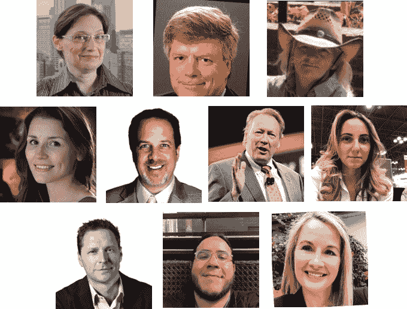
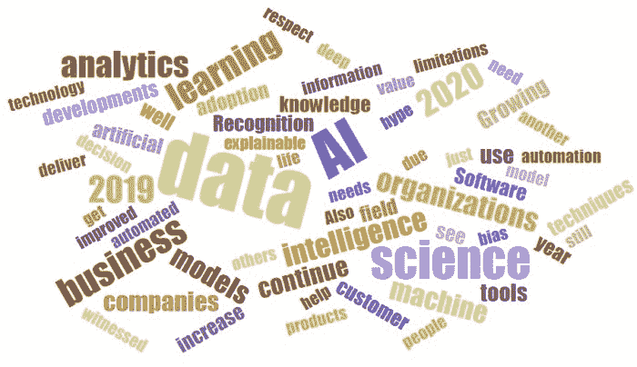

# AI、分析、机器学习、数据科学、深度学习技术 2019 年的主要进展和 2020 年的关键趋势

> 原文：[`www.kdnuggets.com/2019/12/predictions-ai-machine-learning-data-science-technology.html`](https://www.kdnuggets.com/2019/12/predictions-ai-machine-learning-data-science-technology.html)

评论在 2019（以及之前的几年），我们询问了一些顶尖专家他们对 2020 年的预测。

去年预测的一些趋势已经显现：

+   对 AI 伦理的更多关注

+   数据科学的民主化

+   强化学习的进展

+   中国在 AI 领域的成功增长

2019 年也有一些惊喜——去年的专家们没有预测到自然语言处理的突破（如 GPT-2 以及其他版本的 BERT 和 Transformers）。

我们今年再次询问了我们的专家：

> **2019 年人工智能、数据科学、深度学习和机器学习的主要进展是什么？你对 2020 年有何关键趋势预期？**

我们收到了大约 20 个回复，第一部分，主要关注研究，已经发布。

这是第二部分，更加关注技术、行业和部署。一些共同的主题包括：AI 炒作、AutoML、云计算、数据、可解释 AI、AI 伦理。

这里是 Meta Brown、Tom Davenport、Carla Gentry、Nikita Johnson、Doug Laney、Bill Schmarzo、Kate Strachnyi、Ronald van Loon、Favio Vazquez 和 Jen Underwood 的回答。

**[Meta Brown](https://www.linkedin.com/in/metabrown/)，[@metabrown312](https://twitter.com/metabrown312)，是《Data Mining for Dummies》的作者和 A4A Brown 的主席**

在 2018 年，我们看到“人工智能”一词的使用剧增，这一术语被用来描述从真正复杂的应用程序和日益成功的自动驾驶汽车到在直销中使用的普通倾向评分。我预测在 2019 年，人们会意识到这全是数学。我有一半的预测是对的。

一方面，越来越多的人开始看到现在所谓的“AI”的局限性。公众意识到面部识别技术可以被 Juggalo 化妆所干扰，客户服务聊天机器人背后没有智能生命，试图让软件比医生更聪明可能花费数百万仍然可能失败。

尽管如此，“人工智能”仍然是一个热门的流行词，风险投资的钱仍在不断涌入。2019 年前 9 个月，AI 初创企业获得了超过 130 亿美元的投资。

在 2020 年，预计人工智能的两种前景之间会出现越来越明显的二分化：一种是公众对 AI 的疑虑、怀疑和对其局限性的认识不断增长；另一种是商业和投资界继续对 AI 的承诺投入希望、梦想和资金。

* * *

**[汤姆·达文波特](https://www.linkedin.com/in/davenporttom/)、[@tdav](https://twitter.com/tdav) 是巴布森学院信息技术与管理的总统杰出教授，国际分析学会的联合创始人，麻省理工学院数字经济倡议的研究员，以及德勤分析的高级顾问。**

2019 年的主要发展：

+   在数据科学的更结构化方面，自动化机器学习工具的广泛部署。

+   广泛认识到分析和人工智能具有需要有意识地解决的伦理维度。

+   越来越多的人认识到，大多数分析和人工智能模型没有被部署，结果对创建这些模型的组织没有价值。

2020 年的即将发展：

+   提供创建、管理和监控组织的机器学习模型套件的工具，重点是对漂移模型进行持续重新训练和模型库存管理。

+   对分析和人工智能翻译员的地位和认可有所改善，他们与业务用户和领导者合作，将业务需求转化为模型的高级规范。

+   认识到模型与数据的契合度只是决定其是否有用的一个考虑因素。

* * *

**[卡拉·根特里](https://www.linkedin.com/in/datanerd13/)、[@data_nerd](https://twitter.com/data_nerd) 是咨询数据科学家和 Analytical-Solution 的所有者。**

又一年关于人工智能、机器学习和数据科学能做什么和不能做什么的炒作，我对大量未经培训的专业人士涌入这些领域感到不安，以及那些不断颁发所谓认证和学位的学院，教师们根本没有资格教授这些课程。

数据科学和机器学习依赖于大量数据，但我们面临另一年的偏见误解，数据需要解释总是存在偏见风险。无偏数据是独立的，不需要解释，例如 - 玛丽通过增加销售投资回报率 10%与玛丽是个勤奋工作的人，这是一种意见，无法衡量。

前几天有一篇文章的标题引起了我的注意“数据科学正在衰退吗”？我在阅读之前的初步想法是“不是，但所有那些想当专家和炒作确实没有帮助我们的领域 - 数据科学不仅仅是编写代码”。对技术的误解加上缺乏数据和必要的基础设施将继续困扰我们，但至少有些人意识到 21 世纪最性感的工作其实并不那么性感，因为我们大部分时间都在清洗和准备数据，然后才能获得洞察并回答业务问题。

在 2020 年，让我们都记住，关键在于**数据**，并确保我们能够以诚信和透明度推动我们的领域发展。要想继续朝着积极的方向前进，AI 的“黑箱”时代必须结束。记住，你所构建的算法、模型、聊天机器人等可能会对某人的生活产生影响，数据库中的数据点对应的是一个生命，因此要消除你的偏见，让事实本身说话……像往常一样，享受数据的乐趣，并负责任地使用数据。

* * *

**[尼基塔·约翰逊](https://www.linkedin.com/in/nikitaljohnson/)，[@teamrework](https://twitter.com/teamrework)，创始人，RE.WORK 深度学习与 AI**

在 2019 年，我们见证了多个领域的突破，这些突破使得 AI 得到了前所未有的广泛应用。先进的软件技术，如迁移学习和强化学习，也帮助推动了 AI 突破和应用的进展，帮助分离系统改进与我们作为人类的知识限制。

明年 2020 年，我们将看到向“可解释 AI”的转变，以提供更多的透明度、问责制和 AI 模型及技术的可重复性。我们需要增加对每种工具的局限性、优缺点的了解。增强的学习将提高我们与所用产品建立信任的能力，同时也让 AI 的决策更具合理性！

* * *

**[道格·拉尼](https://www.linkedin.com/in/douglaney/)，[@Doug_Laney](https://twitter.com/Doug_Laney)，首席数据策略师，Caserta，《信息经济学》畅销书作者，伊利诺伊大学 Gies 商学院客座教授**

AI 从 90 年代早期的辉煌日子复苏，以及数据科学的主流化，完全是由数据推动的。今天的大数据“只是数据”。尽管其规模不断扩大，但不再会压倒存储或计算能力。至少现在没有任何组织会因为数据庞大而受到阻碍。（提示：云计算。）确实，渐进改进的技术和方法已经出现，但来自社交媒体平台的数据泛滥、伙伴间的数据交换、从网站采集的数据以及来自连接设备的数据滴漏，带来了前所未有的洞察、自动化和优化。这也催生了新的数据驱动业务模型。

在 2020 年，我设想（没有恶意，或者说有点恶意？）扩展的信息生态系统将出现，进一步促进 AI 和数据科学驱动的商业伙伴数字协调。一些组织可能会选择自建数据交换解决方案，以货币化他们及他人的信息资产。其他组织则会通过区块链支持的数据交换平台和/或数据聚合器提供各种替代数据，来推动其高级分析能力。

* * *

**[Bill Schmarzo](https://www.linkedin.com/in/schmarzo/)，[@schmarzo](https://twitter.com/schmarzo)，是 Hitachi Vantara 的首席技术官，负责物联网与分析**。

2019 年的主要发展

+   在智能手机、网站、家居设备和车辆中集成 AI，日益增长的“消费者验证点”。

+   数据工程角色日益重要，数据操作（DataOps）类别的正式化也证明了这一点。

+   在高管层中对数据科学业务潜力的尊重日益增加。

+   首席信息官（CIO）继续在兑现数据货币化承诺方面遇到困难；数据湖的失望导致数据湖的“第二次手术”。

2020 年的关键趋势

+   更多现实世界的例子展示了工业公司如何利用传感器、边缘分析和 AI 创建随着使用变得更智能的产品；这些产品在使用过程中价值上升，而非贬值。

+   由于无法提供合理的财务或运营影响，宏大的智能空间项目仍然在初始试点阶段挣扎，难以进一步发展。

+   经济衰退将加大“拥有者”和“非拥有者”之间的差距，特别是在利用数据和分析推动有意义的业务成果的组织中。

* * *

**[Kate Strachnyi](https://www.linkedin.com/in/kate-strachnyi-data/)，[@StorybyData](https://twitter.com/StorybyData)，致力于用数据讲述故事 | 跑者 | 两个孩子的妈妈 | 数据科学与分析领域的顶级声音**。

2019 年，我们看到数据可视化/商业智能软件领域的整合；Salesforce 收购了 Tableau 软件，Google 收购了 Looker。这些对商业智能工具的投资展示了公司对数据民主化和使用户更容易查看和分析数据的重视。

我们可以预期 2020 年将继续向自动化数据分析/数据科学任务转变。数据科学家和工程师需要可以扩展的工具来解决更多问题。这种需求将促使自动化工具在数据科学过程的多个阶段得到开发。例如，某些数据准备和清洗任务已经部分自动化，但由于公司的独特需求，完全自动化仍然困难。其他自动化候选任务包括特征工程、模型选择等。

* * *

**[Ronald van Loon](https://www.linkedin.com/in/ronald-van-loon-5411a/)，[@Ronald_vanLoon](https://twitter.com/Ronald_vanLoon)，广告总监，帮助数据驱动的公司取得成功。大数据、数据科学、物联网、AI 领域的 Top10 影响者**

在 2019 年，行业见证了可解释 AI 和增强分析的日益采用，这使得企业能够弥合 AI 潜力与基于无偏见 AI 结果的决策技术复杂性之间的差距。全栈 AI 方法是 2019 年的另一项发展，组织们接受了这种方法，以帮助加快创新路径并支持 AI 增长，同时改善不同团队和个人之间的集成与沟通。

在 2020 年，我们将看到一些由于对话式 AI 易用性和直观界面而出现的客户体验改进趋势。这种自动化解决方案使公司能够扩大规模并转变客户体验，同时提供 24/7 的客户通道，并提供快速问题解决和可靠的自助服务机会。此外，狭义智能将继续支持我们如何最有效地利用人类和机器的优势，同时将 AI 融入我们的现有流程，并努力改变我们向 AI 提出的问题。

* * *

**[Favio Vazquez](https://www.linkedin.com/in/faviovazquez/)、[@FavioVaz](https://twitter.com/FavioVaz)，Closter 的首席执行官**

在 2019 年，我们看到了人工智能最前沿领域的惊人进展，主要集中在深度学习方面。数据科学有能力利用这些进展解决更难的问题并塑造我们所生活的世界。数据科学是利用科学催化变革并将论文转化为产品的引擎。我们的领域不再仅仅是“炒作”，它正在成为一个严肃的领域。我们将看到关于数据科学及其相关领域的重要在线和离线教育的增加。希望我们能对所做的工作及其方式更有信心。语义技术、决策智能和知识数据科学将在未来几年成为我们的伙伴，因此我建议大家开始探索图数据库、本体论和知识表示系统。

* * *

**[Jen Underwood](https://www.linkedin.com/in/idigdata/)、[@idigdata](https://twitter.com/idigdata)，推动组织更快发展的自然力量**

在 2019 年，我们达到了一个关键点，即组织必须认真对待在算法经济中的竞争。市场领先的公司通过规划企业范围的 AI 战略，提高了数据科学的显著性，而不是仅仅赞助一次性的项目。与此同时，成熟的数据科学组织启动了伦理、治理和 ML Ops 计划。不幸的是，尽管机器学习的采用率有所提高，但大多数人仍未取得成功。

从技术角度来看，我们见证了混合分布式计算和无服务器架构的兴起。同时，算法、框架和 AutoML 解决方案迅速从创新发展到商品化。

我预计 2020 年个人数据安全、监管、算法偏见和深度伪造话题将主导头条新闻。欣慰的是，可解释 AI 的进步以及自然语言生成和优化技术将有助于弥合数据科学与商业之间的差距。随着数据素养和公民数据科学项目的进一步出现，机器学习从业者应继续蓬勃发展。

这是基于他们预测的词云

**相关：**

+   [2019 年 AI、分析、机器学习、数据科学、深度学习研究的主要进展及 2020 年的关键趋势](https://www.kdnuggets.com/2019/12/predictions-ai-machine-learning-data-science-research.html)

+   [2018 年机器学习与 AI 的主要进展和 2019 年的关键趋势](https://www.kdnuggets.com/2018/12/predictions-machine-learning-ai-2019.html)

+   [2018 年 AI、数据科学、分析的主要进展和 2019 年的关键趋势](https://www.kdnuggets.com/2018/12/predictions-data-science-analytics-2019.html)

### 更多相关内容

+   [2021 年主要进展和 2022 年 AI、数据科学等关键趋势](https://www.kdnuggets.com/2021/12/trends-ai-data-science-ml-technology.html)

+   [AI、分析、机器学习、数据科学、深度学习等](https://www.kdnuggets.com/2021/12/developments-predictions-ai-machine-learning-data-science-research.html)

+   [2021 年数据科学与分析行业的主要进展和关键…](https://www.kdnuggets.com/2021/12/developments-predictions-data-science-analytics-industry.html)

+   [停止学习数据科学以寻找目标，并通过寻找目标来…](https://www.kdnuggets.com/2021/12/stop-learning-data-science-find-purpose.html)

+   [学习数据科学的顶级统计资源](https://www.kdnuggets.com/2021/12/springboard-top-resources-learn-data-science-statistics.html)

+   [成功数据科学家的 5 个特征](https://www.kdnuggets.com/2021/12/5-characteristics-successful-data-scientist.html)
