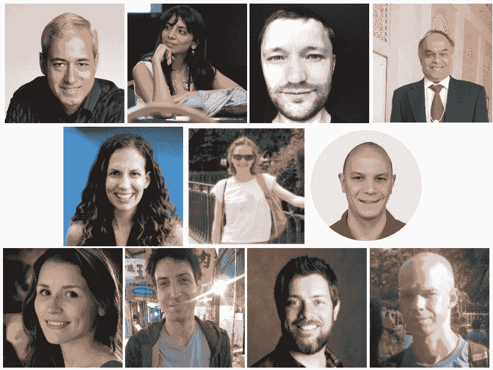

# 2018 年机器学习与人工智能的主要发展及 2019 年的关键趋势

> 原文：[`www.kdnuggets.com/2018/12/predictions-machine-learning-ai-2019.html`](https://www.kdnuggets.com/2018/12/predictions-machine-learning-ai-2019.html)

 comments

在 KDnuggets，我们努力保持对行业、学术界和技术主要事件和发展的关注。我们还尽力展望即将出现的关键趋势。

在往年，我们曾带来过专家的预测和分析的集合。今年我们提出了以下问题：

> **2018 年机器学习和人工智能的主要发展是什么，您对 2019 年的关键趋势有什么预期？**

以下是 Anima Anandkumar、Andriy Burkov、Pedro Domingos、Ajit Jaokar、Nikita Johnson、Zachary Chase Lipton、Matthew Mayo、Brandon Rohrer、Elena Sharova、Rachel Thomas 和 Daniel Tunkelang 的回应。

这些专家提到的关键主题包括深度学习的进展、迁移学习、机器学习的局限性、自然语言处理的变化趋势等。

请务必查看我们上周分享的意见，当时我们向一组专家询问了相关问题，"2018 年数据科学和分析的主要发展是什么，您对 2019 年的关键趋势有什么预期？"

**[Anima Anandkumar](https://www.linkedin.com/in/anima-anandkumar/) ([@AnimaAnandkumar](https://twitter.com/AnimaAnandkumar)) 是 NVIDIA 的机器学习研究主任和加州理工学院的布伦教授。**

*2018 年机器学习和人工智能的主要发展是什么？*

“深度学习的低垂果实已经基本被采摘完毕”

重点开始从标准的监督学习转向更具挑战性的机器学习问题，如半监督学习、领域适应、主动学习和生成模型。生成对抗网络（GANs）继续受到研究人员的热捧，他们尝试更困难的任务，如照片真实感（bigGANs）和视频到视频的合成。开发了替代生成模型（如神经渲染模型），以将生成和预测结合在一个网络中，以帮助半监督学习。研究人员将深度学习应用扩展到许多科学领域，如地震预测、材料科学、蛋白质工程、高能物理和控制系统。在这些情况下，领域知识和约束与学习相结合。例如，为了改善无人机的自主着陆，学习了地面效应模型来修正基础控制器，并且学习被保证是稳定的，这在控制系统中非常重要。

*预测：*

“人工智能将弥合模拟和现实之间的差距，使其更加安全和具备物理感知能力”

我们将看到新领域适应技术的发展，这些技术可以无缝地将知识从模拟环境转移到现实世界。模拟的使用将帮助我们克服数据稀缺问题，加速新领域和新问题的学习。从模拟到真实数据的适应（Sim2real）将在机器人技术、自动驾驶、医学影像、地震预测等领域产生重大影响。模拟是考虑所有可能情景的绝佳方式，尤其在安全关键应用如自动驾驶中。内置于复杂模拟器中的知识将以新的方式被利用，使 AI 更加具备物理意识，更加健壮，并能够推广到新的、未见过的情景。

**[安德烈·布尔科夫](https://www.linkedin.com/in/andriyburkov/?originalSubdomain=ca) ([@burkov](https://twitter.com/burkov)) 是 Gartner 的机器学习团队负责人。**

这是我作为从业者的个人看法，并非基于研究的 Gartner 官方声明。以下是我的想法：

*2018 年机器学习和人工智能的主要发展是什么？*

TensorFlow 在学术界输给了 PyTorch。谷歌的巨大影响力和覆盖面有时可能会使市场走向次优方向，就像 MapReduce 和随后的 hadoop 狂热一样。

深度伪造（及其类似技术，包括声音）摧毁了最可信的信息来源：视频镜头。没有人再能够像以前那样说：我看到了那个家伙说这些话的视频。几十年前我们就不再相信印刷文字，但视频直到现在才变得不可靠。

强化学习以深度学习的形式卷土重来，这非常出乎意料且令人兴奋！

谷歌的系统可以代表你拨打餐厅电话，并成功地伪装成人类，这是一个重要的里程碑。然而，这也引发了许多关于伦理和 AI 的问题。

个人助手和聊天机器人很快达到了它们的极限。虽然它们比以往更出色，但仍未达到大家去年所期望的水平。

*你期待 2019 年有哪些关键趋势？*

1) 我预计大家会比今年更为兴奋于 AutoML 的承诺。我也预期它会失败（除了某些非常具体和明确的用例，如图像识别、机器翻译和文本分类，在这些情况下，手工特征不是必需的，或者是标准的，原始数据接近机器所期望的输入，并且数据量充足）。

2) 营销自动化：随着成熟的生成对抗网络和变分自编码器的发展，我们现在可以生成成千上万张同一人的照片或风景照片，这些图片之间仅有小的面部表情或情绪差异。根据消费者对这些图片的反应，我们可以生成最佳的广告活动。

3) 在移动设备上实时生成的语音几乎无法与真人区分。

4) 自动驾驶出租车将继续停留在测试/概念验证阶段。

**[佩德罗·多明戈斯](https://www.linkedin.com/in/pedro-domingos-77b183/) ([@pmddomingos](https://twitter.com/pmddomingos)) 是华盛顿大学计算机科学与工程系的教授。**

经过多年的炒作，2018 年是对人工智能的过度担忧的一年。听媒体和一些研究人员的话，你会认为剑桥分析公司在 2016 年选举中帮助特朗普赢得了胜利，机器学习算法充斥着偏见和歧视，机器人正来抢夺我们的工作甚至我们的生活。这不仅仅是空谈：欧洲和加利福尼亚已通过了严厉的隐私法律，联合国正在讨论禁止智能武器等。公众对人工智能的看法越来越黑暗，这既危险又不公平。希望 2019 年能是理智回归的一年。

**[阿吉特·贾奥卡尔](https://www.linkedin.com/in/ajitjaokar/) ([@AjitJaokar](https://twitter.com/AjitJaokar)) 是首席数据科学家以及牛津大学物联网数据科学课程的创始人。**

2018 年，一些趋势开始兴起。自动化机器学习就是其中之一，强化学习则是另一个。这两种新兴趋势将在 2019 年显著扩展。作为我在牛津大学（[物联网数据科学课程](https://www.conted.ox.ac.uk/courses/data-science-for-the-internet-of-things-iot)）教学的一部分，我看到物联网越来越多地融入到大型生态系统中，如自动驾驶汽车、机器人和智慧城市。通过与[Dobot](https://www.dobot.cc/)的合作，我认为协作机器人（cobots）是 2019 年的一个关键趋势。与之前的流水线机器人不同，新型机器人将具备自主性，并且能够理解情感（在我的课程中，我们还与[情感研究实验室](https://emotionresearchlab.com/)在这一领域合作）。最后，一个有些争议的观点是：在 2019 年，我们所知的数据科学家的角色将趋向于从研究转向产品开发。我认为人工智能将与下一代数据产品的创造更加紧密地联系在一起。数据科学家的角色也将随之变化。

**[尼基塔·约翰逊](https://www.linkedin.com/in/nikitaljohnson/) ([@nikitaljohnson](https://twitter.com/nikitaljohnson)) 是 RE.WORK 的创始人。**

我们在 2018 年见证的一个发展是，开源工具数量的增加降低了入门门槛，使人工智能更加普及，确保了组织之间的更好合作。这些社区对确保人工智能在社会和商业所有领域的传播至关重要。

同样，在 2019 年，我们将看到更多公司专注于“善用 AI”，继承 Google 最近宣布的 AI for Social Good 项目，以及微软的 AI for Good 倡议。这种向积极影响的 AI 转变正在获得关注，因为社会要求公司具有更高的社会目的。

**[Zachary Chase Lipton](https://www.linkedin.com/in/zacharylipton/) ([@zacharylipton](https://twitter.com/zacharylipton)) 是卡内基梅隆大学的机器学习助理教授及[Approximately Correct Blog](http://approximatelycorrect.com/)的创始人。**

让我们从深度学习场景开始，它占据了公众对机器学习和人工智能讨论的主要份额。也许我会让一些人不悦，但这是对 2018 年的一个合理解读：最大的进展是没有进展！当然，这种看法过于简单，但请允许我详细说明。相当大一部分最大的进展更多地是“调整”而非质新想法。**BigGAN**是一个更大的 GAN。逐步增长的 GAN 产生了非常吸引眼球的结果，在某些方面是一个巨大的进步，但在方法上，它只是一个带有巧妙课程学习技巧的 GAN。在 NLP 领域，年度最大新闻是**ELMO**和**BERT**的上下文嵌入。这些在经验上绝对是了不起的进展。但自 2015-16 年 Andrew Dai 和 Quoc Le 在更小规模上进行这项工作以来，我们一直在预训练语言模型并微调以进行下游分类任务。所以，也许更悲观的看法是，这一年并没有被新“重大想法”主导。另一方面，积极的看法可能是现有技术的全部能力尚未发挥出来，硬件、系统和工具的快速发展可能会在挤出这些 3-4 年旧想法的所有价值方面发挥第二幕。

我认为，现在有很多新鲜的想法在深度学习的新兴理论中酝酿。包括**Sanjeev Arora**、**Tengyu Ma**、**Daniel Soudry**、**Nati Srebro**等在内的大量研究人员正在进行一些非常激动人心的工作。长久以来，我们有的是严谨的第一原理理论，但往往忽视了实践，然后是“实验性的”机器学习，这实际上关心的是科学而不是排行榜追逐。现在出现了一种新的探究模式，其中理论和实验更加紧密地结合。你开始看到受到实验启发的理论论文，以及进行实验的理论论文。最近，我有一个启发性的经历，从一篇理论论文中获得了一个点子，真正揭示了一种我没有预料到的自然现象。

对于 2019 年及以后，我认为应用机器学习将面临一场审视。我们正急于进入所有这些实际领域，声称要“解决”问题，但到目前为止，我们工具箱中唯一可靠的工具仍然是监督学习，而仅凭模式匹配我们能做的事有一定限制。监督模型找出关联，但它们并不能提供理由。它们不知道哪些信息是可靠的，哪些信息是不稳定的（即可能随时间变化）。这些模型不能告诉我们干预的效果。当我们在与人类互动的系统中部署基于监督学习的自动化系统时，我们没有预见到它们如何扭曲激励，从而改变其环境，破坏它们所依赖的模式。我认为在接下来的一年里，我们将看到更多的机器学习项目被废弃，或者因为这些限制而陷入麻烦，我们也会看到社区中更具创意的成员将更多关注从功能拟合排行榜转向解决表征学习和因果推理之间的差距的问题。

**[Matthew Mayo](https://www.linkedin.com/in/mattmayo13/) ([@mattmayo13](https://twitter.com/mattmayo13)) 是 KDnuggets 的编辑。**

对我来说，2018 年在机器学习领域似乎是一个精细化的年份。例如，迁移学习得到了更广泛的应用和关注，特别是在自然语言处理领域，这要归功于诸如[通用语言模型微调用于文本分类（ULMFiT）](http://nlp.fast.ai/classification/2018/05/15/introducting-ulmfit.html)和[双向编码器表示（BERT）](https://ai.googleblog.com/2018/11/open-sourcing-bert-state-of-art-pre.html)等技术。这些并不是去年自然语言处理领域唯一的进展；另一个值得注意的是[来自语言模型的嵌入（ELMo）](https://allennlp.org/elmo)，这是一个深度上下文化的词表示模型，在模型所用的每个任务上都取得了显著的改进。其他的突破似乎集中在现有技术的改进上，例如[BigGANs](https://arxiv.org/abs/1809.11096)。此外，由于许多倡导社区成员的声音，关于机器学习中的包容性和多样性的非技术性讨论也成为主流（可以参考[NeurIPS](https://neurips.cc/public/DiversityInclusion)作为一个例子）。

我相信在 2019 年，研究的关注将从监督学习转向如强化学习和半监督学习等领域，因为这些领域的潜在应用正变得越来越显著。现在我们已经处于图像识别和生成被“解决”（为了避免使用更具负担的术语）的阶段，例如，我们在此过程中学到的知识可以帮助研究人员追求更复杂的机器学习应用。

作为一名业余的自动化机器学习（AutoML）倡导者，我认为我们将继续看到 AutoML 的渐进式进展，以至于普通的监督学习任务将能够通过现有和开发中的方法自信地进行算法选择和超参数优化。我认为，自动化机器学习的广泛认知将从*替代*实践者转变为*增强*实践者（或者可能已经达到了这一临界点）。AutoML 将不再被视为替代机器学习工具箱的威胁，而是作为工具箱中的另一个工具。相反，我觉得实践者将定期在日常场景中使用这些工具已是板上钉钉的事情，并且被期望知道如何使用它们。

**[布兰登·罗赫尔](https://www.linkedin.com/in/brohrer/) ([@_brohrer_](https://twitter.com/_brohrer_)) 是 Facebook 的数据科学家。**

2018 年的一个重要趋势是数据科学教育机会的激增和成熟。在线课程是最早的数据科学教育场所。它们在所有级别上继续受到欢迎，每年有更多的学生、变体和话题。

在学术界，新的数据科学硕士项目正在以每年大约十几个的速度启动。我们的高等教育机构正在响应公司和学生的呼声，提供专门的数据相关领域项目。（今年，18 位行业合著者和我以及 11 位学术贡献者，共同创建了一个[虚拟行业顾问委员会](https://github.com/brohrer/academic_advisory)来帮助支持这一爆炸性增长。）

在非正式的领域，教程博客帖子随处可见。它们为数据科学的集体理解做出了很大贡献，无论是对读者还是作者。

从 2019 年开始，学术数据科学项目将成为获取进入首个数据科学职位所需的基本技能的更常见方式。这是一件好事。受认证机构监管的机构将填补一个长期存在的空白。到目前为止，数据科学的资格主要是通过以往的工作经验来证明的。这造成了一个悖论：新的数据科学家无法展示他们的资格，因为他们从未有过数据科学职位，而他们无法获得数据科学职位，因为他们不能展示自己的资格。来自教育机构的凭证是打破这一循环的一种方式。

然而，在线课程不会消失。对许多人来说，大学教育的时间和经济承诺使其无法实现。既然数据科学教育已经确立，它将始终拥有实际的轨道。通过坚持不懈地展示项目工作、相关经验和在线培训，新数据科学家将能够展示他们的技能，即使没有学位。在线课程和教程将继续变得更加普遍、复杂和重要于数据科学教育。实际上，一些知名的数据科学和机器学习项目甚至将他们的课程放到线上，并提供非在校学生的注册选项。我预计数据科学大学学位与在线培训课程之间的界限将继续模糊。在我看来，这才是“数据科学民主化”的最真实形式。

**[埃琳娜·沙罗娃](https://codefying.com/)是 ITV 的高级数据科学家**。

*2018 年在机器学习（ML）和人工智能（AI）领域的主要发展是什么？*

在我看来，2018 年将因以下三件事件而被 AI 和 ML 社区铭记。

首先，欧盟全球数据保护条例（[GDPR](https://ico.org.uk/for-organisations/guide-to-the-general-data-protection-regulation-gdpr/)）旨在提高个人数据使用的公平性和透明度。该条例揭示了个人对控制其个人数据的权利，并获取关于数据使用的信息，但也引起了对法律解释的一些困惑。迄今为止的结果是，大多数公司认为自己已经符合规定，仅仅对数据处理做了一些表面上的更改，而忽视了重新设计数据存储和处理基础设施的根本需要。

其次，[剑桥分析丑闻](https://www.theguardian.com/news/2018/mar/26/the-cambridge-analytica-files-the-story-so-far)在整个数据科学（DS）社区投下了阴影。如果说之前的争论主要集中在确保人工智能（AI）和机器学习（ML）产品的公平性上，那么这个丑闻引发了更深层次的伦理问题。对[Facebook 涉事](https://www.theguardian.com/technology/2018/oct/31/uk-and-canada-mps-unite-to-demand-mark-zuckerberg-answers-questions-cambridge-analytica)的最新调查意味着它不会很快平息。随着数据科学领域的成熟，这样的发展将发生在许多行业中，超越了政治。有些将更加悲剧，例如[Uber 在亚利桑那州的自动驾驶汽车事件](https://www.wired.com/story/uber-self-driving-crash-arizona-ntsb-report/)，这些事件将引发强烈的公众反应。技术是权力，权力伴随着责任。正如诺姆·乔姆斯基所说：“只有在民间故事、儿童故事和智识期刊中，权力才被明智地使用以摧毁邪恶。现实世界教给我们的教训却非常不同，只有故意和专注的无知才能未能察觉这些教训。”

最后，从积极的角度来看，亚马逊[推出自家服务器处理器芯片](https://www.bloomberg.com/news/articles/2018-11-27/amazon-unveils-its-own-server-chip-challenging-intel-on-price)意味着我们可能会接近一个云计算普及不再成为成本问题的日子。

*你对 2019 年有哪些主要趋势的预期？*

数据科学家的角色和责任正超越了建立能够准确预测的模型。2019 年，机器学习（ML）、人工智能（AI）和数据科学（DS）从业者的主要趋势将是对遵循既定软件开发实践的责任日益增加，特别是在测试和维护方面。数据科学的最终产品必须与公司技术堆栈的其他部分共存。对专有软件高效运行和维护的要求将适用于我们构建的模型和解决方案。这意味着最佳的软件开发实践将支撑我们需要遵循的[机器学习规则](https://developers.google.com/machine-learning/guides/rules-of-ml/)。

**[Rachel Thomas](https://www.linkedin.com/in/rachel-thomas-942a7923/) ([@math_rachel](https://twitter.com/math_rachel)) 是 fast.ai 的创始人，也是 USF 的助理教授。**

2018 年的两个主要人工智能发展是：

1\. 转移学习在自然语言处理中的成功应用

2\. 对人工智能的反乌托邦滥用（包括仇恨团体和独裁者的监控与操控）的关注不断增加

转移学习是将预训练模型应用于新数据集的实践。转移学习是计算机视觉进展爆炸性增长的关键因素，2018 年，转移学习在自然语言处理领域成功应用，包括来自[fast.ai](http://fast.ai)和 Sebastian Ruder 的[ULMFiT](http://nlp.fast.ai/)、[艾伦研究所的 ELMo](https://allennlp.org/elmo)、[OpenAI 变换器](https://blog.openai.com/language-unsupervised/)和[谷歌的 Bert](https://github.com/google-research/bert)。这些进展既令人兴奋又令人担忧，详见这篇[纽约时报文章](https://www.nytimes.com/2018/11/18/technology/artificial-intelligence-language.html)。

像 Facebook 的[决定性角色](http://time.com/5197039/un-facebook-myanmar-rohingya-violence/)在[缅甸种族灭绝](https://www.wired.com/story/how-facebooks-rise-fueled-chaos-and-confusion-in-myanmar/)中的作用，YouTube 不成比例地[推荐阴谋理论](https://www.nytimes.com/2018/03/10/opinion/sunday/youtube-politics-radical.html)（其中许多推广了白人至上主义），以及政府[监控](https://www.engadget.com/2018/02/22/china-xinjiang-surveillance-tech-spread/)和[执法机构](https://www.wired.com/story/amazon-facial-recognition-congress-bias-law-enforcement/)使用人工智能的情况，终于在 2018 年开始获得更多主流媒体的关注。虽然这些人工智能的误用情况严重且令人恐惧，但更多的人开始意识到这些问题，并越来越多地反对它们，这是一件好事。

我预计这些趋势会在 2019 年继续，随着自然语言处理的快速进展（正如 Sebastian Ruder[今年夏天所写](https://thegradient.pub/nlp-imagenet/)，“自然语言处理的 ImageNet 时刻已经到来”），以及在技术如何用于监控、煽动暴力和被危险政治运动操控方面的更多反乌托邦发展。

**[Daniel Tunkelang](https://www.linkedin.com/in/dtunkelang/) ([@dtunkelang](https://twitter.com/dtunkelang))是一位独立顾问，专注于搜索、发现和机器学习/人工智能。**

2018 年在自然语言处理和理解中，词嵌入的复杂性取得了两个重大进展。

第一个是在三月。来自艾伦人工智能研究所和华盛顿大学的研究人员发布了“深度语境化词表示”，并引入了 ELMo（Embeddings from Language Models），这是一种开源的深度语境化词表示，相较于 word2vec 或 GloVe 等上下文无关的词嵌入有所改进。作者通过简单地用 ELMo 预训练模型中的向量替代，展示了对现有自然语言处理系统的改进。

第二个突破发生在 11 月。谷歌开源了 BERT（双向编码器表示从变换器），这是一个双向、无监督的语言表示，预先在维基百科上进行训练。正如作者在《BERT: Pre-training of Deep Bidirectional Transformers for Language Understanding》中所展示的那样，他们在各种自然语言处理基准测试中取得了显著改进，甚至相对于 ELMo 也有显著提高。

在智能扬声器快速普及（到 2018 年底约为 1 亿台）和移动手机上数字助手的普及之间，自然语言理解的进展正迅速从实验室转向实际应用。这是自然语言处理研究和实践的激动人心的时代。

但我们仍然有很长的路要走。

今年，艾伦研究所的研究人员发布了“Swag: A Large-Scale Adversarial Dataset for Grounded Commonsense Inference”，这是一个用于句子完成任务的数据集，需要常识理解。他们的实验表明，最先进的自然语言处理技术仍远远落后于人类表现。

但希望我们能在 2019 年看到更多的自然语言处理突破。计算机科学领域的许多顶尖人才正在努力研发，行业也渴望应用他们的成果。

**相关内容**：

+   2018 年 AI、数据科学、分析的主要发展与 2019 年的关键趋势

+   机器学习与人工智能：2017 年的主要发展与 2018 年的关键趋势

+   数据科学、机器学习：2017 年的主要发展与 2018 年的关键趋势

* * *

## 我们的前三大课程推荐

 1\. [谷歌网络安全证书](https://www.kdnuggets.com/google-cybersecurity) - 快速进入网络安全职业轨道。

 2\. [谷歌数据分析专业证书](https://www.kdnuggets.com/google-data-analytics) - 提升你的数据分析技能

 3\. [谷歌 IT 支持专业证书](https://www.kdnuggets.com/google-itsupport) - 支持你的组织的 IT 需求

* * *

### 更多相关话题

+   [AI、分析、机器学习、数据科学、深度学习等的主要发展]（https://www.kdnuggets.com/2021/12/developments-predictions-ai-machine-learning-data-science-research.html）

+   [2021 年主要发展与 2022 年关键趋势：AI、数据科学等](https://www.kdnuggets.com/2021/12/trends-ai-data-science-ml-technology.html)

+   [数据科学与分析行业 2021 年的主要发展与关键预测](https://www.kdnuggets.com/2021/12/developments-predictions-data-science-analytics-industry.html)

+   [成为优秀数据科学家所需的 5 项关键技能](https://www.kdnuggets.com/2021/12/5-key-skills-needed-become-great-data-scientist.html)

+   [每个初学者数据科学家应掌握的 6 种预测模型](https://www.kdnuggets.com/2021/12/6-predictive-models-every-beginner-data-scientist-master.html)

+   [2021 年最佳 ETL 工具](https://www.kdnuggets.com/2021/12/mozart-best-etl-tools-2021.html)
