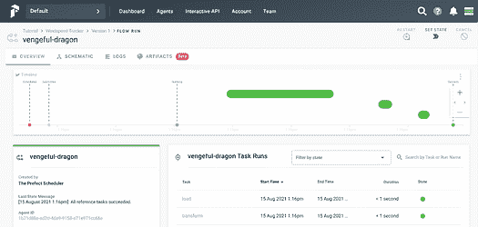
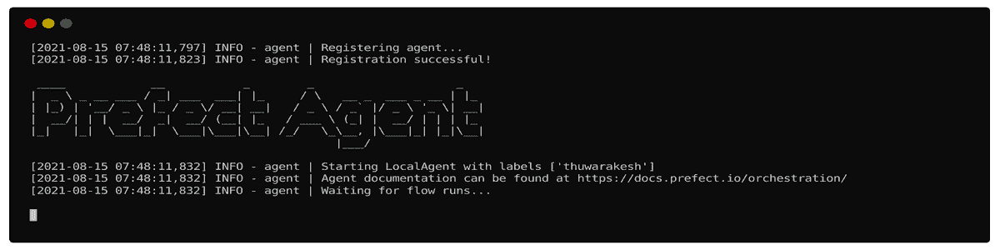
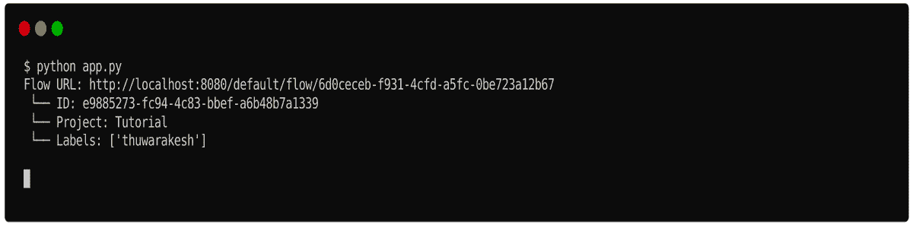
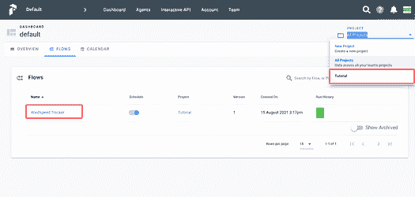
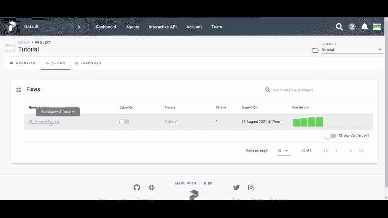

# Prefect 自动化与协调数据管道的方法

> 原文：[`www.kdnuggets.com/2021/09/prefect-way-automate-orchestrate-data-pipelines.html`](https://www.kdnuggets.com/2021/09/prefect-way-automate-orchestrate-data-pipelines.html)

评论

**由 [Murallie Thuwarakesh](https://www.linkedin.com/in/thuwarakesh/)，Stax, Inc. 的数据科学家提供。**


插图来自 [Undraw](https://undraw.co/illustrations)。

我曾经是 Apache Airflow 的大粉丝。即使今天，我对它也没有太多抱怨。但新技术 Prefect 让我惊叹不已，我忍不住将所有内容迁移到它上面。

Prefect（以及 Airflow）是一个工作流自动化工具。你可以协调各个任务以完成更复杂的工作。你可以管理任务依赖关系、在任务失败时重试任务、调度任务等。

我相信工作流管理是每个数据科学项目的支柱。即使是小项目，也可以通过像 Prefect 这样的工具获得显著的好处。它消除了大量重复任务的部分。不用说，它还消除了复杂项目中的心理负担。

本文涵盖了关于 Prefect 的一些常见问题，包括：

+   Prefect 核心概念的简短介绍；

+   为什么我决定从 Airflow 迁移。

+   Prefect 的令人惊叹的功能和与其他技术的集成，以及；

+   如何在其云部署与本地部署选项之间做出决定。

## 快速启动 Prefect。

Prefect 是一个既简约又完整的工作流管理工具。它的设置极其简单。然而，它能够完成 Airflow 等工具能够做的所有任务，甚至更多。

你可以使用 PyPI、Conda 或 Pipenv 安装它，它就绪待用。更多关于此的内容在 Airflow 部分中有比较。

```py
pip install prefect
# conda install -c conda-forge prefect
# pipenv install --pre prefect
```

在我们深入使用 Prefect 之前，先来看一个未管理的工作流。这有助于理解 Prefect 在工作流管理中的角色。

以下脚本查询一个 API（提取 — E），从中选择相关字段（转换 — T），并将其追加到文件中（加载 — L）。它包含执行每个任务的三个函数。这是一个直接但日常使用的工作流管理工具用例 —— ETL。

代码由 [作者](https://thuwarakesh.medium.com/) 提供。

该脚本从 OpenWeatherMap API 下载天气数据，并将风速值存储在一个文件中。现实生活中的 ETL 应用可能很复杂。但这个示例应用很好地涵盖了基本方面。

注意：请将 API 密钥替换为真实的密钥。你可以从 [`openweathermap.org/api`](https://openweathermap.org/api) 获取一个。

你可以使用命令 `python app.py` 运行此脚本，其中 app.py 是你脚本文件的名称。这将创建一个名为 windspeed.txt 的新文件，包含一个值。这是你访问 API 时波士顿的风速。如果你重新运行脚本，它将向同一文件追加另一个值。

## 你的第一个 Prefect ETL 工作流。

上面的脚本运行良好。然而，它缺少完整 ETL 的一些关键特性，比如重试和调度。此外，如前所述，实际的 ETL 可能在一个工作流中有数百个任务。其中一些可以并行运行，而有些则依赖于一个或多个其他任务。

想象一下，如果有一个临时网络问题阻止你调用 API，脚本会立即失败而不会再做进一步尝试。在实时应用程序中，这种停机时间并不奇怪。它们发生的原因有很多——服务器停机、网络停机、服务器查询限制超出。

此外，你必须每次手动执行上述脚本以更新你的 windspeed.txt 文件。然而，将工作流调度在预定时间内运行在 ETL 工作流中是很常见的。

这时像 Prefect 和 Airflow 这样的工具就派上用场了。下面是你如何调整上面的代码使其成为 Prefect 工作流的方法。

代码来自 [作者](https://thuwarakesh.medium.com/)。

`@task` 装饰器将一个普通的 Python 函数转换为 Prefect 任务。可选参数允许你指定其重试行为。在上面的例子中，我们配置了该函数在失败之前尝试三次。我们还配置了每次重试之间延迟三分钟。

使用这种新设置，我们的 ETL 对我们之前讨论的网络问题具有弹性。

要测试其功能，请将计算机从网络断开连接，并用`python app.py`运行脚本。你会看到一条消息，说明第一次尝试失败，下一次将会在接下来的 3 分钟内开始。在三分钟内，将计算机重新连接到互联网。已经运行的脚本现在将无错误地完成。

## 使用 Prefect 调度工作流。

重试只是 ETL 故事的一部分。许多工作流应用程序的另一个挑战是按计划间隔运行它们。Prefect 的调度 API 对任何 Python 程序员来说都是直接了当的。它是如何工作的，下面是说明。

代码来自 [作者](https://thuwarakesh.medium.com/)。

我们创建了一个 IntervalSchedule 对象，它在脚本执行后五秒启动。我们还将其配置为以一分钟为间隔运行。

如果你用`python app.py`运行脚本并监控 windspeed.txt 文件，你会看到每分钟都会有新值出现。

除了这种简单的调度外，Prefect 的调度 API 提供了更多的控制。你可以用类似 cron 的方法调度工作流，使用带有时区的时钟时间，或者做一些更有趣的事情，比如仅在周末执行工作流。我在这里没有涵盖所有内容，但 Prefect 的官方 [文档](https://docs.prefect.io/core/concepts/schedules.html#clocks) 非常完美。

## Prefect UI。

像 Airflow（和许多其他工具）一样，Prefect 也附带一个具有美观 UI 的服务器。它允许你控制和可视化你的工作流执行。



插图来自 [作者](https://thuwarakesh.medium.com/)。

要运行这个，你需要在计算机上安装 docker 和 docker-compose。不过，启动它只需一个命令，令人惊讶。

```py
**$** prefect server start
```


插图由 [作者](https://thuwarakesh.medium.com/) 提供。

这个命令将启动 prefect 服务器，你可以通过你的网页浏览器访问它：`[`localhost:8080/`](http://localhost:8080/)`。

然而，Prefect 服务器本身无法执行你的工作流。它的作用只是为所有 Prefect 活动提供一个控制面板。由于这个仪表板与应用程序的其余部分解耦，你可以使用 Prefect cloud 完成相同的任务。我们将在稍后详细讨论这个问题。

执行任务时，我们还需要一些其他东西。好消息是，它们也不复杂。

因为服务器仅作为控制面板，我们需要一个代理来执行工作流。以下命令将启动一个本地代理。如果你的项目需要，你也可以选择 docker 代理或 Kubernetes 代理。

```py
**$** prefect agent local start
```



插图由 [作者](https://thuwarakesh.medium.com/) 提供。

一旦服务器和代理运行，你将需要创建一个项目并将工作流注册到该项目中。为此，请将执行工作流的行更改为以下内容。

代码由 [作者](https://thuwarakesh.medium.com/) 提供。

现在在终端中，你可以使用 `prefect create project <project name>` 命令创建一个项目。然后重新运行脚本将其注册到项目中，而不是立即运行。

```py
**$** prefect create project 'Tutorial'
**$** python app.py
```



插图由 [作者](https://thuwarakesh.medium.com/) 提供。

在网页界面中，你可以看到新项目‘Tutorial’出现在下拉菜单中，我们的风速跟踪器在工作流列表中。该工作流已经计划并正在运行。如果你愿意，也可以手动运行它们。



插图由 [作者](https://thuwarakesh.medium.com/) 提供。

## 带参数的工作流运行。

我们在前一个练习中创建的工作流是固定的。它只查询波士顿，马萨诸塞州，我们无法更改它。这时我们可以使用参数。下面是如何调整我们的代码以在运行时接受参数。

代码由 [作者](https://thuwarakesh.medium.com/) 提供。

我们已经将函数更改为接受城市参数，并在 API 查询中动态设置它。在 Flow 内部，我们创建一个默认值为‘Boston’的参数对象，并将其传递给 Extract 任务。

如果你在 UI 中手动运行风速跟踪器工作流，你会看到一个名为 input 的部分。在这里，你可以为每次执行设置城市的值。



插图由 [作者](https://thuwarakesh.medium.com/) 提供。

这是运行工作流的一种方便方法。在许多情况下，ETL 和其他工作流都附带运行时参数。

## 我为什么决定从 Airflow 迁移到 Prefect？

Airflow 是一个出色的工作流管理平台。在许多项目中，它为我节省了大量时间。然而，我们需要欣赏那些取代旧技术的新技术。这就是 Airflow 和 Prefect 的情况。

> Airflow 很多地方做得很好，但其核心假设从未预见到数据应用的丰富多样性。
> 
> — Prefect 文档。

我在这里描述的内容并不是说如果你偏好 Airflow 就没有解决方案。我们有大多数问题的解决办法。然而，在 Prefect 中，这些问题的解决方案是工具原生支持的。

相比于 Airflow，Prefect 的 **安装** 非常简单。对于训练有素的眼睛，这可能不是问题。然而，对于任何想要开始工作流编排和自动化的人来说，这是一种麻烦。

Airflow 需要在后台运行一个 **服务器** 来执行任何任务。然而，在 Prefect 中，服务器是可选的。这是使用 Prefect 的一个巨大优势。我有许多在计算机上作为服务运行的小项目。以前，我必须在启动时启动 Airflow 服务器。因为 Prefect 可以独立运行，所以我不再需要启动这个额外的服务器。

Airflow 不具备使用 **参数** 运行工作流（或 DAG）的灵活性。我使用的解决方法是让应用程序从数据库中读取这些参数。这对于如此简单的任务来说不是一个很好的编程技术。在这方面，Prefect 的参数概念非常出色。

Prefect 允许拥有相同工作流的不同 **版本**。每次你将工作流注册到项目中时，它会创建一个新版本。如果你需要运行以前的版本，你可以轻松地在下拉菜单中选择它。这在 Airflow 中是不可能的。

Prefect 还允许我们创建团队和基于角色的访问控制。每个团队可以管理自己的配置。**授权** 是每个现代应用程序的重要部分，Prefect 以最佳方式处理它。

最后，我发现 Prefect 的 **UI** 更加直观和吸引人。Airflow 的 UI，尤其是其任务执行可视化，刚开始时很难理解。

## Prefect 的生态系统及其与其他技术的集成。

Prefect 内置了与许多其他技术的集成。它消除了大量的开销，使得与这些技术的工作变得非常简单。

现实项目经常需要处理多种技术。例如，当你的 ETL 失败时，你可能想要向维护者发送电子邮件或 Slack 通知。

在 Prefect 中，发送这样的通知是非常简单的。你可以使用 Prefect 的任务库中的 EmailTask，设置凭据，然后开始发送电子邮件。

你可以在他们的 [官方文档](https://docs.prefect.io/core/task_library/overview.html#task-library-in-action) 中了解更多关于 Prefect 丰富生态系统的内容。在本文中，我们将看到如何发送电子邮件通知。

要发送电子邮件，我们需要使凭证对 Prefect 代理可访问。你可以通过在`$HOME/.prefect/config.toml`中创建以下文件来实现。

代码来自[作者](https://thuwarakesh.medium.com/)。

你的应用程序现在已准备好发送电子邮件。以下是我们成功捕获风速测量时如何发送通知。

代码来自[作者](https://thuwarakesh.medium.com/)。

在上述代码中，我们创建了 EmailTask 类的一个实例。在初始化期间，我们使用了电子邮件配置的所有静态元素。然后在 Flow 中，我们使用了带有变量内容的实例。

上述配置将发送包含捕获的风速测量的电子邮件。但其主题将始终保持为‘捕获的新风速’。

## Prefect Cloud 与本地服务器部署。

我们已经了解了如何启动本地服务器。因为这个服务器只是一个控制面板，你可以轻松地使用云版本代替。要做到这一点，我们需要遵循一些额外的步骤。

1.  创建一个[Prefect cloud](https://cloud.prefect.io/)账户。

1.  从[API 密钥页面](https://cloud.prefect.io/user/keys)生成一个密钥。

1.  在你的终端中，将后端设置为云：`prefect backend cloud`。

1.  还需要使用生成的密钥登录：`prefect auth login --key YOUR_API_KEY`。

1.  现在，像往常一样启动代理：`prefect agent local start`。

在云仪表板中，你可以管理之前在本地服务器上完成的所有操作。

在选择云版本和服务器版本时，一个重要问题是**安全性**。根据 Prefect 的文档，服务器仅存储与工作流执行相关的数据和用户提供的自愿信息。由于代理在你的本地计算机上执行逻辑，你可以控制数据存储的位置。

云选项在**性能**方面也很合适。使用一个云服务器，你可以管理多个代理。因此，你可以轻松地扩展你的应用程序。

## 最后的想法

Airflow 曾是我构建 ETL 和其他工作流管理应用程序的最终选择。然而，Prefect 让我改变了主意，现在我正在将所有内容从 Airflow 迁移到 Prefect。

Prefect 是一个简单的工具，具有超越 Airflow 的灵活扩展性。你甚至可以在 Jupyter notebook 中运行它。同时，你可以将其作为完整的任务管理解决方案进行托管。

除了工作流管理的核心问题外，Prefect 还解决了你可能在实时系统中经常遇到的其他问题。管理带有授权控制的团队、发送通知等就是其中的一些。

在这篇文章中，我们讨论了如何创建一个 ETL，它

+   根据配置重试一些任务；

+   按计划运行工作流；

+   接受运行时参数，并且；

+   当操作完成时，发送电子邮件通知。

我们只是触及了 Prefect 能力的表面。我建议阅读官方[文档](https://docs.prefect.io/core/)以获取更多信息。

> 谢谢阅读，朋友！看起来我们有很多共同的兴趣。我很想在 [LinkedIn](https://www.linkedin.com/in/thuwarakesh/)、[Twitter](https://twitter.com/Thuwarakesh) 和 [Medium](https://thuwarakesh.medium.com/) 上与你联系。

还不是 Medium 会员？请使用此链接 [**成为会员**](https://thuwarakesh.medium.com/membership)。你可以享受数千篇有见地的文章，并支持我，因为我通过推荐你获得少量佣金。

**个人简介：[Murallie Thuwarakesh](https://www.linkedin.com/in/thuwarakesh/)** (**[@Thuwarakesh](https://twitter.com/Thuwarakesh)**) 是 Stax, Inc. 的数据科学家，并且是 Medium 上的顶级分析写作者。Murallie 分享了他在数据科学中的每日探索。

[原文](https://towardsdatascience.com/the-prefect-way-to-automate-orchestrate-data-pipelines-d4465638bac2)。经授权转载。

**相关内容：**

+   Prefect：如何使用 Python 编写和安排你的第一个 ETL 管道

+   使用 Gretel 和 Apache Airflow 构建合成数据管道

+   本地开发和测试 AWS 的 ETL 管道

* * *

## 我们的三大课程推荐

 1\. [Google 网络安全证书](https://www.kdnuggets.com/google-cybersecurity) - 快速进入网络安全职业道路

 2\. [Google 数据分析专业证书](https://www.kdnuggets.com/google-data-analytics) - 提升你的数据分析技能

 3\. [Google IT 支持专业证书](https://www.kdnuggets.com/google-itsupport) - 支持你的组织 IT

* * *

### 更多相关内容

+   [使用 Prefect 在 Python 中编排数据科学项目](https://www.kdnuggets.com/2022/02/orchestrate-data-science-project-python-prefect.html)

+   [使用 Prefect 构建数据管道](https://www.kdnuggets.com/building-data-pipeline-with-prefect)

+   [使用 Python 自动化数据清洗的 5 个简单步骤](https://www.kdnuggets.com/5-simple-steps-to-automate-data-cleaning-with-python)

+   [用 Python 自动化的 5 个任务](https://www.kdnuggets.com/2021/06/5-tasks-automate-python.html)

+   [使用 Python 自动化 Microsoft Excel 和 Word](https://www.kdnuggets.com/2021/08/automate-microsoft-excel-word-python.html)

+   [用 GPT-4 和 Python 自动化无聊的事情](https://www.kdnuggets.com/2023/03/automate-boring-stuff-chatgpt-python.html)
