# Prefect: 如何用 Python 编写和调度您的第一个 ETL 管道

> 原文：[`www.kdnuggets.com/2021/08/prefect-write-schedule-etl-pipeline-python.html`](https://www.kdnuggets.com/2021/08/prefect-write-schedule-etl-pipeline-python.html)

评论

**由 [Dario Radečić](https://www.linkedin.com/in/darioradecic/)，NEOS 的顾问**


照片由 [**Helena Lopes**](https://www.pexels.com/@wildlittlethingsphoto?utm_content=attributionCopyText&utm_medium=referral&utm_source=pexels) 提供，来自 [**Pexels**](https://www.pexels.com/photo/young-man-writing-reminder-on-fridge-and-drinking-coffee-at-home-3867001/?utm_content=attributionCopyText&utm_medium=referral&utm_source=pexels)

* * *

## 我们的三大课程推荐

 1\. [Google Cybersecurity Certificate](https://www.kdnuggets.com/google-cybersecurity) - 快速进入网络安全职业轨道

 2\. [Google Data Analytics Professional Certificate](https://www.kdnuggets.com/google-data-analytics) - 提升您的数据分析技能

 3\. [Google IT Support Professional Certificate](https://www.kdnuggets.com/google-itsupport) - 支持您在 IT 领域的组织

* * *

Prefect 是一个基于 Python 的工作流管理系统，基于一个简单的前提*— 您的代码可能正常工作，但有时它并不*([source](https://docs.prefect.io/core/))。当一切按预期工作时，没有人会考虑工作流系统。但当事情出问题时，Prefect 将确保您的代码成功失败。

作为一个工作流管理系统，Prefect 使得在数据管道中添加日志记录、重试、动态映射、缓存、失败通知等变得非常容易。当您不需要它时，它是隐形的——当一切按预期运行时；而当您需要它时，它是可见的。就像保险一样。

虽然 Prefect 不是唯一的 Python 用户工作流管理系统，但它无疑是最高效的一个。像 Apache Airflow 这样的替代品通常表现良好，但在处理大型项目时会带来很多麻烦。您可以在[这里](https://docs.prefect.io/core/getting_started/why-not-airflow.html#overview)阅读 Prefect 与 Airflow 的详细比较。

本文涵盖了库的基础知识，例如任务、流程、参数、失败和计划，并解释了如何在本地和云端设置环境。我们将使用 [Saturn Cloud](https://www.saturncloud.io/s/?utm_source=dario-radecic) 来完成这部分，因为它使配置变得毫不费力。这是由数据科学家制作的云平台，因此大部分繁重的工作都为您完成了。

Saturn Cloud 可以轻松处理 Prefect 工作流。它也是从仪表板到分布式机器学习、深度学习和 GPU 训练的前沿解决方案。

今天您将学习如何：

+   本地安装 Prefect

+   使用 Python 编写一个简单的 ETL 管道

+   使用 Prefect 声明任务、流程、参数、调度并处理失败

+   在 Saturn Cloud 中运行 Prefect

## 如何在本地安装 Prefect

我们将在虚拟环境中安装 Prefect 库。以下命令将通过 Anaconda 创建并激活一个名为`prefect_env`的环境，基于 Python 3.8：

```py
conda create — name prefect_env python=3.8
conda activate prefect_env
```

你需要输入`y`几次来指示 Anaconda 继续，但这在每次安装时都是这样的。在库方面，我们需要*Pandas*用于数据处理，*Requests*用于下载数据，当然，还需要*Prefect*用于工作流管理：

```py
conda install requests pandas
conda install -c conda-forge prefect
```

我们现在拥有了开始编写 Python 代码所需的一切。接下来我们开始动手吧。

## 用 Python 编写 ETL 管道

今天我们将使用 Prefect 完成一个相对简单的任务——运行一个 ETL 管道。这个管道将从一个虚拟 API 下载数据，转换数据，并将其保存为 CSV 文件。[JSON Placeholder](https://jsonplaceholder.typicode.com/) 网站将作为我们的虚拟 API。除此之外，它还包含十个用户的虚假数据：

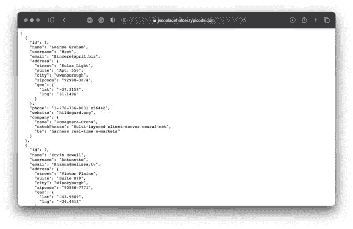

*图 1 — 虚假用户数据（来源：*[*https://jsonplaceholder.typicode.com/users)*](https://jsonplaceholder.typicode.com/users))*（图片由作者提供）*

首先创建一个 Python 文件——我将其命名为`01_etl_pipeline.py`。另外，请确保有一个文件夹来保存提取和转换的数据。我称之为`data`，它位于 Python 脚本所在的位置。

任何 ETL 管道都需要实现三个功能——用于提取、转换和加载数据。在我们的案例中，这些功能将完成以下任务：

+   `extract(url: str) -> dict` — 对`url`参数发出一个 GET 请求。测试是否返回了一些数据——如果是的话，它将作为字典返回。否则，会抛出一个异常。

+   `transform(data: dict) -> pd.DataFrame` — 转换数据，仅保留特定的属性：ID、姓名、用户名、电子邮件、地址、电话号码和公司。将转换后的数据作为 Pandas DataFrame 返回。

+   `load(data: pd.DataFrame, path: str) -> None` — 将之前转换过的`data`保存到`path`处的 CSV 文件中。我们还会在文件名中添加时间戳，以免文件被覆盖。

在函数声明之后，所有三个函数在执行 Python 脚本时都会被调用。这是完整的代码片段：

现在你可以通过在终端中执行以下命令来运行脚本：

```py
python 01_etl_pipeline.py
```

如果一切正常，你不应该看到任何输出。然而，你应该在`data`文件夹中看到 CSV 文件（我运行了文件两次）：

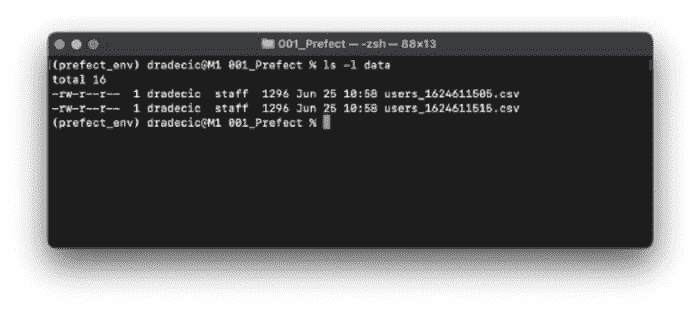

*图 2 — 运行 ETL 管道两次后 data 文件夹中的 CSV 文件列表（图片由作者提供）*

正如你所看到的，ETL 管道运行并完成没有任何错误。但如果你想按照计划运行管道呢？这时*Prefect*派上用场了。

## 探索 Prefect 的基础知识

在本节中，你将学习 *Prefect* 任务、流程、参数、调度等的基础知识。

## Prefect 任务

让我们从最简单的开始 — 任务。它基本上是你工作流中的一个单独步骤。为了跟上进度，创建一个名为 `02_task_conversion.py` 的新 Python 文件。从 `01_etl_pipeline.py` 复制所有内容，然后你就可以开始了。

要将 Python 函数转换为 Prefect 任务，你首先需要进行必要的导入 — `from prefect import task`，然后装饰任何感兴趣的函数。以下是一个示例：

```py
@task
def my_function():
    pass
```

这就是你需要做的全部！这是我们 ETL 流程的更新版本：

让我们运行它，看看会发生什么：

```py
python 02_task_conversion.py
```

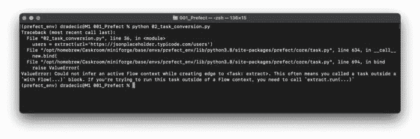

*图 3 — 使用 Prefect 将函数转换为任务（图片由作者提供）*

看起来似乎出了问题。这是因为 *Prefect Task* 不能在没有 *Prefect Flow* 的情况下运行。接下来我们来实现它。

## Prefect 流程

将 `02_task_conversion.py` 中的所有内容复制到一个新文件 — `03_flow.py`。在声明之前，你需要从 `prefect` 库中导入 `Flow`。

要声明一个流程，我们将编写另一个 Python 函数 — `prefect_flow()`。它不会接受任何参数，也不会被装饰。函数内部，我们将使用 Python 的上下文管理器来创建一个流程。该流程应包含与之前在 `if __name__ == '__main__'` 代码块中相同的三行代码。

在提到的代码块中，我们现在需要用相应的 `run()` 函数来运行流程。

这是该文件的完整代码：

让我们运行它，看看会发生什么：

```py
python 03_flow.py
```

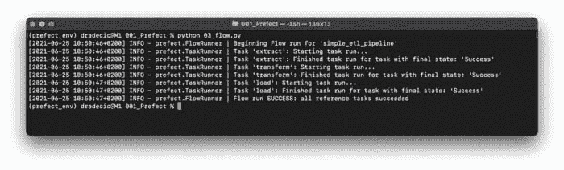

*图 4 — 第一次运行 Prefect 流程（图片由作者提供）*

这真是太棒了！不仅 ETL 流程被执行了，我们还获得了关于每个任务开始和结束时间的详细信息。我已经运行了文件两次，因此应该会有两个新的 CSV 文件保存到 `data` 文件夹中。让我们验证一下是否如此：

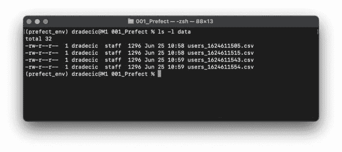

*图 5 — Prefect 流程生成的 CSV 文件（图片由作者提供）*

这就是如何使用 Prefect 运行一个简单的 ETL 流程。它目前还没有比纯 Python 实现带来很多好处，但我们很快会改变这一点。

## Prefect 参数

硬编码参数值从来不是一个好主意。这就是 *Prefect Parameters* 发挥作用的地方。首先，将 `03_flow.py` 中的所有内容复制到一个新文件 — `04_parameters.py`。你需要从 `prefect` 包中导入 `Parameter` 类。

你可以在流程上下文管理器中使用这个类。以下是你可能会觉得有用的参数：

+   `name` — 参数的名称，将在运行流程时使用。

+   `required` — 一个布尔值，指定该参数是否是执行流程所必需的。

+   `default` — 指定参数的默认值。

我们将声明一个用于 API URL 的参数 — `param_url = Parameter(name='p_url', required=True)`。

要给参数赋值，你需要将 `parameters` 字典指定为 `run()` 函数的一个参数。参数名称和值应以键值对的形式编写。

这是该文件的完整代码：

让我们运行文件，看看会发生什么：

```py
python 04_parameters.py
```

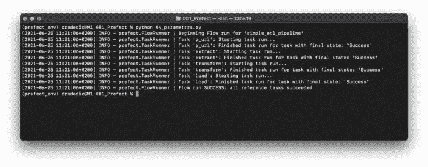

*图 6 — 运行包含参数的 Prefect 流（图像作者提供）*

我已经运行了两次文件，因此`data`文件夹中应出现两个新的 CSV 文件。让我们确认一下：

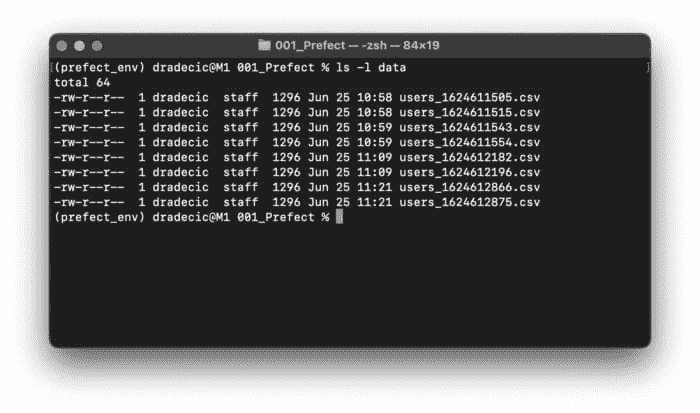

*图 7 — Prefect 流生成的 CSV 文件（图像作者提供）*

就这样——在一个地方指定参数值。这使得将来进行更改变得容易，也方便管理更复杂的工作流。

接下来，我们将探讨 Prefect 的一个特别有用的功能——调度。

## Prefect 调度

今天我们将探讨两种调度任务的方法——*间隔调度*和*Cron 调度*。第二种可能听起来很熟悉，因为 Cron 是在 Unix 上调度任务的著名方法。

我们将从 **间隔调度器** 开始。首先，将`04_intervals.py`中的所有内容复制到`05_interval_scheduler.py`。你需要从`prefect.schedules`中导入`IntervalScheduler`。

然后，我们将在 `prefect_flow()` 函数声明之前创建导入类的实例，并指示其每十秒运行一次。这可以通过设置 `interval` 参数的值来实现。

要将调度器连接到工作流，你需要在使用上下文管理器初始化`Flow`类时为`schedule`参数指定值。

整个脚本文件应如下所示：

让我们运行文件，看看会发生什么：

```py
python 05_interval_scheduler.py
```

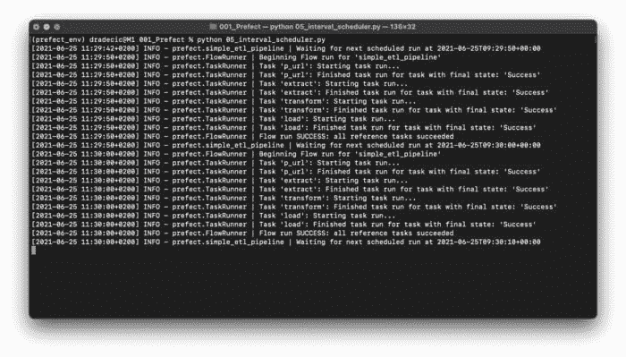

*图 8 — 使用间隔调度（图像作者提供）*

如你所见，整个 ETL 管道运行了两次。Prefect 将向终端报告下一次执行的时间。

现在，让我们探讨 **Cron 调度器**。将`05_interval_scheduler.py`中的所有内容复制到`06_cron_scheduler.py`。这一次，你将导入`CronSchedule`而不是`IntervalSchedule`。

在类初始化时，你需要为`cron`参数指定一个 cron 模式。五个星号符号将确保工作流每分钟运行一次。这是 Cron 的最低可能间隔。

其余部分保持不变。以下是代码：

让我们运行文件：

```py
python 06_cron_scheduler.py
```

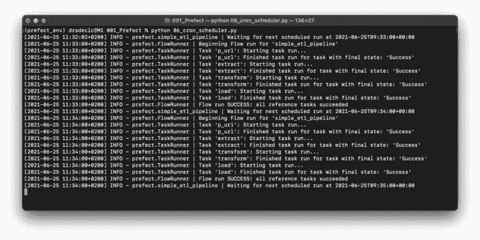

*图 9 — 使用 Cron 调度（图像作者提供）*

如你所见，ETL 管道每分钟运行两次，正如 Cron 模式所指定的。接下来的部分，我们将探讨如何处理失败——并解释为什么你应该总是做好准备。

## 完美失败

迟早，你的工作流中会发生意外错误。Prefect 提供了一种极其简单的方法来重试任务的执行。首先，将`04_parameters.py`中的所有内容复制到一个新文件中 — `07_failures.py`。

`extract()`函数可能因为各种网络原因而失败。例如，API 可能暂时不可用，但几秒钟后会恢复。这些情况在生产环境中时有发生，不应该完全崩溃你的应用程序。

为了避免不必要的崩溃，我们可以稍微扩展一下`task`装饰器。它可以接受不同的参数，今天我们将使用`max_retries`和`retry_delay`。这两个参数不言自明，所以我不会进一步解释。

唯一的问题是 — 我们的工作流现在不会失败。但如果我们在`flow.run()`内部放置一个不存在的 URL 作为参数值，它会失败。以下是代码：

让我们运行文件：

```py
python 07_failures.py
```

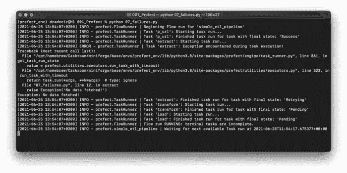

*图 10 — 使用 Prefect 防止失败（作者提供的图像）*

任务失败了，但工作流并没有崩溃。当然，在经过十次重试后，它会崩溃，不过你始终可以更改参数规格。

这就是在本地使用 Prefect 的所有内容。接下来，让我们将代码移到云端，并探讨一下变化。

## 在 Saturn Cloud 中运行 Prefect

让我们立即开始动手吧。首先，注册一个免费的[Prefect Cloud](https://www.prefect.io/cloud/)账户。注册过程简单明了，不需要进一步解释。注册完成后，创建一个项目。我将其命名为`SaturnCloudDemo`。

在转到[Saturn Cloud](https://www.saturncloud.io/s/?utm_source=dario-radecic)之前，你需要在 Prefect 中创建一个 API 密钥来连接这两个服务。你可以在设置中找到*API Key*选项。如你所见，我将其命名为`SaturnDemoKey`：

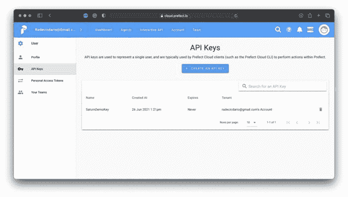

*图 11 — 创建 Prefect Cloud API 密钥（作者提供的图像）*

现在你已经具备了所需的一切，前往[Saturn Cloud](https://www.saturncloud.io/s/?utm_source=dario-radecic)创建一个免费账户。一旦进入仪表板，你会看到多个项目创建选项。选择*Prefect*选项，如下所示：

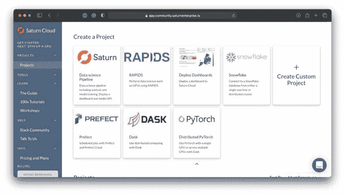

*图 12 — 在 Saturn Cloud 中创建 Prefect 项目（作者提供的图像）*

Saturn Cloud 现在会自动为你完成所有繁重的工作，几分钟后，你可以通过点击按钮打开 JupyterLab 实例：

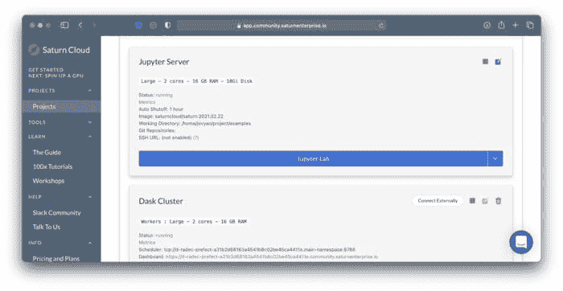

*图 13 — 在 Saturn Cloud 中打开 JupyterLab（作者提供的图像）*

你将可以访问两个笔记本 — 第二个笔记本展示了在 Saturn Cloud 中使用 Prefect 的快速演示。如下所示：

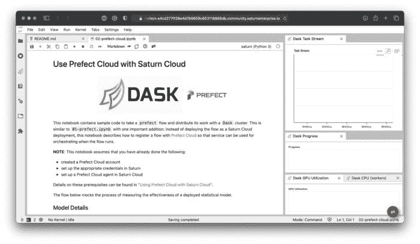

*图 14 — Saturn Cloud 中的 Prefect Cloud 笔记本（作者提供的图像）*

你只需要更改两个设置来使笔记本正常工作。首先，将项目名称更改为 Prefect Cloud 中你的项目名称。其次，将 ` <your_api_key_here> ` 替换为几分钟前生成的 API 密钥。如果你做对了，你应该会看到以下消息：

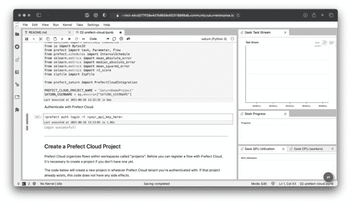

*图 15 — Saturn Cloud 中的登录成功消息（图片由作者提供）*

为了进行测试，请运行接下来的每个单元格。然后转到 Prefect Cloud 仪表板并打开你的项目。它不会像几分钟前那样空着：

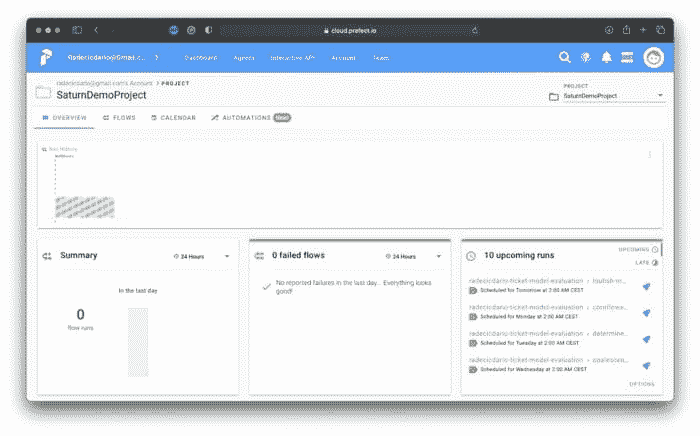

*图 16 — 成功的 Prefect 任务调度（图片由作者提供）*

这就是你需要做的全部！随意复制/粘贴我们的 ETL 管道并验证其是否有效。这就是 Saturn Cloud 的亮点——你可以从本地机器上复制/粘贴代码，几乎无需更改，因为所有繁琐的配置都自动完成。

让我们在下一部分总结一下。

## 最后的思考

那么，这就是 Prefect 的基础知识介绍，包括本地和云端的内容。我希望即使在阅读这篇文章之前你对这个话题一无所知，也能看到工作流管理系统在生产应用中的价值。

要获取更高级的指南，即配置日志记录和 Slack 通知，请参考 [官方文档](https://docs.prefect.io/core/)。提供的示例足以帮助你入门。

## 保持联系

+   在 [Medium](https://medium.com/@radecicdario) 上关注我，获取更多类似的故事

+   订阅我的 [新闻通讯](https://mailchi.mp/46a3d2989d9b/bdssubscribe)

+   在 [LinkedIn](https://www.linkedin.com/in/darioradecic/) 上连接

**简介: [Dario Radečić](https://www.linkedin.com/in/darioradecic/)** 是 NEOS 的顾问。

[原文](https://towardsdatascience.com/prefect-how-to-write-and-schedule-your-first-etl-pipeline-with-python-54005a34f10b)。经许可转载。

**相关内容：**

+   AWS 本地 ETL 管道的开发与测试

+   什么是 ETL？

+   dbt 数据转换 – 实用教程

### 更多相关主题

+   [2021 年最佳 ETL 工具](https://www.kdnuggets.com/2021/12/mozart-best-etl-tools-2021.html)

+   [使用管道编写干净的 Python 代码](https://www.kdnuggets.com/2021/12/write-clean-python-code-pipes.html)

+   [使用 Bash 构建你的第一个 ETL 管道](https://www.kdnuggets.com/building-your-first-etl-pipeline-with-bash)

+   [使用 Prefect 构建数据管道](https://www.kdnuggets.com/building-data-pipeline-with-prefect)

+   [成为伟大数据科学家所需的 5 个关键技能](https://www.kdnuggets.com/2021/12/5-key-skills-needed-become-great-data-scientist.html)

+   [每个初学者数据科学家都应该掌握的 6 种预测模型](https://www.kdnuggets.com/2021/12/6-predictive-models-every-beginner-data-scientist-master.html)
