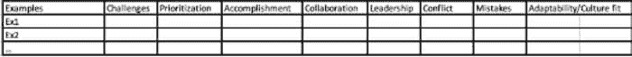
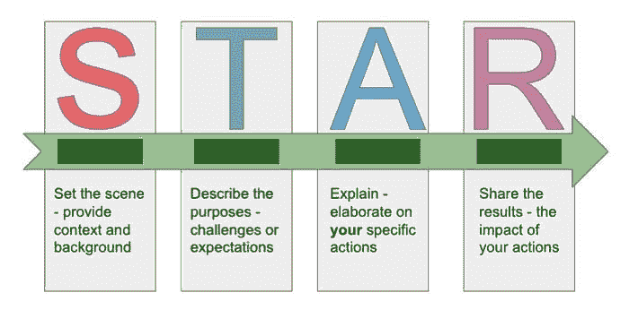

# 准备数据科学面试中的行为问题

> 原文：[`www.kdnuggets.com/2021/07/prepare-behavioral-questions-data-science-interviews.html`](https://www.kdnuggets.com/2021/07/prepare-behavioral-questions-data-science-interviews.html)

评论

**作者 [Zijing Zhu](https://zzhu17.medium.com/)，经济学博士，数据科学认证专家**

照片由[Clem Onojeghuo](https://unsplash.com/@clemono?utm_source=unsplash&utm_medium=referral&utm_content=creditCopyText)拍摄，来源于[Unsplash](https://unsplash.com/s/photos/job-interview?utm_source=unsplash&utm_medium=referral&utm_content=creditCopyText)

* * *

## 我们的前三个课程推荐

 1\. [谷歌网络安全证书](https://www.kdnuggets.com/google-cybersecurity) - 快速进入网络安全职业生涯。

 2\. [谷歌数据分析专业证书](https://www.kdnuggets.com/google-data-analytics) - 提升你的数据分析技能

 3\. [谷歌 IT 支持专业证书](https://www.kdnuggets.com/google-itsupport) - 支持你的组织在 IT 领域

* * *

在我之前关于数据科学面试准备的文章中，我列出了用于练习的技术问题，包括[machine learning](https://towardsdatascience.com/20-machine-learning-related-questions-to-prepare-for-interviews-93bcba72f911)、[statistics](https://towardsdatascience.com/22-statistics-questions-to-prepare-for-data-science-interviews-d5651a8b3c56)和[probability theory](https://towardsdatascience.com/12-probability-practice-questions-for-data-science-interviews-2ec5230304d9)。我还讨论了在数据科学面试前后准备[案例分析问题](https://towardsdatascience.com/structure-your-answers-for-case-study-questions-during-data-science-interviews-a14a02d21e6c)的策略。这篇文章是数据科学面试准备系列的第五篇，主要关注行为问题。我将首先讨论如何准备行为环节，然后列出一些常见问题，供你练习这些技巧。

我在面试过程中最喜欢行为面试，因为与其他技术面试相比，它相对轻松。在我了解回答行为面试问题的策略之前，我总感觉在这个环节中我是在和人聊我经历过的有趣事情。尽管在面试过程中保持较少的压力心态是件好事，但过于放松可能会让你无法给面试官留下深刻的印象。我最终讲述了过多的细节，错过了证明自己符合面试官要求的机会。请记住，即使你主要是在与面试官聊天，你仍然会通过这轮对话被评估。你应该把这轮面试视为展示你基于经验和个性为何是最佳候选人的机会。没有扎实的例子和明确的结构，你无法有效地展示自己，这将在本文中讨论。

### **第一部分：收集有力的例子**

行为面试问题的回答内容是基础。在面试过程中，为了保持对话流畅，你很少有时间思考完美的例子来回答问题。因此，在准备面试时，我们应从收集所有“有用”的经历开始，并按问题类型进行分类。这样，你就会知道你总会有话题可谈，并且有合适的例子来支持你的论点。在这一部分，我将讨论收集有力例子的过程。

**制作你的清单**

你应该使用哪些例子来回答行为面试问题？考虑一下你过去的工作和学习经历，并将其分类到不同的类别中。

当我准备行为面试问题时，我使用了以下表格来头脑风暴我所经历的经验。尽管问题可以用无数种方式提出，我们可以将它们概括为以下八类。你遇到过哪些挑战？你如何优先安排工作？你有哪些成就想要分享？有哪些例子能展示你的领导能力？你什么时候遇到过冲突，如何处理的？你犯过哪些错误？你如何适应新环境，融入其中？

类别清单

对于每个类别，搜索你的记忆并准备至少一个例子分享。如果每个类别有多个例子，那就更好！将它们全部写下来，并从不同方面加以强调。例如，在展示你的成就的同一类别中，你可能会找到一个例子强调你的自学能力，另一个则显示你是一个团队合作者。这些都是面试官可能会寻找的优秀特质。收集所有这些例子，并学习如何根据面试中的问题背景优先选择分享的例子。

**优先考虑例子**

如果你有多个挑战已经克服，那么在回答特定问题时，你应该选择哪个挑战？我建议你遵循以下原则来优先考虑例子：

+   优先考虑影响力较大的例子：影响力是关键。它展示了你工作的成果，并证明你符合申请的要求。当你说你为项目构建了一个新模型时，人们可能会质疑，直到你提到这个模型增加了 x%的客户留存率。

+   优先考虑相关的例子：相关性有几个方面。首先，根据问题的背景和提问方式，答案可能会有所不同。因此，在面试过程中，积极倾听非常重要。尽管你可能已经准备好了很好的演讲，但如果与问题无关，你应该根据问题调整你的回答。此外，如果你申请的是工作岗位，那么工作相关的例子比学校项目更为相关。

+   优先考虑近期的例子：讨论最近发生的例子比讨论很久以前发生的事情更好。例如，你可以讨论你在最近职位上的经历。如果你有工作经验，当被问及领导力技能时，你仍然使用学校的例子，面试官可能会对你在职场中实践技能的能力产生疑虑。这会发出不好的信号。

**研究公司的核心价值观和职位描述**

面试官希望从你讲述的经历中发现一些关键特征。一般来说，这些特征包括：

+   良好的沟通者

+   自信与谦逊

+   主动进取者

+   遵守规则和协议的能力

+   独立自主

+   与他人合作良好

+   问题解决者

+   对角色和公司的承诺

+   领导力特质

+   公司的积极代表

你使用的例子应向面试官展示你具备他们所寻找的关键特征。此外，每家公司都有其核心价值观，可能会优先考虑某些品质。你应该在线上轻松找到这些核心价值观或从职位描述中总结出来。在准备例子时，记住所有核心价值观，并在回答中尽量融入并优先考虑它们。

**充分利用每个例子**

在回答有关解决冲突的问题时，除了展示你解决问题的技能外，你还可以展示你出色的沟通能力和领导力。 因此，我建议你也为你所有的代表性例子制作下表：

首先总结这个例子的量化影响。然后尝试挖掘这个例子并勾选这个例子有助于展示的类别。你可以写一个关于你在这个例子中完成的任务的单句总结，展示你在这一类别中的质量。

如果你有工作经验，你可以很容易找到许多例子，无论是全职、兼职还是实习。对于新毕业生，学术经验也可以作为工作经验来处理。你可以谈谈你参与的一个个人研究项目；你如何与顾问合作，他们类似于职场中的主管；你如何与其他研究生合作，他们类似于职场中的同事。如果你曾经担任过助教，即使这份工作本身可能与你现在申请的职位无关，你仍然可以谈谈一些展现你沟通和领导技能的经历。

**诚实**

**不要编造任何例子！** **不要假装成你不是的人。** 找到工作不是故事的终点，而是开始的篇章。你不希望给未来的同事或老板留下错误的印象，让他们觉得你以后每天都要假装成别人的样子。与其编造例子，不如回顾你已有的经验，并深入挖掘细节。当我寻找我的第一份全职工作时，我在向一些面试官证明我在职场上的能力时遇到了一些困难。我特别强调了我在初创公司实习的经历，尤其是我与来自不同团队的主管和同事合作的部分。这段经历给了我很多可以用来证明我的沟通和领导技能的例子，并向面试官展示我能够在快节奏的工作环境中表现出色。这也是为什么我们需要深入挖掘并充分利用所有例子的原因。

### **第二部分：建立和实践结构**

你的回答应该始终有条理。否则，你会发现自己很容易在没有重点的情况下滔滔不绝或喋喋不休。你不是在跟朋友聊天，所以你不需要深入每一个细节。你也不是在写悬疑小说，所以不需要让读者绞尽脑汁并尝试给他们惊喜。在面试中，你的回答应该直接、简洁明了。

**遵循 STAR 结构**

STAR 代表 **S**ituation（情境）、**T**ask（任务）、**A**ction（行动）、**R**esult（结果）。这是一个可靠的方法来构建你的回答。

作者绘制

你从简要描述你所处的情况或需要完成的任务开始你的回答。然后谈谈**你**需要完成的任务。接着列出你为完成这些任务所采取的行动。最后，总结一下你的行动结果是什么。例如，发生了什么？事件如何结束？你达成了什么？你学到了什么？注意：

+   你可以用结果来描述情况。例如，你可以从“我想分享一下我建立了一个模型，减少了 x%的客户流失”开始你的回答。

+   你选择的任务需要是具体的，而非一般的或假设性的。

+   即使是一个团队项目，也要专注于描述**你的**任务和行动。如果你需要提到其他人的任务，强调沟通和协作技能。

+   如果你能量化结果，它总是会显得更令人印象深刻。

有关更多细节和示例，请参阅[这篇文章](https://www.indeed.com/career-advice/interviewing/how-to-use-the-star-interview-response-technique)和许多其他在线文章，以帮助你练习这种结构。

**关注影响而非过程**

我无法强调足够展示你工作的影响有多么重要。你怎么做固然重要，但不是优先考虑的，因为你不是在一个知识分享会议上。你应该专注于你做了什么，特别是结果是什么。量化对公司关键 KPI 的影响会更令人印象深刻。

**将细节留到后续问题中**

起初不要深入细节，尤其是技术细节。保持你的回答清晰且直截了当。首先简要介绍示例，并专注于影响和结果。如果面试官对你如何取得结果感到好奇，他们会问跟进问题，然后你可以详细说明。如前所述，诚实地讲述你知道什么和不知道什么。如果你假装自己做过某事或详细了解某事，面试官可能会问跟进问题并发现你在撒谎。这是一个很糟糕的信号。

### **第三部分：练习常见问题**

现在你有了一些示例，并且知道了正确的结构，练习以下问题：

+   讲述一下你曾被要求做过从未做过的事情的经历？你学到了什么？

+   讲述一下你曾同时负责多个项目的经历。你是如何组织时间的？结果如何？

+   讲述一下在工作中有重要的事情未按计划进行的经历。你的角色是什么？结果如何？你从这次经历中学到了什么？

+   讲述一下你曾经需要和一个难以相处的人一起工作的经历。你是如何处理与那个人的互动的？

+   讲述一下在问题出现时你的主管不在的经历。你是如何处理这种情况的？你咨询了谁？

### 最后的备注

你可以在线找到很多其他问题来练习。当我说练习时，我并不是让你写下答案然后阅读，希望在面试中遇到完全一样的问题。相反，要练习用一种固定的结构来回答问题。此外，要在镜子前面或与伙伴一起练习，以便获得反馈。请记住，在面试过程中，你并不是在演讲，而是在与他人交谈。因此，积极倾听，并注意他人的反应是非常重要的。我知道在虚拟面试中可能会更具挑战性，我有一篇文章[这里](https://towardsdatascience.com/how-to-be-better-prepared-for-virtual-data-science-interviews-7650c4492d65)帮助你更好地为虚拟面试做准备。目标是进行一次良好的对话，因此你应该专注于回答问题，而不是提供“完美答案”。

这篇文章就到这里。感谢阅读。这里是我所有博客文章的列表。如果你感兴趣，可以查看一下！

[**我的博客文章画廊**](https://zzhu17.medium.com/my-blog-posts-gallery-ac6e01fe5cc3)

我的快乐之地

**个人简介：[Zijing Zhu](https://zzhu17.medium.com/)** 拥有经济学博士学位，获得数据科学认证，并对生活充满热情。

[原文](https://towardsdatascience.com/prepare-behavioral-questions-for-data-science-interviews-96e97f13be15)。经授权转载。

**相关内容：**

+   数据科学面试中你应该知道的 10 个统计概念

+   麦肯锡教给我的 5 个课程，让你成为更优秀的数据科学家

+   数据科学家编码面试终极指南

### 更多相关内容

+   [数据科学面试中的 24 个 A/B 测试面试问题以及……](https://www.kdnuggets.com/2022/09/24-ab-testing-interview-questions-data-science-interviews-crack.html)

+   [如何准备数据科学面试](https://www.kdnuggets.com/2022/12/prepare-data-science-interview.html)

+   [用于数据可视化的 SQL：如何为图表和图形准备数据](https://www.kdnuggets.com/sql-for-data-visualization-how-to-prepare-data-for-charts-and-graphs)

+   [SQL 数据清理：如何为分析准备混乱的数据](https://www.kdnuggets.com/data-cleaning-in-sql-how-to-prepare-messy-data-for-analysis)

+   [利用 AI 和分析引擎更快地准备时间序列数据](https://www.kdnuggets.com/2021/12/piexchange-faster-way-prepare-timeseries-data-ai-analytics-engine.html)

+   [为有效的 Tableau 和 Power BI 仪表板准备数据](https://www.kdnuggets.com/2022/06/prepare-data-effective-tableau-power-bi-dashboards.html)
