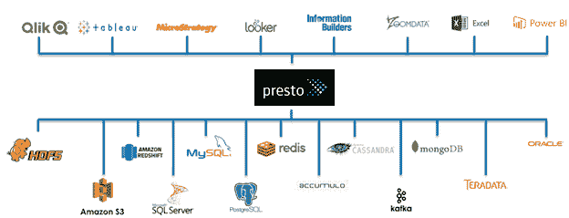

# Presto 为数据科学家 – SQL 适用于任何数据

> 原文：[`www.kdnuggets.com/2018/04/presto-data-scientists-sql.html`](https://www.kdnuggets.com/2018/04/presto-data-scientists-sql.html)

 评论

**由 [Kamil Bajda-Pawlikowski](https://www.starburstdata.com/leadership/)，Starburst Data 的 CTO 提供**。

最初由 Facebook 开发，[Presto](https://prestodb.io/) 是一个开源、分布式 ANSI SQL 查询引擎，它能够快速分析各种数据源，数据规模从吉字节到拍字节不等。对于数据科学家来说，这对于在几秒钟内返回大数据查询结果非常理想，通过支持仪表板、报告和临时分析，加快数据科学发现的迭代过程。

Presto 被从零开始设计和构建，目的是成为一个快速的 SQL 查询引擎。它遵循经典的 MPP SQL 引擎设计，其中查询处理在机器集群上并行进行。因此，高度并发的查询以交互速度执行。然而，它有一个显著的偏离传统并行数据库管理系统的教科书配方——计算和存储的分离。Presto 的架构完全抽象化了它可以连接的数据源。连接器 API 允许为文件系统和对象存储、NoSQL 存储、关系数据库系统以及自定义服务构建插件。只要数据科学家能够将数据映射到表格、列和行等关系概念中，就可以创建一个 Presto 连接器。

实际上，Presto 配备了大量现有的连接器，包括 HDFS、S3、Cassandra、Accumulo、MongoDB、MySQL、PostgreSQL 和其他数据存储。此外，在 Presto 的单个安装中，用户可以注册多个目录，并运行访问多个连接器的数据的查询。此外，虽然许多数据科学项目和生产应用程序需要执行 ETL，但使用 Presto，你可以直接查询数据所在的位置。

例如，想象一下将来自 RDBMS 的客户数据与 Kafka 中的最新事件关联，并回到 Hadoop 或 S3 查看这些数据如何与过去的趋势相关。这确实是“SQL-on-Anything”。

*Presto 将许多最流行的大数据源与各种分析、商业智能、仪表板和可视化应用程序连接起来。*

与大量 SQL-on-Hadoop 引擎不同，Presto 在大数据查询和分析中不依赖于 Hadoop。它几乎可以部署在任何地方，无论是在公共云、虚拟机集群还是本地专用集群。如果 Hadoop 在其中，数据科学家可以放心。Presto 仅通过连接到 Hive Metastore 允许用户与 Hive、Spark 和其他 Hadoop 生态系统工具共享相同的数据。一个不依赖于 Hadoop 的额外好处是供应商中立的方法，以及对包括 Avro、ORC、Parquet、RCFile、Text 等常见文件格式的原生支持。

在过去几年里，Presto 在 [各种规模的企业](https://github.com/prestodb/presto/wiki/Presto-Users) 中经历了前所未有的增长，从快速发展的互联网公司到《财富》500 强。除了 Facebook，早期采用者还包括 Airbnb、Dropbox、Groupon 和 Netflix 等。Presto 路线图的加速以及成功的概念验证也导致了在 Bloomberg、Comcast、FINRA、LinkedIn 和 Lyft 以及 Slack、Twitter、Uber 和 Yahoo! Japan 的生产部署。

确实，上个月在 [圣荷西的 Strata Data Conference](https://conferences.oreilly.com/strata/strata-ca/) 上，几位领先的 Presto 采用者 [讨论了他们的部署](https://www.starburstdata.com/technical-blog/2018/3/12/starburst-strata) 并展示了互动速度、[卓越的查询并发性](https://conferences.oreilly.com/strata/strata-ca/public/schedule/detail/63786) 和出色的可扩展性。

除了快速的 ANSI SQL 和对多种数据源的访问外，Presto 还为数据科学家提供了什么？考虑易用性、简单的部署和通过 [Superset](https://superset.incubator.apache.org/)、[Redash](https://redash.io/)、[Jupyter](http://jupyter.org/) 和众多支持 JDBC 和 ODBC 的分析工具的访问。考虑到 Presto 与数据科学生态系统的良好集成，它支持包括 C、Go、Java、Python、R 和 Ruby on Rails 在内的流行编程语言。

此外，Presto 具有大量的 [内置分析函数](https://docs.starburstdata.com/latest/functions.html)，包括 lambda 表达式和函数、窗口函数、正则表达式，甚至地理空间函数——被 [Uber 公共地广泛使用](https://www.oreilly.com/ideas/query-the-planet-geospatial-big-data-analytics-at-uber)。除了标准 SQL 数据类型，数据科学家还可以处理复杂类型，如映射、数组、结构体和 JSON。

如果这引起了你的兴趣，我鼓励你下载免费的开源 Presto 并分享你的故事。对许多数据科学家来说，这可以迅速成为快速查询大数据和互动分析的游戏规则改变者。

**相关：**

+   [关于大数据的 5 件事](https://www.kdnuggets.com/2018/03/5-things-big-data.html)

+   [云中大数据 SQL 平台基准测试](https://www.kdnuggets.com/2017/09/databricks-benchmarking-big-data-sql-platforms-cloud.html)

+   [想要从事数据工作？学这个](https://www.kdnuggets.com/2018/02/want-job-data-learn-this.html)

* * *

## 我们的前三大课程推荐

 1\. [谷歌网络安全证书](https://www.kdnuggets.com/google-cybersecurity) - 快速进入网络安全职业生涯

 2\. [谷歌数据分析专业证书](https://www.kdnuggets.com/google-data-analytics) - 提升你的数据分析技能

 3\. [谷歌 IT 支持专业证书](https://www.kdnuggets.com/google-itsupport) - 支持你的组织 IT 事务

* * *

### 更多相关内容

+   [学习如何使用 ChatGPT 学习 Python（或其他任何东西）](https://www.kdnuggets.com/2023/02/learn-python-chatgpt.html)

+   [Segment Anything 模型：图像分割的基础模型](https://www.kdnuggets.com/2023/07/segment-anything-model-foundation-model-image-segmentation.html)

+   [25 个针对数据科学家的高级 SQL 面试问题](https://www.kdnuggets.com/2022/10/25-advanced-sql-interview-questions-data-scientists.html)

+   [数据科学家的顶级 SQL 查询](https://www.kdnuggets.com/top-sql-queries-for-data-scientists)

+   [关于精通 SQL、Python、数据清理、数据处理的指南集合](https://www.kdnuggets.com/collection-of-guides-on-mastering-sql-python-data-cleaning-data-wrangling-and-exploratory-data-analysis)

+   [SQL 中的数据清理：如何为分析准备混乱的数据](https://www.kdnuggets.com/data-cleaning-in-sql-how-to-prepare-messy-data-for-analysis)
