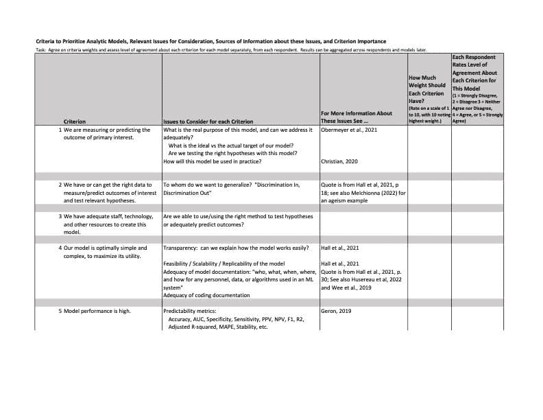
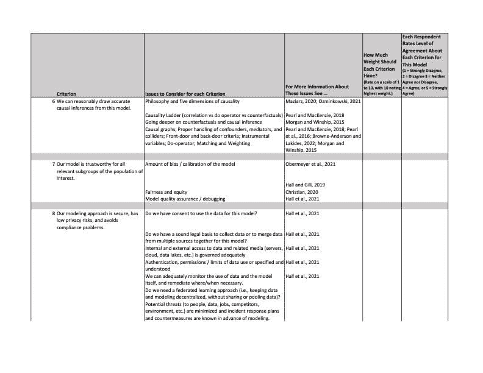
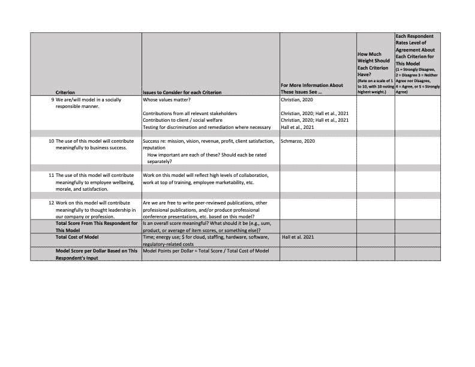
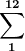

# 优先排序数据科学模型以便投入生产

> 原文：[`www.kdnuggets.com/2022/04/prioritizing-data-science-models-production.html`](https://www.kdnuggets.com/2022/04/prioritizing-data-science-models-production.html)

图片来源于 airfocus，在 unsplash.com

很少有企业拥有不受限制的数据科学预算。用于人员、技术、分析环境和平台的资金通常远小于公司对知识的需求。在我曾经工作的公司中，新的分析模型的愿望清单需要将我们的研究人员数量翻倍，这显然是不可能的。

* * *

## 我们的前 3 个课程推荐

 1\. [Google 网络安全证书](https://www.kdnuggets.com/google-cybersecurity) - 快速开启网络安全职业生涯。

 2\. [Google 数据分析专业证书](https://www.kdnuggets.com/google-data-analytics) - 提升你的数据分析技能

 3\. [Google IT 支持专业证书](https://www.kdnuggets.com/google-itsupport) - 支持你的组织的 IT 需求

* * *

Therese Gorski，多个优先级排序工作的领导者，告诉我优先级排序的需求在许多产品管理组织中很常见。它通常是评估许多市场产品创意的更大过程的一部分。她说，因此，将优先级排序过程管理得像其他产品开发投资一样是有用的。

在这篇文章中，我提出了一些标准供公司在分配稀缺资源用于数据科学工作时考虑。我的建议是与每个参与生产、营销、销售、融资、支持或维护公司产品的部门人员讨论这些标准。公司员工的见解应来自所有层级，而不仅仅是领导层。这应当辅以受每个模型影响的外部利益相关者的见解。广泛的意见反馈将有助于最大化客户效用，从而增加他们和你公司的销售额和利润。广泛的意见反馈也将提升你产品的社会价值。

# 十二项考虑标准

以下表格中的标准受到了 Therese 及其在几家公司工作的同事以及最近文献关于使模型有用的属性和应避免的陷阱的启发。其中一些标准可以在生产前进行权衡；其他标准则涉及已经生产出的模型。

模型属性应在生产前后进行权衡，因为直到训练过程的后期甚至之后，才可能清楚任何模型是否可能变得或保持有用。此外，新模型通常要与长期出售但需要定期且重要投资以维持或更新的旧模型竞争有限的资金。因此，考虑每个模型对业务成功的可能贡献非常重要。这要求在评估投资或继续投资数据科学模型的效用时，权衡多种标准和视角。

考虑到这些因素，以下表格列出了十二个考虑标准。这样的文件可以分发给利益相关者和员工，以便从多方收集对每个标准的评分，然后汇总讨论。

如表格所示，这些十二个标准以声明的形式出现，每个回应者的任务是记录他们对每个模型中每个声明的同意程度。为了简化，我假设同意程度的范围从 1（强烈不同意）到 5（强烈同意）。使用相同的范围通过减少回应的差异性来增加结果的可靠性；它也使每个声明更易于解释。

另一个重要任务是权衡每个标准的重要性。在这里，重点是标准而非模型，Excel 文件包括一个列来指定每个标准的权重。您的业务利益相关者是否希望对每个标准赋予相同的重要性，还是认为某些标准比其他标准更重要，需要更高的权重？这个讨论可能会很有启发性，也可能会引发争议，有三种选项值得考虑。有些人可能认为权重的讨论应该在收集到一致性数据之后进行，这样可以促进标准权重与一致性水平之间的独立性，意味着一个不会影响另一个。其他人可能会持不同意见，先评估每个标准的重要性，然后评估每个模型中每个标准的一致性水平。第三种选择，如表中所示，是在评估一致性水平的同时，询问利益相关者对每个标准应给予多少权重，然后使用所有响应者的结果来共同决定每个标准的权重。使用对您的组织效果更好的选项。如果不确定哪种方法更好，可以对不同的独立随机评估子集尝试不同的方法，或随着时间的推移尝试不同的方法，以帮助决定哪种方法更适合您。

# 评分模型

一旦这些活动完成并且所有受访者提供了每个模型的评分，就可以开始对每个模型进行评分。每个模型的得分可以从每个受访者那里计算，基于所有人一致同意的标准权重和受访者对每个标准的一致性水平：

受访者 A 的总得分 =  标准权重 * 一致性水平

总和从 1 到 12，因为每个模型有十二个标准。例如，假设受访者 A 对每个标准都强烈同意，并且每个标准的权重都是 1.0\。那么他的得分将等于 60（即，12 个标准乘以 5 的值，表示对每个标准都强烈同意）。大多数受访者会将他们的分数从 1 到 5 进行变化，使得标准权重非常重要。

一旦从每个受访者那里获得了每个模型的分数，就可以通过将所有受访者的分数相加或平均来获得整体模型得分。这些数据可以在另一张表格中呈现和比较。可以生成模型标准和模型得分的均值、中位数、方差和箱形图，带有和不带有异常值。这将有助于讨论哪些标准最重要，以及采用或保留哪些模型。

# 标准有效性

提议的标准的有效性也很重要。我试图通过涵盖我与同事讨论的分析模型质量的几个问题，以及最近文献中描述的内容来解决内容有效性。因此，一个标准涉及到所考虑的模型是否可能测量或预测真实感兴趣结果，而不是该结果的代理。评论这个问题时，布赖恩·霍赫雷因，另一位著名的分析领导者提到，没有数据集能够完美捕捉人类行为或自然界的复杂性，所以问题是当数据不完美时，是否以及如何继续建模。Christian (2020)、Hall 等人 (2021) 和 Obermeyer 等人 (2021) 提供了一些在这种情况下如何继续的想法。

模型的复杂性和性能也在表格中被列为重要标准。根据布赖恩的说法，我们需要那些易于理解但足够复杂以准确预测或理解感兴趣结果的模型。其他人也同意这一点（例如，Christian, 2020；Hall 和 Gill (2019)）。这些模型应在统计指标上表现良好，并且具有高灵敏度和低虚假发现率。它们还应提供比竞争对手模型更好或更有用的见解。

能够得出因果推断也反映在标准中，因为数据科学家和政策制定者对这一领域的兴趣日益增长。因果关系基于对真实感兴趣结果的测量，如前所述，这依赖于拥有合适的数据和其他资源。当数据、资源或建模过程未能充分捕捉人类本性时，因果推断将受到限制。

还建议考虑模型的透明度、可信度、公平性、偏见和安全性，以及在建模过程中保护数据和研究对象的努力。

在我工作过的地方，模型被开发、维护和更新，以便它们可以作为公司销售或希望销售的产品中的组件。因此，每个模型对公司和客户收入与利润的最终贡献非常重要。对公司声誉的潜在贡献也很重要。这些都很难为任何给定的分析模型估算，因为它们必须考虑到模型的有效使用期，而这很难预测。关于数据科学努力对收入、利润和声誉的大小和时机的贡献，可能会有激烈的讨论。这些讨论会揭示争议；公开和专业地处理这些争议将会建立信任，并对不同的意见有更广泛的理解和尊重。

表中提到的最后两个标准反映了每个模型对员工福祉、士气和满意度的贡献，以及对专业思想领导力的贡献。我们应该建立能够吸引和激励公司全体员工的模型。给予员工参与思想领导力的机会，并允许他们影响模型生产，将培养忠诚度并提供专业成长的机会。

除了列出评估每个标准重要性的标准和建议外，该表还提到了关于每个标准需要考虑的几个问题。我还提供了引用或链接，以便在文献中找到关于这些问题的更多信息。

图片由 Stephen Dawson 提供，来源于 unsplash.com

# 限制与讨论

这本简短的模型优先级指南中还有很多未涵盖的内容。我的重点是面向外部的模型，尽管类似的标准也可以用于内部工作。

你可能会认为十几个标准太多了，或者太少——找出适合你公司的标准。你可能会识别出其他重要的标准或需要解决的其他问题。虽然我在表中提供了一些关于需要考虑的问题的想法，但没有说明如何解决这些问题或如何解决有关这些问题的争议。下面列出的参考文献以及表中所列的参考文献可以帮助解决这些问题。我鼓励你查看这些资料。这些作者在他们的领域中非常著名，并提供了许多值得考虑的见解。

模型评分后会发生什么？评分过程和结果应在内部和外部贡献者之间讨论。如果有必要，可以进行调整，也许采用收集、整理和分发评论以进行后续讨论的方法。这可以根据需要重复多次，以达成一致。

但要小心最响亮的声音和最高级别的声音症候群。预期一些情感上的呼吁或观点可能会有意或无意地使标准偏向某些模型而非其他模型，或压制辩论。这些问题应该被广泛讨论。也许是在小组中，也许是个人讨论，但每个人都应该了解不同的观点，以便能够专业地解决利弊。

Hall 等人（2021）和 Obermeyer 等人（2021）提供了关于当模型表现不佳或被认为不太有用时的建议。他们还提出了如何利用人员、流程和技术来改进模型的想法。他们及其他人（例如，Christian, 2020; Melchionna 2022）强烈推荐由人类专家和非专家提供指导，特别是那些代表我们模型覆盖的群体的专家。有关模型问责制和审计流程的指导也在他们的工作中提到。

# 扩展与最终思考

数据科学家可能会建议其他优先级设定方法。大公司通常会追踪其产品的表现。如果是这样，可能可以收集到足够的关于其产品属性的数据，或者模型的基础数据，然后使用聚类和回归模型，或其他机器学习技术，来帮助设定每个标准的权重。

为了便于数据收集和分析，一些公司通过给每个输入贴上标签，将其产品商品化。这些输入应包括每个产品所采用的所有数据科学模型。公司随后可能会为每个模型和其他输入分配类似零件号的标识。由于模型和其他特性可以在多个产品中使用多年，这有助于识别数据科学团队和其他团队对公司产品的贡献范围。考虑到创建每个输入所需的工作量和资源，有助于在参与产品开发和管理的团队之间分配收入或利润信用。跟踪这些信用随着时间的推移也有助于员工对标准的权重和建模工作的市场价值进行推断，以优先考虑未来的工作。

理想情况下，应该就使用哪些标准、如何对每个标准加权，以及如何在公司内优先排序模型达成共识，或至少形成强大的多数意见。经验表明，这将需要一些时间，因此数据科学路线图应当预留足够的时间，以完成深思熟虑的模型优先级设定过程。第一次使用时，这可能需要三到四个月。预计后续应用会快得多。我已经多次做过这个过程，乐意提供帮助。希望你觉得这个过程有用。

# 致谢

我要感谢 Therese Gorski 和 Brian Hochrein 对本文的有益评论。他们的见解使文章大为改进。任何剩余的错误均由我承担。

## 参考文献

1.  A. Christian, *对齐问题：机器学习与人类价值*（2020），纽约，NY：W.W. Norton & Company

1.  A. Géron, *动手实践机器学习：使用 Scikit-Learn、Keras 和 TensorFlow 构建智能系统的概念、工具和技术，第 2**版*（2019），Sebostopal，CA：O’Reilly Media, Inc.

1.  P. Hall 和 N. Gill, *机器学习可解释性简介：公平性、问责制、透明度和可解释 AI 的应用视角，第 2**版*（2019），Sebostopal，CA：O’Reilly Media, Inc.

1.  P. Hall, N. Gill 和 B. Cox, *负责任的机器学习*（2021），Sebostopal，CA：O’Reilly Media, Inc.

1.  D. Husereau, M. Drummond, F. Augustovski 等，《整合健康经济评估报告标准（CHEERS）2022 解释与阐述：ISPOR CHEERS II 良好实践工作组的报告》（2022），*价值健康* 25:1:10-31。

1.  M. Maziarz，*经济学中的因果关系哲学：因果推断与政策建议*（2020），纽约，NY：Routledge

1.  M. Melchionna，世卫组织：是时候消除人工智能中的年龄歧视了（2022 年 2 月 10 日），*健康 IT 分析*，[`healthitanalytics.com/news/who-its-time-to-eliminate-ageism-in-artificial-intelligence`](https://healthitanalytics.com/news/who-its-time-to-eliminate-ageism-in-artificial-intelligence)

1.  S.L. Morgan 和 C. Winship，*反事实与因果推断：社会研究的方法与原则，第 2 版*（2015），英国剑桥：剑桥大学出版社

1.  Z. Obermeyer, R. Nissan, M. Stern 等，*算法偏见手册*（2021 年 6 月），芝加哥，IL：芝加哥大学应用人工智能中心

1.  R. Ozminkowski，什么原因导致什么，我们如何知道？（2021 年 9 月 14 日），*迈向数据科学*，[`towardsdatascience.com/what-causes-what-and-how-would-we-know-b736a3d0eefb`](https://towardsdatascience.com/what-causes-what-and-how-would-we-know-b736a3d0eefb)

1.  J. Pearl, M. Glymour 和 N.P. Jewell，*统计学中的因果推断：入门*（2016），英国威斯萨塞克斯，Chichester：John Wiley & Sons

1.  J. Pearl 和 D. Mackenzie，*为什么之书：因果关系的新科学*（2018），纽约，NY：Basic Books

1.  B. Schmarzo，《数据、分析与数字化转型的经济学：引导组织数字化转型的定理、法则与赋能》（2020），英国伯明翰：Packt Publishing

1.  L. Wee, M.J. Sander, F.J.van Kujik 等，《预测模型的报告标准与批判性评估》，见于*临床数据科学基础*（2019），编辑：A. Dekker, M. Dumontier, 和 P. Kubben，通过 [`doi.org/10.1007/978-3-319-99713-1`](https://doi.org/10.1007/978-3-319-99713-1) 开放获取

**[Ron Ozminkowski 博士](https://www.linkedin.com/in/ronozminkowski/)** 是一位国际认可的顾问、作家和高管，专注于医疗分析和机器学习，其出版的工作已被全球 90 多个国家的读者阅读。

### 更多相关话题

+   [功能商店峰会 2023：部署机器学习的实用策略…](https://www.kdnuggets.com/2023/09/hopsworks-feature-store-summit-2023-practical-strategies-deploying-ml-models-production-environments)

+   [使用 Eurybia 检测数据漂移以确保生产 ML 模型质量](https://www.kdnuggets.com/2022/07/detecting-data-drift-ensuring-production-ml-model-quality-eurybia.html)

+   [将机器学习算法完整端到端部署到…](https://www.kdnuggets.com/2021/12/deployment-machine-learning-algorithm-live-production-environment.html)

+   [从 PoC 到生产的机器学习运作](https://www.kdnuggets.com/2022/05/operationalizing-machine-learning-poc-production.html)

+   [生产 ML 的元数据存储！](https://www.kdnuggets.com/2022/05/layer-metadata-store-production-ml.html)

+   [skops: 一个提升 Scikit-learn 生产环境的新库](https://www.kdnuggets.com/2023/02/skops-new-library-improve-scikitlearn-production.html)
