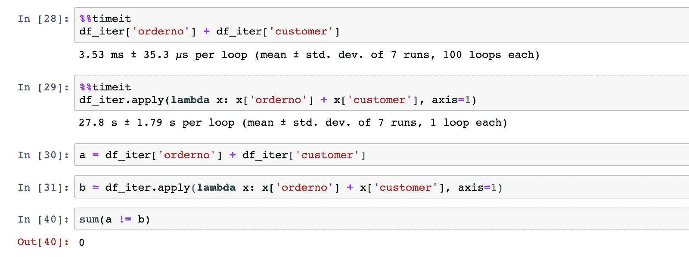
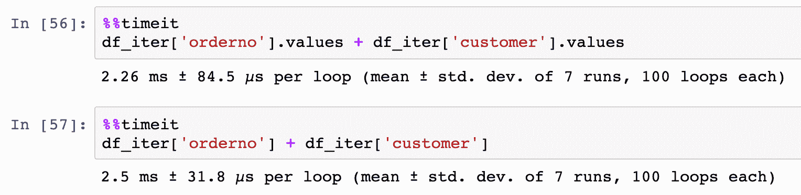
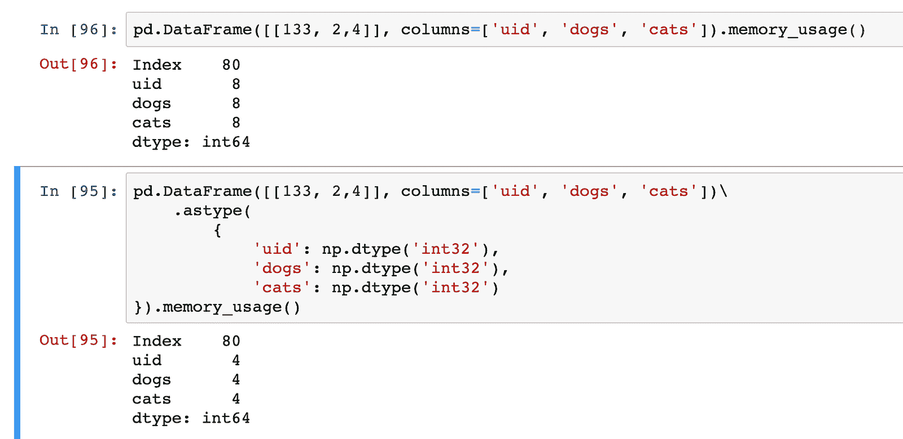
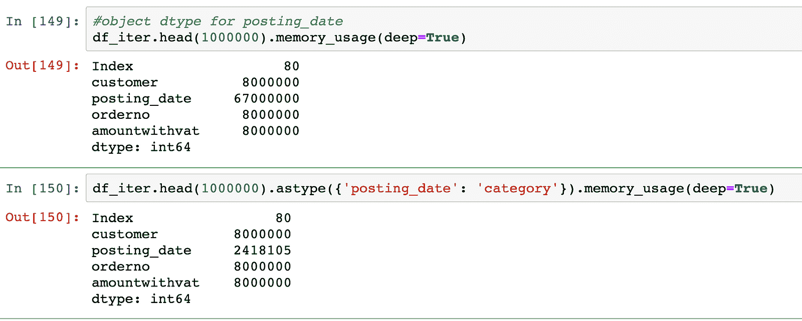
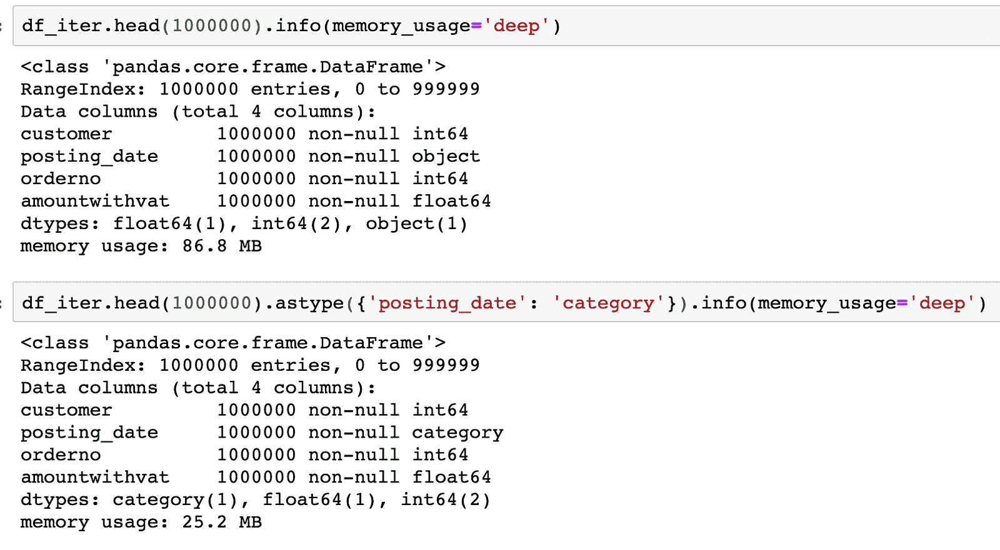
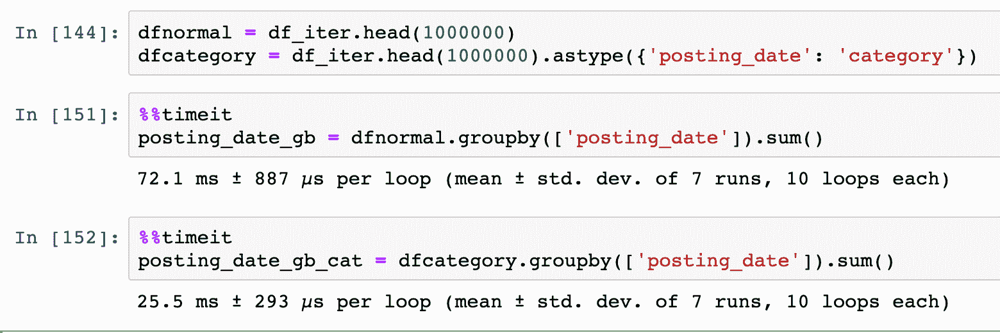
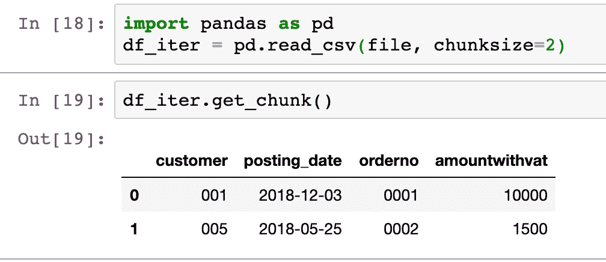
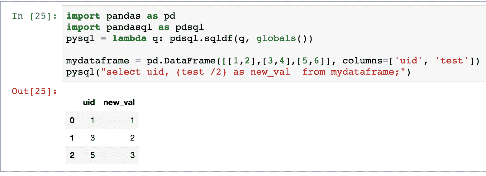
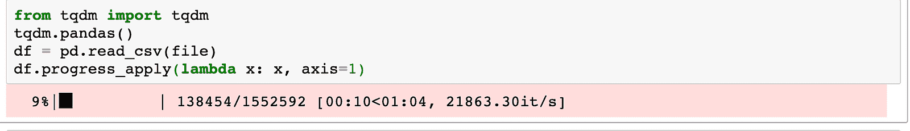
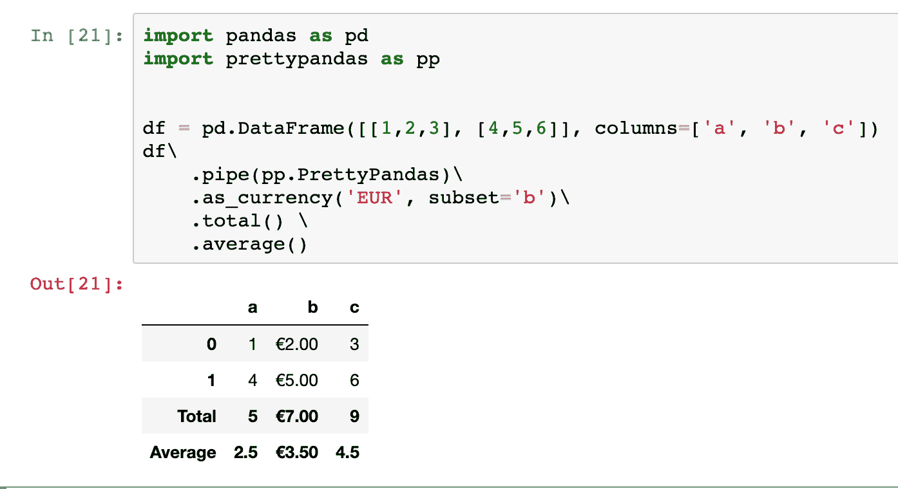

# 成为 Pandas，Python 的数据处理库的专家

> 原文：[`www.kdnuggets.com/2019/06/pro-pandas-python-library.html`](https://www.kdnuggets.com/2019/06/pro-pandas-python-library.html)

 评论

**由[Julien Kervizic](https://www.linkedin.com/in/julienkervizic/)，GrandVision NV 高级企业数据架构师**

Pandas 库是 Python 中最流行的数据处理库。它通过其数据框 API 提供了一种简便的数据处理方式，灵感来自 R 的数据框。

照片由[Damian Patkowski](https://unsplash.com/@damianpatkowski?utm_source=medium&utm_medium=referral)拍摄，[Unsplash](https://unsplash.com?utm_source=medium&utm_medium=referral)

### 了解 Pandas 库

了解 Pandas 的关键之一是理解 Pandas 主要是围绕一系列其他 Python 库的包装器。主要包括 Numpy、SQLAlchemy、Matplotlib 和 openpyxl。

数据框的核心内部模型是一系列 numpy 数组，Pandas 函数如现已弃用的“as_matrix”返回结果在该[内部表示](https://pandas.pydata.org/pandas-docs/stable/reference/api/pandas.DataFrame.as_matrix.html)中。

Pandas 利用其他库将数据输入和输出到数据框中，例如，通过 read_sql 和 to_sql 函数使用 SQLAlchemy。而 openpyxl 和 xlsx writer 则用于 read_excel 和 to_excel 函数。

Matplotlib 和 Seaborn 用于提供一个简单的接口来绘制数据框中的信息，使用如 df.plot()这样的命令。

### Numpy 的 Pandas——高效的 Pandas

经常听到的抱怨之一是 Python 运行缓慢或难以处理大量数据。大多数情况下，这是由于编写的代码效率低下。确实，本地 Python 代码往往比编译代码慢，但像 Pandas 这样的库有效地提供了 Python 代码到编译代码的接口。了解如何正确地与其接口，可以让我们充分发挥 Pandas/Python 的优势。

**应用向量化操作**

Pandas，像其底层库 Numpy 一样，执行向量化操作比执行循环更高效。这些效率来源于向量化操作通过 C 编译代码而非本地 Python 代码进行，同时利用了向量化操作对整个数据集进行处理的能力。

apply 接口通过使用 CPython 接口进行循环，从而提高了一些效率：

```py
df.apply(lambda x: x['col_a'] * x['col_b'], axis=1)
```

但大部分性能提升将来自于使用向量化操作本身，无论是直接在 Pandas 中还是通过直接调用其内部的 Numpy 数组。



正如你从上面的图片中可以看到，性能差异可能非常巨大，通过矢量化操作处理（3.53 毫秒）和用 Apply 循环进行加法（27.8 秒）之间的差距。通过直接调用 numpy 的数组和 API，可以获得额外的效率，例如：



***Swifter:*** Swifter 是一个 Python 库，简化了在数据框上对不同类型操作的矢量化，其 API 与 Apply 函数非常相似。

**高效数据存储通过 DTYPES**

在将数据框加载到内存中时，无论是通过 read_csv、read_excel 还是其他数据框读取函数，SQL 都会进行类型推断，这可能会导致效率低下。这些 API 允许你明确指定每列的类型，从而实现更高效的数据存储。

```py
df.astype({'testColumn': str, 'testCountCol': float})
```

Dtypes 是 [Numpy](https://docs.scipy.org/doc/numpy/reference/arrays.dtypes.html) 的本地对象，它允许你定义存储某些信息所使用的确切类型和位数。

Numpy 的 dtype `np.dtype('int32')` 例如表示一个 32 位长的整数。Pandas 默认使用 64 位整数，通过使用 32 位可以节省一半的空间：



memory_usage() 显示了每列所使用的字节数，由于每列只有一个条目（行），因此每个 int64 列的大小为 8 字节，而 int32 为 4 字节。

Pandas 还引入了分类 dtype，允许对频繁出现的值进行高效的内存利用。在下面的例子中，我们可以看到，将字段 posting_date 转换为分类值后，内存利用率降低了 28 倍。



在我们的例子中，只需更改这种数据类型，数据框的总体大小就减少了 3 倍以上：



不仅使用正确的 dtypes 允许你在内存中处理更大的数据集，还使一些计算变得更有效。在下面的例子中，我们可以看到，使用分类类型为 groupby/sum 操作带来了 3 倍的速度提升。



在 Pandas 中，你可以在数据加载时（read_）或作为类型转换（astype）来定义 dtypes。

***CyberPandas:*** [CyberPandas](https://www.anaconda.com/cyberpandas-extending-pandas-with-richer-types/) 是一种不同的库扩展，支持更多种类的数据类型，包括 ipv4 和 ipv6 数据类型，并高效地存储它们。

**处理大数据集的 CHUNKS**

Pandas 允许通过块加载数据框，因此可以将数据框作为迭代器进行处理，并能够处理比可用内存更大的数据框。



在读取数据源时定义 chunksize 和使用 get_chunk 方法的组合，使 Pandas 能够将数据作为 [迭代器](https://www.w3schools.com/python/python_iterators.asp) 进行处理。例如，在上述示例中，数据框每次读取 2 行。这些块可以被迭代：

```py
i = 0
for a in df_iter:
  # do some processing  chunk = df_iter.get_chunk()
  i += 1
  new_chunk = chunk.apply(lambda x: do_something(x), axis=1)
  new_chunk.to_csv("chunk_output_%i.csv" % i )
```

其输出可以被保存到 CSV 文件中、进行 pickle 操作、导出到数据库等……

通过块设置操作员也允许某些操作通过 [多处理](https://docs.python.org/2/library/multiprocessing.html) 来完成。

***Dask:*** 这是一个建立在 Pandas 之上的框架，考虑了多处理和分布式处理。它利用了内存和磁盘上的 Pandas 数据框块集合。

### SQL Alchemy 的 Pandas — 数据库 Pandas

Pandas 也建立在 SQLAlchemy 之上与数据库接口，因此能够从各种 SQL 类型的数据库中下载数据集，并将记录推送到数据库中。直接使用 SQLAlchemy 接口（而不是使用 Pandas API）可以执行 Pandas 中原生不支持的某些操作，如事务或 upserts。

**SQL 事务**

Pandas 也可以利用 SQL 事务，处理提交和回滚。Pedro Capelastegui 在他的 [博客文章](https://capelastegui.wordpress.com/2018/05/21/commit-and-rollback-with-pandas-dataframe-to_sql/) 中解释了 Pandas 如何通过 SQLAlchemy 上下文管理器利用事务。

```py
with engine.begin() as conn:
  df.to_sql(
    tableName,
    con=conn,
    ...
  )
```

使用 SQL 事务的优点在于，如果数据加载失败，事务将会回滚。

**SQL 扩展**

***PandaSQL***

Pandas 有一些 SQL 扩展，如 [pandasql](https://pypi.org/project/pandasql/) 这个库允许在数据框上执行 SQL 查询。通过 pandasql，数据框对象可以像数据库表一样直接进行查询。



***SQL UPSERTs***

Pandas 本身不支持对支持此功能的数据库进行 upsert 导出。存在 [Pandas 补丁](https://github.com/ryanbaumann/Pandas-to_sql-upsert) 以实现此功能。

### MatplotLib/Seaborn — 可视化 Pandas

Matplotlib 和 Seaborn 可视化已经集成在一些数据框 API 中，例如通过 .plot 命令。有关接口工作的相当全面的文档可以在 [Pandas 网站](https://pandas.pydata.org/pandas-docs/version/0.22/visualization.html) 上找到。

**扩展：** 存在不同的扩展，如 Bokeh 和 plotly，以在 Jupyter notebooks 中提供交互式可视化，同时也可以扩展 matplotlib 以处理 [3D 图形](https://pythonprogramming.net/3d-graphing-pandas-matplotlib/)。

### 其他扩展

还有很多其他 Pandas 扩展，用于处理非核心功能。其中之一是 tqdm，它提供了进度条功能；另一个是 pretty Pandas，它允许格式化数据框并添加汇总信息。

***tqdm***

tqdm 是 Python 中的一个进度条扩展，它与 Pandas 互动，允许用户在使用相关函数（progress_map 和 progress_apply）时查看 Pandas 数据框的操作进度：



***PrettyPandas***

[PrettyPandas](https://github.com/HHammond/PrettyPandas) 是一个库，提供了格式化数据框和添加表格摘要的简便方法：



**个人简介：[Julien Kervizic](https://www.linkedin.com/in/julienkervizic/)** 是 GrandVision NV 的高级企业数据架构师。

[原文](https://medium.com/analytics-and-data/become-a-pro-at-pandas-pythons-data-manipulation-library-264351b586b1)。经授权转载。

**相关：**

+   Pandas 数据框索引

+   初学者使用 Pandas 的数据可视化与探索

+   Python 数据准备案例文件：基于分组的插补

* * *

## 我们的前 3 个课程推荐

 1\. [谷歌网络安全证书](https://www.kdnuggets.com/google-cybersecurity) - 快速开启网络安全职业之路。

 2\. [谷歌数据分析专业证书](https://www.kdnuggets.com/google-data-analytics) - 提升你的数据分析能力

 3\. [谷歌 IT 支持专业证书](https://www.kdnuggets.com/google-itsupport) - 支持组织的 IT 需求

* * *

### 了解更多主题

+   [像专业人士一样测试：Python Mock 库的逐步指南](https://www.kdnuggets.com/testing-like-a-pro-a-step-by-step-guide-to-pythons-mock-library)

+   [帮助你成为高手的免费 Python 资源](https://www.kdnuggets.com/free-python-resources-that-can-help-you-become-a-pro)

+   [10 个 Pandas 单行命令用于数据访问、处理和管理](https://www.kdnuggets.com/2023/01/pandas-one-liners-data-access-manipulation-management.html)

+   [数据处理必备的 Python 库](https://www.kdnuggets.com/essential-python-libraries-for-data-manipulation)

+   [8 款最佳 Python 图像处理工具](https://www.kdnuggets.com/2022/11/8-best-python-image-manipulation-tools.html)

+   [Pandas AI：生成式 AI Python 库](https://www.kdnuggets.com/2023/05/pandas-ai-generative-ai-python-library.html)
