# 数据科学中的概率分布

> 原文：[`www.kdnuggets.com/2020/02/probability-distributions-data-science.html`](https://www.kdnuggets.com/2020/02/probability-distributions-data-science.html)

评论

### 介绍

拥有扎实的统计学背景对于数据科学家的日常工作极为有益。每当我们开始探索一个新的数据集时，我们首先需要做一个[探索性数据分析（EDA）](https://towardsdatascience.com/interactive-data-visualization-167ae26016e8)，以了解某些特征的主要特点。如果我们能够理解数据分布中是否存在任何模式，我们可以根据我们的案例研究量身定制机器学习模型。这样，我们可以在更短的时间内获得更好的结果（减少优化步骤）。实际上，一些机器学习模型在某些分布假设下效果最佳。因此，了解我们处理的是哪些分布，可以帮助我们识别出最适合的模型。

* * *

## 我们的前三个课程推荐

 1\. [谷歌网络安全证书](https://www.kdnuggets.com/google-cybersecurity) - 快速入门网络安全职业

 2\. [谷歌数据分析专业证书](https://www.kdnuggets.com/google-data-analytics) - 提升你的数据分析技能

 3\. [谷歌 IT 支持专业证书](https://www.kdnuggets.com/google-itsupport) - 支持你的组织的 IT 需求

* * *

### 数据的不同类型

每次我们处理一个数据集时，我们的数据集代表了一个**样本**，来自于一个**总体**。利用这个样本，我们可以尝试理解其主要模式，从而在没有机会检查整个总体的情况下，对整个总体进行预测。

让我们假设我们想要预测给定一组特征的房价。我们可能会在线找到一个包含旧金山所有房价的数据集（我们的样本），经过一些统计分析后，我们可能能够对美国其他城市的房价做出相当准确的预测（我们的总体）。

数据集由两种主要类型的数据组成：**数值型**（例如，整数、浮点数）和**类别型**（例如，名字、笔记本电脑品牌）。

数值数据还可以进一步分为其他两个类别：**离散**和**连续**。离散数据只能取某些特定值（例如，学校中的学生数量），而连续数据可以取任何实际或分数值（例如，身高和体重）。

从离散随机变量可以计算出**概率质量函数**，而从连续随机变量可以推导出**概率密度函数**。

概率质量函数给出一个变量等于某个值的概率，而概率密度函数的值本身不是概率，因为它们需要在给定范围内积分。

自然界中存在许多不同的概率分布（图 1），在本文中，我将介绍数据科学中最常用的分布。

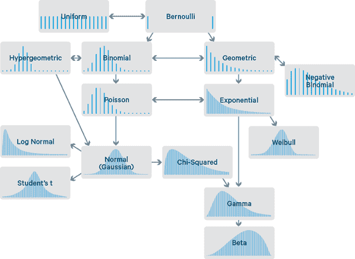

图 1: 概率分布流程图 [1]

在本文中，我将提供如何创建不同分布的代码片段。如果你对额外资源感兴趣，可以在 [这个我的 GitHub 仓库](https://github.com/pierpaolo28/Artificial-Intelligence-Projects/tree/master/Statistics)中找到。

首先，我们需要导入所有必要的库：

### 伯努利分布

伯努利分布是最容易理解的分布之一，可以作为推导更复杂分布的起点。

该分布只有两个可能的结果和一个试验。

一个简单的例子是一次掷硬币的结果。如果硬币是偏向的或不偏向的，那么结果为正面或反面的概率可以分别视为**p**和**(1 - p)**（互斥事件的概率总和需要等于一）。

在图 2 中，我提供了一个关于偏向硬币的伯努利分布的例子。

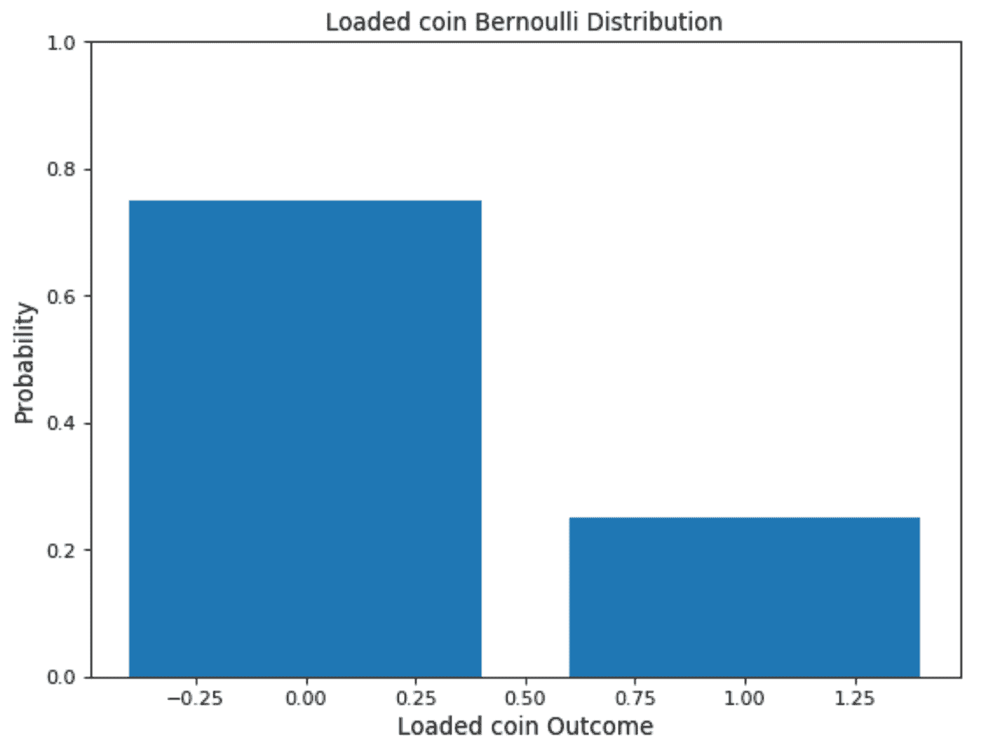

图 2: 偏向硬币的伯努利分布

### 均匀分布

均匀分布可以很容易地从伯努利分布中推导出来。在这种情况下，允许有可能无限多的结果，并且所有事件发生的概率是相同的。

例如，假设掷一个公平的骰子。在这种情况下，有多个可能的事件，每个事件发生的概率相同。

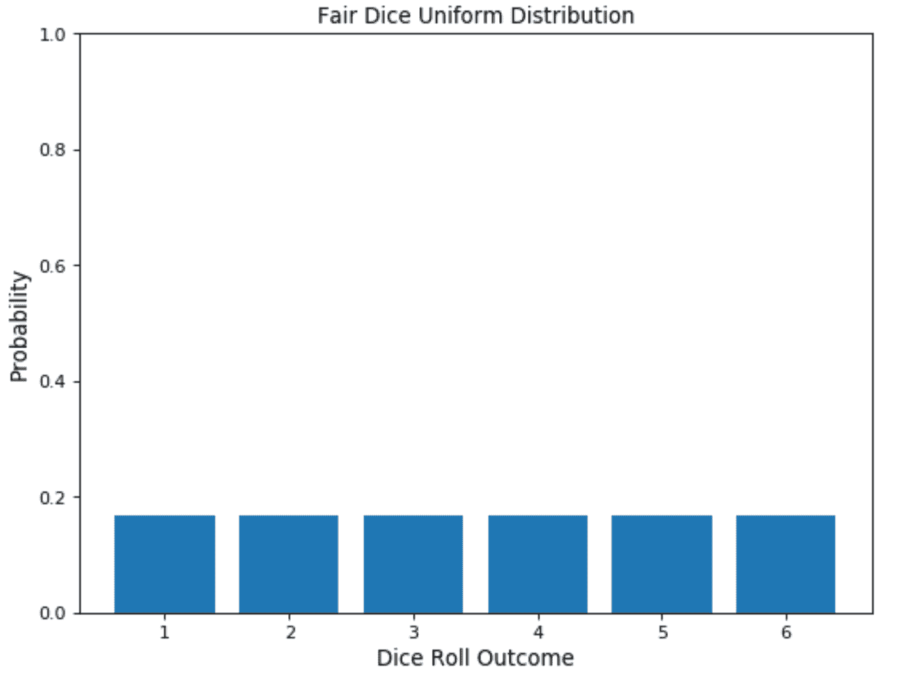

图 3: 公平骰子的掷骰分布

### 二项分布

二项分布可以被认为是遵循伯努利分布的事件结果的总和。因此，二项分布用于二元结果事件，并且所有连续试验中的成功和失败的概率是相同的。该分布接受两个参数作为输入：事件发生的次数和分配给两个类别之一的概率。

二项分布的一个简单示例是重复掷某个次数的偏向或不偏向硬币。

改变偏向的量会改变分布的外观（图 4）。

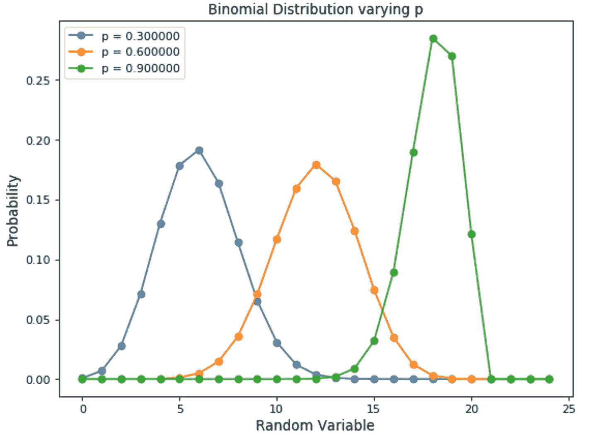

图 4: 二项分布变化的事件发生概率

二项分布的主要特征包括：

+   在多次试验中，每次试验彼此独立（一个试验的结果不会影响另一个试验）。

+   每次试验只能有两个可能的结果（例如，赢或输），其概率分别为**p**和**(1 - p)**。

如果给定成功的概率（**p**）和试验次数（**n**），我们可以使用以下公式（见图 5）计算这些 n 次试验中成功的概率（**x**）。

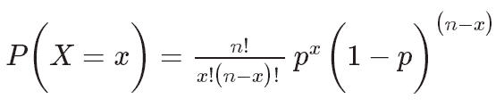

图 5：二项分布公式 [2]

### 正态（高斯）分布

正态分布是数据科学中最常用的分布之一。许多发生在我们日常生活中的常见现象都遵循正态分布，例如：经济中的收入分布、学生的平均成绩、人口的平均身高等。此外，小随机变量的和通常也遵循正态分布（中心极限定理）。

> “在概率论中，**中心极限定理**（**CLT**）表明，在某些情况下，当独立随机变量相加时，其适当标准化的和趋向于正态分布，即使原始变量本身并不服从正态分布。”
> 
> — [维基百科](https://en.wikipedia.org/wiki/Central_limit_theorem)

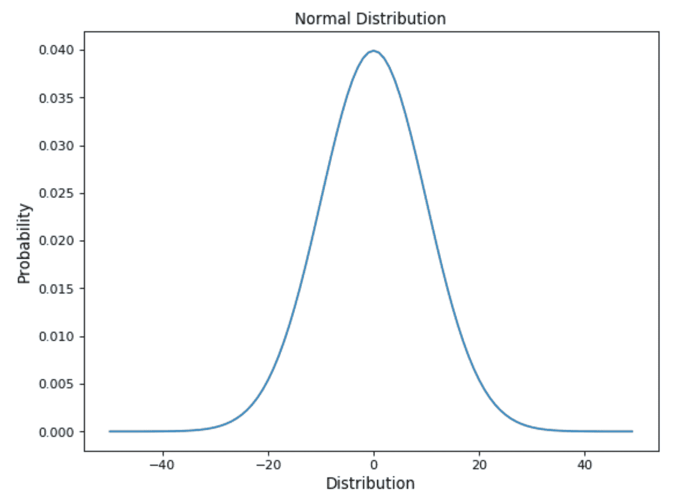

图 6：高斯分布

一些可以帮助我们识别正态分布的特征包括：

+   曲线在中心对称。因此，均值、众数和中位数都相等，使得所有值围绕均值对称分布。

+   分布曲线下的面积等于 1（所有概率的总和必须等于 1）。

可以使用以下公式推导出正态分布（见图 7）。

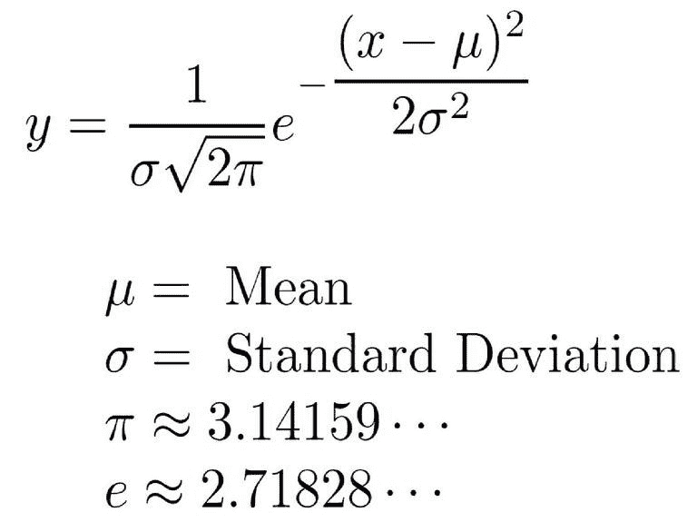

图 7：正态分布公式 [3]

在使用正态分布时，分布的均值和标准差起着非常重要的作用。如果我们知道它们的值，就可以通过检查概率分布（见图 8）轻松找出预测确切值的概率。实际上，得益于分布的特性，68%的数据位于均值的一个标准差内，95%位于均值的两个标准差内，99.7%位于均值的三个标准差内。

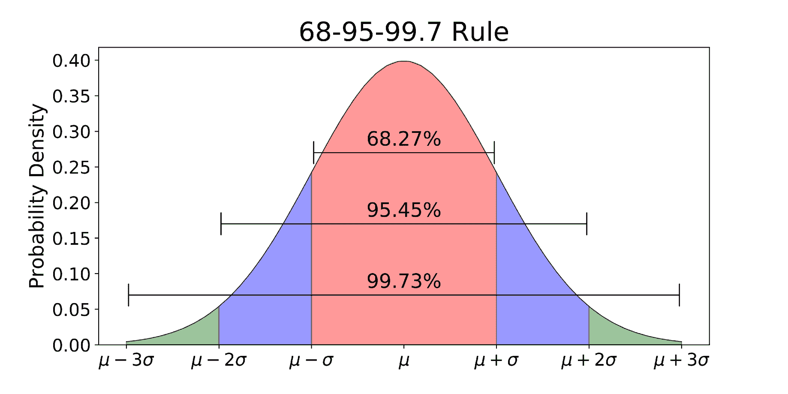

图 8：正态分布 68–95–99.7 规则 [4]

许多机器学习模型被设计为在使用遵循正态分布的数据时表现最佳。以下是一些例子：

+   高斯朴素贝叶斯分类器

+   线性判别分析

+   二次判别分析

+   最小二乘回归模型

此外，在某些情况下，还可以通过应用对数和平方根等变换将非正态数据转换为正态形式。

### 泊松分布

泊松分布常用于找到某个事件发生的概率，或者在不知道事件发生频率的情况下预测事件发生的次数。此外，泊松分布还可以用于预测在给定时间段内事件发生的次数。

泊松分布，例如，常被保险公司用于进行风险分析（例如，预测在预定时间段内发生的车祸数量）以决定车险定价。

在处理泊松分布时，我们可以对不同事件发生的平均时间有信心，但事件发生的确切时刻在时间上是随机分布的。

泊松分布可以使用以下公式进行建模（图 9），其中**λ**代表在一个时间段内可以发生的预期事件数量。

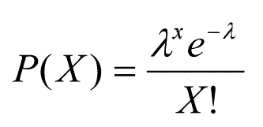

图 9：泊松分布公式 [5]

描述泊松过程的主要特征是：

1.  事件彼此独立（如果一个事件发生，这不会改变另一个事件发生的概率）。

1.  事件可以在定义的时间段内发生任意次数。

1.  两个事件不能同时发生。

1.  事件发生的平均速率是恒定的。

在图 10 中，展示了在一个时间段内预期事件数量（λ）变化如何改变泊松分布。

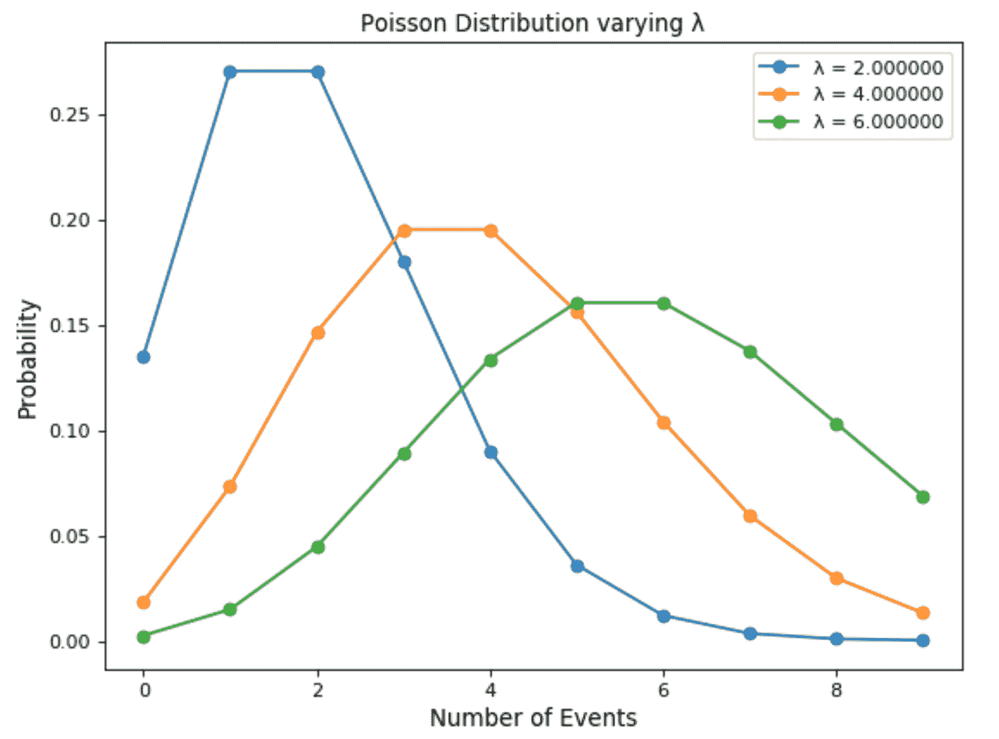

图 10：泊松分布变化λ

### 指数分布

最后，指数分布用于建模不同事件发生之间的时间。

例如，假设我们在一家餐馆工作，我们想预测不同顾客到餐馆的时间间隔。使用指数分布来解决这个问题，可能是一个完美的起点。

指数分布的另一个常见应用是生存分析（例如，设备/机器的预期寿命）。

指数分布由一个参数λ控制。λ值越大，指数曲线衰减得越快（图 11）。

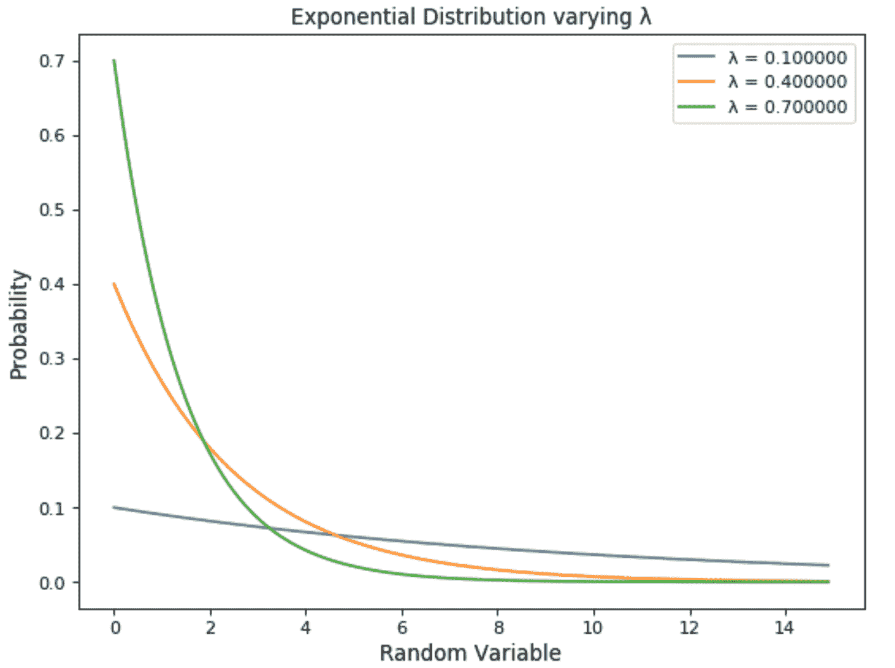

图 11：指数分布

指数分布使用以下公式进行建模（图 12）。

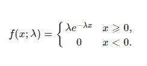

图 12：指数分布公式 [6]

如果你有兴趣调查概率分布如何用来解密随机过程，你可以在[这里](https://towardsdatascience.com/stochastic-processes-analysis-f0a116999e4)找到更多信息。

### 联系方式

如果你想随时了解我的最新文章和项目，[请关注我的 Medium](https://medium.com/@pierpaoloippolito28?source=post_page---------------------------)并订阅我的[邮件列表](http://eepurl.com/gwO-Dr?source=post_page---------------------------)。以下是我的一些联系方式：

+   [Linkedin](https://uk.linkedin.com/in/pier-paolo-ippolito-202917146?source=post_page---------------------------)

+   [个人博客](https://pierpaolo28.github.io/blog/?source=post_page---------------------------)

+   [个人网站](https://pierpaolo28.github.io/?source=post_page---------------------------)

+   [Medium 个人资料](https://towardsdatascience.com/@pierpaoloippolito28?source=post_page---------------------------)

+   [GitHub](https://github.com/pierpaolo28?source=post_page---------------------------)

+   [Kaggle](https://www.kaggle.com/pierpaolo28?source=post_page---------------------------)

### 参考书目

[1] 数据科学统计学简介。

Diogo Menezes Borges，《数据科学家的成长历程》。访问网址：[`medium.com/diogo-menezes-borges/introduction-to-statistics-for-data-science-7bf596237ac6`](https://medium.com/diogo-menezes-borges/introduction-to-statistics-for-data-science-7bf596237ac6)

[2] 二项随机变量，UF 生物统计学开放学习教科书。访问网址：[`bolt.mph.ufl.edu/6050-6052/unit-3b/binomial-random-variables/`](https://bolt.mph.ufl.edu/6050-6052/unit-3b/binomial-random-variables/)

[3] 正态分布或钟形曲线公式。ThoughtCo，Courtney Taylor**。 **访问网址：[`www.thoughtco.com/normal-distribution-bell-curve-formula-3126278`](https://www.thoughtco.com/normal-distribution-bell-curve-formula-3126278)

[4] 解释正态分布的 68–95–99.7 规则。

Michael Galarnyk，Medium。访问网址：[`towardsdatascience.com/understanding-the-68-95-99-7-rule-for-a-normal-distribution-b7b7cbf760c2`](https://towardsdatascience.com/understanding-the-68-95-99-7-rule-for-a-normal-distribution-b7b7cbf760c2)

[5] 正态分布、二项分布与泊松分布，Make Me Analyst。访问网址：[`makemeanalyst.com/wp-content/uploads/2017/05/Poisson-Distribution-Formula.png`](http://makemeanalyst.com/wp-content/uploads/2017/05/Poisson-Distribution-Formula.png)

[6] 指数函数公式，&learning。访问网址：[`www.andlearning.org/exponential-formula/`](https://www.andlearning.org/exponential-formula/)

**简介： [Pier Paolo Ippolito](https://www.linkedin.com/in/pierpaolo28/)** 是一名数据科学家，拥有南安普顿大学人工智能硕士学位。他对人工智能进展和机器学习应用（如金融和医学）有浓厚的兴趣。可以在 [Linkedin](https://www.linkedin.com/in/pierpaolo28/) 上与他联系。

[原文](https://towardsdatascience.com/probability-distributions-in-data-science-cce6e64873a7)。已获得许可转载。

**相关：**

+   什么是泊松分布？

+   如何优化你的 Jupyter Notebook

+   入门 R 编程

### 更多相关主题

+   [停止学习数据科学以寻找目标，找到目标后…](https://www.kdnuggets.com/2021/12/stop-learning-data-science-find-purpose.html)

+   [数据科学学习统计学的顶级资源](https://www.kdnuggets.com/2021/12/springboard-top-resources-learn-data-science-statistics.html)

+   [成功数据科学家的 5 个特征](https://www.kdnuggets.com/2021/12/5-characteristics-successful-data-scientist.html)

+   [每位数据科学家都应该了解的三个 R 库（即使你使用 Python）](https://www.kdnuggets.com/2021/12/three-r-libraries-every-data-scientist-know-even-python.html)

+   [一个 90 亿美元的人工智能失败，详细分析](https://www.kdnuggets.com/2021/12/9b-ai-failure-examined.html)

+   [是什么让 Python 成为初创企业理想的编程语言](https://www.kdnuggets.com/2021/12/makes-python-ideal-programming-language-startups.html)
