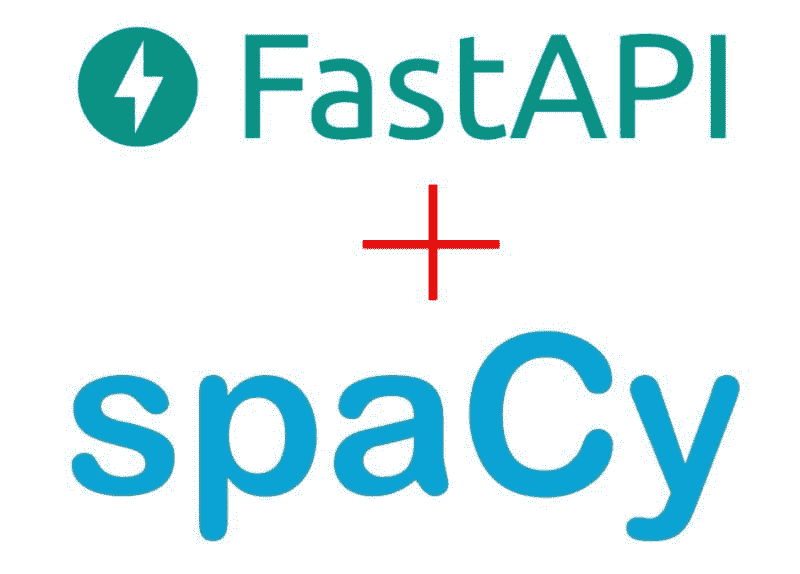

# 生产就绪的机器学习 NLP API，使用 FastAPI 和 spaCy

> 原文：[`www.kdnuggets.com/2021/04/production-ready-machine-learning-nlp-api-fastapi-spacy.html`](https://www.kdnuggets.com/2021/04/production-ready-machine-learning-nlp-api-fastapi-spacy.html)

评论

**作者：[Julien Salinas](https://www.linkedin.com/in/julien-salinas-673b3811/)，全栈开发者，[NLPCloud.io](https://nlpcloud.io) 的创始人兼首席技术官**



[FastAPI](https://fastapi.tiangolo.com/) 是一个新的 Python API 框架，今天越来越多地被用于生产环境中。我们在 [NLP Cloud](https://nlpcloud.io/) 的底层使用 FastAPI。NLP Cloud 是一个基于 spaCy 和 HuggingFace transformers 的 API，提供命名实体识别（NER）、情感分析、文本分类、摘要等服务。FastAPI 帮助我们快速构建了一个快速且稳健的机器学习 API，服务于 NLP 模型。

让我告诉你我们为什么做出这样的选择，并展示如何基于 FastAPI 和 spaCy 实现一个用于命名实体识别（NER）的 API。

### 为什么选择 FastAPI？

直到最近，我一直使用 Django Rest Framework 来构建 Python API。但 FastAPI 提供了几个有趣的功能：

+   它非常快速

+   它文档齐全

+   它易于使用

+   它会自动为你生成 API 架构（如 OpenAPI）

+   它在底层使用 Pydantic 进行类型验证。对于像我这样习惯静态类型的 Go 开发者来说，能够利用这样的类型提示非常酷。它使代码更清晰，减少了错误的可能性。

FastAPI 的性能使其成为机器学习 API 的一个优秀候选者。考虑到我们在 NLP Cloud 中服务了许多基于 spaCy 和 transformers 的高要求 NLP 模型，FastAPI 是一个很好的解决方案。

### 设置 FastAPI

你可以选择自己安装 FastAPI 和 Uvicorn（FastAPI 前面的 ASGI 服务器）：

```py
pip install fastapi[all] 
```

如你所见，FastAPI 在一个 ASGI 服务器后面运行，这意味着它可以原生处理使用 asyncio 的异步 Python 请求。

然后你可以用类似这样的方式运行你的应用：

```py
uvicorn main:app 
```

另一个选择是使用 Sebastián Ramírez（FastAPI 的创始人）慷慨提供的 Docker 镜像。这些镜像已维护，并且开箱即用。

例如，[Uvicorn + Gunicorn + FastAPI](https://github.com/tiangolo/uvicorn-gunicorn-fastapi-docker) 镜像将 Gunicorn 添加到堆栈中，以处理并行进程。基本上，Uvicorn 处理单个 Python 进程中的多个并行请求，而 Gunicorn 处理多个并行 Python 进程。

如果你按照镜像文档正确操作，应用程序应该会自动通过 `docker run` 启动。

这些图像是可定制的。例如，你可以调整 Gunicorn 创建的并行进程数量。根据你的 API 需求调整这些参数非常重要。如果你的 API 服务一个需要几个 GB 内存的机器学习模型，你可能想要减少 Gunicorn 的默认并发，否则你的应用程序将快速消耗过多内存。

### 简单的 FastAPI + spaCy NER API

假设你想创建一个使用[spaCy](https://spacy.io/)进行命名实体识别（NER）的 API 端点。基本上，NER 是从句子中提取实体如名字、公司、职位等。[有关 NER 的更多细节](https://nlpcloud.io/nlp-named-entity-recognition-ner-api.html)，如果需要的话。

这个端点将接受一个句子作为输入，并返回一个实体列表。每个实体由实体第一个字符的位置、实体的最后位置、实体的类型以及实体文本本身组成。

端点将以 POST 请求的方式进行查询：

```py
curl "http://127.0.0.1/entities" \
  -X POST \
  -d '{"text":"John Doe is a Go Developer at Google"}' 
```

它将返回类似这样的内容：

```py
[
  {
    "end": 8,
    "start": 0,
    "text": "John Doe",
    "type": "PERSON"
  },
  {
    "end": 25,
    "start": 13,
    "text": "Go Developer",
    "type": "POSITION"
  },
  {
    "end": 35,
    "start": 30,
    "text": "Google",
    "type": "ORG"
  },
] 
```

下面是我们如何操作：

```py
import spacy
from fastapi import FastAPI
from pydantic import BaseModel
from typing import List

model = spacy.load("en_core_web_lg")

app = FastAPI()

class UserRequestIn(BaseModel):
    text: str

class EntityOut(BaseModel):
    start: int
    end: int
    type: str
    text: str

class EntitiesOut(BaseModel):
    entities: List[EntityOut]

@app.post("/entities", response_model=EntitiesOut)
def read_entities(user_request_in: UserRequestIn):
    doc = model(user_request_in.text)

    return {
        "entities": [
            {
                "start": ent.start_char,
                "end": ent.end_char,
                "type": ent.label_,
                "text": ent.text,
            } for ent in doc.ents
        ]
    } 
```

首要的是我们正在加载 spaCy 模型。对于我们的示例，我们使用了一个大型的 spaCy 预训练英文模型。大型模型占用更多内存和磁盘空间，但由于在更大的数据集上进行训练，因此提供了更好的准确性。

```py
model = spacy.load("en_core_web_lg") 
```

稍后，我们将通过以下方式使用这个 spaCy 模型进行 NER：

```py
doc = model(user_request_in.text)
# [...]
doc.ents 
```

第二个令人惊叹的 FastAPI 特性是使用 Pydantic 强制数据验证的能力。基本上，你需要提前声明用户输入的格式和 API 响应的格式。如果你是 Go 开发者，你会发现这与使用结构体进行 JSON 解组非常相似。例如，我们这样声明返回实体的格式：

```py
class EntityOut(BaseModel):
    start: int
    end: int
    type: str
    text: str 
```

请注意，`start`和`end`是句子中的位置，因此它们是整数，而`type`和`text`是字符串。如果 API 尝试返回一个未实现此格式的实体（例如，如果`start`不是整数），FastAPI 将抛出错误。

如你所见，将一个验证类嵌套到另一个类中是可能的。这里我们返回的是一个实体列表，因此我们需要声明以下内容：

```py
class EntitiesOut(BaseModel):
    entities: List[EntityOut] 
```

一些简单类型如`int`和`str`是内置的，但更复杂的类型如`List`需要显式导入。

为了简洁起见，响应验证可以在装饰器中实现：

```py
@app.post("/entities", response_model=EntitiesOut) 
```

### 更高级的数据验证

使用 FastAPI 和 Pydantic 可以做许多更高级的验证。例如，如果你需要用户输入的最小长度为 10 个字符，你可以这样做：

```py
from pydantic import BaseModel, constr

class UserRequestIn(BaseModel):
    text: constr(min_length=10) 
```

现在，如果 Pydantic 验证通过，但你后来发现数据有问题，因此想要返回 HTTP 400 代码，该怎么办？

只需引发一个`HTTPException`：

```py
from fastapi import HTTPException

raise HTTPException(
            status_code=400, detail="Your request is malformed") 
```

这只是几个例子，你可以做更多！只需查看 FastAPI 和 Pydantic 文档即可。

### 根路径

在反向代理后运行这样的 API 是很常见的。例如，我们在 NLPCloud.io 背后使用的是 Traefik 反向代理。

在反向代理后运行时，一个棘手的事情是你的子应用程序（这里是 API）并不一定知道整个 URL 路径。实际上，这很好，因为它表明你的 API 与应用程序的其余部分是松散耦合的。

例如，我们希望 API 认为端点 URL 是 ` /entities`，但实际的 URL 可能是类似 ` /api/v1/entities` 的东西。这里是如何通过设置根路径来实现：

```py
app = FastAPI(root_path="/api/v1") 
```

如果你手动启动 Uvicorn，你也可以通过传递额外的参数来实现：

```py
uvicorn main:app --root-path /api/v1 
```

### 结论

如你所见，使用 FastAPI 创建 API 非常简单，而 Pydantic 的验证使得代码非常表达清晰（从而减少了对文档的需求）并且更不容易出错。

FastAPI 提供了出色的性能，并且可以直接使用 asyncio 进行异步请求，这对于需求高的机器学习模型非常有利。上面的示例关于使用 spaCy 和 FastAPI 的命名实体提取几乎可以认为是生产就绪的（当然，API 代码只是完整集群应用程序的一小部分）。到目前为止，FastAPI 从未成为我们 NLPCloud.io 基础设施的瓶颈。

如果你有任何问题，请随时提问！

**[也有法语版](https://juliensalinas.com/fr/api-machine-learning-nlp-production-fastapi-nlpcloud)**

**简历： [Julien Salinas](https://www.linkedin.com/in/julien-salinas-673b3811/)** 是一位全栈工程师，精通 Python/Django、Go、Vue.js、Linux 和 Docker。他是 [NLPCloud.io](https://nlpcloud.io) 的创始人和首席技术官，该 API 帮助开发人员和数据科学家轻松地在生产环境中使用 NLP。他喜欢山脉、滑雪、拳击……同时也是两个男孩的父亲。

[原文](https://juliensalinas.com/en/machine-learning-nlp-api-production-fastapi-nlpcloud/)。经许可转载。

**相关：**

+   如何将 Transformers 应用于任何长度的文本

+   如何在 Kubernetes 中部署 Flask API 并与其他微服务连接

+   机器学习项目为何会失败？

* * *

## 我们的前三个课程推荐

 1\. [Google 网络安全证书](https://www.kdnuggets.com/google-cybersecurity) - 快速开启网络安全职业生涯。

 2\. [Google 数据分析专业证书](https://www.kdnuggets.com/google-data-analytics) - 提升你的数据分析技能

 3\. [谷歌 IT 支持专业证书](https://www.kdnuggets.com/google-itsupport) - 支持你的组织在 IT 方面

* * *

### 主题更多内容

+   [开始使用 spaCy 进行 NLP](https://www.kdnuggets.com/2022/11/getting-started-spacy-nlp.html)

+   [使用 spaCy 进行自然语言处理](https://www.kdnuggets.com/2023/01/natural-language-processing-spacy.html)

+   [FastAPI 教程：用 Python 几分钟内构建 API](https://www.kdnuggets.com/fastapi-tutorial-build-apis-with-python-in-minutes)

+   [认识 Gorilla：UC 伯克利与微软的 API 增强型 LLM…](https://www.kdnuggets.com/2023/06/meet-gorilla-uc-berkeley-microsoft-apiaugmented-llm-outperforms-gpt4-chatgpt-claude.html)

+   [OpenAI 的 Whisper API 用于转录和翻译](https://www.kdnuggets.com/2023/06/openai-whisper-api-transcription-translation.html)

+   [如何免费访问和使用 Gemini API](https://www.kdnuggets.com/how-to-access-and-use-gemini-api-for-free)
