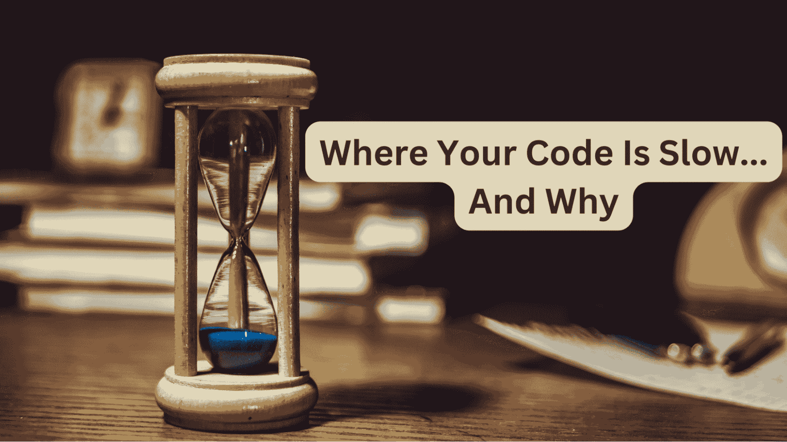
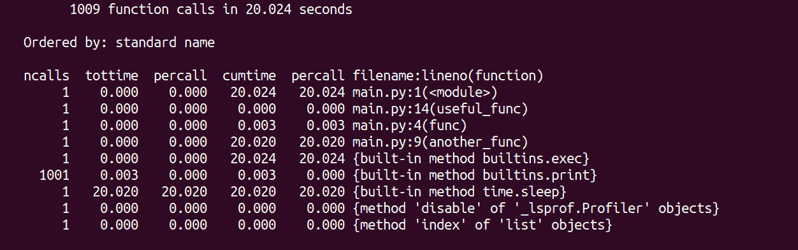
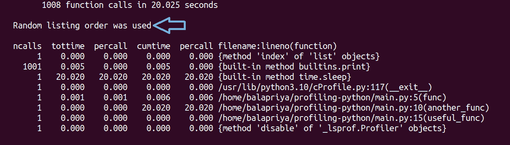
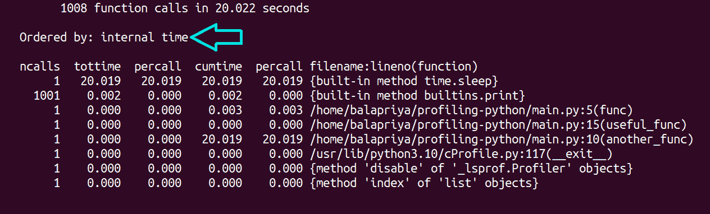

# 使用 timeit 和 cProfile 进行 Python 代码性能分析

> 原文：[`www.kdnuggets.com/profiling-python-code-using-timeit-and-cprofile`](https://www.kdnuggets.com/profiling-python-code-using-timeit-and-cprofile)



作者提供的图片

作为一名软件开发人员，你在职业生涯中可能会多次听到 [“过早优化是万恶之源”](https://ubiquity.acm.org/article.cfm?id=1513451#:~:text=The%20second%20thing%20to%20note,you%20get%20with%20micro%2Doptimization) 的名言。虽然对于小项目来说，优化可能不是非常有用（或绝对必要），但性能分析通常是有帮助的。

* * *

## 我们的前 3 个课程推荐

 1\. [谷歌网络安全证书](https://www.kdnuggets.com/google-cybersecurity) - 快速进入网络安全职业生涯。

 2\. [谷歌数据分析专业证书](https://www.kdnuggets.com/google-data-analytics) - 提升你的数据分析能力

 3\. [谷歌 IT 支持专业证书](https://www.kdnuggets.com/google-itsupport) - 支持你的组织 IT

* * *

完成模块编码后，进行性能分析是一种良好的实践，可以测量每个部分执行所需的时间。这有助于识别代码异味并指导优化以提高代码质量。所以在优化之前一定要进行性能分析！

要迈出第一步，本指南将帮助你开始使用 Python 中的内置 [timeit](https://docs.python.org/3/library/timeit.html) 和 [cProfile](https://docs.python.org/3/library/profile.html#module-cProfile) 模块进行性能分析。你将学习如何使用命令行界面和在 Python 脚本中等效的调用方式。

# 如何使用 timeit 性能分析 Python 代码

timeit 模块是 Python 标准库的一部分，提供了一些方便的函数，可以用来计时短代码片段。

让我们以反转 Python 列表的简单示例为例。我们将测量使用以下方法获取列表反转副本的执行时间：

+   `reversed()` 函数，以及

+   列表切片。

```py
>>> nums=[6,9,2,3,7]
>>> list(reversed(nums))
[7, 3, 2, 9, 6]
>>> nums[::-1]
[7, 3, 2, 9, 6]
```

## 在命令行中运行 timeit

你可以使用以下语法在命令行中运行 `timeit`：

```py
$ python -m timeit -s 'setup-code' -n 'number' -r 'repeat' 'stmt'
```

你需要提供要测量执行时间的语句 `stmt`。

你可以在需要时指定 `setup` 代码——使用短选项 -s 或长选项 --setup。setup 代码只会运行一次。

执行语句的次数：短选项 -n 或长选项 --number 是可选的。重复此循环的次数：短选项 -r 或长选项 --repeat 也是可选的。

让我们在示例中查看上述内容：

这里创建列表是 `setup` 代码，反转列表是要计时的语句：

```py
$ python -m timeit -s 'nums=[6,9,2,3,7]' 'list(reversed(nums))'
500000 loops, best of 5: 695 nsec per loop
```

当你没有指定`repeat`的值时，使用默认值 5。当你没有指定`number`时，代码将运行足够多的次数，以达到至少[0.2 秒](https://docs.python.org/3/library/timeit.html#cmdoption-timeit-n)的总时间。

此示例明确设置了执行语句的次数：

```py
$ python -m timeit -s 'nums=[6,9,2,3,7]' -n 100Bu000 'list(reversed(nums))'
100000 loops, best of 5: 540 nsec per loop
```

`repeat`的默认值是 5，但我们可以将其设置为任何合适的值：

```py
$ python3 -m timeit -s 'nums=[6,9,2,3,7]' -r 3 'list(reversed(nums))'
500000 loops, best of 3: 663 nsec per loop
```

让我们也来测量列表切片方法的时间：

```py
$ python3 -m timeit -s 'nums=[6,9,2,3,7]' 'nums[::-1]'
1000000 loops, best of 5: 142 nsec per loop
```

列表切片方法似乎更快（所有示例均在 Ubuntu 22.04 上的 Python 3.10 中）。

## 在 Python 脚本中运行 timeit

这是在 Python 脚本中运行 timeit 的等效方法：

```py
import timeit

setup = 'nums=[9,2,3,7,6]'
number = 100000
stmt1 = 'list(reversed(nums))'
stmt2 = 'nums[::-1]'

t1 =  timeit.timeit(setup=setup,stmt=stmt1,number=number)
t2 = timeit.timeit(setup=setup,stmt=stmt2,number=number)

print(f"Using reversed() fn.: {t1}")
print(f"Using list slicing: {t2}")
```

`timeit()`可调用对象返回`stmt`执行`number`次的执行时间。注意，我们可以明确指定运行次数，或者让`number`取默认值 1000000。

```py
Output >>
Using reversed() fn.: 0.08982690000000002
Using list slicing: 0.015550800000000004
```

这将执行语句——而不重复计时器函数——指定的`number`次，并返回执行时间。通常也可以使用`time.repeat()`并取最小时间，如下所示：

```py
import timeit

setup = 'nums=[9,2,3,7,6]'
number = 100000
stmt1 = 'list(reversed(nums))'
stmt2 = 'nums[::-1]'

t1 =  min(timeit.repeat(setup=setup,stmt=stmt1,number=number))
t2 = min(timeit.repeat(setup=setup,stmt=stmt2,number=number))

print(f"Using reversed() fn.: {t1}")
print(f"Using list slicing: {t2}")
```

这将重复运行代码`number`次，重复`repeat`次，并返回最小执行时间。这里我们有 5 次重复，每次 100000 次。

```py
Output >>
Using reversed() fn.: 0.055375300000000016
Using list slicing: 0.015101400000000043
```

# 如何使用 cProfile 分析 Python 脚本

我们已经看到 timeit 可以用来测量短代码片段的执行时间。然而，在实际应用中，分析整个 Python 脚本更有帮助。

这将给我们所有函数和方法调用的执行时间——包括内置函数和方法。因此，我们可以更好地了解更昂贵的函数调用，并识别优化机会。例如：可能存在一个过慢的 API 调用。或者一个函数可能有一个可以用更 Pythonic 的推导式替换的循环。

让我们学习如何使用 cProfile 模块（也属于 Python 标准库）来分析 Python 脚本。

考虑以下 Python 脚本：

```py
# main.py
import time

def func(num):
    for i in range(num):
        print(i)

def another_func(num):
    time.sleep(num)
    print(f"Slept for {num} seconds")

def useful_func(nums, target):
    if target in nums:
        return nums.index(target)

if __name__ == "__main__":
    func(1000)
    another_func(20)
    useful_func([2, 8, 12, 4], 12)
```

这里有三个函数：

+   `func()`循环遍历数字范围并打印出来。

+   包含对`sleep()`函数调用的`another func()`。

+   `useful_func()`返回列表中目标数字的索引（如果目标在列表中）。

上述列出的函数将在每次运行 main.py 脚本时被调用。

## 在命令行运行 cProfile

使用命令行运行 cProfile：

```py
python3 -m file-name.py
```

这里我们将文件命名为 main.py：

```py
python3 -m main.py
```

运行此代码应该会得到以下输出：

```py
 Output >>
  0
  ...
  999
  Slept for 20 seconds
```

以及以下配置文件：



这里，`ncalls`指的是函数调用的次数，`percall`指的是每次函数调用的时间。如果`ncalls`的值大于 1，则`percall`是所有调用的平均时间。

脚本的执行时间被 `another_func` 所主导，该函数使用内置的 `sleep` 函数调用（休眠 20 秒）。我们也看到 `print` 函数调用的开销相当大。

## 在 Python 脚本中使用 cProfile

尽管在命令行运行 cProfile 工作得很好，你也可以将性能分析功能添加到 Python 脚本中。你可以使用 cProfile 结合 [pstats 模块](https://docs.python.org/3/library/profile.html) 来进行性能分析和访问统计信息。

作为处理资源设置和拆除的最佳实践，使用 with 语句并创建一个作为上下文管理器的 profile 对象：

```py
# main.py
import pstats
import time
import cProfile

def func(num):
    for i in range(num):
        print(i)

def another_func(num):
    time.sleep(num)
    print(f"Slept for {num} seconds")

def useful_func(nums, target):
    if target in nums:
        return nums.index(target)

if __name__ == "__main__":
    with cProfile.Profile() as profile:
        func(1000)
        another_func(20)
        useful_func([2, 8, 12, 4], 12)
    profile_result = pstats.Stats(profile)
    profile_result.print_stats()
```

让我们更深入地查看生成的输出文件：



当你分析一个大型脚本时，*按执行时间排序结果* 会很有帮助。为此，你可以在 profile 对象上调用 `sort_stats` 方法，并根据执行时间进行排序：

```py
...
if __name__ == "__main__":
    with cProfile.Profile() as profile:
        func(1000)
        another_func(20)
        useful_func([2, 8, 12, 4], 12)
    profile_result = pstats.Stats(profile)
    profile_result.sort_stats(pstats.SortKey.TIME)
    profile_result.print_stats()
```

现在运行脚本时，你应该能看到按时间排序的结果：



# 结论

我希望这份指南能帮助你开始使用 Python 进行性能分析。始终记住，优化不应以牺牲可读性为代价。如果你有兴趣了解其他性能分析工具，包括第三方 Python 包，请查看这篇关于 Python 性能分析器的文章。

**[Bala Priya C](https://www.linkedin.com/in/bala-priya/)** 是来自印度的开发者和技术作家。她喜欢在数学、编程、数据科学和内容创作的交集处工作。她的兴趣和专长领域包括 DevOps、数据科学和自然语言处理。她喜欢阅读、写作、编码和咖啡！目前，她正在学习并通过撰写教程、操作指南、意见文章等与开发者社区分享她的知识。

### 更多相关主题

+   [Python 内存分析简介](https://www.kdnuggets.com/introduction-to-memory-profiling-in-python)

+   [使用管道编写干净的 Python 代码](https://www.kdnuggets.com/2021/12/write-clean-python-code-pipes.html)

+   [优化 Python 代码性能：深入分析 Python 性能分析器](https://www.kdnuggets.com/2023/02/optimizing-python-code-performance-deep-dive-python-profilers.html)

+   [追踪和可视化 Python 代码执行的 3 个工具](https://www.kdnuggets.com/2021/12/3-tools-track-visualize-execution-python-code.html)

+   [KDnuggets™ 新闻 22:n01，1 月 5 日：追踪和可视化的 3 个工具…](https://www.kdnuggets.com/2022/n01.html)

+   [掌握 Python：编写清晰、组织良好的代码的 7 种策略](https://www.kdnuggets.com/mastering-python-7-strategies-for-writing-clear-organized-and-efficient-code)
