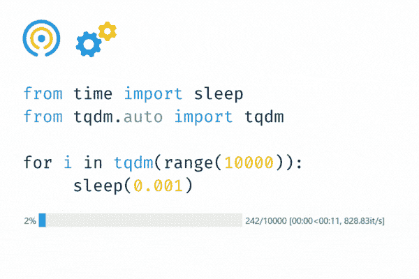
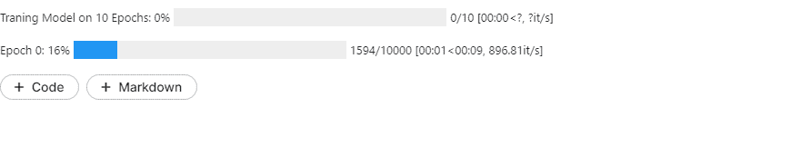

# 使用 tqdm 的 Python 进度条，带来乐趣与收益

> 原文：[`www.kdnuggets.com/2022/09/progress-bars-python-tqdm-fun-profit.html`](https://www.kdnuggets.com/2022/09/progress-bars-python-tqdm-fun-profit.html)



Gif 作者

# tqdm

* * *

## 我们的三大课程推荐

 1\. [谷歌网络安全证书](https://www.kdnuggets.com/google-cybersecurity) - 快速进入网络安全职业生涯。

 2\. [谷歌数据分析专业证书](https://www.kdnuggets.com/google-data-analytics) - 提升你的数据分析技能

 3\. [谷歌 IT 支持专业证书](https://www.kdnuggets.com/google-itsupport) - 支持你所在组织的 IT

* * *

在阿拉伯语中，[tqdm](https://github.com/tqdm/tqdm)（taqadum）意味着进展，它用于为循环创建智能进度条。你只需要将 tqdm 包裹在任何可迭代对象上 - **tqdm(iterable)**。

tqdm 可以帮助你为数据处理、训练机器学习模型、多循环 Python 函数以及从互联网下载数据创建进度条。

使用 pip 安装该软件包：

```py
pip install tqdm
```

复制粘贴下面的代码，并在我们的机器上运行，以亲身体验 tqdm 的魔力。

tqdm 显示了进度条、迭代次数、运行循环所用的时间以及每秒的迭代频率。

```py
from tqdm import tqdm

for i in tqdm(range(10000)):
    pass
```

```py
100%|????????????????????????????????????????| 10000/10000 [00:00<00:00, 1764759.54it/s]
```

在本教程中，我们将学习如何自定义进度条，并将其与 pandas 数据框集成。我们还将学习额外的功能，如并发。

# Python 进度条教程

## tqdm 和 Python 函数

在下面的示例中，我们创建了一个 **fun** 函数，它接受整数 **x** 并在 **x** 秒延迟后运行。

然后，我们将 tqdm 包裹在 range 函数周围，这样它将运行一个循环，进行 **0-9** 的 10 次迭代。

第一次迭代将花费 **零** 秒。第二次迭代将花费 **1** 秒，以此类推。循环完成花费了 **45** 秒，我们体验到了动画进度条。

太棒了！

## tqdm.notebook 在列表中

在这一部分，我们将使用 **tqdm.notebook** 模块在 Jupyter Notebook 中使用 Ipython 小部件显示进度条。

首先，创建一个简单的不同颜色的列表。然后，使用循环逐一打印名称，每次打印之间延迟一秒钟。

我们在列表周围添加了包装器，它显示了一个多色进度条。

太棒了！


## 多个进度条

让我们创建多循环进度条以模拟机器学习模型训练。

1.  **trange** 是 tqdm 在 range 函数周围的一个包装。

1.  外层循环将运行 10 次，延迟 0.01 秒。

1.  **desc** 用于标记进度条。我会在进度条之前显示它。

1.  内部循环将运行 10,000 次，延迟为 0.001。

正如我们所观察到的，多重进度条的动画效果非常惊艳。为了更好地理解，我希望你复制代码、修改它，并在你的机器上运行，亲身体验这份魔法。



# tqdm 适用于数据科学。

在这一部分，我们将把 tqdm 集成到 pandas dataframe 中，并使用 **progress_apply** 将函数应用于 dataframe，同时显示进度条。

## 加载数据集

首先，我们将从 Kaggle 加载 [酒店预订](https://www.kaggle.com/datasets/mojtaba142/hotel-booking) 数据集。然后，我们将显示 dataframe 的前五行。

数据集包含 2015 年 7 月 1 日至 2017 年 8 月 31 日之间的城市酒店和度假酒店预订的 119390 条观察数据，包括实际到达的预订和被取消的预订。

你可以向右滚动以查看值和列名。

## 使用 tqdm

在这一部分，我们将使用客户的姓名创建一个新的列“user_name”。

1.  **tqdm.pandas** 用于为 pandas dataframe 启动进度条。我们还将添加进度条标签“Processing the name column”。

1.  **user_name** 函数将字符串转换为小写，并用“–”替换空格。

1.  使用 **.progress_apply()** 函数对 dataframe 应用函数。这类似于 **apply()** 函数。对于 **map()** 函数，你可以使用 **.progress_map()**。

1.  显示前三行

如果你向右滚动，你会看到一个新的列 **user_name**，其中包含值。

## 并行处理工具

tqdm 不仅仅是循环的进度条。它还提供了如 **tqdm.contrib.concurrent** 的并行处理实用工具。

在这一部分，我们将从电子邮件列中提取 **email provider**。

1.  从 **tqdm.contrib.concurrent** 导入 **process_map**。

1.  **provider_extraction** 函数将根据“@”和“.”拆分文本。

1.  使用 process_map 将函数映射到 df["email"] 上。我们将基于 CPU 数量选择 8 个 max_worker，并将 chunksize 设置为 64。

1.  添加进度条标签并自定义它，以显示绿色进度条而不是黑色。

1.  查看“email_provider”列的前 5 个值。

成功了！我们用绿色进度条提取了电子邮件提供者。这不是很棒吗？

# 结论

玩弄 tqdm 并与大家分享我的经验是一次有趣的经历。除了乐趣，它还为软件开发提供了必要的功能。

我使用了 GitHub gist、Deepnote 嵌入和 Kaggle 来添加代码块和 Gif。你可以查看这些工具，并使用 tqdm 创造你的魔法。

在这篇博客中，我们学习了 tqdm 在 Python 循环、列表、多级进度条、pandas 集成以及使用并发模块进行并行处理中的应用。

**阅读** [**文档**](https://tqdm.github.io) **以了解更多功能：**

+   异步

+   回调函数（Dask，Keras）

+   迭代器的装饰器（Tkinter，Matplotlib）

+   CLI（终端，控制台）

+   精简包装器（并发，itertools）

+   日志记录

+   发送更新（slack，discord，telegram）

**[Abid Ali Awan](https://www.polywork.com/kingabzpro)** ([@1abidaliawan](https://twitter.com/1abidaliawan)) 是一位认证的数据科学专业人士，热爱构建机器学习模型。目前，他专注于内容创作和撰写关于机器学习和数据科学技术的技术博客。Abid 拥有技术管理硕士学位和电信工程学士学位。他的愿景是使用图神经网络为那些在心理健康上挣扎的学生构建 AI 产品。

### 更多关于这个主题

+   [开源工具在加速数据科学进展中的角色](https://www.kdnuggets.com/2023/05/role-open-source-tools-accelerating-data-science-progress.html)

+   [适合初学者的有趣 Python 项目！](https://www.kdnuggets.com/2022/10/beginner-friendly-python-projects-fun.html)

+   [简短有趣的课程，让你迅速了解生成 AI](https://www.kdnuggets.com/short-and-fun-courses-to-get-you-up-to-speed-about-generative-ai)

+   [理解 Python 的迭代和成员资格：__contains__ 和 __iter__ 魔法方法指南](https://www.kdnuggets.com/understanding-pythons-iteration-and-membership-a-guide-to-__contains__-and-__iter__-magic-methods)

+   [优化 Python 代码性能：深入探讨 Python 解析器](https://www.kdnuggets.com/2023/02/optimizing-python-code-performance-deep-dive-python-profilers.html)

+   [Python 枚举：如何在 Python 中构建枚举](https://www.kdnuggets.com/python-enum-how-to-build-enumerations-in-python)
