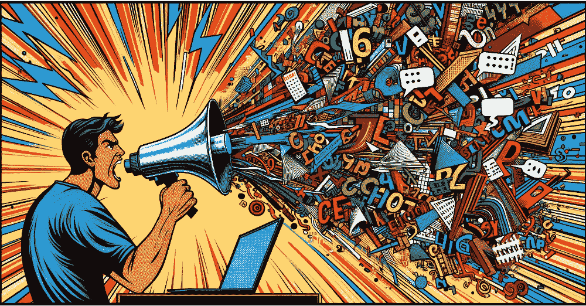

# 提示工程 101：掌握有效的 LLM 沟通

> 原文：[`www.kdnuggets.com/prompt-engineering-101-mastering-effective-llm-communication`](https://www.kdnuggets.com/prompt-engineering-101-mastering-effective-llm-communication)

图片由作者使用 DALL•E 3 创建

# 介绍

* * *

## 我们的前 3 个课程推荐

 1\. [谷歌网络安全证书](https://www.kdnuggets.com/google-cybersecurity) - 快速进入网络安全职业生涯。

 2\. [谷歌数据分析专业证书](https://www.kdnuggets.com/google-data-analytics) - 提升你的数据分析能力

 3\. [谷歌 IT 支持专业证书](https://www.kdnuggets.com/google-itsupport) - 支持你组织的 IT 工作

* * *

提示工程，像语言模型本身一样，在过去的 12 个月里取得了长足的进步。仅仅一年前，ChatGPT 的问世就将所有人对 AI 的恐惧和期望推向了一个充满压力的高压锅中，几乎在一夜之间加速了 AI 末日和拯救故事的传播。当然，提示工程在 ChatGPT 之前就已经存在，但我们用来从现在充斥我们生活的各种语言模型中引发所需回应的技术范围，随着 ChatGPT 的崛起，也真正进入了自己的发展阶段。五年前，随着最初的 GPT 问世，我们开玩笑说“提示工程师”有一天可能会成为一个职业头衔；而今天，提示工程师已经成为最热门的技术（或技术相关）职业之一。

> 提示工程是构建可以被生成型 AI 模型解读和理解的文本的过程。提示是描述 AI 应该执行任务的自然语言文本。
> 
> 从“提示工程” [维基百科条目](https://en.wikipedia.org/wiki/Prompt_engineering)

抛开炒作不谈，提示工程现在已经成为那些经常与 LLM 互动的人的生活中不可或缺的一部分。如果你正在阅读这篇文章，那么你很可能就是*你*，或者你可能正朝着这样的职业方向发展。对于那些想了解提示工程是什么，以及——更重要的是——当前的提示策略环境是什么样的，这篇文章就是为你准备的。

# 入门

让我们从基础开始。这篇文章，[与 ChatGPT 进行有效互动的提示工程](https://machinelearningmastery.com/prompt-engineering-for-effective-interaction-with-chatgpt/)，在机器学习大师网站上涵盖了提示工程的基础概念。具体来说，介绍的主题包括：

+   **提示原则**，概述了在优化提示过程中需要记住的几个基础技巧

+   **基础提示工程**，如提示措辞、简洁性以及正面和负面提示

+   **高级提示工程策略**，包括单次和多次提示、链式思维提示、自我批评和迭代提示

+   **合作力量技巧**，用于识别和培养与 ChatGPT 的合作氛围，以推动进一步成功

> 提示工程是有效利用大型语言模型（LLMs）的关键方面，是定制与 ChatGPT 交互的强大工具。它涉及制定清晰而具体的指令或查询，以引导语言模型产生所需的响应。通过精心构造提示，用户可以将 ChatGPT 的输出引导向其预期的目标，并确保更准确和有用的回应。
> 
> 来自《机器学习大师》文章 "[有效与 ChatGPT 互动的提示工程](https://machinelearningmastery.com/prompt-engineering-for-effective-interaction-with-chatgpt/)"

一旦你掌握了基础知识，并对提示工程及一些当前最有用的技术有了了解，你就可以继续学习掌握这些技术。

# 提示工程技术深度探讨

以下 KDnuggets 文章分别概述了单一的常见提示工程技术。这些技术的复杂性有一个逻辑进展，因此从顶部开始逐步阅读将是最佳方法。

每篇文章包含了首次提出该技术的学术论文概述。你可以在文章中阅读该技术的解释，了解它如何与其他技术相关联，并找到其实现的示例，如果你对阅读或浏览相关论文感兴趣，也可以在文章中找到相关链接。

**[揭示链式思维提示在大型语言模型中的力量](https://www.kdnuggets.com/2023/07/power-chain-thought-prompting-large-language-models.html)**

本文深入探讨了链式思维（CoT）提示的概念，这是一种增强大型语言模型（LLMs）推理能力的技术。它讨论了 CoT 提示背后的原理、应用及其对 LLM 性能的影响。

**[探索思维树提示：AI 如何通过搜索学习推理](https://www.kdnuggets.com/2023/07/exploring-tree-of-thought-prompting-ai-learn-reason-through-search.html)**

新的方法将问题解决表示为对大型语言模型的推理步骤进行搜索，允许超越从左到右解码的战略探索和规划。这提高了在数学谜题和创意写作等挑战中的表现，并增强了 LLM 的可解释性和适用性。

**[自动化思维链：AI 如何自我提示以进行推理](https://www.kdnuggets.com/2023/07/automating-chain-of-thought-ai-prompt-itself-reason.html)**

Auto-CoT 提示方法让大语言模型自动生成自己的演示来引导复杂推理，采用基于多样性的采样和零-shot 生成，减少了人工创建提示的工作。实验表明，它在推理任务中与手动提示的性能相匹配。

**[提示工程中的并行处理：Skeleton-of-Thought 技术](https://www.kdnuggets.com/parallel-processing-in-prompt-engineering-the-skeleton-of-thought-technique)**

探索 Skeleton-of-Thought 提示工程技术如何通过减少延迟、提供结构化输出和优化项目来增强生成式 AI。

**[通过链式密度提示解锁 GPT-4 总结](https://www.kdnuggets.com/unlocking-gpt-4-summarization-with-chain-of-density-prompting)**

解锁 GPT-4 总结的能力，利用链式密度（CoD）技术，该技术旨在平衡信息密度以获得高质量的总结。

**[通过链式验证解锁可靠生成：提示工程的飞跃](https://www.kdnuggets.com/unlocking-reliable-generations-through-chain-of-verification)**

探索链式验证提示工程方法，这是减少大语言模型中幻觉的重要一步，确保 AI 响应可靠且真实。

**[思维图谱：大语言模型中精细问题解决的新范式](https://www.kdnuggets.com/graph-of-thoughts-a-new-paradigm-for-elaborate-problem-solving-in-large-language-models)**

发现 Graph of Thoughts 如何旨在革新提示工程及大语言模型，使问题解决变得更加灵活和类人化。

**[Thought Propagation：大语言模型复杂推理的类比方法](https://www.kdnuggets.com/thought-propagation-an-analogical-approach-to-complex-reasoning-with-large-language-models)**

Thought Propagation 是一种提示工程技术，指示大语言模型识别和解决与原始查询类似的一系列问题，然后利用这些相似问题的解决方案直接生成新答案或制定详细的行动计划，以完善原始解决方案。

# 额外资源

尽管上述内容应该能帮助你开始工程化有效的提示，但以下资源可能提供一些额外的深度和/或替代视角，你可能会发现有用。

[**掌握生成式 AI 和提示工程：数据科学家的实用指南 [电子书]**](https://datasciencehorizons.com/mastering-generative-ai-prompt-engineering-ebook/) 来自 [数据科学视野](https://datasciencehorizons.com/)

> 这本电子书提供了对生成式 AI 和提示工程的深入理解，涵盖了关键概念、最佳实践和实际应用。你将获得对流行 AI 模型的见解，学习设计有效提示的过程，并探讨这些技术的伦理考虑。此外，书中包括了展示不同行业实际应用的案例研究。

[**掌握生成式 AI 文本提示 [电子书]**](https://datasciencehorizons.com/mastering-generative-ai-text-prompts-ebook/) 来自 [数据科学视野](https://datasciencehorizons.com/)

> 无论你是寻求灵感的作家、追求高效的内容创作者、热衷于知识分享的教育者，还是需要专业应用的从业人员，《掌握生成式 AI 文本提示》都是你的首选资源。在本指南结束时，你将能够利用生成式 AI 的力量，提升创造力，优化工作流程，并解决各种问题。

[**提示工程学的心理学 [电子书]**](https://datasciencehorizons.com/ebook-psychology-prompt-engineering/) 来自 [数据科学视野](https://datasciencehorizons.com/)

> 我们的电子书充满了引人入胜的见解和实用策略，涵盖了广泛的主题，如理解人类认知和 AI 模型、有效提示的心理学原理、考虑认知原理设计提示、评估和优化提示，以及将心理学原理融入你的工作流程。我们还包括了成功提示工程示例的实际案例研究，以及对提示工程、心理学和跨学科合作未来的探索。

[**提示工程指南**](https://www.promptingguide.ai/) 来自 [DAIR.AI](https://dair.ai/)

> 提示工程学是一门相对新的学科，旨在开发和优化提示，以高效地使用语言模型（LMs）进行各种应用和研究主题。提示工程技巧有助于更好地理解大型语言模型（LLMs）的能力和局限性。

**[提示工程指南](https://learnprompting.org/docs/intro)** 来自 [学习提示](https://learn-prompting.webflow.io/)

> 生成式 AI 是当今世界上最热门的流行词，我们创建了最全面（且免费的）使用指南。该课程针对非技术读者，适合那些甚至可能没有听说过 AI 的人，是你进入生成式 AI 和提示工程的绝佳起点。技术读者也会在我们的后续模块中找到有价值的见解。

# 结论

提示工程是 AI 工程师和 LLM 高级用户必备的技能。除此之外，提示工程已经发展成为一个独立的 AI 专业领域。目前还无法确定提示工程的确切角色——或者是否专职提示工程师职位会继续受到 AI 专业人士的青睐——但有一点是明确的：掌握提示工程的知识绝不会成为你的负担。通过本文中的步骤，你现在应该已经拥有了构建自己高性能提示的良好基础。

谁知道呢？也许你就是下一个 AI 语言大师。

****[Matthew Mayo](https://www.kdnuggets.com/wp-content/uploads/./profile-pic.jpg)**** ([**@mattmayo13**](https://twitter.com/mattmayo13)) 拥有计算机科学硕士学位和数据挖掘研究生文凭。作为[KDnuggets](https://www.kdnuggets.com/)和[Statology](https://www.statology.org/)的主编，以及[Machine Learning Mastery](https://machinelearningmastery.com/)的贡献编辑，Matthew 的目标是让复杂的数据科学概念变得易于理解。他的专业兴趣包括自然语言处理、语言模型、机器学习算法以及探索新兴的人工智能。他的使命是普及数据科学社区中的知识。Matthew 从 6 岁起就开始编程。

### 更多相关内容

+   [一些提升 LLM 模型的强大提示工程技巧](https://www.kdnuggets.com/some-kick-ass-prompt-engineering-techniques-to-boost-our-llm-models)

+   [有效提示工程的艺术：免费课程和…](https://www.kdnuggets.com/the-art-of-effective-prompt-engineering-with-free-courses-and-certifications)

+   [掌握生成 AI 和提示工程：一本免费电子书](https://www.kdnuggets.com/2023/04/free-ebook-mastering-generative-ai-prompt-engineering.html)

+   [数据可视化最佳实践及有效沟通资源](https://www.kdnuggets.com/2023/04/data-visualization-best-practices-resources-effective-communication.html)

+   [Web LLM：将 LLM 聊天机器人带入浏览器](https://www.kdnuggets.com/2023/05/webllm-bring-llm-chatbots-browser.html)

+   [提示工程的艺术：解码 ChatGPT](https://www.kdnuggets.com/2023/06/art-prompt-engineering-decoding-chatgpt.html)
