# 使用简单的 Python 包拉取和分析金融数据

> 原文：[`www.kdnuggets.com/2020/07/pull-analyze-financial-data-simple-python-package.html`](https://www.kdnuggets.com/2020/07/pull-analyze-financial-data-simple-python-package.html)

评论

图片来源：[Pixabay（商业用途免费）](https://pixabay.com/photos/entrepreneur-idea-competence-vision-1340649/)

### 介绍

* * *

## 我们的前三个课程推荐

 1\. [Google 网络安全证书](https://www.kdnuggets.com/google-cybersecurity) - 快速进入网络安全职业。

 2\. [Google 数据分析专业证书](https://www.kdnuggets.com/google-data-analytics) - 提升你的数据分析能力

 3\. [Google IT 支持专业证书](https://www.kdnuggets.com/google-itsupport) - 支持你的组织的 IT

* * *

股票市场分析和良好的投资（为了长期增长）需要[仔细审查财务数据](https://finance.zacks.com/evaluate-stock-investments-using-financial-statement-analysis-8024.html)。各种[指标和比率](https://www.investopedia.com/financial-edge/0910/6-basic-financial-ratios-and-what-they-tell-you.aspx)通常用于这种分析，即**评估股票的固有质量**。你可能在财务和投资专家的讨论中听说过其中的一些。

例如，[**市盈率**](https://www.investopedia.com/investing/use-pe-ratio-and-peg-to-tell-stocks-future/)或**PE 比率**。它是股价与年收益/每股的比率。

或者，[**每股账面价值**](https://www.investopedia.com/terms/b/bookvaluepercommon.asp)。它是公司普通股权益与其流通股数的比率。当一只股票被低估时，它的每股账面价值相对于市场上当前的股价会更高。

**利用市盈率和 PEG 评估股票的未来**

市盈率（P/E）是投资者和分析师用于确定股票的最广泛使用的指标之一……

通常这些数据可以从像雅虎财经这样的网页上获得。然而，除非你使用某种付费注册服务，否则你无法以编程方式下载或抓取数据。

**雅虎财经 - 股票市场实时行情、报价、商业与金融新闻**

在雅虎财经，你可以获得免费的股票报价、最新新闻、投资组合管理资源、国际市场……

然而，许多微服务存在，它们通过简单的 API 调用提供这些数据。为了利用这一点，我们在本文中展示了如何编写一个简单的 Python 类脚本，以接口连接到**[金融数据微服务](https://financialmodelingprep.com/)**。

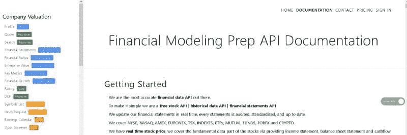

图像来源：作者截屏（[网站](https://financialmodelingprep.com/developer/docs/)）

使用这个 Python 类，你可以通过调用一系列简单的方法来提取数据并构建一个 Pandas DataFrame，其中包含几乎所有重要的财务指标和比率。

我们还提供了简单的图表方法（柱状图和散点图），用于图形化分析数据。

**请注意，你需要从网站上获取自己的秘密 API 密钥（免费），并在实例化类对象后注册它。**

说到这一点，让我们深入了解 Python 包/类以及附带的各种方法。

### Python 类和各种内置方法

核心 Python 类可以在[**我的 Github 仓库中找到**](https://github.com/tirthajyoti/Finance-with-Python/tree/master/financeAPI)。欢迎给仓库加星和分叉，进行改进。你可以直接克隆该仓库，并在自己的笔记本中开始使用脚本。

```py
**> mkdir My_project
> cd My_Project
> git clone** [**https://github.com/tirthajyoti/Finance-with-Python.git**](https://github.com/tirthajyoti/Finance-with-Python.git) **> cd financeAPI** 
```

为了保持代码整洁，在本文中，我们展示了在测试 Jupyter 笔记本中使用该类的方法。

我们首先导入常规库和类对象。

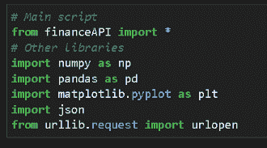

### 从文件中读取秘密 API 密钥并注册

注意，你需要在与代码文件相同的目录中有一个名为 `Secret_Key.txt` 的文件。没有它，你无法继续。

**在这里注册：**[**https://financialmodelingprep.com/login**](https://financialmodelingprep.com/login)

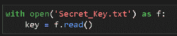

### 创建一个类实例


### 它有一个描述

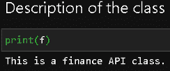

### 没有注册密钥，我们无法访问数据

我们肯定想要开始提取数据。假设我们想为公司 Apple（股票代码为‘AAPL’）构建一个数据字典。我们可以尝试，但不会成功，因为我们还没有用类对象注册秘密密钥。

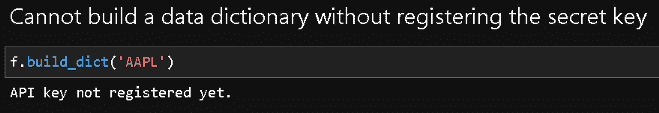

### 所以，我们注册了秘密密钥

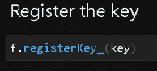

### 让我们现在构建一个数据字典

对于该类中的所有方法，我们必须传递公司（在美国金融市场上的）股票代码。例如，Apple Inc 的代码是‘AAPL’。

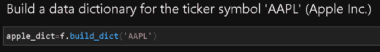

如果我们检查这个字典，会发现从 API 端点拉取了大量数据。下面提供了部分截图。

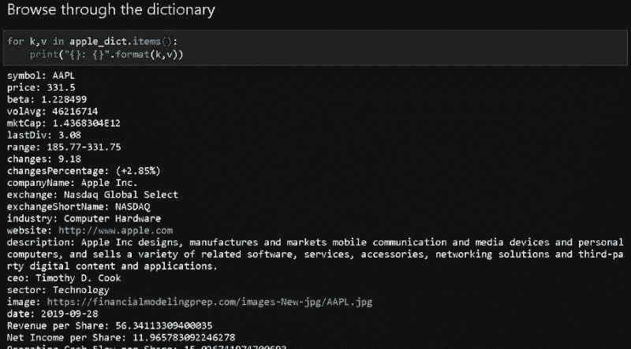

### 用多个公司的数据构建一个 DataFrame

使用 Python 字典是可以的，但对于大规模数据分析，我们应考虑构建 Pandas DataFrame。我们提供了一个内置方法来实现这一点。构建 DataFrame 就像传递一个股票代码列表一样简单，代码会为您完成所有的数据抓取和结构化工作。

比如我们想下载以下公司的所有财务数据，

+   Twitter

+   Facebook

+   Microsoft

+   Nvidia

+   苹果

+   Salesforce

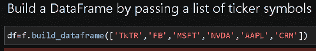

一份格式良好的 DataFrame 准备好了！


### 究竟有哪些数据可用？

我们可以轻松检查从 API 服务中提取的数据类型。注意，我们传递参数‘profile’，‘metrics’ 或 ‘ration’，并返回相应的数据项列表。

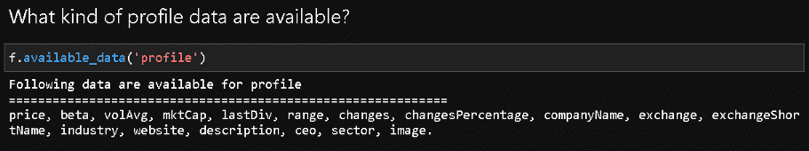

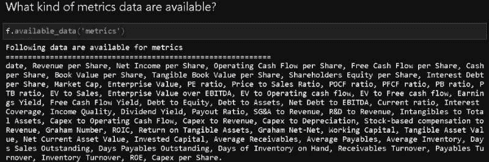

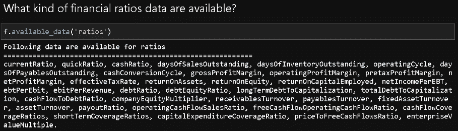

### 绘图 — 可视化分析

在这个包中，我们包含了用于数据的简单可视化分析的代码。

查看各种指标和财务比率在简单条形图中的表现通常是有帮助的。为此，只需传递您想绘制的变量名称。您还可以包括常见的 Matplotlib 关键字参数，例如颜色和透明度（alpha）。

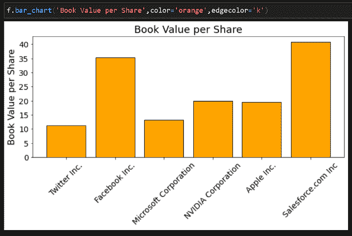

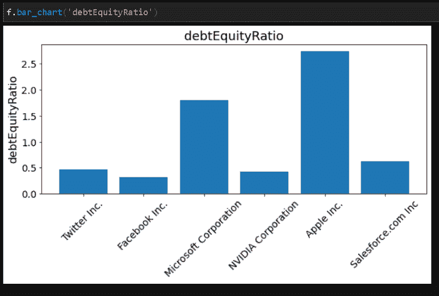

您还可以绘制简单的散点图来直观分析财务指标之间的关系。

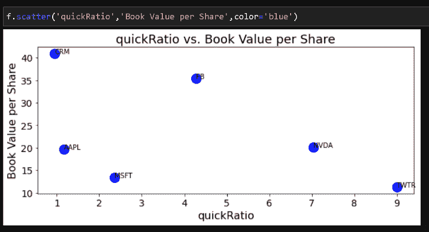

您还可以传递第三个变量用于调整散点图中标记的大小。这在间接上有助于在二维图中可视化超过两个变量。例如，我们在下面的代码中将股价参数作为第三个变量传递。

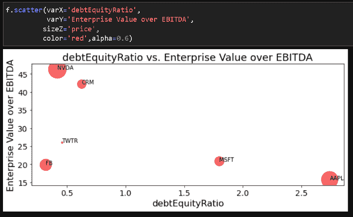

### 自定义分析与底层 DataFrame

投资者经常会想要根据可用数据创建自己的筛选器和投资逻辑。

例如，我们可能只考虑市值 > 2000 亿美元的公司，然后在条形图中查看*企业价值与 EBITDA 比*的指标。

我们可以访问底层 DataFrame，创建自定义 DataFrame，然后将此自定义 DataFrame 分配给一个新的`financeAPI()`对象，以利用现成的图表方法。

这样，我们就无需再次从 API 请求数据。**我们应该尽量避免读取数据，因为免费 API 密钥的读取数据量有限。**

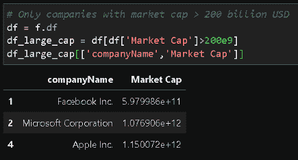

然后我们根据这个自定义 DataFrame（嵌入在自定义类对象中）绘制条形图。

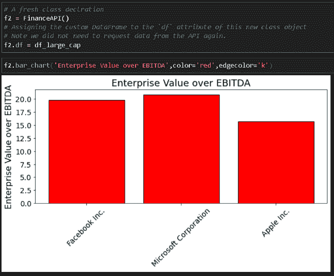

### 摘要

我们展示了一个简单的 Python 类/包的实现和使用，这可以用于从微服务中提取广泛的金融指标和比率。

要获取此服务的免费 API 密钥，必须进行注册。使用量当然在免费账户下是有限制的。网站还提供了[无限使用的付费计划](https://financialmodelingprep.com/developer/docs/pricing/)。

请注意，本工作重点关注**静态金融数据**，即年度财务报表中的数据，而非动态时间序列股市定价数据。**它应当用于评估公司的长期财务实力，以便进行以增长为导向的投资。**

作为数据科学家，你可能经常需要编写自定义的类/包以从微服务 API 中提取和分析数据，希望这篇文章（及相关代码库）能为你提供一个简单但有效的入门介绍。


图片来源：[Pixabay（可商用免费）](https://pixabay.com/photos/money-coin-investment-business-2724241/)

你还可以查看作者的[**GitHub**](https://github.com/tirthajyoti?tab=repositories)** 代码库**，获取机器学习和数据科学方面的代码、想法和资源。如果你像我一样，对 AI/机器学习/数据科学充满热情，请随时[在 LinkedIn 上添加我](https://www.linkedin.com/in/tirthajyoti-sarkar-2127aa7/)或[在 Twitter 上关注我](https://twitter.com/tirthajyotiS)。

[原文](https://towardsdatascience.com/pull-and-analyze-financial-data-using-a-simple-python-package-83e47759c4a7)。经许可转载。

**相关：**

+   时间序列分类：合成与真实金融时间序列

+   数据科学家免费的经济学与金融课程

+   在金融服务中应用 NLP 的四种方法

### 更多相关话题

+   [如何使用 MLFlow 打包和分发机器学习模型](https://www.kdnuggets.com/2022/08/package-distribute-machine-learning-models-mlflow.html)

+   [拖拽、放置、分析：无代码数据科学的兴起](https://www.kdnuggets.com/drag-drop-analyze-the-rise-of-nocode-data-science)

+   [如何通过 ML 模型可解释性加速 AI 采纳之旅…](https://www.kdnuggets.com/2022/07/ml-model-explainability-accelerates-ai-adoption-journey-financial-services.html)

+   [Pydantic 教程：简化 Python 数据验证](https://www.kdnuggets.com/pydantic-tutorial-data-validation-in-python-made-simple)

+   [用 Python 自动化数据清洗的 5 个简单步骤](https://www.kdnuggets.com/5-simple-steps-to-automate-data-cleaning-with-python)

+   [提升 Python 代码速度的 3 种简单方法](https://www.kdnuggets.com/2022/10/3-simple-ways-speed-python-code.html)
