# 使用 PyCaret 编写和训练你自己的自定义机器学习模型

> 原文：[`www.kdnuggets.com/2021/05/pycaret-write-train-custom-machine-learning-models.html`](https://www.kdnuggets.com/2021/05/pycaret-write-train-custom-machine-learning-models.html)

评论

**作者 [Moez Ali](https://www.linkedin.com/in/profile-moez/)，PyCaret 创始人兼作者**


由 [Rob Lambert](https://unsplash.com/@roblambertjr?utm_source=medium&utm_medium=referral) 在 [Unsplash](https://unsplash.com/?utm_source=medium&utm_medium=referral) 提供的照片

### PyCaret

PyCaret 是一个开源的低代码机器学习库和端到端模型管理工具，构建于 Python 上，用于自动化机器学习工作流。它因易用性、简洁性以及能够快速高效地构建和部署端到端 ML 原型而受到极大的欢迎。

PyCaret 是一个替代性的低代码库，可以用几行代码替代数百行代码。这使得实验周期显著加快且高效。

PyCaret **简单且** **易于使用**。PyCaret 中执行的所有操作都依次存储在一个 **Pipeline** 中，该 **Pipeline** 完全自动化以 **进行部署**。无论是填补缺失值、进行独热编码、转换分类数据、特征工程，还是超参数调优，PyCaret 都会自动完成所有这些操作。

本教程假设你对 PyCaret 有一定的知识和经验。如果你以前没有使用过 PyCaret，也没关系——你可以通过这些教程快速入门：

+   [PyCaret 2.2 已发布——新特性](https://towardsdatascience.com/pycaret-2-2-is-here-whats-new-ad7612ca63b)

+   [宣布 PyCaret 2.0](https://towardsdatascience.com/announcing-pycaret-2-0-39c11014540e)

+   [你不知道的 PyCaret 五件事](https://towardsdatascience.com/5-things-you-dont-know-about-pycaret-528db0436eec)

### 安装 PyCaret

安装 PyCaret 非常简单，只需几分钟即可完成。我们强烈建议使用虚拟环境，以避免与其他库潜在的冲突。

PyCaret 的默认安装是 pycaret 的精简版，只安装了硬性依赖项，[列在这里](https://github.com/pycaret/pycaret/blob/master/requirements.txt)。

```py
**# install slim version (default)** pip install pycaret**# install the full version**
pip install pycaret[full]
```

当你安装完整版本的 pycaret 时，所有的可选依赖项也会被安装，[列在这里](https://github.com/pycaret/pycaret/blob/master/requirements-optional.txt)。

### ???? 让我们开始吧

在我们开始讨论自定义模型训练之前，让我们先快速演示一下 PyCaret 如何与开箱即用的模型一起工作。我将使用 [PyCaret 的仓库](https://github.com/pycaret/pycaret/tree/master/datasets) 中的“insurance”数据集。该数据集的目标是根据一些属性预测患者费用。

### ???? **数据集**

```py
**# read data from pycaret repo** from pycaret.datasets import get_data
data = get_data('insurance')
```

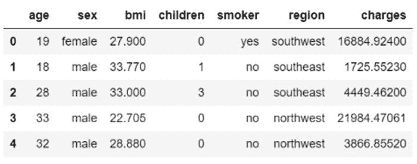

来自保险数据集的示例行

### ???? **数据准备**

在 PyCaret 的所有模块中，`setup` 是任何 PyCaret 机器学习实验中第一个也是唯一的强制步骤。此函数处理所有训练模型前所需的数据准备工作。除了执行一些基本的默认处理任务外，PyCaret 还提供了各种预处理功能。要了解 PyCaret 中所有预处理功能的更多信息，你可以查看这个 [链接](https://pycaret.org/preprocessing/)。

```py
**# initialize setup** from pycaret.regression import *
s = setup(data, target = 'charges')
```


pycaret.regression 模块中的 setup 函数

每当你初始化 PyCaret 中的 `setup` 函数时，它会对数据集进行分析，并推断所有输入特征的数据类型。如果所有数据类型都被正确推断，你可以按回车键继续。


从 `setup` 输出 — 输出已截断以便展示

### ???? 可用模型

要检查所有可用训练模型的列表，你可以使用名为 `models` 的函数。它会显示一个包含模型 ID、名称和实际估计器参考的表格。

```py
**# check all the available models** models()
```

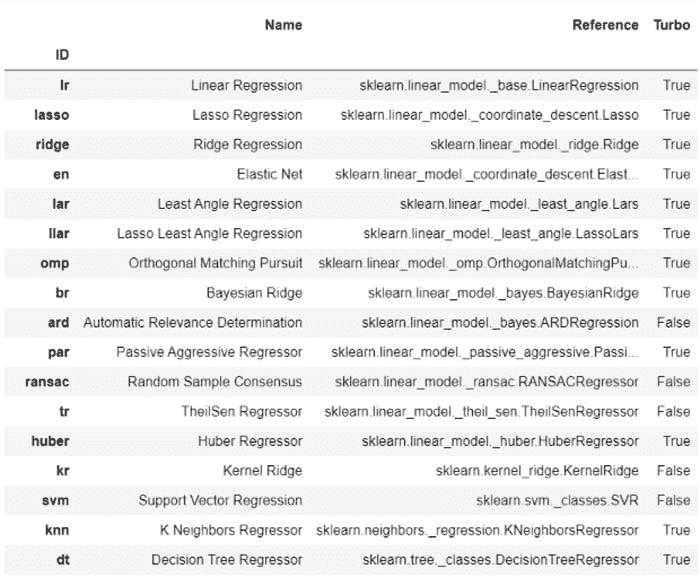

从 `models()` 输出 — 输出已截断以便展示

### ???? 模型训练与选择

PyCaret 中用于训练任何模型的最常用函数是 `create_model`。它接受一个你想要训练的估计器的 ID。

```py
**# train decision tree** dt = create_model('dt')
```

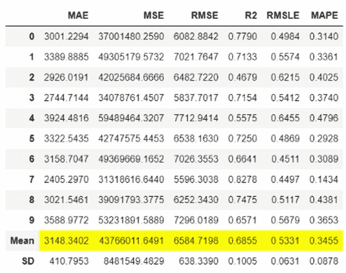

从 `create_model('dt')` 输出

输出显示了 10 折交叉验证指标的均值和标准差。此函数的输出是一个训练后的模型对象，实际上是一个 `scikit-learn` 对象。

```py
print(dt)
```

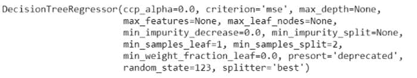

从 `print(dt)` 输出

要在循环中训练多个模型，你可以编写一个简单的列表推导式：

```py
**# train multiple models**
multiple_models = [create_model(i) for i in ['dt', 'lr', 'xgboost']]**# check multiple_models** type(multiple_models), len(multiple_models)
>>> (list, 3)print(multiple_models)
```

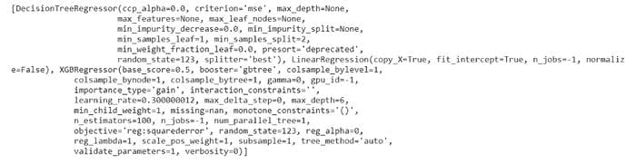

从 `print(multiple_models)` 输出

如果你想训练库中所有可用的模型而不是仅仅几个选择的模型，可以使用 PyCaret 的 `compare_models` 函数，而不是编写自己的循环（*不过结果会是一样的*）。

```py
**# compare all models**
best_model = compare_models()
```

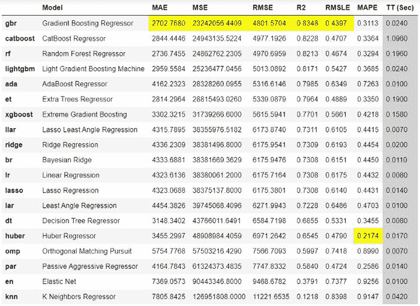

从 `compare_models` 函数输出

`compare_models` 返回的输出显示了所有模型的交叉验证指标。根据此输出，梯度提升回归器是最好的模型，使用 10 折交叉验证在训练集上的均值绝对误差（MAE）为 $2,702。

```py
**# check the best model**
print(best_model)
```

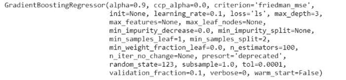

从 `print(best_model)` 输出

上述网格中显示的指标是交叉验证得分，要查看 `best_model` 在保留集上的得分：

```py
**# predict on hold-out** pred_holdout = predict_model(best_model)
```

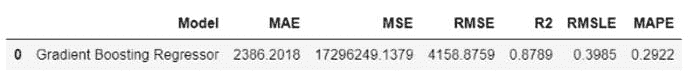

从 `predict_model(best_model)` 函数输出

要在未见数据集上生成预测，你可以使用相同的 `predict_model` 函数，但只需传递额外的参数 `data`：

```py
**# create copy of data drop target column**
data2 = data.copy()
data2.drop('charges', axis=1, inplace=True)**# generate predictions** predictions = predict_model(best_model, data = data2)
```

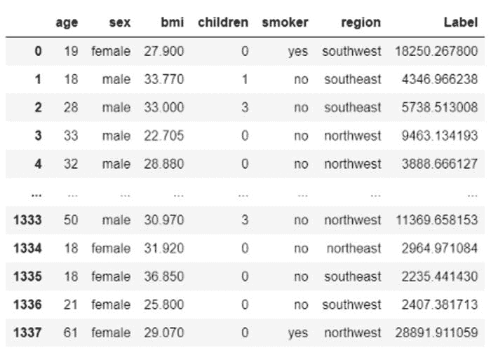

从 `predict_model(best_model, data = data2)` 输出

### ???? 编写和训练自定义模型

到目前为止，我们看到的是在 PyCaret 中对所有可用模型的训练和模型选择。然而，PyCaret 对自定义模型的处理方式完全相同。只要你的估计器兼容 `sklearn` API 风格，它将以相同的方式工作。让我们看几个例子。

在我展示如何编写自定义类之前，我将首先演示如何处理自定义非-sklearn 模型（在 sklearn 或 pycaret 的基础库中不可用的模型）。

### ???? **GPLearn 模型**

虽然遗传编程（GP）可以用于执行[各种任务](http://www.genetic-programming.org/combined.php)，`gplearn` 特意限制于解决符号回归问题。

符号回归是一种机器学习技术，旨在识别最能描述关系的潜在数学表达式。它首先通过构建一组天真的随机公式来表示已知自变量与其因变量目标之间的关系，以预测新数据。然后，每一代程序从前一代中进化，选择适应度最好的个体进行遗传操作。

要使用 `gplearn` 的模型，你必须首先安装它：

```py
**# install gplearn** pip install gplearn
```

现在你可以简单地导入未训练的模型，并将其传递给 `create_model` 函数：

```py
**# import untrained estimator**
from gplearn.genetic import SymbolicRegressor
sc = SymbolicRegressor()**# train using create_model** sc_trained = create_model(sc)
```

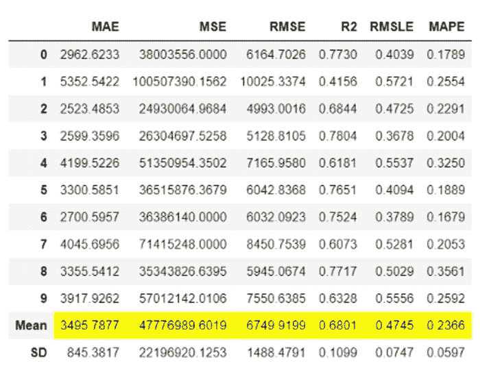

从 create_model(sc_trained) 的输出

```py
print(sc_trained)
```

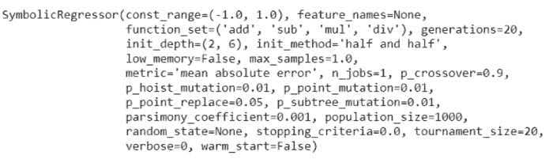

从 print(sc_trained) 的输出

你也可以检查这一点的持出评分：

```py
**# check hold-out score** pred_holdout_sc = predict_model(sc_trained)
```

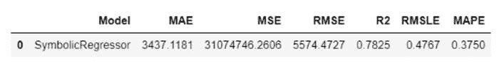

从 predict_model(sc_trained) 的输出

### ???? NGBoost 模型

ngboost 是一个 Python 库，实现了自然梯度提升，如 [“NGBoost: Natural Gradient Boosting for Probabilistic Prediction”](https://stanfordmlgroup.github.io/projects/ngboost/) 中所述。它构建在 [Scikit-Learn](https://scikit-learn.org/stable/) 之上，旨在根据适当的评分规则、分布和基础学习器的选择具有可扩展性和模块化。关于 NGBoost 基础方法的教学介绍可以在这个 [幻灯片文档](https://drive.google.com/file/d/183BWFAdFms81MKy6hSku8qI97OwS_JH_/view?usp=sharing) 中找到。

要使用 ngboost 的模型，你必须首先安装 ngboost：

```py
**# install ngboost**
pip install ngboost
```

安装完成后，你可以从 ngboost 库中导入未训练的估计器，并使用 `create_model` 来训练和评估模型：

```py
**# import untrained estimator**
from ngboost import NGBRegressor
ng = NGBRegressor()**# train using create_model** ng_trained = create_model(ng)
```

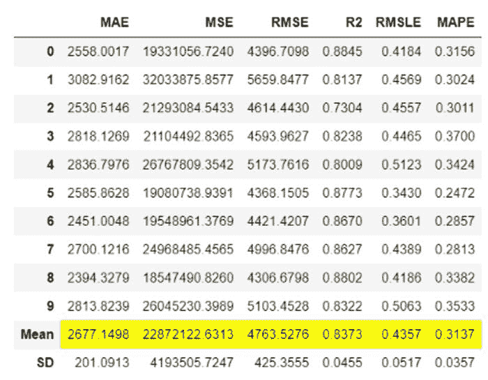

从 create_model(ng) 的输出

```py
print(ng_trained)
```

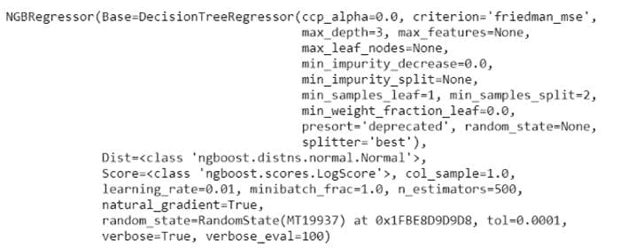

从 print(ng_trained) 的输出

### ???? 编写自定义类

上述两个示例 `gplearn` 和 `ngboost` 是 PyCaret 的自定义模型，因为它们在默认库中不可用，但您可以像使用任何其他现成模型一样使用它们。然而，可能会有一种使用案例涉及编写自己的算法（即算法背后的数学），在这种情况下，您可以从 `sklearn` 继承基类并编写自己的数学。

让我们创建一个朴素的估算器，它在 `fit` 阶段学习 `target` 变量的均值，并对所有新数据点预测相同的均值，不论 X 输入如何（*这在现实生活中可能没有用，但只是为了演示功能*）。

```py
**# create custom estimator**
import numpy as npfrom sklearn.base import BaseEstimatorclass MyOwnModel(BaseEstimator):

    def __init__(self):
        self.mean = 0

    def fit(self, X, y):
        self.mean = y.mean()
        return self

    def predict(self, X):
        return np.array(X.shape[0]*[self.mean])
```

现在让我们使用这个估算器进行训练：

```py
**# import MyOwnModel class**
mom = MyOwnModel()**# train using create_model** mom_trained = create_model(mom)
```

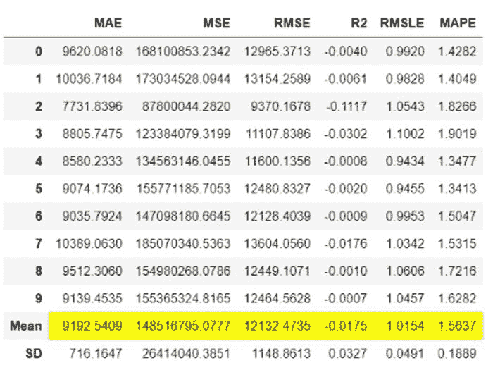

来自 create_model(mom) 的输出

```py
**# generate predictions on data**
predictions = predict_model(mom_trained, data=data)
```


来自 predict_model(mom, data=data) 的输出

注意到 `Label` 列，即预测值，对于所有行来说都是相同的数字 $13,225，这因为我们以这样的方式创建了这个算法：它从训练集的均值中学习，并预测相同的值（只是为了简单起见）。

我希望您会欣赏 PyCaret 的易用性和简洁性。仅需几行代码，您就可以进行端到端的机器学习实验，并编写自己的算法，而无需调整任何原生代码。

### 敬请期待！

下周我将编写一个教程来推进这个教程。我们将编写一个更复杂的算法，而不仅仅是均值预测。我将在下一个教程中介绍一些复杂的概念。请关注我在 [Medium](https://medium.com/@moez-62905)、[LinkedIn](https://www.linkedin.com/in/profile-moez/) 和 [Twitter](https://twitter.com/moezpycaretorg1) 的更新。

使用这个轻量级的 Python 工作流自动化库，您可以实现无限的目标。如果您觉得有用，请不要忘记在我们的 GitHub 仓库上给我们 ⭐️。

想了解更多关于 PyCaret 的信息，请关注我们的 [LinkedIn](https://www.linkedin.com/company/pycaret/) 和 [Youtube](https://www.youtube.com/channel/UCxA1YTYJ9BEeo50lxyI_B3g)。

加入我们的 Slack 频道。邀请链接 [在这里](https://join.slack.com/t/pycaret/shared_invite/zt-p7aaexnl-EqdTfZ9U~mF0CwNcltffHg)。

### 您可能还会感兴趣：

[在 Power BI 中使用 PyCaret 2.0 构建您自己的 AutoML](https://towardsdatascience.com/build-your-own-automl-in-power-bi-using-pycaret-8291b64181d)

[使用 Docker 在 Azure 上部署机器学习管道](https://towardsdatascience.com/deploy-machine-learning-pipeline-on-cloud-using-docker-container-bec64458dc01)

[在 Google Kubernetes Engine 上部署机器学习管道](https://towardsdatascience.com/deploy-machine-learning-model-on-google-kubernetes-engine-94daac85108b)

[在 AWS Fargate 上部署机器学习管道](https://towardsdatascience.com/deploy-machine-learning-pipeline-on-aws-fargate-eb6e1c50507)

[构建并部署你的第一个机器学习 web 应用](https://towardsdatascience.com/build-and-deploy-your-first-machine-learning-web-app-e020db344a99)

[使用 AWS Fargate 无服务器架构部署 PyCaret 和 Streamlit 应用](https://towardsdatascience.com/deploy-pycaret-and-streamlit-app-using-aws-fargate-serverless-infrastructure-8b7d7c0584c2)

[使用 PyCaret 和 Streamlit 构建并部署机器学习 web 应用](https://towardsdatascience.com/build-and-deploy-machine-learning-web-app-using-pycaret-and-streamlit-28883a569104)

[在 GKE 上部署使用 Streamlit 和 PyCaret 构建的机器学习应用](https://towardsdatascience.com/deploy-machine-learning-app-built-using-streamlit-and-pycaret-on-google-kubernetes-engine-fd7e393d99cb)

### 重要链接

[文档](https://pycaret.readthedocs.io/en/latest/installation.html)

[博客](https://medium.com/@moez_62905)

[GitHub](https://www.github.com/pycaret/pycaret)

[StackOverflow](https://stackoverflow.com/questions/tagged/pycaret)

[安装 PyCaret](https://pycaret.readthedocs.io/en/latest/installation.html) [笔记本教程](https://pycaret.readthedocs.io/en/latest/tutorials.html) [为 PyCaret 做贡献](https://pycaret.readthedocs.io/en/latest/contribute.html)

### 想了解某个特定模块？

点击下面的链接查看文档和实际示例。

[分类](https://pycaret.readthedocs.io/en/latest/api/classification.html) [回归](https://pycaret.readthedocs.io/en/latest/api/regression.html)

[聚类](https://pycaret.readthedocs.io/en/latest/api/clustering.html)

[异常检测](https://pycaret.readthedocs.io/en/latest/api/anomaly.html)

[自然语言处理](https://pycaret.readthedocs.io/en/latest/api/nlp.html) [关联规则挖掘](https://pycaret.readthedocs.io/en/latest/api/arules.html)

**简介: [Moez Ali](https://www.linkedin.com/in/profile-moez/)** 是一名数据科学家，也是 PyCaret 的创始人和作者。

[原文](https://towardsdatascience.com/write-and-train-your-own-custom-machine-learning-models-using-pycaret-8fa76237374e)。经授权转载。

**相关:**

+   使用 PyCaret + MLflow 进行简单的 MLOps

+   GitHub 是你所需的最佳 AutoML

+   使用 Docker 容器将机器学习管道部署到云端

* * *

## 我们的前三大课程推荐

 1\. [谷歌网络安全证书](https://www.kdnuggets.com/google-cybersecurity) - 快速进入网络安全职业轨道

 2\. [谷歌数据分析专业证书](https://www.kdnuggets.com/google-data-analytics) - 提升你的数据分析技能

 3\. [谷歌 IT 支持专业证书](https://www.kdnuggets.com/google-itsupport) - 支持你的组织的 IT

* * *

### 更多相关内容

+   [宣布 PyCaret 3.0：开源、低代码的 Python 机器学习](https://www.kdnuggets.com/2023/03/announcing-pycaret-30-opensource-lowcode-machine-learning-python.html)

+   [用自定义指令调整 ChatGPT 以满足您的需求](https://www.kdnuggets.com/2023/08/tailor-chatgpt-fit-needs-custom-instructions.html)

+   [使用 Tensorflow 训练图像分类模型的指南](https://www.kdnuggets.com/2022/12/guide-train-image-classification-model-tensorflow.html)

+   [使用管道编写干净的 Python 代码](https://www.kdnuggets.com/2021/12/write-clean-python-code-pipes.html)

+   [使用 PyCaret 进行二元分类的介绍](https://www.kdnuggets.com/2021/12/introduction-binary-classification-pycaret.html)

+   [使用 PyCaret 在 Python 中进行聚类的介绍](https://www.kdnuggets.com/2021/12/introduction-clustering-python-pycaret.html)
