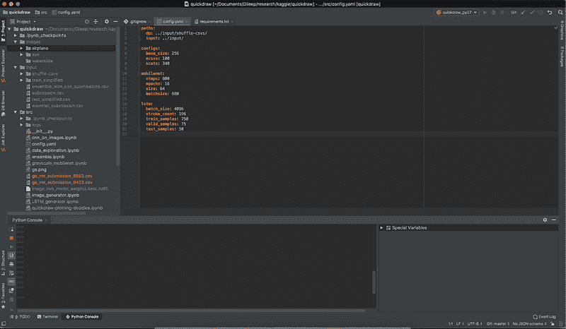

# PyCharm 针对数据科学家的功能

> 原文：[`www.kdnuggets.com/2019/05/pycharm-data-scientists.html`](https://www.kdnuggets.com/2019/05/pycharm-data-scientists.html)

 评论

**由[迪利普·库马尔](https://www.linkedin.com/in/dileep-kumar-a747371b/)，Target 的首席工程师**

我最近开始使用 PyCharm 作为 Spyder 的替代品，非常喜欢它。本文讨论了一些 PyCharm 的功能，这些功能使我完全从 Spyder 转移到 PyCharm。以下功能是与 Spyder 的比较，而非通用 IDE。

PyCharm 配备了美丽的‘Dracula’主题

* * *

## 我们的前三课程推荐

 1\. [谷歌网络安全证书](https://www.kdnuggets.com/google-cybersecurity) - 快速进入网络安全职业生涯。

 2\. [谷歌数据分析专业证书](https://www.kdnuggets.com/google-data-analytics) - 提升你的数据分析技能

 3\. [谷歌 IT 支持专业证书](https://www.kdnuggets.com/google-itsupport) - 支持你的组织的 IT 工作

* * *

1.  终端：你可以在 IDE 中获得一个 shell 脚本，这有助于轻松访问多个功能，例如从命令行测试你的脚本、从 gs/aws 下载数据文件、git 交互。

1.  Git：谈到 git，PyCharm 提供了 git 集成。从 IDE 中，你可以添加需要加入 gitignore 的文件、添加和提交。你可以随时查看你所在的分支、哪些文件处于修改、添加、提交状态（根据项目视图中的颜色）等。我提到过我们可以直接从 IDE 内部的终端进行 git push 吗？

1.  版本控制：你可以在 IDE 内部查看你的 git 变更日志。你还可以将你的文件与最新的 git 提交文件进行比较，以查看你的更改。

1.  插件：PyCharm 还提供了许多插件来支持非 Python 文件。因此，当你处理配置文件（如 yaml/json/ini）、shell 脚本或 sql/html/css 文件时，IDE 知道预期的格式并自动进行缩进、关键词高亮等。你甚至可以使用 iPython 笔记本，尽管坦白说，它看起来有些混乱，我会选择 Jupyter 来处理笔记本。其他一些值得注意的插件包括 git、flask、vim 等。

1.  项目维护：当你在处理大型项目时，有几个最佳实践需要遵循，例如创建 readme 文件、使用虚拟环境、管理需求文件等。所有这些都可以通过 PyCharm 轻松处理。你还可以很容易地进行代码重构，检查对象的依赖关系，追踪对象的源头等。

1.  调试器：Spyder 中也有这个功能，但我从未在 Spyder 中使用过它。你可以创建调试点，并检查代码在这些点的行为。

1.  分段运行代码：这在 Spyder 中非常自然。你选择你想运行的代码部分，然后按下 cmd+return。这在 PyCharm 中不那么直接，但也可以实现（Mac 上为 Option + Shift + E）。这在编写独立脚本时非常方便。

尽管有这些好处，但也有一些缺点：

1.  内存消耗：PyCharm 消耗了我 Mac 上大约 1.5GB 的内存。这对于一个 IDE 来说似乎有点多。

1.  数据可视化：对我来说，Spyder 最大的优势在于它的变量浏览器。你 *可以* 在 PyCharm 中可视化数据框，但与 Spyder 相比远不及。绘图也是如此。PyCharm 中的绘图渲染时间显著长于 Spyder。

1.  学习曲线：我认为 Spyder 在数据科学家中受欢迎的原因在于它非常简单。你只需安装它，打开它，你就会知道它是如何工作的。然而，PyCharm 有一定的学习曲线，比如设置解释器、搞清楚如何运行选定的代码而不是整段代码等。你需要花费几个小时来真正理解和欣赏它的工作原理。

理想情况下，如果你在一个需要多个脚本互相交互的项目中工作，你绝对应该尝试 PyCharm。如果你的所有脚本都是独立的分析，Spyder（甚至更好的 - *Jupyter*）应该足以满足你的需求。

**简介：[Dileep Kumar](https://www.linkedin.com/in/dileep-kumar-a747371b/)** 是 Target 的首席工程师，他在该公司实现机器学习和深度学习技术，致力于推荐系统、图像数据、社交图分析和文本数据。

[原文](https://medium.com/datadriveninvestor/pycharm-for-data-science-b3fb3daae373)。经许可转载。

**相关：**

+   这里是最受欢迎的 Python IDE / 编辑器

+   数据科学家常犯的 10 个编码错误

+   你的机器学习代码可能很糟糕的 4 个原因

### 更多相关话题

+   [高保真合成数据适用于数据工程师和数据科学家](https://www.kdnuggets.com/2022/tonic-high-fidelity-synthetic-data-engineers-scientists-alike.html)

+   [我们不需要数据科学家，我们需要数据工程师](https://www.kdnuggets.com/2021/02/dont-need-data-scientists-need-data-engineers.html)

+   [数据分析师和数据科学家之间的区别是什么？](https://www.kdnuggets.com/2022/03/difference-data-analysts-data-scientists.html)

+   [数据科学家和数据工程师如何协作？](https://www.kdnuggets.com/2022/08/data-scientists-data-engineers-work-together.html)

+   [掌握数据讲故事的艺术：数据科学家的指南](https://www.kdnuggets.com/2023/06/mastering-art-data-storytelling-guide-data-scientists.html)

+   [KDnuggets 新闻，7 月 5 日：一个糟糕的数据科学项目 • 10 人工智能…](https://www.kdnuggets.com/2023/n24.html)
