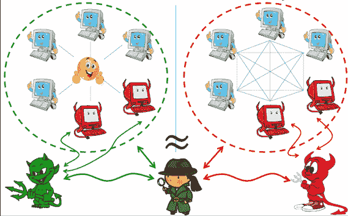
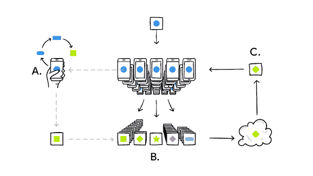
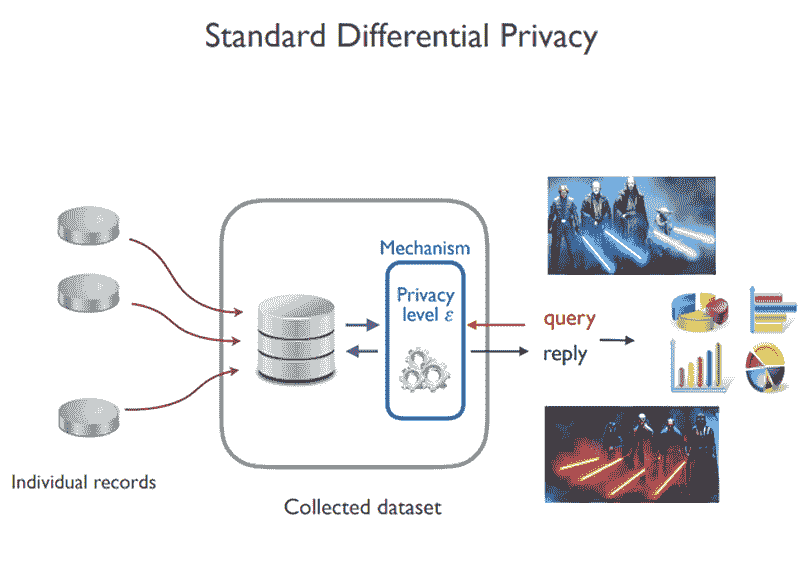
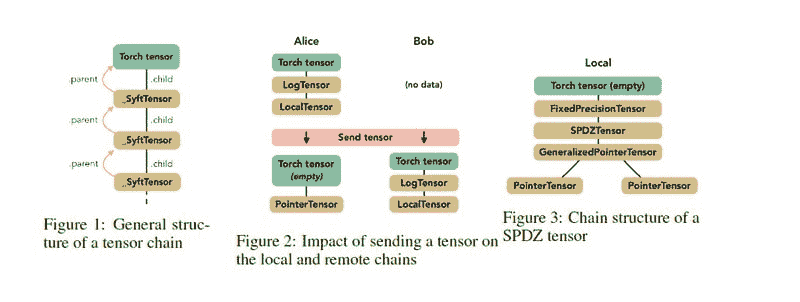
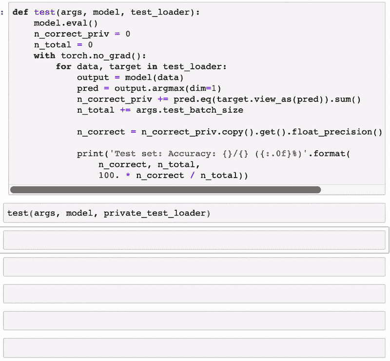

# PySyft 和私人深度学习的兴起

> 原文：[`www.kdnuggets.com/2019/06/pysyft-emergence-deep-learning.html`](https://www.kdnuggets.com/2019/06/pysyft-emergence-deep-learning.html)

评论 

信任是实施深度学习应用的关键因素。从训练到优化，深度学习模型的生命周期依赖于不同方之间的可信数据交换。这种动态在实验室环境中确实有效，但结果容易受到各种安全攻击的威胁，这些攻击会操控模型中不同参与者之间的信任关系。我们以一个使用金融交易来分类特定客户信用风险的信用评分模型为例。

传统的训练或优化模型机制假设执行这些操作的实体将完全访问这些金融数据集，这就打开了各种隐私风险的大门。随着深度学习的发展，在数据集和模型生命周期中执行隐私约束的机制变得越来越重要。在尝试解决这一巨大挑战的技术中，**PySyft** 是一个最近在深度学习社区中稳步获得关注的框架。

深度学习应用中隐私的重要性直接与分布式、多方模型的兴起相关。传统的深度学习解决方案依赖于集中式方，这些方控制模型的整个生命周期，即使使用大型分布式计算基础设施也是如此。这就是一个组织创建预测模型的情况，该模型管理访问其网站的客户的偏好。然而，集中式深度学习拓扑在诸如移动设备或物联网（IOT）等依赖大量设备生成数据和执行模型的场景中已被证明是不切实际的。

在这些场景中，分布式方不仅常常生成敏感数据集，还执行和评估深度学习模型的性能。这种动态要求负责创建、训练和执行深度学习模型的不同方之间建立双向隐私关系。

向更分布式架构的过渡是深度学习模型中需要强大隐私机制的主要动力之一。这是**PySyft** 旨在解决的挑战，但如果没有机器学习和分布式编程几个研究领域的演进，这将是不可能的。

### 使能因素

深度学习模型中的隐私问题已经存在多年，但能够提供解决方案的技术现在才开始达到一定的可行性。以 PySyft 为例，该框架利用了过去十年中机器学习和加密领域的三种最吸引人的技术：

+   安全多方计算

+   联邦学习

+   差分隐私

**安全多方计算**

安全多方计算（sMPC）是一种加密技术，它允许不同的参与方在保持输入数据私密的情况下进行计算。在计算机科学理论中，sMPC 通常被视为解决著名的[姚氏百万富翁问题](https://en.wikipedia.org/wiki/Yao%27s_Millionaires%27_Problem)的方案，该问题由计算机科学家[姚期智](https://en.wikipedia.org/wiki/Andrew_Yao)于 1980 年代提出。该问题描述了一个场景，其中多个百万富翁希望知道谁更富有，但不披露他们的实际财富。百万富翁问题出现在许多现实世界的场景中，如拍卖、选举或在线游戏。

从概念上讲，sMPC 用安全计算替代了对可信中介的需求。在 sMPC 模型中，一组具有私密输入的参与方计算分布式函数，如公平性、隐私性和正确性等安全属性被保留。

**联邦学习**

联邦学习是一种新的 AI 系统学习架构，适用于在高度分布的拓扑结构中运行的系统，如移动设备或物联网（IOT）系统。最初由 Google 研究实验室提出，联邦学习代表了一种替代集中式 AI 训练的方法，其中通过中央服务器协调，从参与设备的联盟中训练一个共享的全局模型。在该模型中，不同的设备可以在保持大部分数据在设备上的同时，贡献于模型的训练和知识。

在联邦学习模型中，一方下载深度学习模型，通过从给定设备上的数据学习来改进模型，然后将更改总结为一个小的集中更新。只有这个模型的更新被发送到云端，通过加密通信进行传输，并与其他用户的更新立即进行平均，以改进共享模型。所有训练数据仍保留在原始设备上，云端不会存储单个更新。

**差分隐私**

差分隐私是一种用于限制统计算法对包含在更大数据集中的对象隐私影响的技术。大致上，如果一个观察者看到算法的输出无法判断是否使用了某个特定个体的信息，那么该算法就是差分隐私的。差分隐私通常在识别数据库中可能存在的个人信息的背景下讨论。尽管它并不直接涉及识别和重新识别攻击，但差分隐私算法被证明能够抵抗这种攻击。

### PySyft

PySyft 是一个使深度学习模型中的安全、隐私计算成为可能的框架。PySyft 将联邦学习、安全的多方计算和差分隐私结合在一个编程模型中，集成到 PyTorch、Keras 或 TensorFlow 等不同的深度学习框架中。PySyft 的原则 [最初在一篇研究论文中阐述](https://arxiv.org/abs/1811.04017)，其 [首个实现由 OpenMind 主导](https://github.com/OpenMined/PySyft)，OpenMind 是领先的去中心化 AI 平台之一。

PySyft 的核心组件是一个叫做 SyftTensor 的抽象。SyftTensors 旨在表示数据的状态或转换，可以将它们链式连接在一起。链结构的头部始终是 PyTorch 张量，SyftTensors 所体现的转换或状态可以通过子属性向下访问，通过父属性向上访问。

使用 PySyft 相对简单，与标准的 PyTorch 或 Keras 程序没有太大区别。下面的动画展示了一个使用 PySyft 开发的简单分类模型。

PySyft 代表了在深度学习程序中实现强大隐私模型的首次尝试之一。随着领域的发展，隐私可能会成为下一代深度学习框架的基础构件之一。

[原文](https://towardsdatascience.com/pysyft-and-the-emergence-of-private-deep-learning-a2d169bb1d0b)。经许可转载。

**简介：** [Jesus Rodriguez](https://www.linkedin.com/in/jesusmrv/) 是一位技术专家、执行投资人和创业顾问。作为软件科学家，Jesus 是一位国际知名的演讲者和作者，他的贡献包括数百篇文章和在行业会议上的演讲。

**相关：**

+   [差分隐私的更简单解释](https://www.kdnuggets.com/2015/11/simpler-explanation-differential-privacy.html)

+   如何在数据隐私时代构建分析产品

+   自编码器：使用 TensorFlow 的 Eager Execution 进行深度学习

* * *

## 我们的三大课程推荐

 1\. [谷歌网络安全证书](https://www.kdnuggets.com/google-cybersecurity) - 快速进入网络安全职业道路。

 2\. [谷歌数据分析专业证书](https://www.kdnuggets.com/google-data-analytics) - 提升你的数据分析技能

 3\. [谷歌 IT 支持专业证书](https://www.kdnuggets.com/google-itsupport) - 支持你的组织 IT 需求

* * *

### 更多相关话题

+   [学习数据科学、机器学习和深度学习的坚实计划](https://www.kdnuggets.com/2023/01/mwiti-solid-plan-learning-data-science-machine-learning-deep-learning.html)

+   [人工智能、分析、机器学习、数据科学、深度学习…](https://www.kdnuggets.com/2021/12/developments-predictions-ai-machine-learning-data-science-research.html)

+   [15 本免费机器学习和深度学习书籍](https://www.kdnuggets.com/2022/10/15-free-machine-learning-deep-learning-books.html)

+   [KDnuggets 新闻，11 月 2 日：数据科学的现状…](https://www.kdnuggets.com/2022/n43.html)

+   [15 本更多免费机器学习和深度学习书籍](https://www.kdnuggets.com/2022/11/15-free-machine-learning-deep-learning-books.html)

+   [最先进的深度学习中的可解释预测与现在预测](https://www.kdnuggets.com/2021/12/sota-explainable-forecasting-and-nowcasting.html)
