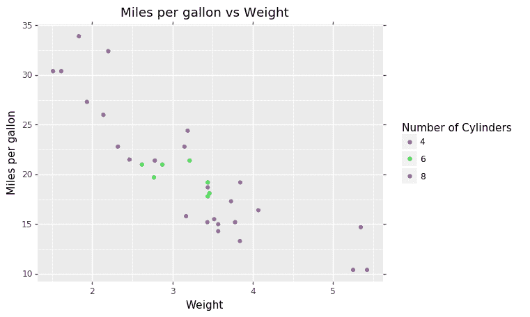
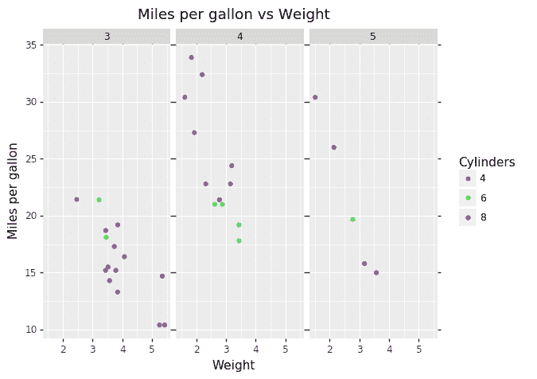
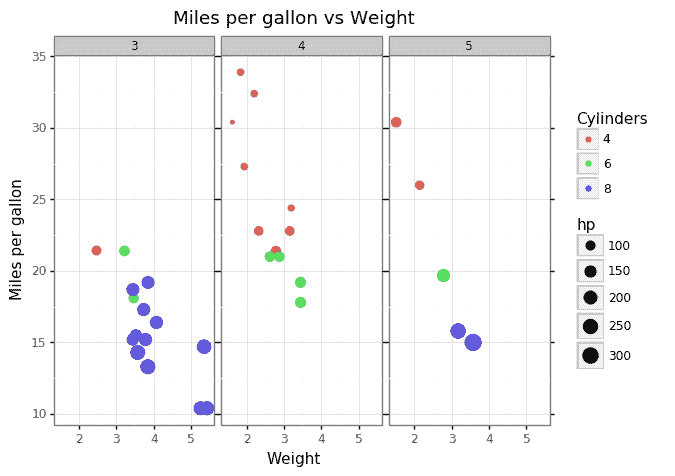

# Plotnine：Python 中 ggplot2 的替代品

> 原文：[`www.kdnuggets.com/2019/12/python-alternative-ggplot2.html`](https://www.kdnuggets.com/2019/12/python-alternative-ggplot2.html)

comments

R 的忠实用户知道 ggplot2 可以简化处理探索性数据分析和数据可视化的过程。它使得创建优雅而强大的图形变得非常简单，帮助解读数据中的潜在关系。

Python 的绘图库，如 matplotlib 和 seaborn，确实允许用户创建优雅的图形，但相比于 R 中 ggplot2 的简单、可读和分层的方法，它们缺乏标准化的语法来实现图形语法，使得在 Python 中实现起来更加困难。

* * *

## 我们的前三大课程推荐

 1\. [谷歌网络安全证书](https://www.kdnuggets.com/google-cybersecurity) - 快速进入网络安全职业道路。

 2\. [谷歌数据分析专业证书](https://www.kdnuggets.com/google-data-analytics) - 提升您的数据分析水平

 3\. [谷歌 IT 支持专业证书](https://www.kdnuggets.com/google-itsupport) - 支持您组织的 IT

* * *

**这个问题的答案在于 [Plotnine](https://plotnine.readthedocs.io/en/stable/index.html)。**

我会说这种风格与 R 中的 ggplot2 99% 相似。主要区别在于你将会看到的几个简短示例中的括号用法。使用 plotnine 的最佳收获之一是输出基本上与 R 中得到的相同。视觉上没有明显差异。

我们可以使用许多**[plotnine 的 API](https://plotnine.readthedocs.io/en/stable/api.html)** 来制作我们的图表。

```py

(
ggplot(mtcars, aes(‘wt’, ‘mpg’, color=’factor(cyl)’))
+ geom_point()
+ labs(title=’Miles per gallon vs Weight’, x=’Weight’, y=’Miles per gallon’)
+ guides(color=guide_legend(title=’Number of Cylinders’)) )

```



ggplot 在 R 中的主要卖点之一是能够 [**FACET**](https://plotnine.readthedocs.io/en/stable/api.html#facets)。我们也有许多选项来用一行代码绘制数据的子集。

```py

(ggplot(mtcars, aes(‘wt’, ‘mpg’, color=’factor(cyl)’))
+ geom_point()
+ labs(title=’Miles per gallon vs Weight’,x=’Weight’, y=’Miles per gallon’)
+ guides(color=guide_legend(title=’Cylinders’))
+ facet_wrap(‘~gear’)
)

```



只需在前面的代码末尾添加 **`facet_wrap(‘~gear’)`** 我们现在就有了一个分面图。 *这实际上比使用 Matplotlib 和 Seaborn 简单得多。Matplotlib 需要你为每一组变量创建一个单独的图表（例如，上面的图表有 3 个图表，所以你必须创建 3 个图表），而 Seaborn 比 Matplotlib 更简单，但需要使用不同的命令，这可能会让缺乏经验的用户感到困惑。*

### 美学改进

如果没有正确格式化这些可视化图形，那么创建它们是没有意义的。

```py

(ggplot(mtcars, aes(‘wt’, ‘mpg’, color=’factor(cyl)’, size = ‘hp’))
+ geom_point()
+ theme_bw()
+ labs(title=’Miles per gallon vs Weight’,x=’Weight’, y=’Miles per gallon’)
+ guides(color=guide_legend(title=’Cylinders’))
+ facet_wrap(‘~gear’)
)

```



通过添加`**size = ‘hp’**`，我们可以从数据中获得另一个见解（马力的数量），并使用`**theme_bw()**`为图形提供一个标准化的格式和一个简单的主题。`theme_bw()`是任何使用 ggplot2 的 R 用户都会知道的一个主题命令。它基本上是进行其他主题和格式实验之前使用的默认主题。

**查看我们如何[将 ipywidgets 与 Plotnine、Jupyter Notebook 和 JupyterLab 集成](https://plotnine.readthedocs.io/en/stable/tutorials/miscellaneous-using-notebook-widgets.html)。**

当我们深入研究时，我们会发现 Plotnine 提供了我们从 R 中的 ggplot2 获得的简单 API 和令人惊叹的视觉效果。Seaborn 能够用一行代码格式化图形，但 Matplotlib 则不能。Seaborn 在某种程度上确实与 Plotnine 和 ggplot2 有相似之处，但其易于解读的语法赋予了它独特的卖点，使得切换变得容易。

**相关：**

+   Vega-Lite: 交互式图形的语法

+   如何在 Python（和 R）中可视化数据

+   理解箱线图

### 相关话题

+   [每个数据科学家都应该知道的三个 R 库（即使你使用 Python）](https://www.kdnuggets.com/2021/12/three-r-libraries-every-data-scientist-know-even-python.html)

+   [是什么让 Python 成为初创企业的理想编程语言](https://www.kdnuggets.com/2021/12/makes-python-ideal-programming-language-startups.html)

+   [停止学习数据科学以寻找目标，并通过目标来...](https://www.kdnuggets.com/2021/12/stop-learning-data-science-find-purpose.html)

+   [一个 90 亿美元的人工智能失败案例分析](https://www.kdnuggets.com/2021/12/9b-ai-failure-examined.html)

+   [学习数据科学统计的最佳资源](https://www.kdnuggets.com/2021/12/springboard-top-resources-learn-data-science-statistics.html)

+   [成功数据科学家的 5 个特征](https://www.kdnuggets.com/2021/12/5-characteristics-successful-data-scientist.html)
