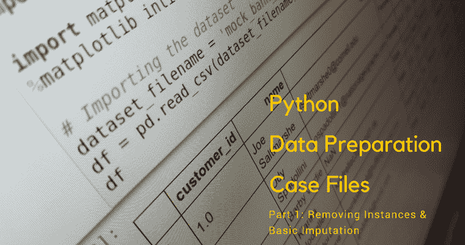
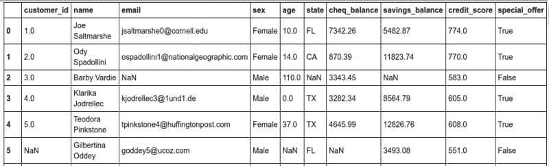

# Python 数据准备案例文件：删除实例与基本插补

> 原文：[`www.kdnuggets.com/2017/09/python-data-preparation-case-files-basic-imputation.html`](https://www.kdnuggets.com/2017/09/python-data-preparation-case-files-basic-imputation.html)



数据准备涵盖了许多潜在的内容：数据集成、数据转换、特征选择、特征工程等等。数据准备的一个最基本、也是最重要的方面是处理缺失值。

从实际的角度来看，处理包含缺失值的数据实例有 3 种一般方法：

1.  删除具有缺失值的数据实例

1.  用某些派生值填充缺失值

1.  如果你的算法可以处理缺失值，就保留缺失值原样

请记住，这些方法仅从技术角度来看。它们并没有解决在特定情境下哪个方法或方法组合是合适的。这些决策取决于对数据、领域和期望结果的理解，不能在这样的文章中详细讨论。

当然，删除具有缺失值的数据实例的第一种方法有多种实现方式：删除所有具有任何缺失值的实例；删除所有具有 2 个或更多缺失值的实例；删除所有仅缺少特定特征值的实例。同样，第二种方法，即填充缺失值——或称为插补——可以基于多种测量标准，包括均值、中位数、众数、回归或其他策略。第三种方法提到，一些机器学习算法，如随机森林，通常可以充分处理缺失值，而其他算法则无法处理。

由于第#1 点和第#3 点相对简单（尽管选择它们的**推理**可能复杂，但决定采纳后的操作相当简单），第#2 点，即插补，是我们将在本系列文章中主要讨论的内容。如你所见，插补的变种足够多，需要额外的关注。

我想再次提醒，这只是处理缺失数据值的几种方法的简要概述，并强调没有对任何特定情境下的某种方法表示认可，尤其是涉及到与领域相关的整体决策时。你应该注意在这些问题上需要寻求其他指导。

### 数据

对于这些练习，我们将使用一个通过[Mockaroo](https://www.mockaroo.com/)构建的模拟银行信息数据集。该小数据集包括 10 个变量或特征（包括类别或目标变量）-- 对应于表格的列 -- 和 1000 个实例 -- 对应于表格的行（见图 1）。我们的练习目的是模拟一个使用银行客户数据来决定（并预测）是否向客户提供特别优惠的过程，假设“更好”的客户会收到优惠。

什么才是“更好”的客户？我们将如何对数据建模？我们现在还不太关心这些。我们将在数据准备过程中进行一些业余猜测，但**终极目标**是为建模和预测过程准备好数据集，而不是执行该过程。在现实生活中，你不想凭空揣测领域知识，但在此过程中，我们会对数据的有用性做出一些合理的假设。

我们的计划包括一些数据检查以及使用一些基本的填补方法来帮助填补数据集中的缺失值，并决定是否根据缺失的变量决定是否删除某些实例。

让我们开始导入数据集并查看它。我们还将总结缺失值。首先，[在这里获取数据集](https://drive.google.com/file/d/0B6GhBwm5vaB2S3V6bXdBNE1jLUU/view?usp=sharing)。

```py` ``` import pandas as pd  import numpy as np    # 导入数据集  dataset_filename = 'mock_bank_data_original.csv'  df = pd.read_csv(dataset_filename)    # 总结缺失值  print 'Null values by variable:'  print '------------------------'  df.isnull().sum() ```py ````  ```py` ``` Null values by variable:  ------------------------  customer_id         18  name                 0  email              158  sex                111  age                113  state               40  cheq_balance        23  savings_balance     96  credit_score         0  special_offer        0  dtype: int64 ```py ```` 

**图 1：** 我们练习的模拟银行数据集。

### 处理过程

本文将处理第一组数据预处理任务，具体包括删除某些实例和进行一些基本的填补。接下来的两篇文章将演示如何基于不同变量的类别成员身份进行填补（例如，使用华盛顿州所有人的平均薪资来确定华盛顿州居民的缺失薪资值）以及通过回归进行填补（例如，使用变量的组合进行线性回归，并基于结果线性回归模型填补不同变量的缺失值）。

**删除缺失州值的实例**

我们的初步假设是，我们将以客户所在的州为基础进行大部分准备，因此我们将不幸地牺牲任何缺少该变量值的实例。坏消息是我们将减少到 960 个实例；好消息是（希望）我们不会再牺牲更多。

**插补缺失的信用评分**

假设拥有领域知识的人已经指出，所有客户的中位信用评分可以作为有效的缺失值替代。虽然可以使用均值、最频繁值，或其他更复杂的方案，但我们的专家确保这是填补该变量缺失值的合适方法。

请注意，也可以使用类似于用同一州银行客户的平均信用评分进行替代的方法。然而，我们将把这种方法留到下一篇文章的任务中使用。

**丢弃不必要的变量**

由于我们不需要所有变量来预测哪个客户会收到优惠（例如，客户的名字是“Daniel”还是“Michael”不应有区别），我们将继续丢弃不必要的数据。我们可以将此任务留到所有数据预处理完成后，但由于这篇文章的步骤有点少，我们现在就利用机会完成它。

具体来说，我们绝对不需要 'customer_id'、'name' 或 'email' 变量。

**保存新数据集**

接下来，由于我们想将数据集保存为新形式以便在下一个教程中使用，我们将创建一个新的、最新的 CSV 文件。

### 代码

完整的代码及其注释如下所示。

这起步缓慢，我们进展不大，但希望这些麻烦对下一次有帮助，当我们讨论按类别成员进行插补，或基于组的插补，然后是回归插补时。很高兴的是，我们现在已经演示了基于相同变量的所有值的基本插补，以便将其与我们更具创意的方法进行比较。

嘿，至少我们已经完成了枯燥的部分。下一篇文章会很快发布；在此期间，请查看下面的相关帖子，以获取更多关于数据准备的阅读材料。

**相关内容**：

+   用 Python 掌握数据准备的 7 个步骤

+   从零开始的 Python 机器学习工作流 第一部分：数据准备

+   数据准备技巧、窍门和工具：内部人士的访谈

* * *

## 我们的前三个课程推荐

 1\. [Google 网络安全证书](https://www.kdnuggets.com/google-cybersecurity) - 快速进入网络安全职业生涯。

 2\. [Google 数据分析专业证书](https://www.kdnuggets.com/google-data-analytics) - 提升你的数据分析技能

 3\. [Google IT 支持专业证书](https://www.kdnuggets.com/google-itsupport) - 支持你的组织在 IT 方面

* * *

### 更多相关主题

+   [使用 Python 中的标准差去除离群值](https://www.kdnuggets.com/2017/02/removing-outliers-standard-deviation-python.html)

+   [数据填补的 3 种方法](https://www.kdnuggets.com/2022/12/3-approaches-data-imputation.html)

+   [数据填补的方法](https://www.kdnuggets.com/2023/01/approaches-data-imputation.html)

+   [使用 Datawig，这是一种用于缺失值填补的 AWS 深度学习库](https://www.kdnuggets.com/2021/12/datawig-aws-deep-learning-library-missing-value-imputation.html)

+   [数据准备和机器学习中的原始数据](https://www.kdnuggets.com/2022/07/data-preparation-raw-data-machine-learning.html)

+   [SQL 数据准备备忘单](https://www.kdnuggets.com/2021/05/data-preparation-sql-cheat-sheet.html)
