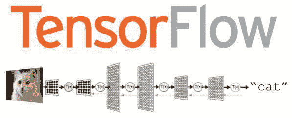

# Python 深度学习框架概述

> 原文：[`www.kdnuggets.com/2017/02/python-deep-learning-frameworks-overview.html`](https://www.kdnuggets.com/2017/02/python-deep-learning-frameworks-overview.html)

**由 Madison May， [indico](https://indico.io/)**。

我最近发现了我在 Data Science Stack Exchange 上关于 [“最佳 Python 神经网络库”](http://datascience.stackexchange.com/a/695/684) 的一个旧回答，这让我意识到在过去 2.5 年里 Python 深度学习生态系统的巨大变化。我在 2014 年 7 月推荐的库 `pylearn2` 已不再积极开发或维护，但许多深度学习库已崛起取而代之。每个库都有其自身的优缺点。我们在 indico 的生产或开发中使用了大多数列表中的技术，但对于少数未使用的，我将借鉴他人的经验，以帮助提供 2017 年 Python 深度学习生态系统的清晰全面的图景。

特别是，我们将关注：

+   Theano

+   Lasagne

+   Blocks

+   TensorFlow

+   Keras

+   MXNet

+   PyTorch

### [Theano](https://github.com/Theano/Theano)

**描述：**

Theano 是一个 Python 库，允许你高效地定义、优化和评估涉及多维数组的数学表达式。它支持 GPU 并执行高效的符号微分。

**文档：**

[`deeplearning.net/software/theano/`](http://deeplearning.net/software/theano/)

**总结：**

Theano 是驱动我们列表中许多其他深度学习框架的数值计算工具。它由 Frédéric Bastien 和蒙特利尔大学 MILA 实验室的优秀研究团队开发。它的 API 级别较低，为了编写有效的 Theano 代码，你需要非常熟悉在其他框架中隐藏的算法。如果你拥有丰富的学术机器学习专业知识，寻找对模型进行非常细粒度控制，或希望实现新颖或不寻常的模型，Theano 是首选库。一般来说，Theano 牺牲了易用性以换取灵活性。

**优点：**

+   灵活

+   如果正确使用则性能良好

**缺点：**

+   学习曲线较陡

+   更低级别的 API

+   编译复杂的符号图可能较慢

**资源：**

+   [安装指南](http://deeplearning.net/software/theano/install.html)

+   [官方 Theano 教程](http://deeplearning.net/software/theano/tutorial/)

+   [Theano 幻灯片和练习题](https://github.com/goodfeli/theano_exercises)

+   [从线性回归到 CNNs 的 Theano 教程](https://github.com/Newmu/Theano-Tutorials)

+   [使用 Python 和 Theano 进行深度学习简介（MNIST 视频教程）](https://indico.io/blog/introduction-to-deep-learning-with-python-and-theano-2/)

### [Lasagne](https://github.com/Lasagne/Lasagne)

**描述：**

一个用于在 Theano 中构建和训练神经网络的轻量级库。

**文档：**

[`lasagne.readthedocs.org/`](http://lasagne.readthedocs.org/)

**总结：**

由于 Theano 主要旨在成为一个符号数学库，Lasagne 在 Theano 之上提供了更适合深度学习的抽象。它主要由 DeepMind 的研究科学家 Sander Dieleman 编写和维护。Lasagne 允许用户从`Layer`层面进行思考，提供像“Conv2DLayer”和“DropoutLayer”等构建块来进行操作，而无需在符号变量之间指定函数关系。Lasagne 在提供丰富的常见组件以帮助层定义、层初始化、模型正则化、模型监控和模型训练的同时，几乎没有牺牲灵活性。

**优点：**

+   仍然非常灵活

+   比 Theano 更高层次的抽象

+   文档和代码包含各种意大利面梗

**缺点：**

+   社区较小

**资源：**

+   [官方 GitHub 页面](https://github.com/Lasagne/Lasagne)

+   [官方安装指南](http://lasagne.readthedocs.io/en/latest/user/installation.html)

+   [官方 Lasagne 教程](http://lasagne.readthedocs.io/en/latest/user/tutorial.html)

+   [示例 Lasagne 代码](https://github.com/Lasagne/Lasagne/tree/master/examples)

### [Blocks](https://github.com/mila-udem/blocks)

**描述：**

一个用于构建和训练神经网络的 Theano 框架。

**文档：**

[`blocks.readthedocs.io/en/latest/`](http://blocks.readthedocs.io/en/latest/)

**总结：**

类似于 Lasagne，Blocks 试图在 Theano 之上添加一层抽象，以便比编写原始 Theano 代码更清晰、更简单、更标准化地定义深度学习模型。它由蒙特利尔大学的实验室 MILA 编写——这些人中有一些参与了 Theano 及其第一个高层接口 PyLearn2 的构建。它比 Lasagne 灵活一些，但有效使用的学习曲线稍微困难一些。Blocks 对递归神经网络架构有很好的支持，如果你对探索这类模型感兴趣，它值得一看。与 TensorFlow 并列，Blocks 是我们在 indico 生产环境中部署的许多 API 的首选库。

**优点：**

+   仍然非常灵活

+   比 Theano 更高层次的抽象

+   经过非常充分的测试

**缺点：**

+   学习曲线较陡

+   社区较小

**资源：**

+   [官方安装指南](http://blocks.readthedocs.io/en/latest/setup.html)

+   [关于 Blocks 库设计的 Arxiv 论文](https://arxiv.org/pdf/1506.00619.pdf)

+   [关于 Blocks 和 Lasagne 之间差异的 Reddit 讨论](https://www.reddit.com/r/MachineLearning/comments/4kpztm/lasagne_vs_blocks_for_deep_learning/)

+   [Block 的数据管道姊妹库 Fuel](https://github.com/mila-udem/fuel)

### [TensorFlow](https://github.com/tensorflow/tensorflow)

**描述：**

一个使用数据流图进行数值计算的开源软件库。

**文档：**

[`www.tensorflow.org/api_docs/python/`](https://www.tensorflow.org/api_docs/python/)

**摘要：**

TensorFlow 是低级符号计算库（如 Theano）和高级网络规范库（如 Blocks 和 Lasagne）之间的混合体。尽管它是 Python 深度学习库中的最新成员，但由于得到 Google Brain 团队的支持，它可能已经拥有了最大的活跃社区。它支持在多个 GPU 上运行机器学习模型，提供高效的数据管道工具，并具有内置的模型检查、可视化和序列化模块。最近，TensorFlow 团队决定将对 Keras 的支持纳入其中，Keras 是我们列表中的下一个深度学习库。社区似乎一致认为，尽管 [TensorFlow 存在不足之处](https://indico.io/blog/the-good-bad-ugly-of-tensorflow/)，但其社区的庞大和项目的巨大势头意味着学习 TensorFlow 是一个安全的选择。因此，TensorFlow 是我们 indico 目前选择的深度学习库。

**优点：**

+   由软件巨头 Google 支持

+   社区非常庞大

+   网络训练的低级和高级接口

+   比基于 Theano 的选项编译模型速度更快

+   支持多 GPU 清洁操作

****缺点：****

+   在许多基准测试中最初较慢于基于 Theano 的选项，尽管 TensorFlow 正在赶上。

+   RNN 支持仍被 Theano 超越

**资源：**

+   [TensorFlow 官方网站](https://www.tensorflow.org/)

+   [下载和设置指南](https://github.com/tensorflow/tensorflow/blob/master/tensorflow/g3doc/get_started/os_setup.md)

+   [indico 对 TensorFlow 的看法](https://indico.io/blog/the-good-bad-ugly-of-tensorflow/)

+   [TensorFlow 教程合集](https://github.com/nlintz/TensorFlow-Tutorials)

+   [使用 TensorFlow 教授的 Udacity 机器学习课程](https://www.udacity.com/course/deep-learning--ud730)

+   [TensorFlow MNIST 教程](https://www.tensorflow.org/tutorials/mnist/beginners/)

+   [TensorFlow 数据输入](https://indico.io/blog/tensorflow-data-inputs-part1-placeholders-protobufs-queues/)

### [Keras](https://github.com/fchollet/keras)

**描述：**

Python 的深度学习库。卷积神经网络、递归神经网络等。可以在 Theano 或 TensorFlow 上运行。

**文档：**

[`keras.io/`](https://keras.io/)

**摘要：**

Keras 可能是所有库中最高层次、最用户友好的库。它由 Google Brain 团队的另一成员 Francis Chollet 编写和维护。它允许用户选择构建的模型是运行在 Theano 还是 TensorFlow 的符号图上。Keras 的用户界面受到 Torch 启发，因此如果你有 Lua 机器学习的经验，Keras 绝对值得一试。部分得益于优秀的文档和相对易用性，Keras 社区非常庞大且活跃。最近，TensorFlow 团队宣布计划内置 Keras 支持，因此 Keras 很快将成为 TensorFlow 项目的一个子集。

**优点：**

+   你可以选择 Theano 或 TensorFlow 后端

+   直观的高层接口

+   更易于学习

**缺点：**

+   比其他选项更不灵活，更具规定性

**资源：**

+   [官方安装指南](https://keras.io/#installation)

+   [Keras 用户 Google 群组](https://groups.google.com/forum/#!forum/keras-users)

+   [Keras 示例库](https://github.com/fchollet/keras/tree/master/examples)

+   [使用 Docker 的 Keras 指南](https://github.com/fchollet/keras/tree/master/docker)

+   [按应用领域分类的 Keras 教程库](https://github.com/fchollet/keras-resources)

### [MXNet](https://github.com/dmlc/mxnet)

**描述：**

MXNet 是一个旨在兼顾效率和灵活性的深度学习框架。

**文档：**

[`mxnet.io/api/python/index.html#python-api-reference`](http://mxnet.io/api/python/index.html#python-api-reference)

**总结：**

MXNet 是亚马逊在深度学习中的首选库，可能是所有库中性能最优的。它具有类似 Theano 和 TensorFlow 的数据流图，提供对多 GPU 配置的良好支持，具有类似 Lasagne 和 Blocks 的高级模型构建模块，并且几乎可以在任何你能想到的硬件上运行（包括手机）。Python 支持只是冰山一角——MXNet 还提供了对 R、Julia、C++、Scala、Matlab 和 JavaScript 的接口。如果你在寻找无与伦比的性能，选择 MXNet，但你必须愿意处理一些 MXNet 的怪癖。

**优点：**

+   超快的基准测试

+   极其灵活

**缺点：**

+   最小的社区

+   比 Theano 的学习曲线更陡峭

**资源：**

+   [官方入门指南](http://mxnet.io/get_started/)

+   [indico 对 MXNet 的介绍](https://indico.io/blog/getting-started-with-mxnet/)

+   [MXNet 示例库](https://github.com/dmlc/mxnet/tree/master/example)

+   [亚马逊 CTO 对 MXNet 的看法](http://www.allthingsdistributed.com/2016/11/mxnet-default-framework-deep-learning-aws.html)

+   [MXNet Arxiv 论文](https://arxiv.org/abs/1512.01274)

### [PyTorch](https://github.com/pytorch/pytorch)

**描述：**

Python 中具有强大 GPU 加速的张量和动态神经网络。

**文档：**

[`pytorch.org/docs/`](http://pytorch.org/docs/)

**总结：**

PyTorch 刚刚发布了一周多，它是我们 Python 深度学习框架列表中的新成员。它是 Lua 的 Torch 库在 Python 上的松散移植，并且值得注意的是，它由 Facebook 人工智能研究团队（FAIR）支持，并且 [设计用于处理动态计算图](http://pytorch.org/about/#dynamic-neural-networks-tape-based-autograd) —— 这是 Theano、TensorFlow 和其衍生品所没有的特性。虽然 PyTorch 在 Python 深度学习生态系统中扮演什么角色尚不明朗，但所有迹象都表明，PyTorch 是我们列表中其他框架的一个非常可敬的替代品。

**优点：**

+   来自 Facebook 的组织支持

+   对动态图的清晰支持

+   高级和低级 API 的结合

**缺点：**

+   比其他选项成熟度低得多（用他们自己的话说——“我们处于早期发布的 Beta 阶段。期待一些冒险。”）

+   官方文档之外的参考/资源有限

**资源：**

+   [官方 PyTorch 主页](http://pytorch.org/)

+   [PyTorch Twitter 动态](https://twitter.com/PyTorch)

+   [PyTorch 示例库](https://github.com/pytorch/examples)

+   [PyTorch 教程库](https://github.com/pytorch/tutorials)

**简历：[Madison May](https://www.linkedin.com/in/madison-may-49a1924a)** 是一位开发者、设计师和工程师，同时是 [indico 数据解决方案](https://indico.io/) 的首席技术官。

[原文](https://indico.io/blog/python-deep-learning-frameworks-reviewed/)。转载已获许可。

**相关：**

+   深度学习、人工直觉与 AGI 的追求

+   深度学习为何与机器学习截然不同

+   深度学习是灵丹妙药吗？

* * *

## 我们的前三大课程推荐

 1\. [Google 网络安全证书](https://www.kdnuggets.com/google-cybersecurity) - 快速开启网络安全职业生涯。

 2\. [Google 数据分析专业证书](https://www.kdnuggets.com/google-data-analytics) - 提升你的数据分析技能

 3\. [Google IT 支持专业证书](https://www.kdnuggets.com/google-itsupport) - 支持组织的信息技术

* * *

### 相关话题更多

+   [使用管道编写干净的 Python 代码](https://www.kdnuggets.com/2021/12/write-clean-python-code-pipes.html)

+   [建立强大的数据团队](https://www.kdnuggets.com/2021/12/build-solid-data-team.html)

+   [是什么让 Python 成为初创企业理想的编程语言](https://www.kdnuggets.com/2021/12/makes-python-ideal-programming-language-startups.html)

+   [每个数据科学家都应该了解的三大 R 库（即使你使用 Python）](https://www.kdnuggets.com/2021/12/three-r-libraries-every-data-scientist-know-even-python.html)

+   [停止学习数据科学，去寻找目的，找到目的后…](https://www.kdnuggets.com/2021/12/stop-learning-data-science-find-purpose.html)

+   [数据科学统计学习的顶级资源](https://www.kdnuggets.com/2021/12/springboard-top-resources-learn-data-science-statistics.html)
