# Python 字典指南：10 个 Python 字典方法及示例

> 原文：[`www.kdnuggets.com/2019/12/python-dictionary-methods.html`](https://www.kdnuggets.com/2019/12/python-dictionary-methods.html)

评论

**由 [Michael Galarnyk](https://www.linkedin.com/in/michaelgalarnyk/)，数据科学家**

本 Python 字典教程涵盖：

+   如何定义字典

+   如何访问字典中的值

+   如何添加、更新和删除字典中的键

+   Python 字典方法

+   如何遍历字典

* * *

## 我们的前三个课程推荐

 1\. [谷歌网络安全证书](https://www.kdnuggets.com/google-cybersecurity) - 快速进入网络安全职业的轨道。

 2\. [谷歌数据分析专业证书](https://www.kdnuggets.com/google-data-analytics) - 提升你的数据分析水平

 3\. [谷歌 IT 支持专业证书](https://www.kdnuggets.com/google-itsupport) - 支持你的组织 IT

* * *

这样，让我们开始吧。

### 定义一个 Python 字典

字典使用花括号 {} 编写。

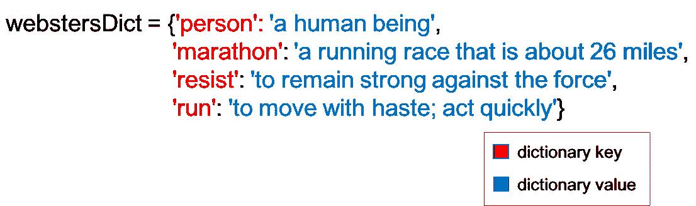 定义字典。键用红色标出。值用蓝色标出。

```py
*# Define a dictionary code* 
webstersDict = {'person': 'a human being',
                'marathon': 'a running race that is about 26 miles',
                'resist': 'to remain strong against the force',
                'run': 'to move with haste; act quickly'}
```

字典 webstersDict 使用了字符串作为字典的键，但字典的键可以是任何不可变的数据类型（数字、字符串、元组等）。字典的值几乎可以是任何东西（整数、列表、函数、字符串等）。

例如，下面的字典 genderDict 使用整数作为键，字符串作为值。

```py
*# Define a dictionary*
genderDict = {0: 'male',
              1: 'female'}
```

需要强调的一点是，如果你尝试将键设为可变数据类型（如列表），你将会遇到错误。

```py
# Failure to define a dictionary
webstersDict = {(1, 2.0): 'tuples can be keys',
                1: 'ints can be keys',
                'run': 'strings can be keys', 
                ['sock', 1, 2.0]: 'lists can NOT be keys'}
```

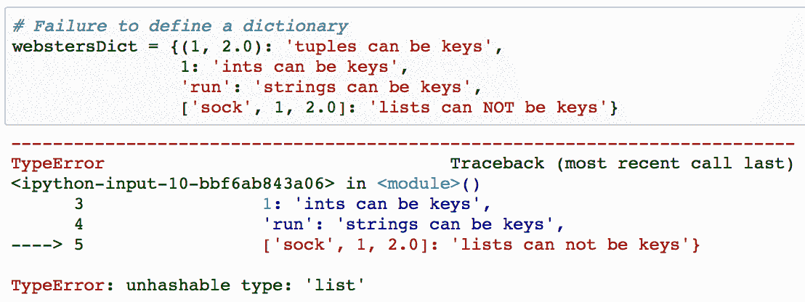 使用列表作为键定义字典失败。列表不是不可变的

### 访问 Python 字典中的值

要访问字典值，可以使用方括号 []。

例如，下面的代码使用键‘marathon’来访问值‘一场约 26 英里的长跑’。

```py
*# Get value of the 'marathon' key*
webstersDict['marathon']
```

 访问键‘marathon’

请记住，如果尝试访问一个**不存在**的键的值，你会得到 KeyError 错误。

```py
*# Try to get value for key that does not exist*
webstersDict['nonexistentKey']
```

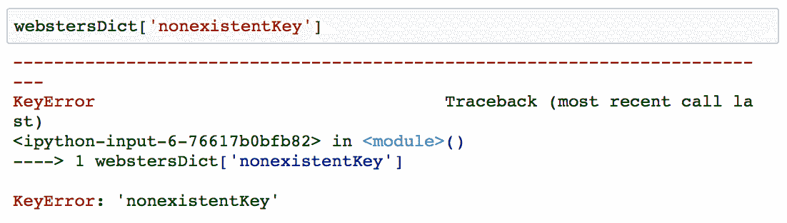 如果尝试查找一个不存在的键，将会导致 KeyError 错误。

在 Python 字典方法部分，你将看到使用字典**get 方法**来避免 KeyErrors 的实用性。

### 添加、更新和删除 Python 字典中的键

### 添加或更新键

你可以添加一个新的键值对。

```py
*# add one new key value pair to a dictionary*
webstersDict['shoe'] = 'an external covering for the human foot'
```

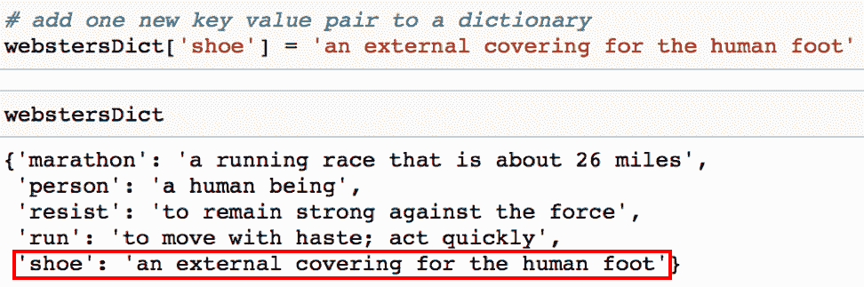 将新键‘shoe’添加到字典中。新键‘shoe’被红色矩形框住。

你也可以更新键值对。

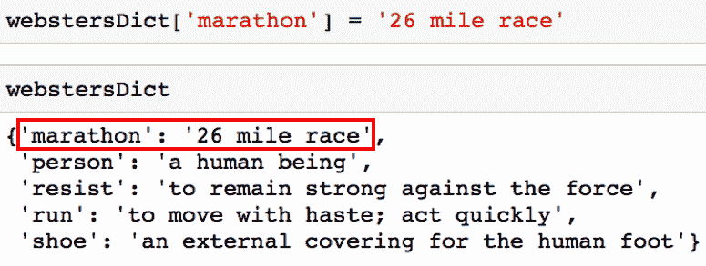 更新字典键‘marathon’

在 Python 字典方法部分，你会看到你还可以使用字典**update 方法**一次添加或更新多个键值对。

### 从 Python 字典中删除键

可以使用**del**删除字典中的键及其对应的值。

```py
# Remove the key 'resist' from the dictionary
del webstersDict['resist']
```

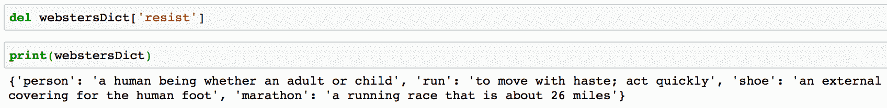从字典 webstersDict 中移除键‘resist’。

在 Python 字典方法部分，你会看到你还可以使用字典**pop 方法**删除键。

### Python 字典方法

Python 字典有不同的方法可以帮助你修改字典。本节教程只是介绍了各种 Python 字典方法。

### update 方法

update 方法对于一次更新多个键值对非常有用。它接受一个字典作为参数。

```py
*# Using update method to add two key value pairs at once*
webstersDict.update({'ran': 'past tense of run',
                     'shoes': 'plural of shoe'})
```

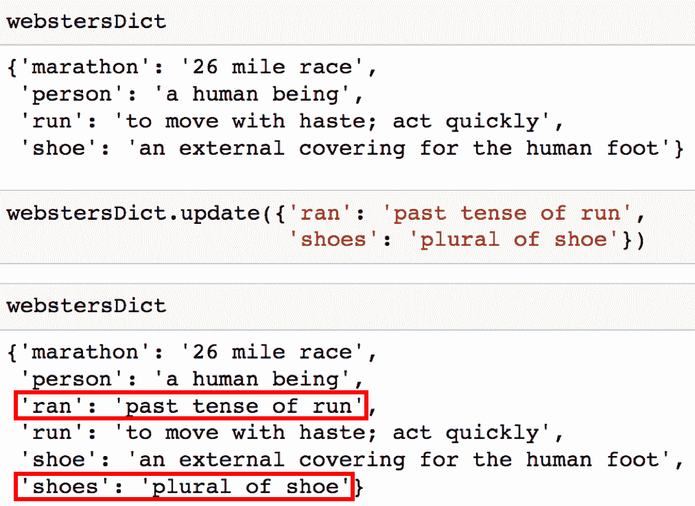将‘ran’和‘shoes’这两个键添加到字典中。

### get 方法

```py
*# Define a dictionary*
storyCount = {'is': 100,
              'the': 90,
              'Michael': 12,
              'runs': 5}
```

get 方法返回给定键的值。如果键不存在，字典默认返回 None。

```py
# Since the key 'Michael' exists, it will return the value 12
storyCount.get('Michael')
```

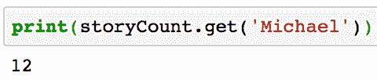由于键‘Michael’存在，它返回值 12。如果‘Michael’不存在，它将返回 None。

这个方法对于查找你不确定是否在字典中的键非常有用，以避免 KeyErrors。

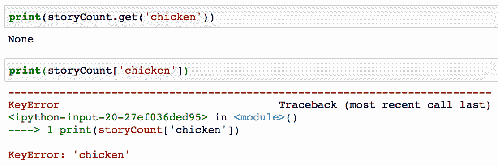键‘chicken’不存在。

你还可以指定一个默认值，以在键不存在时返回。

```py
*# Make default value for key that doesn't exist 0.*
storyCount.get('chicken', 0)
```

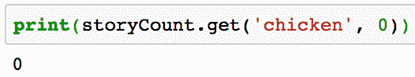如果你尝试一个[Python 词频统计](https://codeburst.io/python-basics-11-word-count-filter-out-punctuation-dictionary-manipulation-and-sorting-lists-3f6c55420855)，你可以看到这个方法的实用性。

### pop 方法

pop 方法移除一个键并返回其值。

```py
storyCount.pop('the')
```

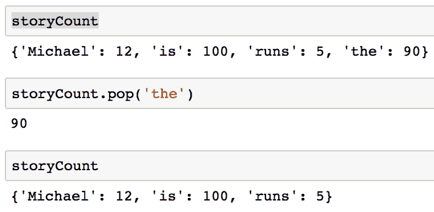移除字典中的键‘the’前后的字典。

### keys 方法

keys 方法返回字典的键。

```py
storyCount.keys()
```

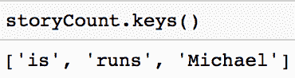

### values 方法

values 方法返回字典中的值。

```py
storyCount.values()
```

### items 方法

items 方法返回一个类似于元组的列表对象，每个元组的形式为（键，值）。

```py
webstersDict.items()
```

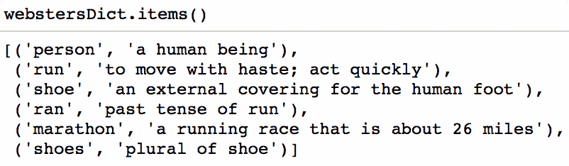

### 遍历字典

你可以通过使用 for 循环遍历字典的键。

```py
for key in storyCount:
   print(key)
```

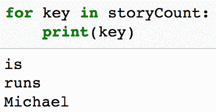遍历字典的键。

你也可以通过使用 keys 方法遍历字典的键。

```py
for key in storyCount.keys():
   print(key)
```

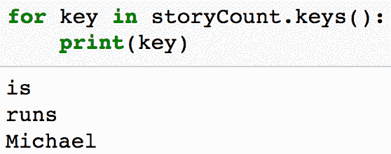遍历字典的键。

下面的 for 循环使用 items 方法在每次循环迭代中访问一个（键，值）对。

```py
for key, value in webstersDict.items():
    print(key, value)
```

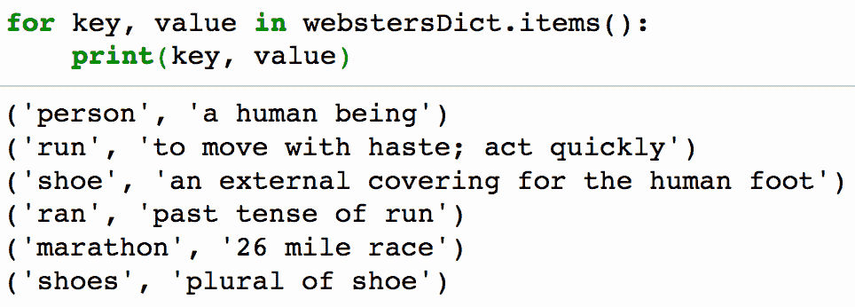遍历字典的键值对。

如果你在理解这一部分时遇到困难，我建议观看以下 [视频](https://youtu.be/LlIqrWJaBcQ?t=5m35s)。

### 结束语

如果你有任何问题，请在此处或通过 [Twitter](https://twitter.com/GalarnykMichael) 告诉我！下一篇文章，[Python 单词计数](https://codeburst.io/python-basics-11-word-count-filter-out-punctuation-dictionary-manipulation-and-sorting-lists-3f6c55420855) 将回顾 Python 字典方法，[列表操作](https://towardsdatascience.com/python-basics-6-lists-and-list-manipulation-a56be62b1f95)，以及 [字符串操作](https://codeburst.io/python-basics-1-hello-world-and-strings-de0d17857c93)。如果你想学习如何使用 Pandas、Matplotlib 或 Seaborn 库，请考虑参加我的 [Python 数据可视化 LinkedIn 学习课程](https://www.linkedin.com/learning/python-for-data-visualization/value-of-data-visualization)。这里有一个 [免费预览视频](https://youtu.be/BE8CVGJuftI)。

**简介: [迈克尔·加拉尔尼克](https://www.linkedin.com/in/michaelgalarnyk/)** 是一名数据科学家和企业培训师。他目前在斯克里普斯转化研究所工作。你可以在 Twitter (https://twitter.com/GalarnykMichael)、Medium (https://medium.com/@GalarnykMichael) 和 GitHub (https://github.com/mGalarnyk) 上找到他。

[原文](https://medium.com/@GalarnykMichael/python-basics-10-dictionaries-and-dictionary-methods-4e9efa70f5b9)。转载经许可。

**相关:**

+   Python 元组和元组方法

+   Python 列表和列表操作

+   如何构建数据科学投资组合

### 更多相关主题

+   [如何更新 Python 字典](https://www.kdnuggets.com/2023/02/update-python-dictionary.html)

+   [数据科学、统计学和机器学习词典](https://www.kdnuggets.com/2022/05/data-science-statistics-machine-learning-dictionary.html)

+   [理解 Python 的迭代和成员资格：__contains__ 和 __iter__ 魔法方法指南](https://www.kdnuggets.com/understanding-pythons-iteration-and-membership-a-guide-to-__contains__-and-__iter__-magic-methods)

+   [SQL LIKE 操作符示例](https://www.kdnuggets.com/2022/09/sql-like-operator-examples.html)

+   [示例的集成学习](https://www.kdnuggets.com/2022/10/ensemble-learning-examples.html)

+   [选择示例以理解机器学习模型](https://www.kdnuggets.com/2022/11/picking-examples-understand-machine-learning-model.html)
