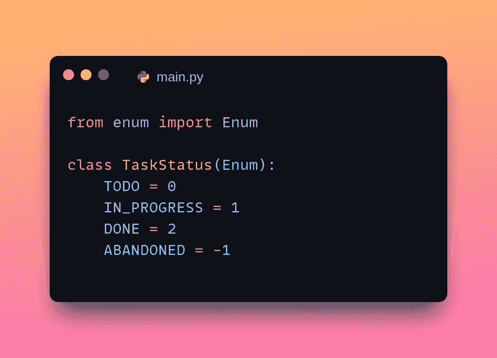
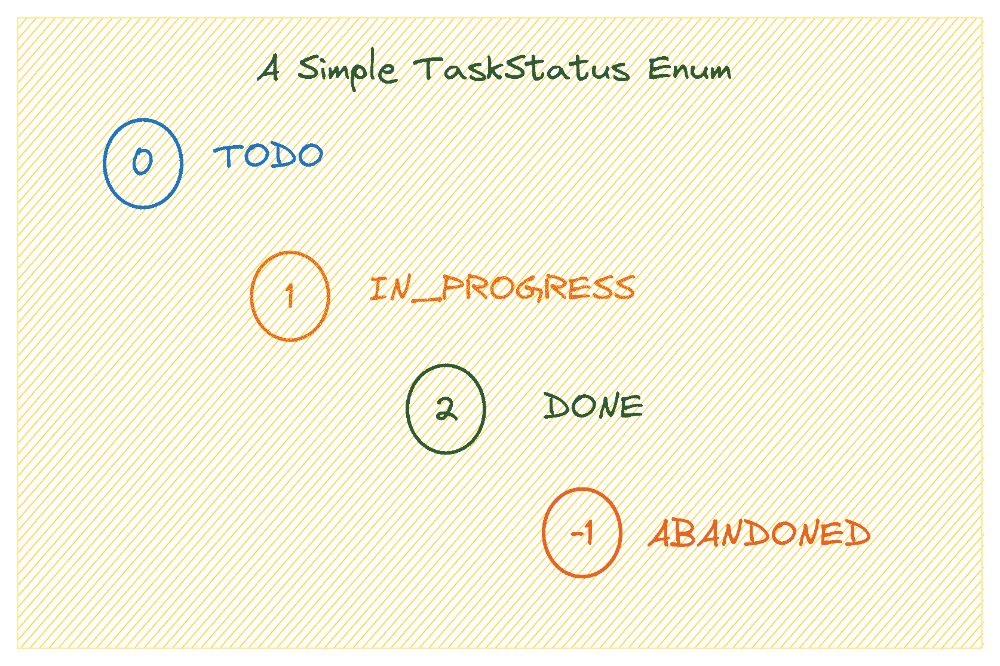
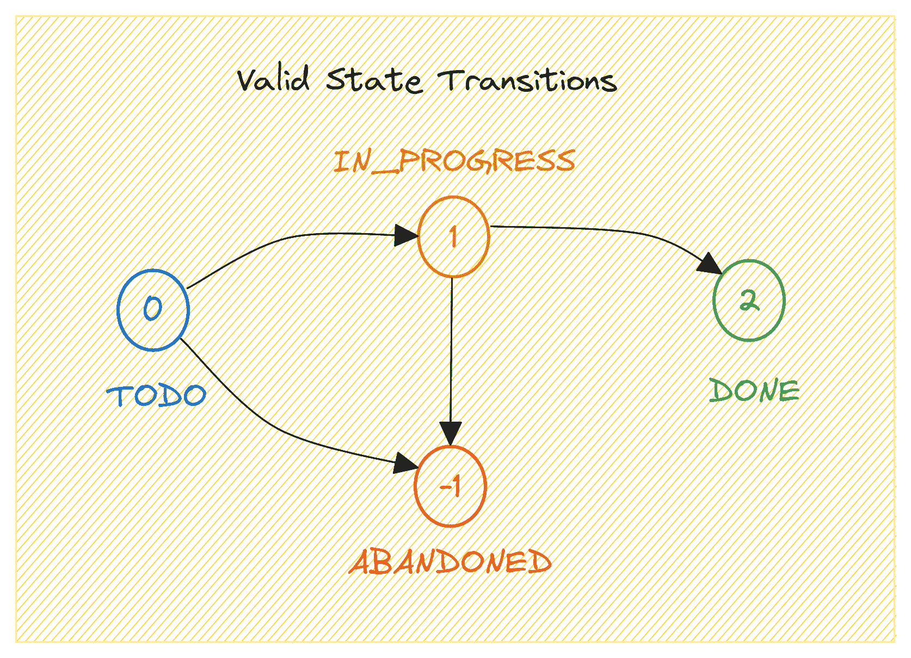

# Python 枚举：如何在 Python 中构建枚举

> 原文：[`www.kdnuggets.com/python-enum-how-to-build-enumerations-in-python`](https://www.kdnuggets.com/python-enum-how-to-build-enumerations-in-python)



图片来源：作者

如果你使用过像 C++ 或 Java 这样的编程语言，你可能已经使用了枚举来创建命名常量。当你有一个变量，它可以取一个固定数量的值时，枚举是很有用的——这些值通常是相关的，如一周中的天数、学生成绩、订单状态等。

* * *

## 我们的前三个课程推荐

 1\. [Google 网络安全证书](https://www.kdnuggets.com/google-cybersecurity) - 快速进入网络安全职业轨道。

 2\. [Google 数据分析专业证书](https://www.kdnuggets.com/google-data-analytics) - 提升你的数据分析技能

 3\. [Google IT 支持专业证书](https://www.kdnuggets.com/google-itsupport) - 支持你的组织的 IT

* * *

然而，Python 并没有一个显式的枚举数据类型。但你可以使用 Python 标准库中的 enum 模块来创建枚举。本教程将教你如何做。

让我们开始吧！

# 什么是枚举，为什么要使用它们？

枚举代表“枚举”，由一组预定义的命名常量组成。这些常量通常相关联。常见的例子包括一年中的月份、一周中的天数、等级、顺序和任务状态。

总结一下：枚举本质上是相关常量的集合，每个常量都有一个有意义的名称。

在 Python 中，你可以使用 [enum 模块](https://docs.python.org/3/library/enum.html) 来创建枚举（我们将很快进行演示！）。

## 为什么使用枚举

使用枚举有助于提高代码的清晰度和可维护性。方法如下：

+   枚举通过用有意义的标签替换神秘数字或字符串来增强代码的清晰度。它们还使代码更具自文档化，因为枚举成员的名称传达了它们的目的。

+   枚举通过提供一种简单的方式来定义和管理相关常量，从而提高代码的可维护性。

+   通过将变量赋值限制为仅有效的枚举值，枚举还确保了类型安全。

+   枚举便于对相关常量进行简单的迭代和比较。

现在让我们在 Python 中创建我们的第一个枚举。

# 使用 Python 的 Enum 类创建枚举

我们将创建一个 `TaskStatus` 枚举，它包含以下四个名称和值：



图片来源：作者

首先，我们从 enum 模块中导入 `Enum` 类来创建枚举。

然后我们定义一个新的类 `TaskStatus`，它继承自 `Enum` 来创建枚举。每个成员都定义了一个唯一的名称和一个可选的值，如下所示：

```py
from enum import Enum

class TaskStatus(Enum):
    TODO = 0
    IN_PROGRESS = 1
    DONE = 2
    ABANDONED = -1
```

我们创建的所有枚举成员都是 Enum 类的实例。你可以通过调用`isinstance()`函数来验证，如下所示：

```py
print(isinstance(TaskStatus.TODO,Enum))
```

```py
Output >>> True
```

让我们通过将`TaskStatus`枚举转换成列表来打印出所有成员：

```py
print(list(TaskStatus))
```

你应该看到以下输出：

```py
Output >>>

[<TaskStatus.TODO: 0>, <TaskStatus.IN_PROGRESS: 1>, <TaskStatus.DONE: 2>, <TaskStatus.ABANDONED: -1>]
```

所有枚举成员都有一个**名称**和一个**值**。这意味着你可以通过它们的名称来访问枚举成员，比如`TaskStatus.TODO`。或者通过值来访问它们，比如`TaskStatus(0)`。

# 使用 Python 枚举

现在我们已经创建了一个简单的`TaskStatus`枚举，接下来让我们学习如何执行一些简单的任务，例如对枚举成员进行迭代。

## 迭代枚举

在 Python 中，你可以以类似于处理任何可迭代对象的方式来处理枚举。例如，你可以使用`len()`函数来计算枚举成员的数量：

```py
num_statuses = len(TaskStatus)
print(num_statuses)
```

```py
Output >>> 4
```

你也可以像迭代 Python 的可迭代对象（如列表）一样迭代枚举。在下面的 for 循环中，我们访问每个枚举成员的名称和值，并将它们打印出来：

```py
for status in TaskStatus:
    print(status.name, status.value)
```

这是输出结果：

```py
Output >>> 

TODO 0
IN_PROGRESS 1
DONE 2
ABANDONED -1
```

## 枚举中的排序

在示例中，状态及其对应的数字值如下：

+   TODO: 0

+   IN_PROGRESS: 1

+   DONE: 2

+   ABANDONED: -1

但你也可以使用默认的排序方式，通过使用`auto()`辅助函数。当你这样做时，如果枚举中有‘n’个成员，分配的值是 1 到 n。但你可以传入一个起始值，比如 k，`auto(k)`用于使枚举从 k 开始并递增到 k + n。

让我们按如下方式修改`TaskStatus`枚举：

```py
from enum import Enum, auto

class TaskStatus(Enum):
    TODO = auto()
    IN_PROGRESS = auto()
    DONE = auto()
    ABANDONED = auto()
```

现在让我们打印出这些成员：

```py
print(list(TaskStatus))
```

我们看到这些值是 1 到 4，正如预期的那样：

```py
Output >>>

[<TaskStatus.TODO: 1>, <TaskStatus.IN_PROGRESS: 2>, <TaskStatus.DONE: 3>, <TaskStatus.ABANDONED: 4>]
```

# 基于 TaskStatus 枚举——一个更有用的示例

现在，让我们在已有的`TaskStatus`枚举基础上继续构建。在你的工作目录中创建一个 task.py 文件，并包含以下版本的枚举：

```py
# task.py

from enum import Enum

class TaskState(Enum):
    TODO = 0
    IN_PROGRESS = 1
    DONE = 2
    ABANDONED = -1
```

假设我们有一个任务，包含一个名称和一个当前状态。有效的状态转换如下所示：



作者提供的图片

让我们创建一个`Task`类：

```py
class Task:
    def __init__(self, name, state):
        self.name = name
        self.state = state

    def update_state(self, new_state):
        # Define valid state transitions based on the current state
        valid_transitions = {
        	TaskState.TODO: [TaskState.IN_PROGRESS, TaskState.ABANDONED],
        	TaskState.IN_PROGRESS: [TaskState.DONE, TaskState.ABANDONED],
        	TaskState.DONE: [],
        	TaskState.ABANDONED: []
    	}

        # Check if the new state is a valid transition from the current state
        if new_state in valid_transitions[self.state]:
            self.state = new_state
        else:
            raise ValueError(f"Invalid state transition from {self.state.name} to {new_state.name}")
```

我们有一个`update_status()`方法，用于检查在当前状态下过渡到新状态是否有效。对于无效的过渡，会引发 ValueError 异常。

这是`Task`类的一个实例：状态为 TODO 的“写报告”任务：

```py
# Create a new task with the initial state "To Do"
task = Task("Write Report", TaskState.TODO)

# Print the task details
print(f"Task Name: {task.name}")
print(f"Current State: {task.state.name}")
```

```py
Output >>>
Task Name: Write Report
Current State: TODO
```

将任务的状态更新为 IN_PROGRESS 应该能成功，因为这是一个有效的状态转换：

```py
# Update the task state to "In Progress"
task.update_state(TaskState.IN_PROGRESS)
print(f"Updated State: {task.state.name}")
```

```py
Output >>> Updated State: IN_PROGRESS
```

一旦任务完成，我们可以将其状态更新为 DONE：

```py
# Update the task state to "DONE"
task.update_state(TaskState.DONE)
print(f"Updated State: {task.state.name}")
```

```py
Output >>> Updated State: DONE
```

但如果你尝试将状态更新为无效的状态，比如尝试将 DONE 更新为 TODO，你会遇到 ValueError 异常：

```py
# Attempt to update the task state to an invalid state
task.update_state(TaskState.TODO)
```

这是因为从 DONE 到 TODO 的无效状态转换引发的 ValueError 的追溯：

```py
Traceback (most recent call last):
  File "/home/balapriya/enums/task.py", line 46, in <module>
	task.update_state(TaskState.TODO)
  File "/home/balapriya/enums/task.py", line 30, in update_state
	raise ValueError(f"Invalid state transition from {self.state.name} to {new_state.name}")
ValueError: Invalid state transition from DONE to TODO</module>
```

# 总结

在本教程中，我们学习了如何通过编写一个简单的 TaskStatus 枚举来构建枚举。我们学习了如何访问枚举成员并对其进行迭代。

此外，我们还学习了如果你选择使用 `auto()` 辅助函数来设置枚举成员的值，默认排序是如何工作的。然后，我们尝试在一个更有用的示例中使用 TaskStatus 枚举。

你可以在 [GitHub 上找到代码示例](https://github.com/balapriyac/python-basics/tree/main/enums)。我会在另一个 Python 教程中再见到你们。在那之前，祝编程愉快！

**[](https://twitter.com/balawc27)**[Bala Priya C](https://www.kdnuggets.com/wp-content/uploads/bala-priya-author-image-update-230821.jpg)**** 是一位来自印度的开发者和技术作家。她喜欢在数学、编程、数据科学和内容创作的交汇点上工作。她的兴趣和专长领域包括 DevOps、数据科学和自然语言处理。她喜欢阅读、写作、编程和咖啡！目前，她正在通过编写教程、操作指南、观点文章等，学习并与开发者社区分享她的知识。Bala 还创建了引人入胜的资源概述和编码教程。

### 更多相关内容

+   [用 Python 在 5 分钟内构建一个网页抓取器](https://www.kdnuggets.com/2022/02/build-web-scraper-python-5-minutes.html)

+   [它活过来了！用 Python 和一些便宜的……构建你的第一个机器人](https://www.kdnuggets.com/2023/06/manning-build-first-robots-python-cheap-basic-components.html)

+   [FastAPI 教程：用 Python 在几分钟内构建 API](https://www.kdnuggets.com/fastapi-tutorial-build-apis-with-python-in-minutes)

+   [用 Python 在 5 分钟内构建一个文本到语音转换器](https://www.kdnuggets.com/2022/09/build-texttospeech-converter-python-5-minutes.html)

+   [用 Python 在 10 个简单步骤中构建一个 AI 应用程序](https://www.kdnuggets.com/build-an-ai-application-with-python-in-10-easy-steps)

+   [用 Python 轻松构建命令行应用程序的 7 个步骤](https://www.kdnuggets.com/build-a-command-line-app-with-python-in-7-easy-steps)
