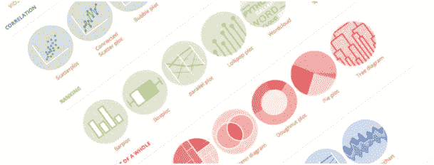
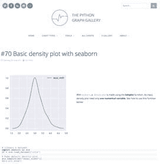
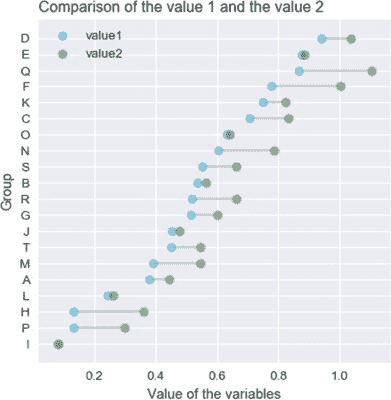
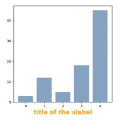

# Python 图形画廊

> 原文：[`www.kdnuggets.com/2017/11/python-graph-gallery.html`](https://www.kdnuggets.com/2017/11/python-graph-gallery.html)

**由 [Yan Holtz](https://holtzyan.wordpress.com/)，布里斯班昆士兰脑研究所**

[Python](https://www.python.org/) 目前是数据科学领域领先的编程语言，其次是 [R](https://www.r-project.org/) [参考: [KDnuggets](https://www.kdnuggets.com/2017/08/python-overtakes-r-leader-analytics-data-science.html)]。数据可视化是这一领域的关键步骤，Python 在图形表示数据方面提供了 [极大的可能性](https://python-graph-gallery.com/all-charts/)。然而，众多工具和文档的复杂性使得构建所需图表变得困难。

[Python 图形画廊](https://www.python-graph-gallery.com/) 是一个展示用 Python 制作的数百种图形的网站，始终提供可重复的代码片段。

**400 张图形和 40 个部分**

画廊目前提供大约 400 张不同的图表，组织在 40 个部分中。每个部分由设计师 [Conor Healy](http://www.conor.fr/indexEN.html) 制作的徽标表示。颜色取决于图形的主题：分布、相关性、整体部分、地图、流程、演变……这种分类受到 [图形连续体](https://policyviz.com/2014/09/09/graphic-continuum/) 的启发，应该可以帮助你快速找到所需的图表。

当然，大多数常见的图形类型如 [条形图](https://python-graph-gallery.com/barplot/)、[散点图](http://python-graph-gallery.com/scatter-plot/)、[箱线图](http://python-graph-gallery.com/boxplot/) 或 [直方图](http://python-graph-gallery.com/histogram/) 都在其中。但也有一些不那么常见的数据可视化类型，比如 [棒棒糖](https://python-graph-gallery.com/lollipop-plot/) 图、[气泡](https://python-graph-gallery.com/bubble-plot/) 图、[2D 密度](https://python-graph-gallery.com/2d-density-plot/) 图或 [词云](https://python-graph-gallery.com/wordcloud/)。

**从简单到复杂**

一旦进入图表部分，会显示几个示例，从最简单到最复杂。通常，第一个示例描述输入数据集必须如何格式化，以及如何使用默认参数生成图形。提供了解释，代码被缩短到最少且逐行注释，这使得理解函数的工作原理变得容易。这里是一个关于 [最简单的密度图](https://python-graph-gallery.com/70-basic-density-plot-with-seaborn/) 的概述：

示例会逐步引导你从非常基础的版本到高度自定义的图表。每个示例旨在解释一个特定的技巧，比如自定义颜色、翻转坐标轴、添加多个分组等等。在该部分的末尾，你将找到一些‘实际案例’，结合所有这些技巧，得到一个漂亮的自定义图形。

**重点关注 Matplotlib 和 Seaborn**

在制作 Python 图表时，存在许多库。我决定主要依赖[Matplotlib](https://python-graph-gallery.com/matplotlib/)和[Seaborn](https://python-graph-gallery.com/seaborn/)，这两个工具目前是主要使用的工具。几乎所有类型的图表都可以用它们制作。当它们无法满足需求时，我会使用其他库，如用于地图的[folium](https://python-graph-gallery.com/map/)或用于网络的[networkX](https://python-graph-gallery.com/network-chart/)。

请注意，Matplotlib 和 Seaborn 都有一个专门的页面，展示了适用于每种图表类型的通用技巧，如自定义坐标轴和标题、调用不同的主题、控制颜色等。这些页面可以帮助你快速找到我们容易忘记的日常代码片段。

访问此链接 [here](https://python-graph-gallery.com/191-custom-axis-on-matplotlib-chart/) 获取代码。

**结论**

[Python Graph Gallery](http://www.python-graph-gallery.com/)展示了数百个图形，并希望能帮助你快速实现所需的图表。在这方面，它主要旨在从技术角度帮助用户。

然而，最终目标也是提高用户在数据可视化领域的知识：

+   通过访问该网站，你可能会发现适合你的数据的新型数据可视化选项。

+   每个部分都有一个简短的描述，解释何时建议使用该图表类型。

+   有时在部分底部会包括一个不良图表示例，警告你关于这种图表类型的常见错误。

该画廊是 Yan Holtz 在他的夜晚和假期期间开发的项目。因此，请对错误、不准确之处和英语语言错误宽容。任何错误或反馈都非常欢迎，通过 yan.holtz.data@gmail.com 或推特：[ @R_Graph_Gallery](https://twitter.com/R_Graph_Gallery?lang=en) 提供。最后但同样重要的是，请注意 Python 图形画廊有一个双胞胎姐妹网站：[R graph gallery](http://www.r-graph-gallery.com/)。

**作者简介**

[Yan Holtz](https://holtzyan.wordpress.com/) 是一位热衷的数据分析师和生物信息学家，目前在布里斯班的昆士兰脑研究所工作。他对数据可视化情有独钟，这使他建立了[R](http://www.r-graph-gallery.com/)和[Python](https://www.python-graph-gallery.com/)图表库。他可以通过以下方式联系到他：yan.holtz.data@gmail.com。

首页: [`holtzyan.wordpress.com/`](https://holtzyan.wordpress.com/)

**相关内容：**

+   [在 Matplotlib 中创建数据可视化](https://www.kdnuggets.com/2017/01/datascience-data-visualization-matplotlib.html)

+   [适用于任何学科的 10 个有用 Python 数据可视化库](https://www.kdnuggets.com/2016/06/python-data-visualization-libraries.html)

+   [导致数据可视化效果差的 5 个常见错误](https://www.kdnuggets.com/2017/10/5-common-mistakes-bad-data-visualization.html)

* * *

## 我们的前三名课程推荐

 1\. [谷歌网络安全证书](https://www.kdnuggets.com/google-cybersecurity) - 快速进入网络安全职业的快车道。

 2\. [谷歌数据分析专业证书](https://www.kdnuggets.com/google-data-analytics) - 提升你的数据分析技能

 3\. [谷歌 IT 支持专业证书](https://www.kdnuggets.com/google-itsupport) - 支持你所在组织的 IT 工作

* * *

### 更多相关内容

+   [使用 Python 图表库创建令人惊叹的可视化](https://www.kdnuggets.com/2022/12/make-amazing-visualizations-python-graph-gallery.html)

+   [关于可信图神经网络的全面调查：隐私、鲁棒性、公平性和解释性](https://www.kdnuggets.com/2022/05/comprehensive-survey-trustworthy-graph-neural-networks-privacy-robustness-fairness-explainability.html)

+   [如何使用图论来勘探足球](https://www.kdnuggets.com/2022/11/graph-theory-scout-soccer.html)

+   [如何使用图数据库构建实时推荐引擎](https://www.kdnuggets.com/2023/08/build-realtime-recommendation-engine-graph-databases.html)

+   [思维图谱：解决大型语言模型中复杂问题的新范式](https://www.kdnuggets.com/graph-of-thoughts-a-new-paradigm-for-elaborate-problem-solving-in-large-language-models)

+   [入门图数据库查询，附备忘单！](https://www.kdnuggets.com/getting-started-with-graph-database-queries-with-cheat-sheet)
