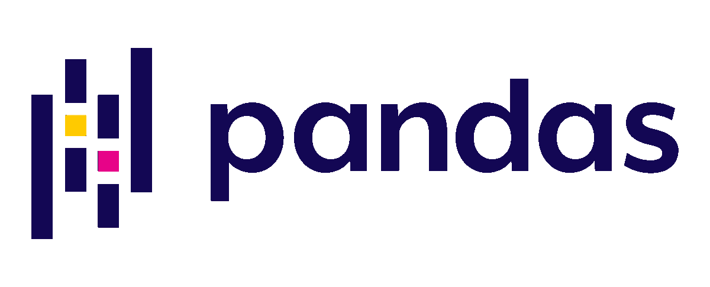
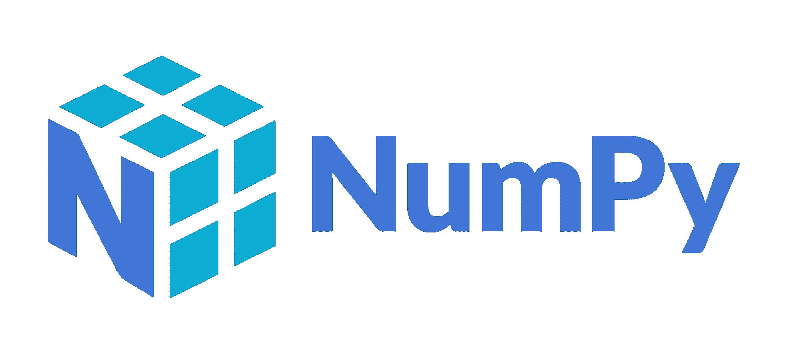
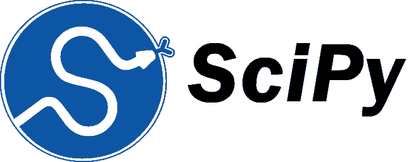
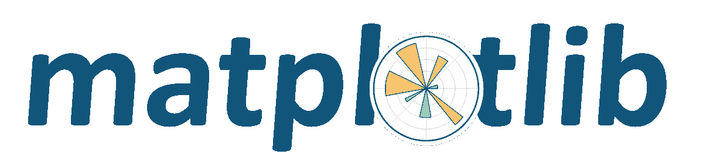
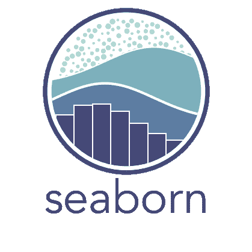
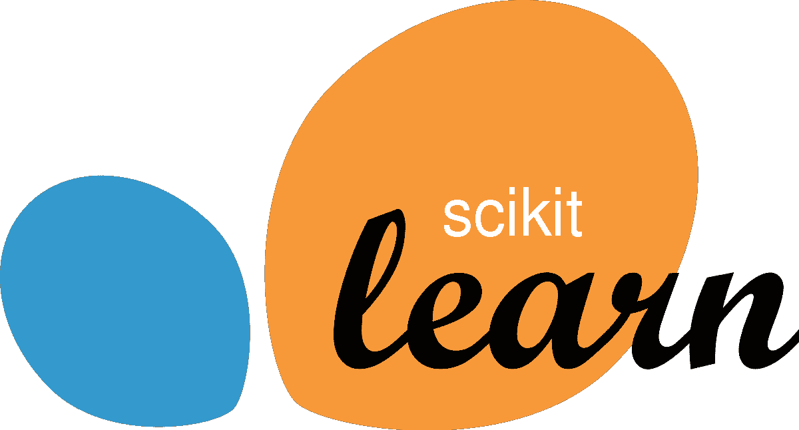
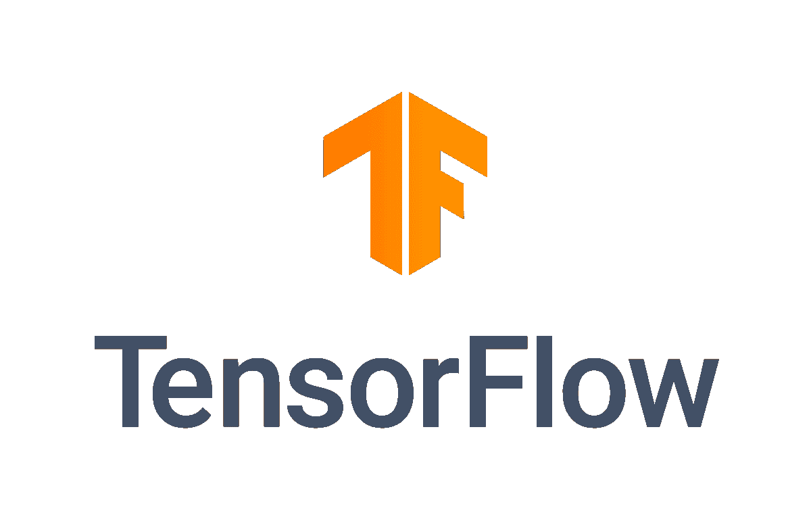

# 数据科学家在 2022 年应该了解的 Python 库

> 原文：[`www.kdnuggets.com/2022/04/python-libraries-data-scientists-know-2022.html`](https://www.kdnuggets.com/2022/04/python-libraries-data-scientists-know-2022.html)

随着越来越多的人进入科技领域，试图从事数据科学家、数据分析师、机器学习工程师等角色，编程语言 Python 变得越来越受欢迎。由于其简化的语法，Python 语言被认为是最易于使用的编程语言之一。

随着数据科学的流行，新的库不断发布，以帮助解决数据科学中的挑战。学习库的方方面面可能会非常让人不知所措；然而，有些库对我们的学习至关重要。

以下是每个数据科学家在 2022 年应该了解的 Python 库，以保持和提升他们的编程技能。

* * *

## 我们的前三大课程推荐

 1\. [Google 网络安全证书](https://www.kdnuggets.com/google-cybersecurity) - 快速进入网络安全职业。

 2\. [Google 数据分析专业证书](https://www.kdnuggets.com/google-data-analytics) - 提升你的数据分析技能

 3\. [Google IT 支持专业证书](https://www.kdnuggets.com/google-itsupport) - 支持你的组织的 IT 工作

* * *

# Pandas



来源：<href en.wikipedia.org="" wiki="" pandas_="" rel="noopener" target="_blank">维基百科</href>

Pandas 是由[Wes McKinney](http://wesmckinney.com/pages/about.html)于 2008 年创建的，是一个用于数据处理和分析的 Python 库。Wes McKinney 基于对强大且灵活分析工具的需求构建了 Pandas。

Pandas 可以处理：

+   处理缺失数据（表示为 NaN）

+   数据集的灵活重塑和透视

+   数据集的索引、操作、重命名、合并和连接

+   时间序列专用功能

+   以及更多

**核心任务：** 数据处理和分析

**如何安装 Pandas：** [Pandas 安装](https://pandas.pydata.org/docs/getting_started/install.html)

```py
pip install pandas
```

**获取书籍：** [Wes McKinney 的《数据分析的 Python 语言》](https://www.amazon.com/gp/product/1491957662/ref=as_li_qf_asin_il_tl?ie=UTF8&tag=quantpytho-20&creative=9325&linkCode=as2&creativeASIN=1491957662&linkId=ea8de4253cce96046e8ab0383ac71b33)

# NumPy



来源：<href en.wikipedia.org="" wiki="" numpy="" rel="noopener" target="_blank">维基百科</href>

NumPy 是另一个用于 Python 的库，主要用于数学函数。它在处理多维数组对象及各种派生对象（如掩码数组和矩阵）方面非常受欢迎，主要用于机器学习计算。该软件包含线性代数、傅里叶变换和矩阵计算函数。

NumPy 可以处理：

+   数组操作如加法、乘法、切割、排序、索引。

+   处理线性代数。

+   NumPy Python 中的基本切片和高级索引。

+   添加/删除/排序元素。

**核心任务：** 处理数组，使用数学函数。

**如何安装 NumPy：** [NumPy 安装](https://numpy.org/install/)

```py
pip install numpy
```

# SciPy



来源：<href scipy.org="" rel="noopener" target="_blank">SciPy</href>

SciPy 代表科学 Python。SciPy 是一个免费且开源的 Python 库，是主要建立在 NumPy 扩展上的数学算法和函数集合。

SciPy：

+   可以操作和可视化数据。

+   包含多种子包，帮助解决与科学计算相关的最常见挑战和问题。

+   可以处理线性代数、积分、常微分方程、微积分和信号处理。

+   易于使用和理解，计算速度快。

+   它可以操作 NumPy 库的数组。

**核心任务：** 解决科学和数学问题。

**如何安装 SciPy：** [SciPy 安装](https://scipy.org/install/)

```py
pip install scipy
```

```py
conda install scipy
```

# Matplotlib



来源：<href github.com="" matplotlib="" rel="noopener" target="_blank">GitHub</href>

Matplotlib 是 NumPy 的一个数值扩展，它是一个跨平台的数据可视化和图形绘制库，用于 Python。它与 NumPy 一起使用，提供了一个有效的环境，是一个开源的 MatLab 替代品。

Matplotlib 可以：

+   创建高质量的数据图表。

+   创建折线图、散点图、条形图和直方图、饼图、茎图、频谱图。

+   制作可以缩放、平移和更新的交互式图形。

+   自定义可视化的样式和布局。

+   导出到不同的文件格式。

**核心任务：** 创建静态、动画和/或交互式的 Python 可视化图。

**如何安装 Matplotlib：** [Matplotlib 安装](https://matplotlib.org/stable/#installation)

```py
pip install matplotlib
```

```py
conda install matplotlib
```

**GitHub：** [Matplotlib](https://github.com/matplotlib/matplotlib)

**教程：** [Matplotlib 教程](https://matplotlib.org/stable/tutorials/index)

**进一步阅读的书籍：**

+   [掌握 matplotlib](https://www.packtpub.com/product/mastering-matplotlib/9781783987542) 由 Duncan M. McGreggor 编写。

+   [使用 Matplotlib 创建交互式应用程序](https://www.packtpub.com/product/interactive-applications-using-matplotlib/9781783988846) 由 Benjamin Root 编写。

+   [《Matplotlib for Python Developers》](https://www.packtpub.com/product/matplotlib-for-python-developers/9781847197900) 作者：Sandro Tosi

# Seaborn



Seaborn 是一个建立在 [matplotlib](https://matplotlib.org/) 之上的库，并与 [pandas](https://pandas.pydata.org/) 数据结构紧密集成。它提供了一个高层接口，通过其绘图函数绘制吸引人且信息丰富的统计图形，帮助你进一步探索和理解数据。

Seaborn 能：

+   创建散点图、直方图、条形图、箱线图等

+   显示两个或三个数据点之间的线性关系

+   比 matplotlib 更舒适地处理 Pandas 数据框

+   执行语义映射和统计聚合以生成信息图。

**核心任务：** 在 Python 中制作统计图形

**如何安装 Seaborn：** [Seaborn 安装](https://seaborn.pydata.org/installing.html)

```py
pip install seaborn
```

```py
conda install seaborn
```

# Scikit-learn



来源：<href en.wikipedia.org="" wiki="" scikit-learn="" rel="noopener" target="_blank">维基百科</href>

Scikit-learn 是一个免费的机器学习库，包含有效的机器学习和统计建模工具，如分类、回归、聚类和降维。

Sci-kit Learn 的主要优点是开源、易于使用、文档完善且用途广泛。

Scikit-learn 可用于：

+   监督学习和无监督学习

+   聚类和降维

+   集成方法

+   交叉验证

+   特征提取和选择

**核心任务：** 机器学习和统计建模

**如何安装 Sci-kit Learn：** [Sci-kit Learn 安装](https://scikit-learn.org/stable/install.html)

```py
pip install scikit-learn
```

**进一步阅读：**

+   [《动手学习机器学习：使用 Scikit-Learn、Keras 和 TensorFlow》](https://www.amazon.co.uk/Hands-Machine-Learning-Scikit-Learn-TensorFlow/dp/1492032646) 作者：Aurelien Geron

# TensorFlow



来源：<href en.wikipedia.org="" wiki="" tensorflow="" rel="noopener" target="_blank">维基百科</href>

TensorFlow 由 Google Brain 团队构建，是一个开源的深度学习应用库。TensorFlow 还通过帮助开发者创建具有多个层的大规模神经网络，使构建深度学习模型变得容易。

TensorFlow 可/已用于：

+   语音和声音识别

+   情感分析、文本分类

+   文本应用程序，如 Google 翻译、Gmail 等。

+   人脸识别，如 Facebook Deep Face、照片标记等

**核心任务：** 使用 Python 开发和训练模型

**如何安装 TensorFlow：** [TensorFlow 安装](https://www.tensorflow.org/install)

```py
pip install tensorflow
```

**进一步阅读的书籍**：

+   [使用 Scikit-Learn、Keras 和 TensorFlow 进行实践机器学习](https://www.amazon.co.uk/Hands-Machine-Learning-Scikit-Learn-TensorFlow/dp/1492032646) 作者为 Aurelien Geron

+   [学习 TensorFlow：构建深度学习系统指南](https://www.amazon.co.uk/Learning-TensorFlow-Tom-Hope/dp/1491978511) 作者为 Itay Lieder、Tom Hope 和 Yehezkel S. Resheff

+   [TensorFlow 深度学习：从线性回归到强化学习](https://www.amazon.co.uk/TensorFlow-Deep-Learning-Bharath-Ramsundar/dp/1491980451) 作者为 Bharath Ramsundar 和 Reza Bosagh

**[尼莎·阿亚](https://www.linkedin.com/in/nisha-arya-ahmed/)** 是一名数据科学家和自由撰稿人。她特别感兴趣于提供数据科学职业建议或教程以及围绕数据科学的理论知识。她还希望探索人工智能在延长人类寿命方面的不同方式。作为一名热衷于学习的人，她寻求拓宽自己的技术知识和写作技能，同时帮助引导他人。

### 更多相关内容

+   [KDnuggets 新闻，4 月 13 日：数据科学家应该知道的 Python 库…](https://www.kdnuggets.com/2022/n15.html)

+   [每个数据科学家都应该知道的三个 R 库（即使你使用 Python）](https://www.kdnuggets.com/2021/12/three-r-libraries-every-data-scientist-know-even-python.html)

+   [每个数据工程师都应该知道的 7 个 Python 库](https://www.kdnuggets.com/7-python-libraries-every-data-engineer-should-know)

+   [每个数据科学家都应该知道的 10 个 Python 库](https://www.kdnuggets.com/10-python-libraries-every-data-scientist-should-know)

+   [Level 50 数据科学家：应知的 Python 库](https://www.kdnuggets.com/level-50-data-scientist-python-libraries-to-know)

+   [数据科学家在 2022 年的收入是多少？](https://www.kdnuggets.com/2022/02/much-data-scientists-make-2022.html)
