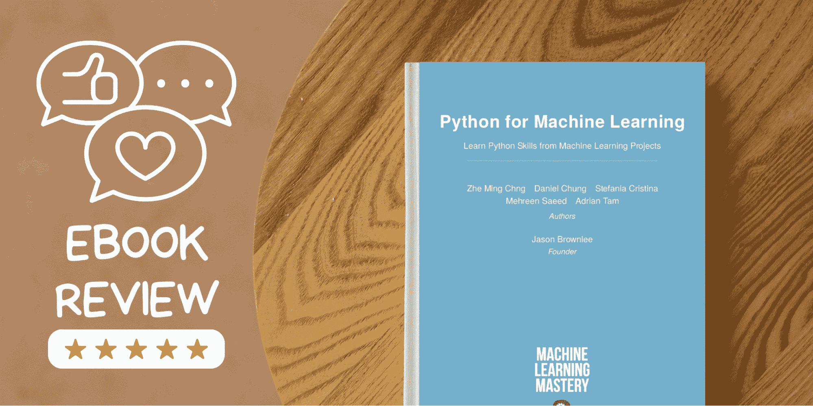
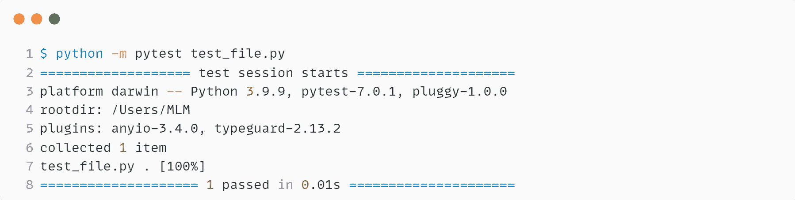
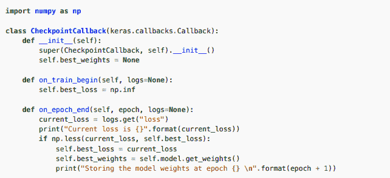
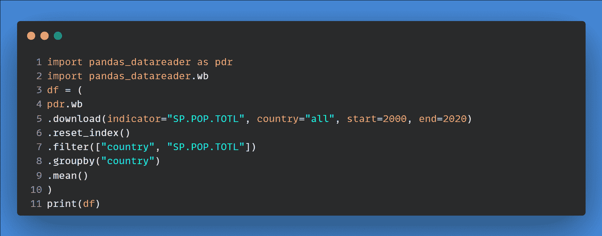
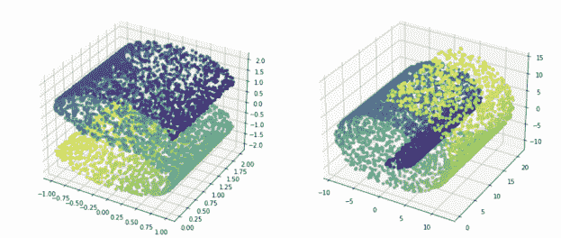
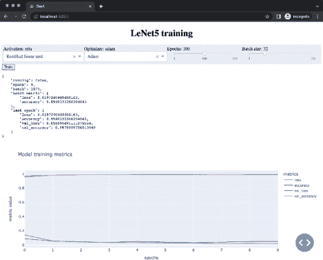

# Python 机器学习：电子书评测

> 原文：[`www.kdnuggets.com/2022/06/python-machine-learning-ebook-review.html`](https://www.kdnuggets.com/2022/06/python-machine-learning-ebook-review.html)
> 
> **编辑注：** 为了完全透明，[机器学习精通](https://machinelearningmastery.com/)是 KDnuggets 的姐妹网站。作者获得了该书的副本，并完全自主地进行评审。

作者提供的图片

我认识的大多数人可以构建、验证和部署机器学习模型，但他们不了解 Python 语言的基础知识。他们主要关注模型架构，而不是学习生产级编码实践。这些软件工程实践是提高生产力的必要条件。

机器学习完全是关于实验和构建更好解决方案的迭代。如果你通过学习单元测试、调试、日志记录、代码检查、文档编制和多线程处理来简化这一过程，你可以改善数据工作流。这些实践已成为数据科学解决方案的行业标准，提供更快、更可靠的开发流程。

Pytest 示例来自书籍

[Python 机器学习](https://machinelearningmastery.com/python-for-machine-learning/?utm_source=kdnuggets&utm_medium=banner&utm_campaign=june2022)适合那些对 Python 语言了解有限但希望深入学习的人。

这本书分为 5 个部分：

1.  **基础知识：** 你将学习 Python 语言特性，如列表推导式、装饰器和生成器。

1.  **调试、性能分析和代码检查：** 你将学习日志记录、调试文档和代码检查。

1.  **更好的代码，更好的软件：** 学习编写更好代码的技巧，如测试、实验、命令行参数和序列化。

1.  **充实你的书库：** 探索 Python 生态系统、网页抓取、数据可视化、数据增强、多进程、网页框架和部署。我们还将学习如何使用 API、SQLite、dbm、Excel 和 Google Sheets 下载和管理数据。

1.  **平台：** 了解免费云平台（Google Colab、Kaggle），用于构建、验证和实验机器学习项目。

# 我喜欢这本书的地方

这本书涵盖了与机器学习相关的所有必要主题，并提供了代码示例。你可以跟随教程在本地机器上进行测试。如果你问我，这本书是进入 Python 机器学习世界的门户。你可以利用这本书赢得 Kaggle 比赛，开发和部署你的项目，参与开源项目，并在顶尖公司找到工作。

大多数公司希望机器学习工程师了解软件开发、单元测试、文档编写、多线程和日志记录。编写干净且易读的代码将帮助你和团队理解你所做的更改。你将学习为你的机器学习项目编写有效、可读且更快的代码。

例如，你将学习为你的 Keras 模型编写回调函数。这将教你函数式编程的基本原理以及如何将机器学习框架集成在一起。

来自书中的图片 | 定义 CheckpointCallback

除此之外，你将学习 Python 语法的核心概念，以及如何使用它来获取、处理、操作和管理数据集。

来自书中的示例 | 函数式语法

我喜欢这本书的设计方式，它从基础知识开始，然后逐步深入到高级概念。这将为你应对各种机器学习项目中的问题做好准备。你将通过逐步编码的课程学习高级概念。

# 机器学习初学者的重要主题

这本书不是关于机器学习的。我不会教你高级算法或深度学习的核心概念。相反，你将学习 Python 在机器学习过程中的应用。

例如，你将学习如何使用 joblib 引入多个进程，以改善数据处理和模型训练时间。

你还将学习机器学习操作，例如实验跟踪、模型训练和部署、数据管理、数据可视化、Python 网络框架、深度学习框架以及免费的云平台。

来自书中的图片 | 由 make_s_curve() 和 make_swiss_roll() 生成的数据集

尽管这本书涵盖了几乎所有与 Python 编程相关的主题，但我还是创建了一个对进入机器学习领域至关重要的主题列表。

**重要主题：**

+   Python 中的语言特性

+   Python 类及其在 Keras 中的应用

+   Python 中的函数式编程

+   Python 中的日志记录

+   注释、文档字符串和类型提示

+   异常处理和调试

+   在 Python 中进行实验

+   你的 Python 脚本的命令行参数

+   单元测试和编写更好的代码

+   Python 中的网页抓取

+   获取机器学习的数据集

+   机器学习项目的数据管理

+   NumPy、SciPy 和 Pandas

+   使用 matplotlib、Seaborn 和 Bokeh 进行数据可视化

+   Python 中的多进程

+   你的 Python 项目的 Web 框架

+   部署 Python 项目

+   Google Colab 和 Kaggle 用于机器学习项目

来自书中的图片 | 模型训练后的 Dash 网络应用

这些主题将帮助你了解机器学习生态系统中的开发和部署过程、实验、质量保证和优化。

# 结论

现在是进入数据科学和机器学习领域的最佳时机。需求很高，你可以年薪超过$120K - [indeed.com](https://www.indeed.com/career/machine-learning-engineer/salaries)。这本书将帮助你学习编写生产级代码所需的所有技能。

在这本电子书中，我涵盖了机器学习中 Python 的核心主题，并给出了我的看法。它适合那些对运行 Python 程序有一定了解，并希望进一步了解 Python 功能和工业实践的初学者。

如果你喜欢这篇评论，可以考虑购买一本[Python for Machine Learning](https://machinelearningmastery.com/python-for-machine-learning/?utm_source=kdnuggets&utm_medium=banner&utm_campaign=june2022) 书籍，价格为$37，或查看[machinelearningmastery.com](https://machinelearningmastery.com/profiling-python-code/)上的精彩教程。

**查看我对数据科学书籍的其他评论：**

+   Pydon’ts – 编写优雅的 Python 代码：免费书评

+   SQL 专业笔记：免费电子书评审

+   命令行数据科学：免费电子书

**[Abid Ali Awan](https://www.polywork.com/kingabzpro)** ([@1abidaliawan](https://twitter.com/1abidaliawan)) 是一位认证的数据科学专业人士，热爱构建机器学习模型。目前，他专注于内容创作，并撰写关于机器学习和数据科学技术的技术博客。Abid 拥有技术管理硕士学位和电信工程学士学位。他的愿景是利用图神经网络构建一款 AI 产品，帮助那些在心理健康方面挣扎的学生。

* * *

## 我们的前三大课程推荐

 1\. [谷歌网络安全证书](https://www.kdnuggets.com/google-cybersecurity) - 快速进入网络安全职业生涯。

 2\. [谷歌数据分析专业证书](https://www.kdnuggets.com/google-data-analytics) - 提升你的数据分析技能

 3\. [谷歌 IT 支持专业证书](https://www.kdnuggets.com/google-itsupport) - 支持你组织的 IT 需求

* * *

### 相关话题

+   [SQL 专业笔记：免费电子书评审](https://www.kdnuggets.com/2022/05/sql-notes-professionals-free-ebook-review.html)

+   [机器学习数学：免费电子书](https://www.kdnuggets.com/2020/04/mathematics-machine-learning-book.html)

+   [免费电子书：10 个实用的 Python 编程技巧](https://www.kdnuggets.com/2023/04/free-ebook-10-practical-python-programming-tricks.html)

+   [命令行中的数据科学：免费电子书](https://www.kdnuggets.com/2022/03/data-science-command-line-free-ebook.html)

+   [超级学习指南：免费算法和数据结构电子书](https://www.kdnuggets.com/2022/06/super-study-guide-free-algorithms-data-structures-ebook.html)

+   [掌握生成式人工智能和提示工程：免费电子书](https://www.kdnuggets.com/2023/04/free-ebook-mastering-generative-ai-prompt-engineering.html)
