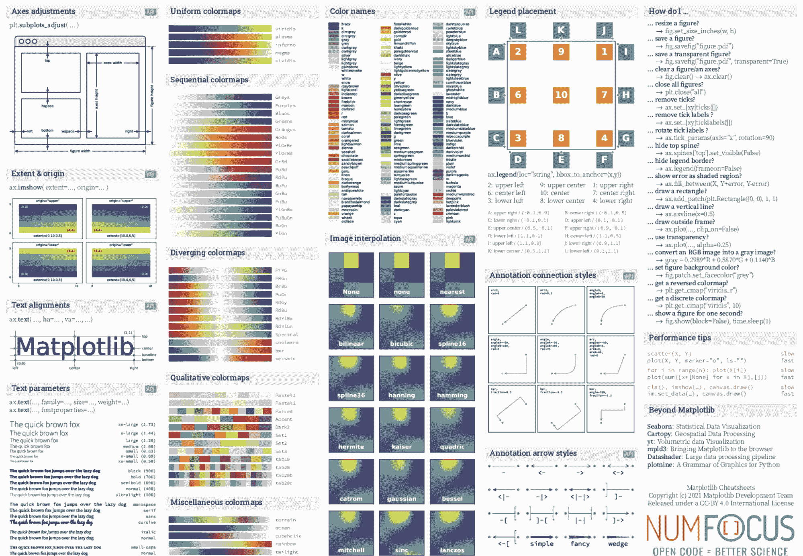
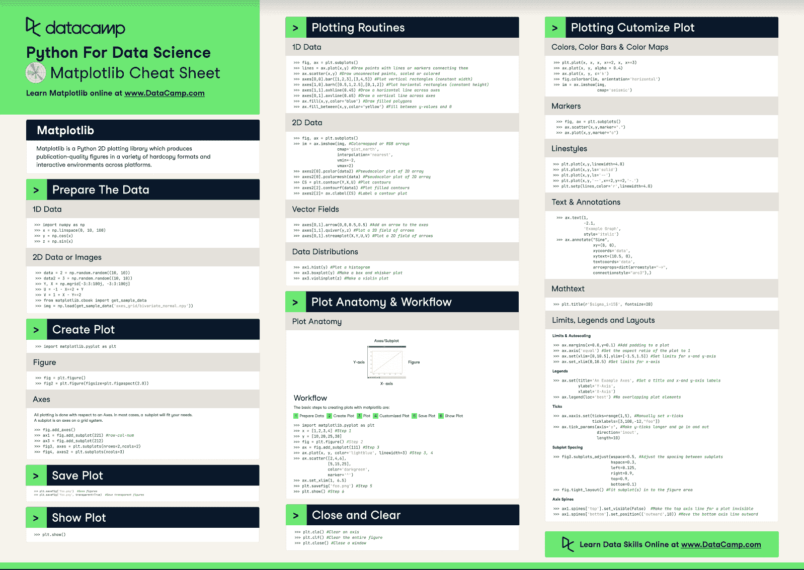

# Python Matplotlib 备忘单

> 原文：[`www.kdnuggets.com/2023/01/python-matplotlib-cheat-sheets.html`](https://www.kdnuggets.com/2023/01/python-matplotlib-cheat-sheets.html)

你不可能在 Python 中完成数据科学项目而不使用 Matplotlib。实际上，如果有这样的情况：

```py
from matplotlib import pyplot as plt
```

* * *

## 我们的前三大课程推荐

 1\. [谷歌网络安全证书](https://www.kdnuggets.com/google-cybersecurity) - 快速进入网络安全职业生涯。

 2\. [谷歌数据分析专业证书](https://www.kdnuggets.com/google-data-analytics) - 提升你的数据分析技能

 3\. [谷歌 IT 支持专业证书](https://www.kdnuggets.com/google-itsupport) - 在 IT 方面支持你的组织

* * *

如果它不在你代码的前三行或四行之内，那么可能有些东西遗漏了。Matplotlib 是 Python 中最著名和最常用的绘图库。它允许你创建清晰且互动的可视化，使你的数据更易于理解，你的结果更具说服力。

你的可视化可以改变别人对你结果的看法，无论你是向客户还是同事展示。为了创建引人注目的可视化，你需要能够充分利用 Matplotlib 所提供的全部功能。

这篇文章的目的就是提供一些资源，帮助你入门、实践和掌握使用 Matplotlib 创建强有力的可视化以支持你的结果。

如果你是数据科学的新手或想要刷新你的知识，一个很好的起点是[Freecodecamp](https://www.freecodecamp.org/news/matplotlib-course-learn-python-data-visualization/)上的 90 分钟 Matplotlib 教程。

另一个很好的起点是[GeeksforGeeks](https://www.geeksforgeeks.org/data-visualization-using-matplotlib/)的这篇文章，它将带你一步一步地从安装 Matplotlib 到在不到 5 分钟内创建美丽的可视化。

如果你想知道如何用 Matplotlib 制作互动可视化，UCLA 高级研究实验室的这个视频将展示基础知识，所有使用的材料都可以在[GitHub](https://github.com/benjum/idre-spring21-python-data-viz-2)上找到。

在你掌握了基础知识后，拥有一个常用函数的总结总是很有帮助的，这些函数你在创建数据科学项目时肯定会用到。

所以，让我和你分享我最喜欢的三个 Matplotlib 备忘单。



图片来源：[Matplotlib](https://matplotlib.org/cheatsheets/)

1.  无论你是 Matplotlib 的初学者、中级用户还是高级用户，你都可以在官方 Matplotlib [网站](https://matplotlib.org/cheatsheets/)上找到你需要的一切。这些备忘单包含创建、编辑甚至动画效果的提示和代码片段。除了备忘单外，它们还提供了基于你在使用该库的经验水平的基本功能指南。

1.  接下来是由 Datacamp 创建的备忘单。Datacamp 提供了备忘单的 pdf/png 版本，你可以在同一 [网页](https://www.datacamp.com/cheat-sheet/matplotlib-cheat-sheet-plotting-in-python) 上找到代码片段。如果你想在编辑之前试用这些代码片段或将其融入你的代码中，这非常适合。

1.  最后但同样重要的是，[CodeAcademy](https://www.codecademy.com/learn/data-visualization/modules/dspath-matplotlib/cheatsheet)也提供了一个简单的备忘单，既有 pdf 格式，也有网页格式。这个简单的备忘单帮助你掌握使用 Matplotlib 的基础知识。



图片来源: [DataCamp](https://www.datacamp.com/cheat-sheet/matplotlib-cheat-sheet-plotting-in-python)

这些资源将帮助你建立对 Matplotlib 的扎实理解。但如果你想进一步掌握这个库，[这个](https://matplotlib.org/cheatsheets/handout-tips.pdf)由官方 Matplotlib 创作者提供的手册和这篇[再生文章](https://regenerativetoday.com/some-tricks-to-make-matplotlib-visualization-even-better/)将教你一些技巧，将你的图表和可视化提升到一个新的层次。

知道如何创建引人注目的可视化图形是每个数据科学家在工作中取得成功的必备技能。我希望你能利用这些资源来构建和提升你的数据可视化技能，并将你的职业生涯提升到一个新的水平。

**[Sara Metwalli](https://www.linkedin.com/in/sara-a-metwalli/)** 是慶應義塾大学的博士生，研究测试和调试量子电路的方法。我是 IBM 的研究实习生和 Qiskit 的倡导者，帮助构建一个更具量子未来。我还是 Medium、Built-in、She Can Code 和 KDN 的撰稿人，撰写有关编程、数据科学和技术主题的文章。我也是国际女性编程 Python 分会的负责人，一个火车爱好者、旅行者和摄影爱好者。

### 相关主题

+   [数据科学备忘单全集 - 第一部分](https://www.kdnuggets.com/2022/02/complete-collection-data-science-cheat-sheets-part-1.html)

+   [KDnuggets™ 新闻 22:n06, 2 月 9 日: 数据科学编程…](https://www.kdnuggets.com/2022/n06.html)

+   [数据科学备忘单全集 - 第二部分](https://www.kdnuggets.com/2022/02/complete-collection-data-science-cheat-sheets-part-2.html)

+   [21 个数据科学面试必备备忘单：解锁…](https://www.kdnuggets.com/2022/06/21-cheat-sheets-data-science-interviews.html)

+   [10 个你需要的备忘单来征服数据科学面试](https://www.kdnuggets.com/2022/10/10-cheat-sheets-need-ace-data-science-interview.html)

+   [7 个数据工程必备备忘单](https://www.kdnuggets.com/2022/12/7-essential-cheat-sheets-data-engineering.html)
